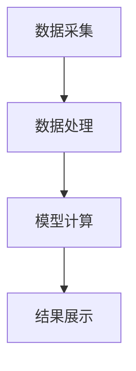
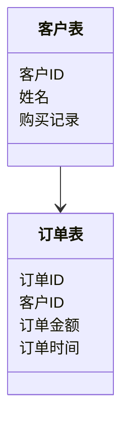

                 


# 《企业估值中的客户终身价值评估》

> 关键词：客户终身价值（CLV）、企业估值、数据驱动决策、客户价值管理、贴现现金流模型、客户流失率、预测分析

> 摘要：客户终身价值（CLV）是企业在评估客户价值时的重要指标，它不仅帮助企业预测客户在其生命周期内的总贡献，还能为企业的战略决策提供数据支持。本文将详细探讨CLV的核心概念、计算方法、系统架构设计以及实际应用案例，结合数学模型和系统设计，为企业估值提供深入的理论和实践指导。

---

# 第一章: 企业估值中的客户终身价值评估背景与概念

## 1.1 客户终身价值（CLV）概述

### 1.1.1 什么是客户终身价值

客户终身价值（Customer Lifetime Value，CLV）是指一个客户在其整个生命周期内为企业带来的总收益或贡献。它不仅考虑了客户的当前价值，还包括客户在未来可能为企业带来的收入和利润。

CLV的核心在于量化客户对企业的长期价值，从而帮助企业做出更精准的客户管理、市场推广和投资决策。

### 1.1.2 CLV的核心要素

- **客户收入贡献（Revenue Contribution）**：客户在企业生命周期内为企业带来的总收入。
- **客户生命周期长度（Customer Lifetime Length）**：客户与企业保持互动的时间长度。
- **客户流失率（Churn Rate）**：客户停止与企业互动的概率。
- **贴现率（Discount Rate）**：用于将未来的现金流折现到当前价值的利率。

### 1.1.3 CLV与企业估值的关系

CLV是企业估值的重要组成部分，因为它直接反映了客户对企业未来收入的贡献。通过评估客户的CLV，企业可以更好地识别高价值客户，优化资源分配，并制定更有效的客户 retention 策略。

---

## 1.2 客户终身价值的计算方法

### 1.2.1 CLV的基本公式

CLV的计算公式可以表示为：

$$ CLV = \frac{R \times (1 - (1 - \gamma)^{n})}{\gamma} $$

其中：
- \( R \) 表示客户生命周期内的收入
- \( \gamma \) 表示客户流失率
- \( n \) 表示客户生命周期长度

### 1.2.2 CLV的计算步骤

1. **确定客户流失率（\(\gamma\)）**：通过历史数据计算客户的流失率。
2. **估计客户生命周期长度（\(n\)）**：基于客户行为数据预测客户的平均生命周期。
3. **计算客户生命周期内的收入（\(R\)）**：根据客户的消费历史和预测未来消费行为计算收入。
4. **应用CLV公式**：将上述参数代入CLV公式，计算客户的终身价值。

### 1.2.3 CLV的适用场景

- **客户细分**：识别高CLV客户，制定针对性的营销策略。
- **客户保留**：通过CLV分析，制定有效的客户保留计划。
- **投资决策**：评估客户获取成本是否合理，确保投资回报。

---

## 1.3 客户终身价值与企业价值的关系

### 1.3.1 CLV对企业估值的影响

高CLV客户能够为企业带来更高的长期收益，从而提升企业的整体估值。CLV可以帮助企业在收购、合并或其他估值相关决策中更准确地评估客户的价值。

### 1.3.2 CLV与企业战略的结合

企业可以根据CLV结果优化客户管理策略，例如：
- 投资于高CLV客户的维护和服务。
- 优化营销预算分配，确保资源用于最有价值的客户群体。

### 1.3.3 CLV在不同行业中的应用

- **电商行业**：通过分析客户的购买频率和消费金额，计算CLV，优化促销策略。
- **金融行业**：评估客户贷款违约风险，调整信贷政策。
- **订阅制企业**：预测客户续订率，优化订阅定价策略。

---

## 1.4 本章小结

本章介绍了客户终身价值（CLV）的核心概念、计算方法及其在企业估值中的应用。CLV不仅是客户价值管理的重要工具，也是企业制定战略决策的关键指标。

---

# 第二章: 客户终身价值评估的核心模型与算法

## 2.1 CLV的数学模型

### 2.1.1 基于概率的CLV模型

CLV的计算依赖于客户流失的概率，可以通过概率模型预测客户在每个阶段的流失率，进而计算客户在每个阶段的贡献。

### 2.1.2 贴现现金流模型

CLV的另一种计算方法是将客户在未来各阶段的现金流进行贴现，求和得到当前价值。

---

## 2.2 客户流失概率的计算

### 2.2.1 基于历史数据的流失率计算

通过分析客户的流失历史，计算客户在每个阶段的流失概率。

### 2.2.2 客户流失概率的预测模型

使用机器学习算法（如逻辑回归、随机森林）预测客户流失概率。

---

## 2.3 CLV的动态更新模型

### 2.3.1 动态CLV计算

随着客户行为的变化，定期更新CLV值，以反映最新的客户价值。

### 2.3.2 动态模型的应用

在实时客户管理中，动态CLV可以帮助企业快速调整策略。

---

## 2.4 本章小结

本章详细介绍了CLV的核心数学模型，包括概率模型和贴现现金流模型。通过这些模型，企业可以准确计算客户终身价值，并根据实际情况动态调整模型参数。

---

# 第三章: 客户终身价值评估的系统架构与实现

## 3.1 系统架构设计

### 3.1.1 系统功能模块

- **数据采集模块**：收集客户行为数据。
- **数据处理模块**：清洗和预处理数据。
- **模型计算模块**：计算客户CLV。
- **结果展示模块**：可视化CLV结果。

### 3.1.2 系统架构图



---

## 3.2 系统功能设计

### 3.2.1 数据采集

通过API、数据库等方式收集客户交易数据、行为数据。

### 3.2.2 数据处理

清洗数据，处理缺失值，标准化数据。

### 3.2.3 模型计算

使用概率模型和贴现现金流模型计算CLV。

### 3.2.4 结果展示

通过仪表盘展示CLV结果，支持数据可视化。

---

## 3.3 系统实现细节

### 3.3.1 数据库设计



---

## 3.4 本章小结

本章详细描述了客户终身价值评估系统的架构设计和功能实现，展示了如何通过系统化的方法计算和展示CLV。

---

# 第四章: 客户终身价值评估的项目实战

## 4.1 项目背景

### 4.1.1 项目目标

计算某电商企业的客户CLV，优化客户管理策略。

### 4.1.2 数据来源

- 客户交易数据
- 客户行为数据

---

## 4.2 项目实施

### 4.2.1 环境安装

- 安装Python、Pandas、Scikit-learn等工具。

### 4.2.2 数据处理

```python
import pandas as pd

# 读取数据
data = pd.read_csv('customer_data.csv')

# 数据清洗
data.dropna(inplace=True)
```

### 4.2.3 模型计算

```python
def calculate_clv(customers, gamma, n):
    R = customers['revenue'].mean()
    clv = (R * (1 - (1 - gamma) ** n)) / gamma
    return clv

gamma = 0.1
n = 5
clv = calculate_clv(data, gamma, n)
print(f"CLV: {clv}")
```

---

## 4.3 项目分析

通过计算CLV，企业可以识别高价值客户，优化营销策略，提升客户满意度。

---

## 4.4 本章小结

本章通过实际案例展示了客户终身价值评估的实施过程，从数据处理到模型计算，再到结果分析，为企业提供了可操作的指导。

---

# 第五章: 客户终身价值评估的最佳实践与注意事项

## 5.1 最佳实践

### 5.1.1 数据质量的重要性

确保数据的准确性和完整性，避免计算偏差。

### 5.1.2 模型的持续优化

定期更新模型参数，适应市场变化。

---

## 5.2 注意事项

### 5.2.1 客户隐私保护

在数据处理和分析过程中，确保客户隐私不被泄露。

### 5.2.2 模型的适用性

根据企业实际情况选择合适的CLV计算模型。

---

## 5.3 拓展阅读

推荐阅读《数据分析实战》、《机器学习入门》等相关书籍，深入理解CLV的应用。

---

# 本文章小结

客户终身价值评估是企业估值中的重要工具，通过科学的计算和系统的实施，企业可以更好地管理客户，提升整体价值。未来，随着技术的发展，CLV的应用将更加广泛和精准。

---

# 作者：AI天才研究院 & 禅与计算机程序设计艺术

