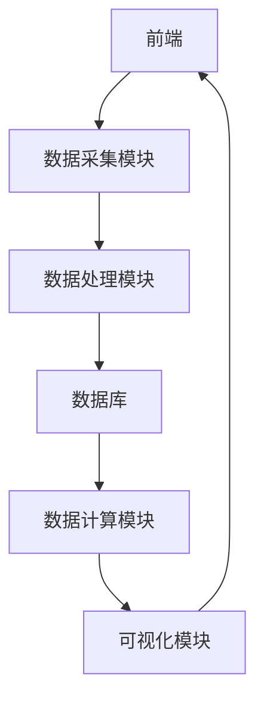
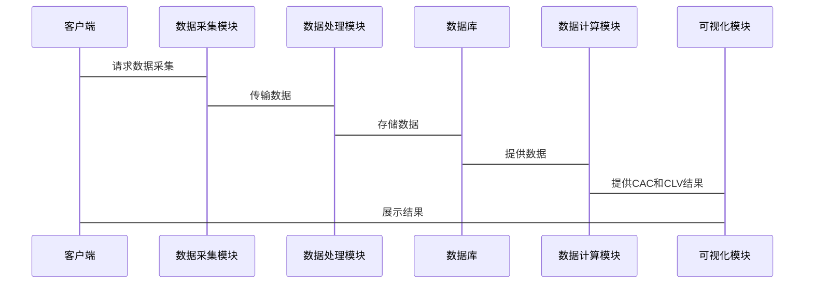

                 


# 《企业估值中的客户获取成本分析》

> **关键词**：企业估值、客户获取成本、CAC、数据分析、机器学习、客户生命周期价值、市场营销  
> **摘要**：客户获取成本（CAC）是企业在市场竞争中获取客户的直接成本，是企业估值的重要组成部分。本文从CAC的基本概念出发，结合数学模型、算法实现、系统架构设计和项目实战，深入分析客户获取成本在企业估值中的应用与优化方法，为企业提供科学的估值和决策支持。

---

# 第一部分: 企业估值中的客户获取成本分析基础

## 第1章: 客户获取成本（CAC）概述

### 1.1 客户获取成本的基本概念

#### 1.1.1 什么是客户获取成本
客户获取成本（Customer Acquisition Cost, CAC）是指企业为获取一位新客户而产生的所有直接和间接成本，包括广告费用、销售团队成本、渠道合作费用、市场调研费用等。CAC是企业市场营销和销售部门的核心指标之一。

#### 1.1.2 CAC的核心概念与定义
CAC的计算公式为：
$$CAC = \frac{\text{营销总成本}}{\text{新增客户数}}$$
其中，营销总成本包括广告费用、销售人员工资、渠道佣金等，新增客户数是指在一定时间内通过各种渠道获取的新客户数量。

#### 1.1.3 CAC在企业估值中的重要性
CAC是企业估值的重要组成部分，尤其是在SaaS（软件即服务）和订阅制商业模式中，CAC与客户生命周期价值（CLV）的比值（CAC/CLV）是衡量企业盈利能力的关键指标。一般来说，CAC/CLV的比率越低，企业的盈利能力越强。

---

### 1.2 CAC的计算方法与公式

#### 1.2.1 CAC的基本计算公式
CAC的计算公式可以进一步细化为：
$$CAC = \frac{\text{广告费用} + \text{销售团队成本} + \text{渠道合作费用}}{\text{新增客户数}}$$
例如，某公司投入100万元的广告费用，通过广告渠道获取了1000位新客户，则：
$$CAC = \frac{100}{1000} = 100 \text{元/客户}$$

#### 1.2.2 CAC的扩展计算方法
在实际应用中，CAC的计算需要考虑以下因素：
1. **时间维度**：广告费用可能在数月内逐步转化为客户，因此需要考虑时间维度。
2. **渠道维度**：不同渠道的CAC可能不同，需要进行渠道级别的CAC分析。
3. **客户分层**：不同客户群体的CAC可能不同，需要进行客户分层分析。

#### 1.2.3 CAC的行业差异性分析
不同行业的CAC差异较大，例如：
- SaaS行业：CAC通常较高，因为客户获取需要多次营销触达。
- 电子商务行业：CAC较低，主要通过广告投放获取客户。
- 传统制造业：CAC可能包括广告费用、销售人员工资、渠道佣金等。

---

### 1.3 CAC与客户生命周期价值（CLV）的关系

#### 1.3.1 CLV的基本概念
客户生命周期价值（Customer Lifetime Value, CLV）是指一个客户在其生命周期内为企业带来的总收入减去相关成本。CLV的计算公式为：
$$CLV = \sum_{t=1}^{T} \frac{R_t}{(1+r)^t}$$
其中，$R_t$为客户在第$t$年贡献的收入，$r$为贴现率，$T$为客户生命周期长度。

#### 1.3.2 CAC与CLV的对比分析
- CAC是获取客户的成本，CLV是客户为企业带来的价值。
- 两者的关系可以用比率表示：$$\text{CAC/CLV}$$
- 一般来说，$\text{CAC/CLV} < 1$表示客户为企业带来的价值大于获取成本，企业具有盈利能力。

#### 1.3.3 CAC与CLV的数学关系公式
$$\text{CAC} = \frac{\text{营销成本}}{\text{新增客户数}}$$
$$\text{CLV} = \sum_{t=1}^{T} \frac{R_t}{(1+r)^t}$$
$$\text{CAC/CLV} = \frac{\text{营销成本}}{\text{新增客户数} \times \sum_{t=1}^{T} \frac{R_t}{(1+r)^t}}$$

---

### 1.4 CAC的行业应用与边界

#### 1.4.1 不同行业的CAC差异
- **SaaS行业**：CAC较高，客户获取成本占总收入比例较大。
- **电子商务行业**：CAC较低，主要通过广告投放获取客户。
- **传统制造业**：CAC可能包括广告费用、销售人员工资、渠道佣金等。

#### 1.4.2 CAC的适用场景与限制
- **适用场景**：适用于需要通过营销渠道获取新客户的业务模式。
- **限制**：不适用于通过免费试用或口碑传播获取客户的模式。

#### 1.4.3 CAC与其他估值指标的关系
CAC与其他估值指标（如客户留存率、客户满意度）密切相关，但需要结合具体业务场景进行综合分析。

---

### 1.5 本章小结

---

## 第2章: CAC的数学模型与算法原理

### 2.1 CAC的基本数学模型

#### 2.1.1 CAC的线性回归模型
线性回归模型可以用于预测CAC，假设CAC与广告费用、销售团队规模等因素呈线性关系：
$$CAC = \beta_0 + \beta_1 \times \text{广告费用} + \beta_2 \times \text{销售团队规模} + \epsilon$$
其中，$\beta_0$为截距，$\beta_1$和$\beta_2$为回归系数，$\epsilon$为误差项。

#### 2.1.2 CAC的分类分析模型
分类分析模型可以用于识别不同渠道的CAC差异，例如使用决策树或随机森林模型进行分类。

#### 2.1.3 CAC的时间序列分析模型
时间序列分析模型可以用于分析CAC的趋势和周期性，例如使用ARIMA模型预测未来CAC。

---

### 2.2 CAC的算法实现

#### 2.2.1 数据预处理与特征提取
- 数据清洗：处理缺失值、异常值。
- 特征提取：提取广告费用、销售团队规模、渠道类型等特征。

#### 2.2.2 CAC预测的机器学习算法选择
- 线性回归：适合线性关系。
- 决策树/随机森林：适合非线性关系。
- 时间序列模型：适合时间相关性。

#### 2.2.3 算法实现步骤与代码示例
```python
import pandas as pd
from sklearn.linear_model import LinearRegression

# 数据加载
data = pd.read_csv('customer_acquisition.csv')

# 特征与目标变量分离
X = data[['广告费用', '销售团队规模']]
y = data['CAC']

# 模型训练
model = LinearRegression()
model.fit(X, y)

# 预测CAC
predicted_CAC = model.predict(X)
```

---

### 2.3 CAC的优化与改进

#### 2.3.1 CAC的优化目标
优化目标是降低CAC，同时提高客户转化率和客户满意度。

#### 2.3.2 基于机器学习的CAC优化算法
使用机器学习算法优化CAC，例如：
- 线性回归：优化广告费用分配。
- 神经网络：优化多变量的CAC预测。

#### 2.3.3 算法优化的数学推导与公式
$$\text{优化目标: } \min_{x} CAC(x)$$
$$\text{约束条件: } x \geq 0$$
其中，$x$为优化变量（如广告费用分配比例）。

---

### 2.4 本章小结

---

## 第3章: CAC的系统分析与架构设计

### 3.1 系统功能设计

#### 3.1.1 系统功能模块
- 数据采集模块：采集广告费用、销售团队成本、客户数据。
- CAC计算模块：计算整体CAC和渠道CAC。
- CLV计算模块：计算客户生命周期价值。
- 可视化模块：展示CAC与CLV的对比分析。

#### 3.1.2 系统功能设计的ER实体关系图
```mermaid
erd
    顾客客户表
        id: int [PK]
        客户名: string
        购买时间: date
        购买金额: float
    广告费用表
        id: int [PK]
        广告渠道: string
        广告费用: float
    销售团队表
        id: int [PK]
        团队成员数: int
        销售费用: float
    CAC计算表
        id: int [PK]
        CAC值: float
        计算时间: date
```

---

### 3.2 系统架构设计

#### 3.2.1 系统架构设计的分层架构图


---

### 3.3 系统接口设计

#### 3.3.1 API接口设计
- 数据采集接口：`GET /api/data采集`
- CAC计算接口：`POST /api/cac计算`
- CLV计算接口：`POST /api/clv计算`

---

### 3.4 系统交互流程图



---

## 第4章: 项目实战

### 4.1 环境安装与配置

#### 4.1.1 安装Python与相关库
```bash
pip install pandas
pip install numpy
pip install scikit-learn
pip install matplotlib
```

#### 4.1.2 安装数据库与可视化工具
- 数据库：MySQL或PostgreSQL
- 可视化工具：Tableau或Power BI

---

### 4.2 系统核心实现源代码

#### 4.2.1 CAC计算代码
```python
import pandas as pd
from sklearn.linear_model import LinearRegression

# 数据加载
data = pd.read_csv('customer_acquisition.csv')

# 特征与目标变量分离
X = data[['广告费用', '销售团队规模']]
y = data['CAC']

# 模型训练
model = LinearRegression()
model.fit(X, y)

# 预测CAC
predicted_CAC = model.predict(X)
```

#### 4.2.2 可视化代码
```python
import matplotlib.pyplot as plt

# 绘制CAC分布直方图
plt.hist(y, bins=10, alpha=0.5, label='实际CAC')
plt.hist(predicted_CAC, bins=10, alpha=0.5, label='预测CAC')
plt.xlabel('CAC值')
plt.ylabel('客户数')
plt.legend()
plt.show()
```

---

### 4.3 实际案例分析与详细解读

#### 4.3.1 案例背景
某SaaS公司计划优化其CAC，希望通过数据分析找到最有效的广告渠道。

#### 4.3.2 数据分析与优化建议
1. **广告渠道分析**：识别高CAC渠道，减少低效渠道的投入。
2. **客户分层**：根据客户生命周期价值，优化CAC投入。
3. **机器学习优化**：使用线性回归模型优化广告费用分配。

---

### 4.4 项目小结

---

## 第5章: 最佳实践与总结

### 5.1 最佳实践 tips
- 定期监控CAC，确保其低于客户生命周期价值。
- 结合机器学习算法优化CAC。
- 注意渠道差异，分渠道分析CAC。

### 5.2 小结
本文从CAC的基本概念出发，结合数学模型、算法实现和系统架构设计，深入分析了CAC在企业估值中的应用与优化方法。通过实际案例分析，为企业提供了科学的估值和决策支持。

### 5.3 注意事项
- CAC的计算需要结合具体业务场景。
- 注意数据质量和完整性。
- 定期更新模型，适应市场变化。

### 5.4 拓展阅读
- 《Customer Loyalty: New Insights into the Customer Lifetime Value Proposition》
- 《Data Analytics Made Accessible: A Primer for Non-Technical Decision-Makers》

---

## 作者：AI天才研究院/AI Genius Institute & 禅与计算机程序设计艺术 /Zen And The Art of Computer Programming

