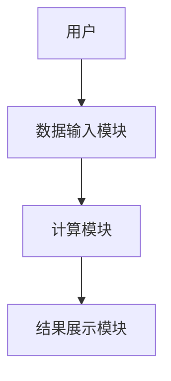
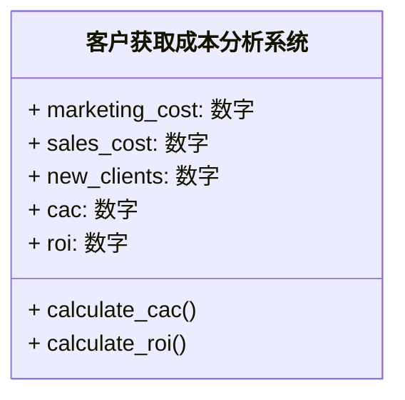

                 


# 企业估值中的客户获取成本分析

> 关键词：企业估值，客户获取成本，CAC，客户生命周期价值，投资回报周期，营销成本，财务分析

> 摘要：本文深入探讨了客户获取成本（CAC）在企业估值中的重要性，分析了CAC的核心概念、计算方法、与客户生命周期价值（CLV）的关系，并结合实际案例，详细讲解了CAC的数学模型、系统架构设计及最佳实践方法。通过本文，读者将能够全面理解CAC在企业估值中的应用，并掌握如何通过CAC优化企业投资策略。

---

# 第1章: 客户获取成本（CAC）概述

## 1.1 什么是客户获取成本（CAC）

### 1.1.1 CAC的定义与核心概念

客户获取成本（Customer Acquisition Cost，CAC）是指企业为获取一名新客户所支付的所有成本之和。这些成本包括营销成本、销售成本以及与客户获取相关的其他费用。

CAC的核心概念在于它反映了企业获取客户的经济投入。在企业估值中，CAC是衡量企业市场效率和客户获取策略的重要指标。CAC的高低直接影响企业的盈利能力和市场扩展能力。

### 1.1.2 CAC在企业估值中的作用

CAC在企业估值中具有重要意义，主要体现在以下几个方面：

1. **衡量市场效率**：CAC可以帮助企业衡量其市场推广活动的效率。如果CAC较高，可能意味着企业的市场推广策略不够高效，或者目标市场的竞争过于激烈。

2. **评估客户价值**：CAC与客户生命周期价值（CLV）密切相关。通过比较CAC与CLV，可以评估客户是否能够为企业的长期发展带来正向价值。

3. **制定投资策略**：CAC是企业制定市场推广预算的重要依据。通过分析CAC，企业可以优化市场推广策略，确保投资回报的最大化。

### 1.1.3 CAC与客户生命周期的关系

客户生命周期（Customer Lifecycle）是指客户从获取到最终流失的整个过程。CAC是客户生命周期中的关键成本投入点，其高低直接影响企业的客户获取能力和盈利能力。

---

## 1.2 CAC的计算方法

### 1.2.1 CAC的基本公式

CAC的计算公式为：

$$ CAC = \frac{\text{营销成本} + \text{销售成本}}{\text{新增客户数}} $$

其中：
- 营销成本包括广告支出、市场推广费用等。
- 销售成本包括销售人员工资、客户支持费用等。
- 新增客户数是指在一定时间内通过各种渠道获取的新客户数量。

### 1.2.2 CAC的计算步骤与注意事项

1. **数据收集**：收集企业在一定时间内所有的营销和销售支出，以及新增客户数量。
2. **计算CAC**：将营销成本和销售成本相加，除以新增客户数，得到CAC。
3. **分析合理性**：对比行业平均水平，评估企业的市场效率。

### 1.2.3 CAC与客户生命周期价值（CLV）的关系

客户生命周期价值（CLV）是指一个客户在其生命周期内为企业带来的总收入减去相关成本后的净现值。公式如下：

$$ CLV = \frac{\text{年收入} \times \text{利润率} \times \text{客户生命周期}}{1 - \text{客户流失率}} $$

CAC与CLV的关系可以用投资回报周期（ROI）公式表示：

$$ ROI = \frac{CAC}{LTV} $$

如果ROI大于1，则说明企业的客户获取成本能够被客户生命周期价值所覆盖，企业可以通过客户获取策略实现正向盈利。

---

## 1.3 CAC在不同行业的应用特点

### 1.3.1 高科技行业的CAC特点

高科技行业通常通过线上渠道获取客户，CAC主要由广告支出和数字营销成本构成。由于目标客户多为技术决策者，销售周期较长，CAC可能较高。

### 1.3.2 传统行业的CAC特点

传统行业如零售、制造等，通常通过线下渠道获取客户，CAC可能包括广告、促销活动和销售人员成本。由于客户获取渠道较为传统，销售周期可能较短，CAC相对较低。

### 1.3.3 服务业的CAC特点

服务业如教育、医疗等，CAC可能包括广告支出、客户关系管理成本等。由于服务行业的客户获取通常依赖于口碑营销和品牌建设，CAC可能相对较高。

---

## 1.4 本章小结

本章介绍了客户获取成本（CAC）的定义、计算方法及其在企业估值中的作用。通过对比不同行业的CAC特点，读者可以更好地理解CAC在实际应用中的差异和重要性。

---

# 第2章: CAC的核心概念与数学模型

## 2.1 CAC的核心概念解析

### 2.1.1 CAC的构成要素

CAC的构成要素包括：
1. **营销成本**：广告支出、市场推广费用等。
2. **销售成本**：销售人员工资、客户支持费用等。
3. **其他成本**：如客户获取相关的培训费用、技术支持费用等。

### 2.1.2 CAC与企业价值的关系

企业价值（Enterprise Value）可以通过以下公式计算：

$$ \text{企业价值} = \text{收入} \times \text{利润率} \times \text{客户数量} $$

其中，客户数量与CAC密切相关。通过优化CAC，企业可以降低客户获取成本，从而提升整体企业价值。

### 2.1.3 CAC与投资回报周期的计算

投资回报周期（ROI）公式为：

$$ ROI = \frac{CAC}{LTV} $$

如果ROI大于1，说明企业的客户获取策略具有盈利能力。反之，则需要优化CAC或提升客户生命周期价值（CLV）。

---

## 2.2 CAC的数学模型与公式

### 2.2.1 CAC的基本公式

$$ CAC = \frac{\text{营销成本} + \text{销售成本}}{\text{新增客户数}} $$

### 2.2.2 投资回报周期公式

$$ ROI = \frac{CAC}{LTV} $$

### 2.2.3 客户生命周期价值（CLV）公式

$$ CLV = \frac{\text{年收入} \times \text{利润率} \times \text{客户生命周期}}{1 - \text{客户流失率}} $$

---

## 2.3 CAC与CLV的对比分析

### 2.3.1 CAC与CLV的定义对比

| 指标 | 定义 | 公式 |
|------|------|------|
| CAC  | 获取客户的平均成本 | $ CAC = \frac{\text{营销成本} + \text{销售成本}}{\text{新增客户数}} $ |
| CLV  | 客户生命周期价值 | $ CLV = \frac{\text{年收入} \times \text{利润率} \times \text{客户生命周期}}{1 - \text{客户流失率}} $ |

### 2.3.2 CAC与CLV的计算公式对比

CAC关注的是获取客户所花费的成本，而CLV关注的是客户为企业带来的长期价值。两者的对比可以帮助企业评估客户获取策略的经济性。

### 2.3.3 CAC与CLV在企业估值中的应用对比

通过对比CAC和CLV，企业可以评估客户获取策略的盈利能力。如果ROI大于1，则说明客户获取策略具有经济可行性。

---

## 2.4 本章小结

本章通过数学模型和公式，深入分析了CAC的核心概念及其与CLV的关系。通过对比分析，读者可以更好地理解CAC在企业估值中的应用。

---

# 第3章: CAC的算法原理与实现

## 3.1 CAC的算法原理

### 3.1.1 CAC的计算流程

1. **数据收集**：收集企业的营销成本、销售成本和新增客户数。
2. **计算CAC**：使用公式$ CAC = \frac{\text{营销成本} + \text{销售成本}}{\text{新增客户数}} $计算CAC。
3. **分析合理性**：对比行业平均水平，评估企业市场效率。

### 3.1.2 数据输入与处理

数据输入包括营销成本、销售成本和新增客户数。数据处理需要确保数据的准确性和完整性。

### 3.1.3 投资回报周期计算

通过公式$ ROI = \frac{CAC}{LTV} $计算投资回报周期，评估客户获取策略的盈利能力。

---

## 3.2 CAC的数学模型

### 3.2.1 CAC的基本公式

$$ CAC = \frac{\text{营销成本} + \text{销售成本}}{\text{新增客户数}} $$

### 3.2.2 投资回报周期公式

$$ ROI = \frac{CAC}{LTV} $$

### 3.2.3 客户生命周期价值（CLV）公式

$$ CLV = \frac{\text{年收入} \times \text{利润率} \times \text{客户生命周期}}{1 - \text{客户流失率}} $$

---

## 3.3 CAC的系统实现

### 3.3.1 系统功能设计

1. **数据输入模块**：输入企业的营销成本、销售成本和新增客户数。
2. **计算模块**：计算CAC和ROI。
3. **结果展示模块**：显示计算结果并提供可视化分析。

### 3.3.2 系统架构设计



### 3.3.3 系统实现代码

```python
def calculate_cac(marketing_cost, sales_cost, new_clients):
    cac = (marketing_cost + sales_cost) / new_clients
    return cac

def calculate_roi(cac, clv):
    roi = cac / clv
    return roi
```

---

## 3.4 本章小结

本章通过算法原理和系统实现，详细讲解了CAC的计算方法及其在企业估值中的应用。通过代码示例，读者可以更好地理解和实现CAC的计算。

---

# 第4章: CAC的系统分析与架构设计

## 4.1 问题场景介绍

企业需要通过分析CAC来优化市场推广策略，提升客户获取效率。

---

## 4.2 项目介绍

本项目旨在通过构建一个客户获取成本分析系统，帮助企业优化市场推广策略。

---

## 4.3 系统功能设计

### 4.3.1 领域模型



### 4.3.2 系统架构设计


---

## 4.4 本章小结

本章通过系统分析与架构设计，详细讲解了如何通过构建一个客户获取成本分析系统来优化企业的市场推广策略。

---

# 第5章: CAC的项目实战

## 5.1 实际案例分析

### 5.1.1 案例背景

假设一家互联网公司，其营销成本为100万元，销售成本为50万元，新增客户数为5000人。

### 5.1.2 CAC计算

$$ CAC = \frac{100 + 50}{5000} = 0.03 \text{万元/人} $$

### 5.1.3 ROI计算

假设CLV为1万元，则：

$$ ROI = \frac{0.03}{1} = 0.03 $$

由于ROI小于1，说明客户获取策略的盈利能力较低，需要优化市场推广策略。

---

## 5.2 代码实现与应用解读

### 5.2.1 代码实现

```python
def calculate_cac(marketing_cost, sales_cost, new_clients):
    cac = (marketing_cost + sales_cost) / new_clients
    return cac

def calculate_roi(cac, clv):
    roi = cac / clv
    return roi

# 示例
marketing_cost = 100  # 万元
sales_cost = 50       # 万元
new_clients = 5000
clv = 1               # 万元

cac = calculate_cac(marketing_cost, sales_cost, new_clients)
roi = calculate_roi(cac, clv)

print(f"CAC: {cac} 万元/人")
print(f"ROI: {roi}")
```

### 5.2.2 代码应用解读

通过上述代码，企业可以快速计算出CAC和ROI，评估客户获取策略的盈利能力。如果ROI小于1，则需要优化市场推广策略或提升客户生命周期价值。

---

## 5.3 本章小结

本章通过实际案例分析和代码实现，详细讲解了如何通过CAC优化企业的市场推广策略。

---

# 第6章: CAC的最佳实践与注意事项

## 6.1 最佳实践

### 6.1.1 数据质量

确保数据的准确性和完整性，避免因数据错误导致的计算偏差。

### 6.1.2 动态调整

根据市场变化和客户行为，动态调整市场推广策略，优化CAC。

### 6.1.3 综合评估

结合CAC、CLV和ROI等多种指标，综合评估客户获取策略的经济性。

---

## 6.2 小结

本章总结了CAC分析的最佳实践和注意事项，帮助企业在实际应用中更好地优化市场推广策略。

---

# 第7章: 总结与展望

## 7.1 本文章总结

本文深入探讨了客户获取成本（CAC）在企业估值中的重要性，分析了CAC的核心概念、计算方法、与客户生命周期价值（CLV）的关系，并结合实际案例，详细讲解了CAC的数学模型、系统架构设计及最佳实践方法。

## 7.2 未来展望

随着人工智能和大数据技术的不断发展，CAC分析将更加智能化和精准化。未来的研究方向可能包括CAC预测模型的优化、多维度CAC分析方法的开发以及CAC在企业战略决策中的深度应用。

---

# 作者

作者：AI天才研究院/AI Genius Institute & 禅与计算机程序设计艺术/Zen And The Art of Computer Programming

---

通过本文的详细讲解，读者可以全面理解CAC在企业估值中的应用，并掌握如何通过CAC优化企业投资策略。

