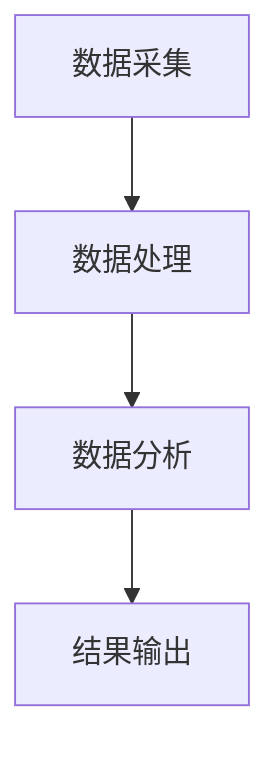
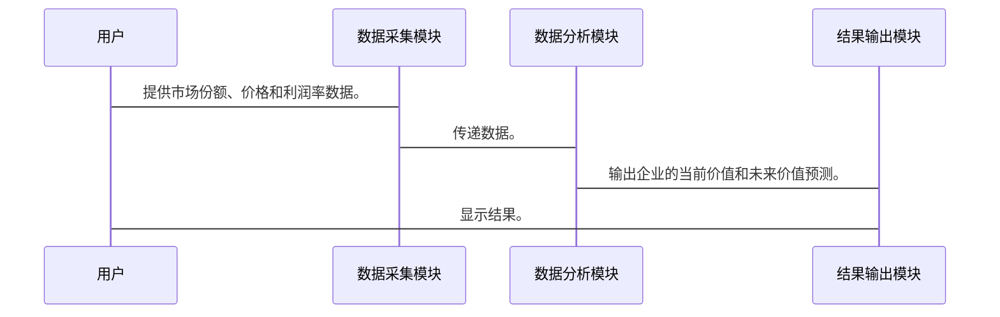

                 


# 企业估值中的市场份额价值法

## 关键词：企业估值，市场份额，价值法，市场分析，企业战略

## 摘要：  
企业估值是商业世界中的核心问题之一，而市场份额作为企业竞争力的重要指标，直接影响企业的价值评估。本文从市场份额价值法的基本概念出发，详细探讨其在企业估值中的应用，结合数学模型和实际案例，分析如何通过市场份额的量化分析来评估企业的真实价值。文章还涵盖了市场份额价值法的算法原理、系统架构设计以及项目实战等内容，帮助读者全面理解并掌握这一方法。

---

# 第1章：市场份额价值法的背景与概念

## 1.1 企业估值的核心问题  
企业估值是投资者和企业管理者在决策过程中面临的关键问题。传统的估值方法，如市盈率（P/E）和市净率（P/B），往往无法全面反映企业的市场竞争力和未来盈利能力。在这种背景下，市场份额价值法作为一种新兴的估值方法，逐渐受到关注。  

**问题背景：**  
- 企业的真实价值不仅取决于财务数据，还与其在市场中的地位密切相关。  
- 市场份额反映了企业在行业中的竞争力，是评估企业未来增长潜力的重要指标。  

**问题解决：**  
- 通过分析企业的市场份额，结合市场价格和利润率，可以更准确地评估企业的价值。  

**边界与外延：**  
- 适用于竞争性行业，尤其是市场份额数据可获取的行业。  
- 不适用于垄断市场或新兴市场，因为这些市场的竞争结构复杂，难以量化。  

---

## 1.2 市场份额价值法的核心概念  

### 1.2.1 市场份额的定义与属性  
市场份额是指企业在某一市场中销售的产品或服务占总市场份额的比例。它反映了企业在市场中的竞争力和影响力。  

| 属性 | 特征 |  
|------|------|  
| 绝对市场份额 | 企业在市场中的具体份额比例（如20%）。 |  
| 相对市场份额 | 企业与竞争对手的市场份额对比（如竞争对手市场份额为30%，自身为20%）。 |  
| 市场集中度 | 行业整体的市场份额分布情况（如高度集中或分散）。 |  

### 1.2.2 价值法的核心要素  
价值法是一种基于市场数据和竞争分析的估值方法，其核心要素包括：  
- 市场份额（M）：企业的市场份额比例。  
- 价格（P）：市场平均价格或企业产品价格。  
- 利润率（R）：企业的利润率或行业平均利润率。  

### 1.2.3 市场份额与价值法的联系  
- 市场份额是价值法的核心输入，决定了企业在市场中的地位和盈利能力。  
- 通过分析市场份额的变化趋势，可以预测企业的未来价值。  

---

# 第2章：市场份额价值法的理论基础

## 2.1 市场份额与企业价值的关系  

### 2.1.1 市场份额对企业价值的影响路径  
- 高市场份额意味着企业具有更强的定价权和成本优势，从而提升盈利能力。  
- 市场份额的增加通常伴随着企业收入和利润的增长，进而提升企业价值。  

### 2.1.2 市场份额与企业利润的关系  
市场份额与企业利润呈正相关关系。企业通过扩大市场份额可以降低单位成本，提高利润率。  

### 2.1.3 市场份额与企业成长性的关系  
高市场份额的企业通常具有更强的市场影响力和品牌效应，能够更快地捕捉市场机会，实现持续成长。  

---

## 2.2 价值法的数学模型  

### 2.2.1 市场份额价值法的基本公式  
企业价值（V）的计算公式如下：  
$$ V = M \times P \times R $$  
其中，  
- $M$ 表示企业的市场份额比例（以小数表示）。  
- $P$ 表示市场平均价格或企业产品价格。  
- $R$ 表示企业的利润率或行业平均利润率。  

### 2.2.2 市场份额的计算方法  
市场份额的计算可以通过以下步骤进行：  
1. 确定目标市场或行业的市场规模。  
2. 计算企业在目标市场中的销售额或用户数。  
3. 将企业的销售额或用户数除以市场规模，得到市场份额比例。  

---

## 2.3 数据收集与分析  

### 2.3.1 数据来源的选择  
- 行业报告：如Statista、Forrester等。  
- 企业财报：企业公开的财务数据。  
- 市场调研：通过问卷调查或访谈获取市场份额数据。  

### 2.3.2 数据的处理与清洗  
- 去除异常值和缺失值。  
- 标准化数据格式，确保数据一致性。  

### 2.3.3 数据分析方法  
- 趋势分析：分析市场份额的历史变化趋势。  
- 对比分析：比较企业在不同地区的市场份额表现。  

---

# 第3章：市场份额价值法的算法原理

## 3.1 算法概述  

### 3.1.1 算法的基本步骤  
1. 收集市场份额、价格和利润率数据。  
2. 计算企业的价值：$V = M \times P \times R$。  
3. 分析市场份额的变化趋势，预测未来价值。  

### 3.1.2 算法的输入与输出  
- 输入：市场份额（M）、价格（P）、利润率（R）。  
- 输出：企业价值（V）、市场份额变化趋势。  

---

## 3.2 算法的数学模型  

### 3.2.1 市场份额变化的预测模型  
企业未来市场份额的变化可以通过以下公式进行预测：  
$$ \Delta M = \alpha \times M + \beta \times (1 - M) $$  
其中，$\alpha$ 和 $\beta$ 是根据市场环境和竞争情况确定的系数。  

### 3.2.2 利润率的调整模型  
利润率的调整可以通过以下公式进行：  
$$ R_{\text{new}} = R \times (1 + \gamma) $$  
其中，$\gamma$ 是利润率增长的百分比。  

---

## 3.3 算法的实现步骤  

### 3.3.1 数据预处理  
1. 收集市场份额、价格和利润率数据。  
2. 对数据进行清洗和标准化。  

### 3.3.2 计算企业价值  
使用公式 $V = M \times P \times R$ 计算企业的当前价值。  

### 3.3.3 预测市场份额变化  
通过 $\Delta M = \alpha \times M + \beta \times (1 - M)$ 预测未来市场份额变化。  

### 3.3.4 输出结果  
1. 绘制市场份额变化趋势图。  
2. 输出企业的当前价值和未来价值预测。  

---

# 第4章：市场份额价值法的系统架构设计

## 4.1 系统功能设计  

### 4.1.1 数据采集模块  
功能：  
- 收集市场份额、价格和利润率数据。  
- 与外部数据源（如行业报告）对接。  

### 4.1.2 数据分析模块  
功能：  
- 处理和清洗数据。  
- 计算企业价值和市场份额变化趋势。  

### 4.1.3 结果输出模块  
功能：  
- 绘制市场份额变化趋势图。  
- 输出企业的当前价值和未来价值预测。  

---

## 4.2 系统架构设计  

### 4.2.1 系统架构图  


### 4.2.2 系统功能模块  
- 数据采集模块：负责数据的获取和预处理。  
- 数据分析模块：负责计算企业价值和预测市场份额变化。  
- 结果输出模块：以图表和报告形式输出结果。  

---

## 4.3 系统接口设计  

### 4.3.1 数据接口  
- 数据输入接口：接收市场份额、价格和利润率数据。  
- 数据输出接口：输出企业的当前价值和未来价值预测。  

### 4.3.2 用户界面  
- 用户输入界面：允许用户输入市场份额、价格和利润率数据。  
- 用户输出界面：显示企业的当前价值和未来价值预测。  

---

## 4.4 系统交互设计  

### 4.4.1 系统交互流程图  


---

# 第5章：项目实战

## 5.1 环境安装  

### 5.1.1 安装工具  
- Python：用于数据分析和建模。  
- Pandas：用于数据处理。  
- Matplotlib：用于绘制图表。  

## 5.2 系统核心实现  

### 5.2.1 数据处理代码  
```python
import pandas as pd
import matplotlib.pyplot as plt

# 数据输入
market_size = 1000  # 市场规模
enterprise_sales = [200, 250, 300]  # 企业的销售额
competitor_sales = [300, 250, 200]  # 竞争对手的销售额

# 计算市场份额
market_share = [s / market_size for s in enterprise_sales]

# 可视化
plt.plot(market_share, label='企业市场份额')
plt.xlabel('时间')
plt.ylabel('市场份额比例')
plt.legend()
plt.show()
```

### 5.2.2 价值计算代码  
```python
# 计算企业价值
def calculate_value(market_share, price, profit_margin):
    return market_share * price * profit_margin

# 示例数据
market_share = 0.2  # 市场份额
price = 50  # 价格
profit_margin = 0.3  # 利润率

# 计算价值
value = calculate_value(market_share, price, profit_margin)
print(f"企业价值：{value}")
```

---

## 5.3 案例分析  

### 5.3.1 案例背景  
假设我们分析一家科技企业的市场份额和价值，数据如下：  
- 市场规模：1000亿元  
- 企业销售额：200亿元  
- 竞争对手销售额：300亿元  
- 市场平均价格：50元  
- 利润率：30%  

### 5.3.2 数据分析  
1. 计算企业市场份额：$200/1000 = 0.2$。  
2. 计算企业价值：$0.2 \times 50 \times 0.3 = 3$ 亿元。  

### 5.3.3 结果解读  
- 企业当前价值为3亿元，未来可以通过扩大市场份额或提高价格/利润率来提升价值。  

---

## 5.4 项目小结  

### 5.4.1 核心代码总结  
- 数据处理代码：用于计算市场份额。  
- 价值计算代码：用于计算企业价值。  

### 5.4.2 项目总结  
通过项目实战，我们验证了市场份额价值法的有效性，并掌握了如何通过代码实现数据分析和价值计算。  

---

# 第6章：最佳实践与注意事项

## 6.1 小结  
市场份额价值法是一种基于市场数据和竞争分析的估值方法，能够帮助企业更准确地评估自身价值。  

## 6.2 注意事项  
- 数据的准确性和完整性直接影响结果的可靠性。  
- 市场份额价值法适用于竞争性行业，不适用于垄断市场。  
- 需要结合其他估值方法（如DCF模型）进行综合分析。  

## 6.3 拓展阅读  
- 《企业估值的多维度分析》  
- 《市场份额与企业战略》  

---

# 作者：AI天才研究院 & 禅与计算机程序设计艺术

---

**总结：**  
通过本文的详细讲解，读者可以掌握市场份额价值法的基本概念、理论基础、算法原理以及实际应用。无论是对于企业高管、投资者还是技术研究人员，这篇文章都提供了深刻的洞察和实用的工具。

