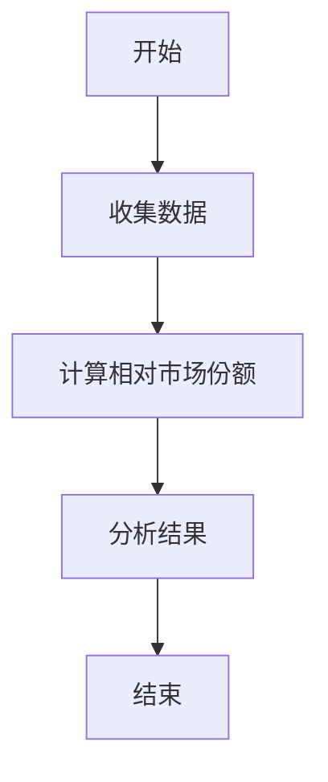
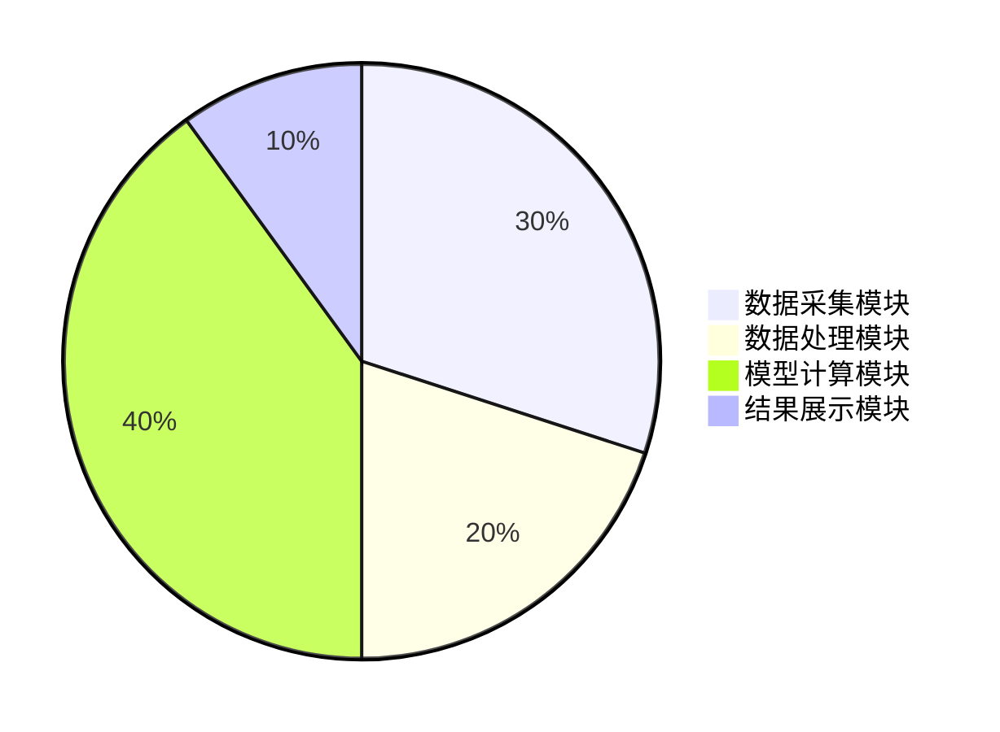
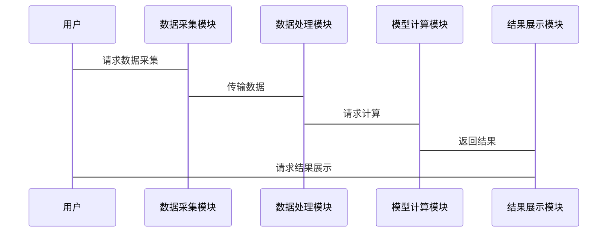

                 


# 《企业估值中的市场份额价值评估》

> 关键词：企业估值，市场份额，价值评估，数学模型，系统架构，项目实战

> 摘要：本文详细探讨了企业在估值过程中如何评估市场份额的价值。通过分析市场份额的核心概念、算法原理、数学模型、系统架构以及项目实战，本文为企业提供了一套全面的市场份额价值评估方法论。从基础概念到实际应用，从理论分析到代码实现，本文旨在帮助企业更好地理解和应用市场份额价值评估。

---

# 第一部分: 企业估值中的市场份额价值评估基础

## 第1章: 企业估值与市场份额概述

### 1.1 企业估值的基本概念
#### 1.1.1 企业估值的定义与意义
企业估值是通过对企业的财务状况、市场地位、盈利能力等多方面因素进行综合评估，以确定其市场价值的过程。它是企业战略决策、投资评估和并购活动的重要依据。

#### 1.1.2 市场份额在企业估值中的作用
市场份额是企业在特定市场中的占有率，反映了企业在行业中的竞争地位。高市场份额意味着更强的市场影响力和盈利能力，从而提升企业的整体估值。

#### 1.1.3 企业估值的核心要素
企业估值的核心要素包括收入、利润、资产、负债、市场地位、竞争优势等。其中，市场份额作为市场地位的重要指标，对企业的估值具有直接影响。

### 1.2 市场份额的定义与属性
#### 1.2.1 市场份额的定义
市场份额是指企业在特定市场中销售的产品或服务的总量占整个市场总量的比例。

#### 1.2.2 市场份额的属性特征
- **相对性**：市场份额是相对概念，需要与行业整体市场进行比较。
- **动态性**：市场份额会随着市场环境的变化而波动。
- **行业特异性**：不同行业的市场份额评估方法和标准可能不同。

#### 1.2.3 市场份额的计算方法
市场份额的计算公式为：
$$ \text{市场份额} = \frac{\text{企业的销售量/销售额}}{\text{市场的总销售量/销售额}} $$

### 1.3 企业估值与市场份额的关系
#### 1.3.1 市场份额对企业价值的影响
高市场份额通常意味着企业具有更强的市场支配力和盈利能力，从而提高企业的估值。

#### 1.3.2 市场份额与企业竞争地位的关联
市场份额是企业竞争地位的直接体现。高市场份额意味着企业在行业中具有更强的竞争力和影响力。

#### 1.3.3 市场份额在企业估值中的应用
在企业估值中，市场份额是评估企业市场地位和未来盈利能力的重要依据。通过分析市场份额的变化趋势，可以预测企业的未来增长潜力。

### 1.4 本章小结
本章主要介绍了企业估值和市场份额的基本概念，以及两者之间的关系。通过理解市场份额的定义、属性及其在企业估值中的作用，我们可以更好地进行企业估值分析。

---

## 第2章: 市场份额价值评估的核心概念

### 2.1 市场份额价值评估的基本原理
#### 2.1.1 价值评估的定义与目标
价值评估是通过对企业的财务状况、市场地位、竞争优势等多方面因素进行综合分析，以确定企业市场价值的过程。

#### 2.1.2 市场份额与价值评估的关系
市场份额是价值评估的重要输入变量。通过分析市场份额的变化，可以评估企业的市场地位和未来的盈利能力。

#### 2.1.3 核心概念的结构与组成
市场份额价值评估的核心概念包括市场份额、市场增长率、企业竞争力、行业结构等。

### 2.2 市场份额与其他相关概念的对比
#### 2.2.1 与市场占有率的对比
市场占有率是企业在特定市场中的销售量或销售额占整个市场总量的比例，与市场份额的定义相似，但更强调企业的实际销售表现。

#### 2.2.2 与市场份额波动的对比
市场份额波动是指企业在不同时间点市场份额的变化情况。通过分析市场份额波动，可以评估企业的市场稳定性。

#### 2.2.3 与市场份额预测的对比
市场份额预测是基于历史数据和市场趋势，预测未来市场份额的变化情况。它是企业制定战略决策的重要依据。

### 2.3 市场份额价值评估的ER实体关系图
以下是市场份额价值评估的ER实体关系图：

```mermaid
erDiagram
    customer(Customers)
    product.Products
    market.Market
    competition.Competitors
    sales.Sales
    (
    customer -|> sales: 实际销售
    product -|> sales: 销售的产品
    market -|> product: 市场中的产品
    market -|> customer: 市场中的客户
    market -|> competition: 市场中的竞争对手
    )
```

### 2.4 本章小结
本章详细介绍了市场份额价值评估的核心概念，包括市场份额的定义、属性及其与其他相关概念的对比。通过ER实体关系图，我们展示了市场份额价值评估的系统结构。

---

## 第3章: 市场份额价值评估的算法原理

### 3.1 市场份额评估的数学模型
#### 3.1.1 相对市场份额模型
相对市场份额模型用于评估企业在市场中的相对竞争力。公式如下：
$$ \text{相对市场份额} = \frac{\text{企业的市场份额}}{\text{行业平均市场份额}} $$

#### 3.1.2 市场增长模型
市场增长模型用于预测企业在未来市场增长中的表现。公式如下：
$$ \text{未来市场份额} = \text{当前市场份额} \times (1 + \text{市场增长率}) $$

#### 3.1.3 综合评估模型
综合评估模型结合了相对市场份额和市场增长模型，用于全面评估企业的市场份额价值。公式如下：
$$ \text{综合市场份额价值} = \text{相对市场份额} \times \text{市场增长潜力} $$

### 3.2 算法原理的详细讲解
以下是相对市场份额模型的详细讲解：

1. **数据收集**：收集企业的市场份额数据和行业平均市场份额数据。
2. **计算相对市场份额**：使用公式 $$ \text{相对市场份额} = \frac{\text{企业的市场份额}}{\text{行业平均市场份额}} $$ 进行计算。
3. **分析结果**：相对市场份额大于1表示企业市场份额高于行业平均水平，小于1则表示低于行业平均水平。

### 3.3 算法原理的mermaid流程图
以下是相对市场份额模型的流程图：



### 3.4 本章小结
本章详细介绍了市场份额价值评估的数学模型，包括相对市场份额模型、市场增长模型和综合评估模型。通过公式推导和流程图展示，我们展示了如何通过数学模型进行市场份额价值评估。

---

## 第4章: 市场份额价值评估的系统架构设计

### 4.1 企业估值系统概述
#### 4.1.1 系统目标
本系统旨在通过收集和分析市场数据，评估企业的市场份额价值，为企业估值提供数据支持。

#### 4.1.2 系统功能模块
- 数据采集模块：收集市场数据和企业数据。
- 数据处理模块：对数据进行清洗和转换。
- 模型计算模块：应用数学模型进行市场份额价值评估。
- 结果展示模块：以可视化方式展示评估结果。

#### 4.1.3 系统架构设计
以下是系统的架构图：



### 4.2 系统功能设计
#### 4.2.1 数据采集模块
数据采集模块负责从市场报告、企业财报等来源收集市场数据和企业数据。

#### 4.2.2 数据处理模块
数据处理模块对收集到的数据进行清洗和转换，确保数据的准确性和一致性。

#### 4.2.3 模型计算模块
模型计算模块应用相对市场份额模型、市场增长模型等数学模型进行市场份额价值评估。

#### 4.2.4 结果展示模块
结果展示模块以图表、报告等形式展示评估结果，方便用户理解和分析。

### 4.3 系统接口设计
以下是系统的接口设计：



### 4.4 本章小结
本章详细介绍了企业估值系统的架构设计，包括功能模块、系统架构和接口设计。通过系统架构设计，我们可以更好地理解如何将市场份额价值评估应用于实际的企业估值中。

---

## 第5章: 项目实战

### 5.1 环境安装
- **Python安装**：安装Python 3.8及以上版本。
- **依赖库安装**：安装pandas、numpy、matplotlib等依赖库。

### 5.2 核心代码实现
以下是相对市场份额模型的Python代码实现：

```python
import pandas as pd

def calculate_relative_market_share企业市场份额，行业平均市场份额):
    return 企业市场份额 / 行业平均市场份额

# 示例数据
企业市场份额 = 0.3
行业平均市场份额 = 0.25
相对市场份额 = calculate_relative_market_share(企业市场份额, 行业平均市场份额)
print("相对市场份额:", 相对市场份额)
```

### 5.3 代码应用解读与分析
通过上述代码，我们可以计算企业的相对市场份额，从而评估企业在市场中的竞争力。

### 5.4 实际案例分析
以某行业为例，假设企业市场份额为20%，行业平均市场份额为15%，则相对市场份额为：
$$ \text{相对市场份额} = \frac{0.2}{0.15} = 1.333 $$

这意味着企业在市场中的相对竞争力较强。

### 5.5 本章小结
本章通过实际案例分析，展示了如何将市场份额价值评估的数学模型应用于实际的企业估值中。通过代码实现和案例分析，我们能够更好地理解市场份额价值评估的实践应用。

---

## 第6章: 最佳实践与小结

### 6.1 最佳实践
- **数据质量**：确保数据的准确性和完整性。
- **模型选择**：根据实际情况选择合适的数学模型。
- **持续监控**：定期更新数据和模型，以适应市场变化。

### 6.2 小结
本章总结了市场份额价值评估的核心内容和最佳实践。通过理论分析和实际案例，我们能够更好地理解如何在企业估值中评估市场份额的价值。

### 6.3 注意事项
- 市场份额价值评估需要结合企业的实际情况进行调整。
- 数据的准确性和模型的合理性是评估的关键。

### 6.4 拓展阅读
- 《企业估值与金融市场》
- 《市场份额分析与预测》
- 《Python数据分析与可视化》

### 6.5 本章小结
通过本章的内容，我们总结了市场份额价值评估的最佳实践，并为读者提供了进一步学习和研究的方向。

---

# 作者：AI天才研究院 & 禅与计算机程序设计艺术

