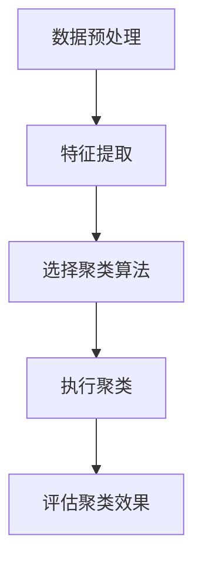
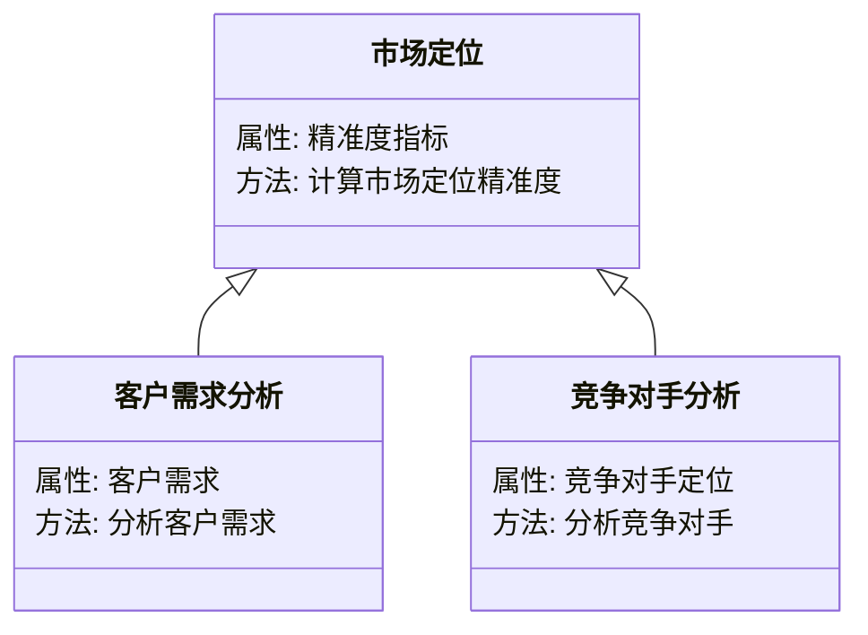
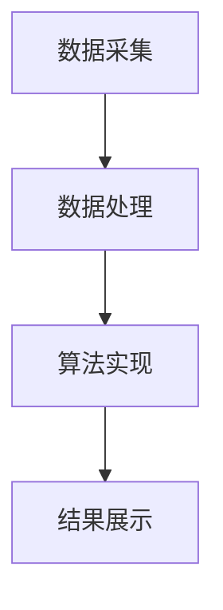

                 


# 企业估值中的市场定位精准度分析

> **关键词**：企业估值、市场定位、精准度分析、算法原理、数学模型、系统设计

> **摘要**：本文系统地探讨了市场定位精准度对企业估值的影响，从核心概念、算法原理、数学模型到系统设计，全面分析了如何通过精准的市场定位提升企业估值。文章结合实际案例，详细讲解了聚类分析和回归分析的应用，以及如何通过系统架构优化市场定位的精准度。

---

## 第一部分：企业估值与市场定位的背景与核心概念

### 第1章：企业估值与市场定位的背景介绍

#### 1.1 企业估值的核心概念

##### 1.1.1 企业估值的定义与作用
企业估值是指对企业的整体价值进行评估的过程，通常用于融资、并购、上市等场景。企业估值的核心作用在于帮助投资者和企业确定合理的价值区间，从而做出更明智的商业决策。

##### 1.1.2 市场定位在企业估值中的重要性
市场定位是指企业在目标市场中的位置，它决定了企业如何被消费者或客户所认知。精准的市场定位能够帮助企业明确目标客户群体，优化产品和服务，从而提升企业的市场竞争力和估值。

##### 1.1.3 市场定位与企业估值的关系
市场定位的精准度直接影响企业估值。精准的市场定位能够帮助企业更好地满足客户需求，提升市场份额和盈利能力，从而提高企业的整体估值。

#### 1.2 市场定位的定义与特征

##### 1.2.1 市场定位的定义
市场定位是指通过产品、价格、渠道、促销等策略，将企业产品或服务在目标市场中定位到一个独特的位置，以满足特定客户群体的需求。

##### 1.2.2 市场定位的核心要素
市场定位的核心要素包括：
1. **目标客户群体**：企业所 targeting 的客户群体。
2. **价值主张**：企业提供的产品或服务的核心价值。
3. **竞争对手分析**：分析竞争对手的市场定位，找到差异化的机会。

##### 1.2.3 市场定位的分类与应用场景
市场定位可以分为：
1. **产品导向定位**：基于产品功能和特点进行定位。
2. **客户导向定位**：基于客户需求和偏好进行定位。
3. **竞争导向定位**：基于竞争对手的市场定位进行差异化定位。

#### 1.3 企业估值中的市场定位问题背景

##### 1.3.1 当前市场环境对企业估值的影响
当前市场环境的不确定性（如经济波动、技术变革等）对企业估值提出了更高的要求。精准的市场定位能够帮助企业更好地应对市场变化，提升估值的稳定性。

##### 1.3.2 市场定位不精准对企业估值的负面影响
市场定位不精准可能导致企业无法有效满足客户需求，市场份额流失，进而影响企业的盈利能力和发展潜力，最终影响企业估值。

##### 1.3.3 提高市场定位精准度的必要性
在竞争激烈的市场环境中，精准的市场定位能够帮助企业快速识别目标客户，优化资源配置，提升市场竞争力，从而显著提高企业估值。

---

### 第2章：市场定位精准度的核心概念与联系

#### 2.1 市场定位精准度的定义与属性

##### 2.1.1 定义
市场定位精准度是指市场定位策略与目标客户群体的实际需求之间的匹配程度。精准的市场定位能够最大限度地满足客户需求，提升企业的市场表现和估值。

##### 2.1.2 核心属性特征对比表

| 属性 | 精准定位 | 非精准定位 |
|------|----------|------------|
| 目标客户群体 | 明确且精准 | 模糊或广泛 |
| 价值主张 | 突出且符合需求 | 模糊或不符合需求 |
| 市场表现 | 高市场占有率 | 低市场占有率 |
| 企业估值 | 高估值 | 低估值 |

##### 2.1.3 ER实体关系图
```mermaid
erd
  id: 市场定位精准度分析
  entity 市场定位 {
    属性: 精准度指标
    关系: 竞争对手分析
    关系: 客户需求分析
  }
  entity 竞争对手分析 {
    属性: 竞争对手定位
    关系: 市场定位
  }
  entity 客户需求分析 {
    属性: 客户需求
    关系: 市场定位
  }
```

#### 2.2 市场定位精准度与企业估值的关系

##### 2.2.1 市场定位精准度对企业估值的影响
精准的市场定位能够提升企业的市场竞争力，增加市场份额和盈利能力，从而显著提高企业估值。

##### 2.2.2 企业估值与市场定位的相互作用
企业估值的高低不仅取决于市场定位的精准度，还受到企业财务状况、行业地位等多种因素的影响。精准的市场定位能够增强企业的核心竞争力，从而提升估值。

#### 2.3 市场定位精准度的数学模型

##### 2.3.1 市场定位精准度指数（MLPI）的定义
市场定位精准度指数（MLPI）是一个衡量市场定位策略与目标客户需求匹配程度的指标。

##### 2.3.2 MLPI的计算公式
$$ MLPI = \frac{\text{实际市场定位精度}}{\text{潜在市场定位精度}} $$

---

### 第3章：市场定位精准度的算法原理

#### 3.1 市场定位精准度分析的算法选择

##### 3.1.1 聚类分析
聚类分析是一种无监督学习算法，适用于将客户群体按照需求特征进行分组，从而帮助企业识别不同客户群体的需求差异。

##### 3.1.2 回归分析
回归分析是一种监督学习算法，适用于预测市场定位的精准度与企业估值之间的关系。

##### 3.1.3 支持向量机（SVM）
支持向量机（SVM）适用于分类问题，可以用于区分不同市场定位策略的优劣。

#### 3.2 基于聚类分析的市场定位算法

##### 3.2.1 聚类分析流程图


##### 3.2.2 Python代码实现
```python
from sklearn.cluster import KMeans
import numpy as np

# 示例数据
X = np.array([[1, 2], [3, 4], [5, 6], [7, 8], [9, 10]])

# 模型训练
kmeans = KMeans(n_clusters=2)
kmeans.fit(X)

# 获取聚类结果
labels = kmeans.labels_
print("聚类结果:", labels)
```

##### 3.2.3 聚类分析的应用场景
聚类分析适用于企业需要将客户群体按照需求特征进行分组，从而制定更有针对性的市场定位策略。

---

## 第4章：数学模型与系统设计

### 4.1 数学模型的建立与优化

#### 4.1.1 市场定位精准度的数学模型
市场定位精准度的数学模型可以通过回归分析建立，用于预测市场定位精准度与企业估值之间的关系。

#### 4.1.2 回归分析模型
$$ \text{企业估值} = \beta_0 + \beta_1 \times \text{市场定位精准度} + \epsilon $$

---

## 第5章：系统分析与架构设计

### 5.1 系统功能设计

#### 5.1.1 领域模型设计


### 5.2 系统架构设计

#### 5.2.1 模块划分
1. 数据采集模块
2. 数据处理模块
3. 算法实现模块
4. 结果展示模块

#### 5.2.2 系统架构图


---

## 第6章：项目实战

### 6.1 环境安装与配置

#### 6.1.1 Python环境安装
安装Python和必要的库（如scikit-learn）。

### 6.2 系统核心实现源代码

#### 6.2.1 聚类分析代码
```python
from sklearn.cluster import KMeans
import numpy as np

# 示例数据
X = np.array([[1, 2], [3, 4], [5, 6], [7, 8], [9, 10]])

# 模型训练
kmeans = KMeans(n_clusters=2)
kmeans.fit(X)

# 获取聚类结果
labels = kmeans.labels_
print("聚类结果:", labels)
```

### 6.3 案例分析与解读

#### 6.3.1 案例分析
假设我们有5家企业的市场定位数据，使用聚类分析进行市场定位精准度分析。

### 6.4 项目小结

---

## 第7章：最佳实践与注意事项

### 7.1 小结
精准的市场定位能够显著提升企业估值，关键在于选择合适的算法和优化模型。

### 7.2 注意事项
1. 数据质量是市场定位精准度分析的关键。
2. 算法选择应根据实际需求进行调整。
3. 结果展示应直观易懂。

### 7.3 拓展阅读
推荐阅读《企业估值分析》和《市场定位策略》等相关书籍。

---

## 作者信息

作者：AI天才研究院/AI Genius Institute & 禅与计算机程序设计艺术/Zen And The Art of Computer Programming

---

感谢您的阅读！如果需要进一步探讨或合作，请随时联系。

