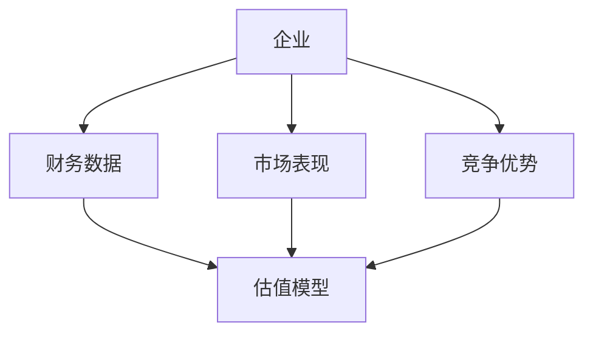

                 


# 企业估值中的常见误区及解决方案

> **关键词**：企业估值，误区，解决方案，财务分析，市场波动，风险管理

> **摘要**：企业估值是投资决策中的关键环节，但常常因常见误区而导致估值偏差。本文系统分析了企业估值中的常见误区，包括财务数据误用、非财务因素忽视、市场波动影响等，并提出了基于DCF模型和相对估值法的解决方案，结合实际案例为企业估值提供科学指导。文章还探讨了估值工具的应用和风险管理策略，为投资者和企业管理者提供了实用的参考。

---

## 第1章 企业估值的引言

### 1.1 企业估值的重要性和挑战

#### 1.1.1 企业估值的定义与作用
企业估值是通过对企业的财务状况、市场表现、竞争优势等多维度分析，确定其内在价值或市场价值的过程。它是投资决策、并购交易、融资活动等的重要依据。准确的企业估值能够帮助投资者识别投资机会、规避风险，同时为企业制定合理的战略规划提供支持。

#### 1.1.2 企业估值中的常见误区概述
在企业估值实践中，常见的误区包括：
- **过度依赖历史数据**：忽视企业未来增长潜力。
- **非财务因素的忽视**：如管理层能力、市场竞争力等。
- **市场波动的影响**：在波动较大的市场中，估值模型可能失效。
- **估值模型的滥用**：忽略模型的假设和适用条件。

#### 1.1.3 本书的目标与结构安排
本文旨在通过分析企业估值中的常见误区，结合科学的估值方法和实际案例，为投资者和企业管理者提供实用的解决方案。文章结构如下：
- 第一部分：企业估值的背景与核心概念。
- 第二部分：企业估值中的常见误区。
- 第三部分：企业估值的核心概念与联系。
- 第四部分：企业估值的算法原理。
- 第五部分：解决方案与实际案例。
- 第六部分：工具与技巧。
- 第七部分：总结与展望。

---

## 第2章 企业估值误区的背景分析

### 2.1 误区产生的主要原因

#### 2.1.1 财务数据的误用
财务数据是企业估值的重要依据，但仅依赖财务数据可能导致偏差。例如，忽略应收账款的回收风险或存货的质量问题。

#### 2.1.2 非财务因素的忽视
企业价值不仅取决于财务数据，还与管理层能力、市场竞争力、行业前景等因素密切相关。忽视这些因素可能导致估值偏差。

#### 2.1.3 市场波动的影响
市场波动可能影响企业的短期表现，但过度关注短期波动可能导致估值模型失效。

### 2.2 误区的具体表现形式

#### 2.2.1 过度依赖历史数据
投资者往往过于依赖企业的历史财务数据，而忽视未来增长潜力。例如，一家科技公司过去几年的低利润可能掩盖其未来的高增长潜力。

#### 2.2.2 忽视企业成长性
忽视企业的成长性可能导致低估其价值。例如，一家处于高速成长期的初创公司可能在当前阶段盈利较低，但未来潜力巨大。

#### 2.2.3 估值模型的滥用
许多投资者在使用估值模型时，忽略模型的假设和适用条件。例如，盲目使用市盈率模型，而不考虑行业的差异性。

### 2.3 误区对企业决策的影响

#### 2.3.1 高估企业价值的风险
由于忽略非财务因素或滥用估值模型，可能导致高估企业价值，从而引发投资损失。

#### 2.3.2 低估企业潜力的后果
忽视企业的成长性或市场竞争力可能导致低估其价值，错失投资机会。

#### 2.3.3 误导投资决策的危害
由于企业估值偏差，可能导致投资者做出错误的投资决策，如盲目进入高风险领域或错失优质投资标的。

---

## 第3章 企业估值的核心概念与联系

### 3.1 企业价值的多维度分析

#### 3.1.1 财务指标分析
- **盈利能力**：如净利润率、ROE。
- **成长能力**：如收入增长率、净利润增长率。
- **偿债能力**：如资产负债率、流动比率。

#### 3.1.2 市场表现分析
- **市盈率（P/E）**：股价与每股收益的比率。
- **市净率（P/B）**：股价与每股净资产的比率。
- **EV/EBITDA**：企业价值与息税折旧及摊销前利润的比率。

#### 3.1.3 竞争优势分析
- **核心竞争力**：企业的技术优势、成本优势等。
- **市场地位**：如行业龙头、 niche市场等。
- **管理团队**：管理层的能力和战略规划。

### 3.2 核心概念的属性对比

| **属性**       | **财务数据**          | **非财务因素**          |
|----------------|-----------------------|--------------------------|
| **数据来源**   | 财务报表              | 企业内部报告、行业研究   |
| **分析重点**   | 盈利能力、偿债能力    | 竞争优势、管理能力       |
| **时间维度**   | 过去表现              | 未来潜力                 |
| **可量化性**   | 高                   | 较低                     |

### 3.3 实体关系图（ER图）



---

## 第4章 企业估值的算法原理

### 4.1 现金流贴现模型（DCF模型）

#### 4.1.1 DCF模型的原理
DCF模型基于未来现金流的现值计算企业价值。公式如下：

$$DCF = \sum_{t=1}^{n} \frac{CF_t}{(1+r)^t} + \frac{TV}{(1+r)^n}$$

其中：
- $CF_t$：第$t$年的现金流。
- $r$：折现率。
- $TV$：终值。

#### 4.1.2 DCF模型的数学公式
$$DCF = \frac{CF_1}{(1+r)^1} + \frac{CF_2}{(1+r)^2} + \cdots + \frac{CF_n}{(1+r)^n} + \frac{TV}{(1+r)^n}$$

#### 4.1.3 实际案例分析
以某科技公司为例，假设未来5年的现金流分别为100万、120万、150万、180万、200万，终值为250万，折现率为10%。

计算各年现金流的现值：
- 第1年：$100万 / 1.1 = 90.91万$
- 第2年：$120万 / 1.21 = 99.17万$
- 第3年：$150万 / 1.331 = 112.76万$
- 第4年：$180万 / 1.4641 = 122.84万$
- 第5年：$200万 / 1.6105 = 124.19万$

终值现值：$250万 / 1.6105 = 155.25万$

总DCF价值：$90.91万 + 99.17万 + 112.76万 + 122.84万 + 124.19万 + 155.25万 = 604.12万$

---

## 第5章 解决方案与实际案例

### 5.1 科学的估值方法

#### 5.1.1 现金流贴现模型（DCF模型）
DCF模型通过预测未来现金流并贴现，计算企业的内在价值。适用于成长型企业。

#### 5.1.2 相对估值法
基于可比公司的市场数据，如市盈率、市净率等，计算企业的估值范围。适用于成熟型企业。

### 5.2 构建企业估值的系统框架

#### 5.2.1 数据收集与处理
- 收集企业的财务报表、行业数据、市场信息等。
- 清理数据，处理缺失值和异常值。

#### 5.2.2 估值模型的选择与应用
- 根据企业特点选择合适的估值模型。
- 调整模型参数，确保合理性。

#### 5.2.3 风险管理与验证
- 进行敏感性分析，评估模型的鲁棒性。
- 对比不同模型的结果，验证估值的合理性。

---

## 第6章 工具与技巧

### 6.1 估值工具的选择

#### 6.1.1 Excel
- 使用Excel的函数（如NPV、IRR）进行DCF模型计算。
- 制作数据透视表，分析财务数据。

#### 6.1.2 Python
- 使用Pandas处理数据，Scipy进行统计分析。
- 编写代码实现DCF模型的自动化计算。

#### 6.1.3 市场数据分析工具
- 使用Yahoo Finance获取市场数据。
- 使用Plotly绘制财务指标的趋势图。

### 6.2 代码实现与应用

```python
import pandas as pd
import numpy as np

# 示例：DCF模型的Python实现
def calculate_dcf(cash_flows, discount_rate, terminal_value):
    n = len(cash_flows)
    dcf = 0
    for t in range(n):
        dcf += cash_flows[t] / (1 + discount_rate) ** (t + 1)
    dcf += terminal_value / (1 + discount_rate) ** n
    return dcf

# 示例数据
cash_flows = [100, 120, 150, 180, 200]
terminal_value = 250
discount_rate = 0.1

dcf_value = calculate_dcf(cash_flows, discount_rate, terminal_value)
print(f"DCF Value: {dcf_value:.2f}")
```

---

## 第7章 总结与展望

### 7.1 总结
企业估值是一个复杂的过程，常见误区可能导致估值偏差。本文通过分析常见误区，提出了基于DCF模型和相对估值法的解决方案，并结合实际案例进行了详细说明。科学的估值方法和合理的风险管理策略是确保企业估值准确性的关键。

### 7.2 展望
未来，随着人工智能和大数据技术的发展，企业估值将更加精准和高效。投资者和企业管理者应不断学习和实践，以应对复杂多变的市场环境。

---

**作者：AI天才研究院/AI Genius Institute & 禅与计算机程序设计艺术 /Zen And The Art of Computer Programming**

