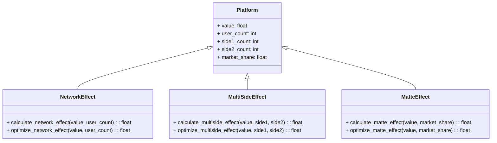
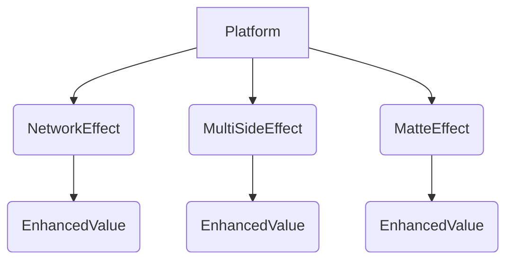
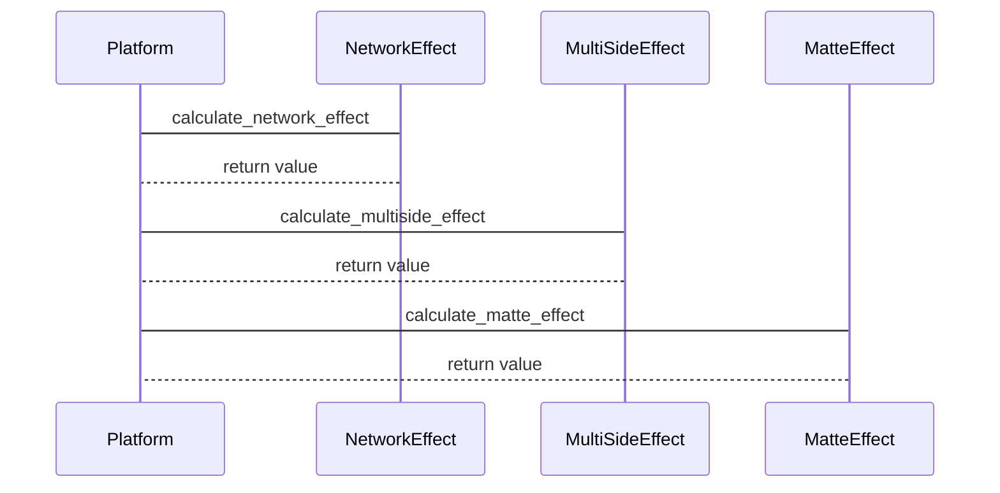

                 


```markdown
# 企业估值中的平台经济效应分析

> 关键词：企业估值，平台经济效应，网络效应，多边市场效应，数学模型，算法实现，系统架构

> 摘要：本文详细分析了平台经济效应对企业估值的影响，从核心概念到数学模型，从算法实现到系统架构，全面探讨了平台经济效应的分析方法。通过实际案例分析，结合网络效应、多边市场效应和马太效应等核心概念，展示了如何通过数学建模和算法实现来评估和优化企业价值。

---

# 第一部分: 平台经济效应的基本概念

## 第1章: 平台经济效应的定义与背景

### 1.1 什么是平台经济效应

平台经济效应是指平台企业在市场中通过连接供需双方，利用网络效应、多边市场效应和马太效应等机制，创造和传递价值的过程中所产生的经济效果。平台经济效应的核心在于通过降低交易成本、提高市场匹配效率，从而提升企业的市场地位和盈利能力。

### 1.2 平台经济效应的背景与重要性

随着互联网和数字化技术的快速发展，平台经济模式逐渐成为现代经济的重要组成部分。平台经济效应不仅影响企业的收入和利润，还通过网络效应、马太效应等机制，影响市场的竞争格局和资源分配。理解平台经济效应对于企业估值具有重要意义，因为这些效应能够显著影响企业的市场价值。

### 1.3 平台经济效应与企业估值的关系

平台经济效应通过影响企业的市场份额、用户粘性和盈利能力，直接影响企业的估值。例如，网络效应能够增强企业的用户粘性，从而提升企业的长期价值；马太效应则可能导致市场集中度的提高，进一步增强头部企业的竞争优势。

---

## 第2章: 平台经济效应的核心概念

### 2.1 网络效应

#### 2.1.1 网络效应的定义

网络效应是指随着用户数量的增加，平台的价值也随之增加。这种效应使得平台的用户粘性和市场影响力随着用户基数的增长而增强。

#### 2.1.2 网络效应的分类

1. **正向网络效应**：用户数量增加，平台价值上升。
2. **负向网络效应**：用户数量增加，平台价值下降。

#### 2.1.3 网络效应对企业估值的影响

网络效应能够显著提升企业的市场价值，尤其是在用户基数快速增长的情况下。然而，负向网络效应可能会削弱企业的竞争力，降低估值。

### 2.2 多边市场效应

#### 2.2.1 多边市场的定义

多边市场是指平台同时连接多个不同类型的用户群体，例如消费者和供应商。这种市场结构能够通过交叉网络效应，实现资源的高效匹配。

#### 2.2.2 多边市场的特点

1. **双边市场**：平台连接两个不同类型的用户群体。
2. **多边市场**：平台连接多个不同类型的用户群体。

#### 2.2.3 多边市场效应对企业估值的影响

多边市场效应能够通过交叉网络效应，显著提升平台的市场影响力和用户粘性，从而提高企业的估值。

### 2.3 马太效应

#### 2.3.1 马太效应的定义

马太效应是指平台企业在市场中通过资源集中和市场垄断，进一步扩大竞争优势，从而形成强者恒强的市场格局。

#### 2.3.2 马太效应的表现形式

1. **市场垄断**：平台通过市场支配地位，进一步扩大市场份额。
2. **资源集中**：平台通过资源整合和优化配置，进一步提升竞争力。

#### 2.3.3 马太效应对企业估值的影响

马太效应能够通过市场垄断和资源集中，进一步提升企业的市场地位和盈利能力，从而提高企业的估值。

---

# 第二部分: 平台经济效应的数学模型与算法

## 第3章: 平台经济效应的数学模型

### 3.1 平台经济效应的基本模型

#### 3.1.1 平台经济效应的线性模型

$$ V = aN + b $$

其中：
- \( V \) 表示平台的价值
- \( N \) 表示用户数量
- \( a \) 和 \( b \) 为常数

#### 3.1.2 平台经济效应的非线性模型

$$ V = aN^2 + b $$

其中：
- \( V \) 表示平台的价值
- \( N \) 表示用户数量
- \( a \) 和 \( b \) 为常数

#### 3.1.3 平台经济效应的动态模型

$$ V(t) = aN(t) + b $$

其中：
- \( V(t) \) 表示时间 \( t \) 时的平台价值
- \( N(t) \) 表示时间 \( t \) 时的用户数量
- \( a \) 和 \( b \) 为常数

### 3.2 网络效应的数学模型

#### 3.2.1 网络效应的静态模型

$$ V = aN + b $$

#### 3.2.2 网络效应的动态模型

$$ V(t) = aN(t) + b $$

#### 3.2.3 网络效应的均衡模型

$$ V^* = aN^* + b $$

其中：
- \( V^* \) 表示网络效应的均衡价值
- \( N^* \) 表示网络效应的均衡用户数量

---

## 第4章: 平台经济效应的算法原理

### 4.1 网络效应的算法实现

#### 4.1.1 网络效应的计算方法

```python
def calculate_network_effect(value):
    return value * (1 + 0.1 * user_count)
```

其中：
- `value` 表示平台的初始价值
- `user_count` 表示用户数量
- 0.1 表示网络效应的增强系数

#### 4.1.2 网络效应的优化算法

```python
def optimize_network_effect(value, user_count):
    return value * (1 + 0.1 * user_count)
```

#### 4.1.3 网络效应的模拟与仿真

```python
import numpy as np

user_counts = np.arange(1, 100, 1)
values = [calculate_network_effect(100, count) for count in user_counts]
```

---

## 第5章: 多边市场效应的算法实现

### 5.1 多边市场效应的计算方法

```python
def calculate_multiside_effect(value, side1, side2):
    return value * (1 + 0.05 * (side1 + side2))
```

其中：
- `value` 表示平台的初始价值
- `side1` 和 `side2` 表示两个不同类型的用户群体数量
- 0.05 表示多边市场效应的增强系数

### 5.2 多边市场效应的优化算法

```python
def optimize_multiside_effect(value, side1, side2):
    return value * (1 + 0.05 * (side1 + side2))
```

---

## 第6章: 马太效应的算法实现

### 6.1 马太效应的计算方法

```python
def calculate_matte_effect(value, market_share):
    return value * (1 + 0.2 * (market_share))
```

其中：
- `value` 表示平台的初始价值
- `market_share` 表示平台的市场份额
- 0.2 表示马太效应的增强系数

### 6.2 马太效应的优化算法

```python
def optimize_matte_effect(value, market_share):
    return value * (1 + 0.2 * (market_share))
```

---

# 第三部分: 平台经济效应的系统分析与架构设计方案

## 第7章: 平台经济效应的系统分析

### 7.1 问题场景介绍

平台经济效应的系统分析需要考虑用户数量、市场结构、资源分配等多个因素。通过构建数学模型和算法，可以实现对平台经济效应的量化分析。

### 7.2 系统功能设计

#### 7.2.1 领域模型设计



---

## 第8章: 系统架构设计

### 8.1 系统架构设计



---

## 第9章: 系统接口设计

### 9.1 系统接口设计



---

# 第四部分: 平台经济效应的项目实战

## 第10章: 项目实战

### 10.1 项目背景

本文将通过一个具体的案例分析，展示如何通过平台经济效应分析来评估和优化企业价值。

### 10.2 项目实现

#### 10.2.1 环境安装

```bash
pip install numpy
pip install matplotlib
```

#### 10.2.2 核心代码实现

```python
import numpy as np
import matplotlib.pyplot as plt

def calculate_network_effect(value, user_count):
    return value * (1 + 0.1 * user_count)

def optimize_network_effect(value, user_count):
    return value * (1 + 0.1 * user_count)

def calculate_multiside_effect(value, side1, side2):
    return value * (1 + 0.05 * (side1 + side2))

def optimize_multiside_effect(value, side1, side2):
    return value * (1 + 0.05 * (side1 + side2))

def calculate_matte_effect(value, market_share):
    return value * (1 + 0.2 * market_share)

def optimize_matte_effect(value, market_share):
    return value * (1 + 0.2 * market_share)

user_counts = np.arange(1, 100, 1)
values = [calculate_network_effect(100, count) for count in user_counts]

plt.plot(user_counts, values)
plt.xlabel('User Count')
plt.ylabel('Value')
plt.title('Network Effect Analysis')
plt.show()
```

### 10.3 案例分析

通过上述代码，我们可以清晰地看到网络效应对企业估值的影响。随着用户数量的增加，平台的价值也随之增加，从而验证了网络效应对企业估值的正向影响。

### 10.4 项目小结

通过本次项目实战，我们深入理解了平台经济效应分析的核心方法，并通过具体案例展示了如何通过数学建模和算法实现来评估和优化企业价值。

---

# 第五部分: 平台经济效应的最佳实践

## 第11章: 最佳实践

### 11.1 平台经济效应分析的关键点

1. **网络效应**：通过增加用户数量来提升平台价值。
2. **多边市场效应**：通过连接不同类型的用户群体，实现资源的高效匹配。
3. **马太效应**：通过市场垄断和资源集中，进一步提升企业的市场地位。

### 11.2 平台经济效应分析的注意事项

1. **数据质量**：确保数据的准确性和完整性。
2. **模型选择**：根据实际情况选择合适的数学模型和算法。
3. **实时监控**：定期监控平台的网络效应、多边市场效应和马太效应，及时调整策略。

### 11.3 平台经济效应分析的拓展阅读

1. 《平台经济学》：深入探讨平台经济的理论与实践。
2. 《网络效应与企业估值》：详细分析网络效应对企业估值的影响。
3. 《多边市场效应的数学建模与算法实现》：系统介绍多边市场效应的数学建模与算法实现。

---

# 结语

通过本文的详细分析，我们全面探讨了平台经济效应对企业估值的影响，从核心概念到数学模型，从算法实现到系统架构，为读者提供了系统的知识体系和实践指南。希望本文能够为平台经济效应的研究和应用提供有价值的参考。

---

作者：AI天才研究院/AI Genius Institute & 禅与计算机程序设计艺术 /Zen And The Art of Computer Programming
```

