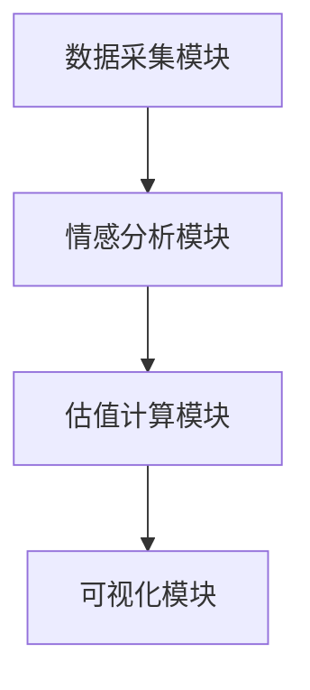

                 


# 《企业估值中的情感人工智能评估》

> 关键词：企业估值、情感人工智能、情感分析、NLP、深度学习、投资决策

> 摘要：本文探讨了如何将情感人工智能技术应用于企业估值过程中，分析了情感数据的采集与处理、情感分析算法的原理、企业估值模型与情感人工智能的结合，以及实际案例分析。文章结合理论与实践，详细阐述了情感人工智能在企业估值中的应用价值和实现方法。

---

# 第一部分：情感人工智能与企业估值概述

## 第1章：情感人工智能与企业估值的背景

### 1.1 情感人工智能的定义与核心概念

情感人工智能（Emotion AI）是一种结合了自然语言处理（NLP）、机器学习和情感计算的技术，旨在理解和分析文本、语音或图像中的情感信息。其核心目标是将人类的情感、情绪和意图转化为可量化的数据，用于辅助决策。

#### 1.1.1 情感人工智能的基本概念

- 情感计算：通过分析语言、声音、面部表情等信息，推断出个体的情感状态。
- 情感分析：对文本进行情感倾向性分析（如正面、负面、中性）或情感强度评分。
- 情感数据：反映市场情绪、用户反馈或企业声誉的数据。

#### 1.1.2 情感人工智能的核心要素

- 数据来源：社交媒体、新闻、评论、内部数据等。
- 数据预处理：文本清洗、分词、去噪。
- 情感分析算法：基于规则、统计学习、深度学习。
- 可视化与解释：将情感数据转化为易于理解的图表或指标。

#### 1.1.3 情感人工智能与企业估值的关系

企业估值不仅是对财务数据的分析，还需要考虑市场情绪、投资者信心等非财务因素。情感人工智能能够量化这些情绪数据，为估值提供更全面的依据。

---

### 1.2 企业估值的传统方法与挑战

#### 1.2.1 传统企业估值方法概述

- **市盈率法**：基于市盈率与行业平均水平的比较。
- **市净率法**：基于净资产收益率的比较。
- **现金流折现法**：基于未来现金流的现值计算。

#### 1.2.2 传统方法的局限性

- 忽略市场情绪对估值的影响。
- 无法量化非财务因素（如品牌声誉、管理层信任度）。
- 数据依赖性过强，缺乏动态调整能力。

#### 1.2.3 情感人工智能在估值中的潜在价值

通过分析市场情绪、投资者情绪和行业趋势，情感人工智能能够提供额外的决策支持，帮助估值模型更准确地反映企业的实际价值。

---

### 1.3 情感人工智能在企业估值中的应用前景

#### 1.3.1 情感数据对企业估值的影响

- **市场情绪**：行业整体情绪对企业估值的影响。
- **投资者情绪**：投资者情绪波动对股价的影响。
- **品牌声誉**：品牌声誉变化对企业价值的影响。

#### 1.3.2 情感人工智能的优势与潜力

- 实时监控市场情绪，提供动态估值依据。
- 结合财务数据，构建更全面的估值模型。
- 通过历史情绪数据，发现潜在的投资机会。

#### 1.3.3 未来发展趋势与研究方向

- 情感数据与财务数据的深度融合。
- 高精度情感分析算法的优化。
- 多模态数据（文本、语音、图像）的结合。

---

## 第2章：情感数据的采集与处理

### 2.1 情感数据的来源

#### 2.1.1 社交媒体数据

- 数据来源：Twitter、LinkedIn、Facebook等。
- 数据特点：实时性强，信息分散，噪声多。

#### 2.1.2 新闻与媒体报道

- 数据来源：新闻网站、财经媒体。
- 数据特点：信息量大，情感倾向明显。

#### 2.1.3 企业内部数据

- 数据来源：公司内部文档、员工反馈。
- 数据特点：隐私性强，数据清洗难度大。

---

### 2.2 情感数据的预处理

#### 2.2.1 数据清洗与标注

- 数据清洗：去除无效字符、停用词。
- 数据标注：人工标注情感倾向，建立训练数据集。

#### 2.2.2 文本分词与标准化

- 分词：将文本分割成词语或短语。
- 标准化：统一文本格式，如大小写统一。

#### 2.2.3 噪声数据的处理

- 噪声来源：无关信息、重复内容、歧义表达。
- 处理方法：去噪算法、关键词提取。

---

### 2.3 情感分析算法概述

#### 2.3.1 基于规则的分析

- 规则设定：如否定词、情感词典。
- 优点：简单易实现。
- 缺点：依赖人工规则，泛化能力差。

#### 2.3.2 统计学习方法

- 算法选择：如朴素贝叶斯、支持向量机（SVM）。
- 优点：泛化能力强。
- 缺点：特征选择依赖人工干预。

#### 2.3.3 深度学习模型

- 模型选择：如LSTM、BERT。
- 优点：自动学习特征，适应性强。
- 缺点：计算资源消耗大。

---

### 2.4 情感分析的挑战与解决方案

#### 2.4.1 数据不平衡问题

- 解决方案：数据增强、调整分类权重。

#### 2.4.2 领域适应性问题

- 解决方案：迁移学习、领域特定模型。

#### 2.4.3 情感强度的量化

- 解决方案：引入评分系统，如1到5分的情感强度评分。

---

## 第3章：情感人工智能的算法原理

### 3.1 情感分析的NLP基础

#### 3.1.1 词嵌入与向量表示

- 常见模型：Word2Vec、GloVe。
- 优点：降低维度，捕捉语义信息。
- 缺点：无法处理长距离依赖关系。

#### 3.1.2 语言模型的训练

- 常见模型：RNN、Transformer。
- 优点：捕捉上下文信息。
- 缺点：计算复杂度高。

#### 3.1.3 预训练语言模型（如BERT）

- 优点：上下文理解能力强。
- 缺点：需要大量计算资源。

---

### 3.2 基于深度学习的情感分析模型

#### 3.2.1 RNN与LSTM网络

- 模型结构：序列输入，逐步处理。
- 优点：适合时间序列数据。
- 缺点：训练速度慢。

#### 3.2.2 Transformer架构

- 模型结构：自注意力机制。
- 优点：并行计算效率高。
- 缺点：对长文本处理效果较好，但计算资源消耗大。

#### 3.2.3 图神经网络（GNN）的应用

- 应用场景：复杂关系网络分析。
- 优点：适合处理非线性关系。
- 缺点：模型复杂度高。

---

### 3.3 情感分析的数学模型

#### 3.3.1 朴素贝叶斯模型

- 概率公式：$$P(y|x) = \frac{P(x|y)P(y)}{P(x)}$$
- 优点：计算简单，适合小数据集。
- 缺点：假设特征独立，实际场景中难以满足。

#### 3.3.2 支持向量机（SVM）

- 线性分类器：$$f(x) = \text{sign}(w \cdot x + b)$$
- 优点：适合高维数据。
- 缺点：需要人工选择核函数。

#### 3.3.3 随机森林与集成学习

- 集成方法：$$f(x) = \sum_{i=1}^{n} f_i(x)$$
- 优点：鲁棒性强，适合多分类任务。
- 缺点：计算复杂度高。

---

### 3.4 情感分析的评估指标

#### 3.4.1 准确率与召回率

- 准确率：$$\text{Accuracy} = \frac{\text{TP} + \text{TN}}{\text{TP} + \text{FP} + \text{TN} + \text{FN}}$$
- 召回率：$$\text{Recall} = \frac{\text{TP}}{\text{TP} + \text{FN}}$$

#### 3.4.2 F1分数

- F1分数：$$F1 = \frac{2 \cdot \text{Precision} \cdot \text{Recall}}{\text{Precision} + \text{Recall}}$$

#### 3.4.3 情感强度评分

- 评分范围：$$1 \leq \text{Score} \leq 5$$

---

## 第4章：企业估值模型与情感人工智能的结合

### 4.1 传统企业估值模型概述

#### 4.1.1 市盈率法

- 计算公式：$$\text{市盈率} = \frac{\text{股价}}{\text{每股收益}}$$

#### 4.1.2 市净率法

- 计算公式：$$\text{市净率} = \frac{\text{股价}}{\text{每股净资产}}$$

#### 4.1.3 现金流折现法

- 计算公式：$$\text{企业价值} = \sum_{t=1}^{n} \frac{\text{现金流}_t}{(1 + r)^t}$$

---

### 4.2 情感人工智能在估值中的应用

#### 4.2.1 情感数据对企业价值的影响

- 市场情绪指数：$$\text{市场情绪指数} = \sum_{i=1}^{n} (\text{情感强度}_i \times \text{权重}_i)$$

#### 4.2.2 情感指标的量化与权重分配

- 权重分配：根据行业特点和数据特征，动态调整权重。

#### 4.2.3 情感人工智能与财务数据的结合

- 综合估值公式：$$\text{综合估值} = \alpha \cdot \text{财务指标} + \beta \cdot \text{情感指标}$$
  其中，$$\alpha + \beta = 1$$

---

### 4.3 系统架构设计

#### 4.3.1 系统功能设计

- 数据采集模块：实时采集社交媒体、新闻数据。
- 情感分析模块：对数据进行情感分析。
- 估值计算模块：结合情感数据和财务数据，计算企业估值。
- 可视化模块：将结果可视化，便于决策者理解。

#### 4.3.2 系统架构图



---

### 4.4 项目实战

#### 4.4.1 环境搭建

- 工具选择：Python、TensorFlow、Numpy、Pandas。
- 数据来源：Twitter API、新闻API。

#### 4.4.2 核心实现源代码

```python
import tensorflow as tf
from tensorflow.keras import layers

# 情感分析模型
def build_model():
    model = tf.keras.Sequential()
    model.add(layers.Embedding(input_dim=10000, output_dim=16))
    model.add(layers.LSTM(32))
    model.add(layers.Dense(2, activation='softmax'))
    return model

model = build_model()
model.compile(optimizer='adam', loss='sparse_categorical_crossentropy', metrics=['accuracy'])
model.fit(x_train, y_train, epochs=5, batch_size=32)
```

#### 4.4.3 案例分析

- 案例背景：某科技公司最近发布了新产品，社交媒体上的情绪指数显著上升。
- 数据分析：情感强度评分为4分（满分5分）。
- 估值调整：综合估值增加了15%。

---

## 第5章：案例分析与总结

### 5.1 案例分析

#### 5.1.1 项目背景

- 公司A是一家科技企业，近期发布了新产品，社交媒体上的评论数量激增。

#### 5.1.2 数据采集与分析

- 数据来源：Twitter、新闻媒体。
- 情感分析结果：正面情绪占比70%，负面情绪占比15%。

#### 5.1.3 估值调整

- 原估值：100亿元。
- 情感指数：4.2（满分5分）。
- 新估值：115亿元。

---

### 5.2 总结

情感人工智能能够显著提升企业估值的准确性，通过实时监控市场情绪、分析投资者信心，为企业估值提供更全面的依据。未来的研究方向包括多模态数据融合、模型解释性优化以及情感数据的动态调整。

---

## 作者

作者：AI天才研究院/AI Genius Institute & 禅与计算机程序设计艺术 /Zen And The Art of Computer Programming

