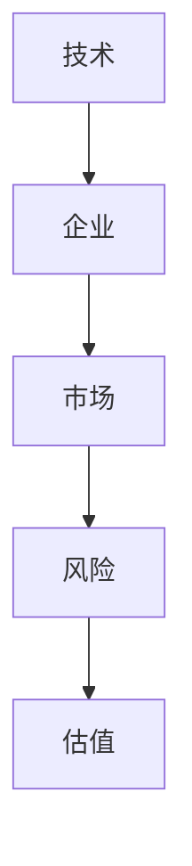
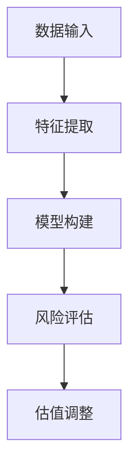
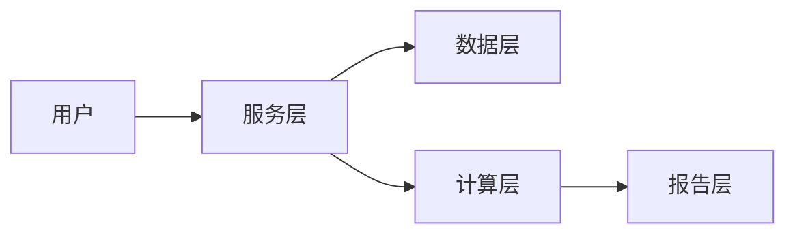

                 


# 企业估值中的技术迭代风险分析

> **关键词**: 企业估值，技术迭代，风险分析，技术生命周期，技术替代性，技术成熟度

> **摘要**: 本文深入探讨了技术迭代对企业估值的影响，分析了技术迭代风险的核心概念、算法原理及系统架构。通过实际案例分析，提出了技术风险评估模型，并提供了最佳实践建议。

---

## 第一部分: 企业估值中的技术迭代风险概述

### 第1章: 技术迭代风险的背景与概念

#### 1.1 技术迭代风险的定义

- **技术迭代**：技术不断更新和变革的过程，通常以更快的速度和更高的频率发生。
- **技术迭代风险**：由于技术快速变化带来的企业估值波动风险，主要体现在技术落后、替代品出现、竞争优势丧失等方面。

#### 1.2 技术迭代风险的背景

- **数字化转型**：企业 increasingly rely on technology，技术变化对企业价值影响显著。
- **技术变革加快**：AI、大数据等技术快速发展，导致企业技术更新压力增大。
- **市场竞争加剧**：技术成为核心竞争力，技术迭代失败可能导致企业估值大幅下降。

#### 1.3 技术迭代风险的核心要素

- **技术生命周期**：技术从引入、成长到衰退的阶段，每个阶段对企业估值的影响不同。
- **技术替代性分析**：评估新技术对企业原有技术的替代程度，影响企业的市场地位。
- **技术成熟度**：技术的成熟程度决定了其稳定性和对企业估值的贡献。

---

### 第2章: 技术迭代风险对企业估值的影响

#### 2.1 技术迭代对企业财务表现的影响

- **收入**：技术领先带来收入增长，而技术落后可能导致收入下降。
- **成本**：技术更新可能降低运营成本，但也可能增加研发支出。
- **利润**：技术优势转化为利润，但技术迭代失败可能导致利润下滑。

#### 2.2 技术迭代风险与企业市场价值的关系

- **技术领先性**：企业技术越领先，市场价值越高。
- **技术迭代失败**：可能导致市场对企业未来盈利能力的质疑，估值下降。
- **技术储备**：企业储备的技术储备越多，应对技术迭代风险的能力越强。

#### 2.3 技术迭代风险的量化分析

- **技术风险度量**：通过指标如技术更新频率、替代品出现概率等量化风险。
- **估值修正模型**：使用数学模型调整企业估值，考虑技术迭代风险的影响。
- **敏感性分析**：评估技术迭代风险对估值的敏感程度，确定关键风险因素。

---

## 第二部分: 技术迭代风险的分析框架

### 第3章: 技术迭代风险的核心概念与联系

#### 3.1 技术迭代风险的核心概念

- **技术生命周期模型**：展示技术从引入到衰退的过程，帮助企业识别不同阶段的风险。
- **技术替代性分析**：评估新技术对企业现有技术的威胁，预测替代可能性。
- **技术成熟度评估**：判断技术的成熟程度，预测其对企业估值的影响。

#### 3.2 技术迭代风险的属性特征对比

- **技术迭代速度与企业竞争力**：速度越快，竞争力越强，但风险也越高。
- **技术迭代成本与财务状况**：高成本可能影响企业的财务健康，进而影响估值。
- **技术不确定性与估值波动**：不确定性越大，估值波动越剧烈。

#### 3.3 技术迭代风险的ER实体关系图



---

### 第4章: 技术迭代风险的算法原理

#### 4.1 技术迭代风险评估模型

- **模型构建步骤**：
  1. 数据采集与清洗。
  2. 特征提取与选择。
  3. 模型训练与验证。
  4. 风险评估与报告。

#### 4.2 技术迭代风险评估的数学模型



数学公式：

$$
风险指数 = \sum_{i=1}^{n} (w_i \times f_i)
$$

其中，$w_i$ 是第i个特征的权重，$f_i$ 是第i个特征的风险值。

---

## 第三部分: 技术迭代风险的系统分析与架构设计

### 第5章: 技术迭代风险的系统分析

#### 5.1 问题场景介绍

- **问题描述**：企业面临技术迭代风险，需建立模型评估风险，调整估值。
- **边界与外延**：聚焦于技术相关风险，不考虑非技术因素。

#### 5.2 系统功能设计

- **功能模块**：
  1. 数据采集模块：收集技术数据。
  2. 评估模块：计算风险指数。
  3. 报告模块：生成风险评估报告。

#### 5.3 系统架构设计



---

### 第6章: 技术迭代风险的项目实战

#### 6.1 环境安装

- **工具**：Python、NumPy、Pandas、Mermaid、Jupyter Notebook。
- **步骤**：
  1. 安装依赖。
  2. 配置开发环境。

#### 6.2 核心代码实现

```python
import numpy as np
import pandas as pd

def calculate_technology_risk(factors):
    risk_factors = factors
    weights = [0.4, 0.3, 0.2, 0.1]
    risk_index = sum(w * f for w, f in zip(weights, risk_factors))
    return risk_index

# 示例数据
factors = [0.8, 0.6, 0.5, 0.7]
risk = calculate_technology_risk(factors)
print(f"技术迭代风险指数: {risk}")
```

#### 6.3 案例分析

- **案例背景**：某科技公司面临技术迭代风险，需评估其技术优势和替代风险。
- **分析步骤**：
  1. 数据收集。
  2. 风险计算。
  3. 结果解读。

---

## 第四部分: 技术迭代风险的最佳实践

### 第7章: 技术迭代风险的最佳实践

#### 7.1 小结

- **技术迭代风险**：企业在估值时需考虑技术的生命周期、替代性和成熟度。
- **模型构建**：使用数学模型量化风险，调整企业估值。

#### 7.2 注意事项

- **数据质量**：确保数据准确，避免偏差。
- **模型更新**：定期更新模型，适应技术变化。

#### 7.3 拓展阅读

- **推荐书籍**：《技术分析与企业估值》。
- **学术论文**：推荐几篇关于技术风险评估的论文。

---

## 作者信息

作者：AI天才研究院/AI Genius Institute & 禅与计算机程序设计艺术/Zen And The Art of Computer Programming

---

**全文完**

