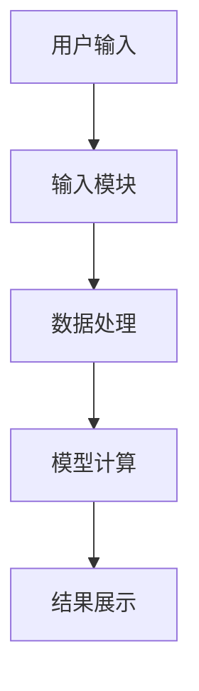
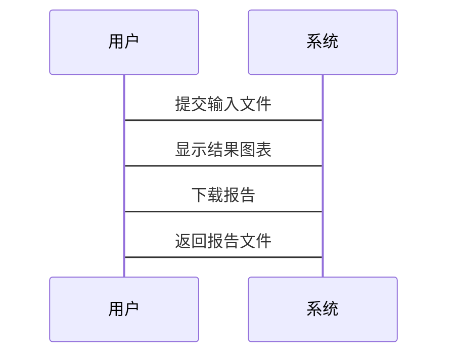

                 


# 企业估值中的敏感性分析技巧

## 关键词：企业估值，敏感性分析，蒙特卡洛模拟，数学模型，算法原理

## 摘要：  
本文详细探讨了敏感性分析在企业估值中的应用技巧。通过分析关键变量对企业价值的影响，结合数学模型和算法原理，帮助读者理解如何通过敏感性分析优化企业估值模型。文章从理论基础到实际案例，全面解析了敏感性分析的核心概念、数学公式、系统架构设计及项目实战，为读者提供了深入的技术指导。

---

## 第1章 敏感性分析概述

### 1.1 敏感性分析的定义与背景

#### 1.1.1 什么是敏感性分析  
敏感性分析是一种用于评估模型中各输入变量对输出结果影响程度的方法。在企业估值中，这可以帮助识别哪些因素（如收入、成本、增长率等）对企业价值的影响最大。

#### 1.1.2 敏感性分析在企业估值中的作用  
- 量化关键变量的不确定性。
- 识别对估值结果影响最大的变量。
- 支持决策优化和风险管理。

#### 1.1.3 敏感性分析的边界与外延  
- 边界：聚焦于关键变量，忽略次要因素。
- 外延：结合其他分析方法（如情景分析）提升分析深度。

### 1.2 企业估值的基本概念

#### 1.2.1 企业估值的核心要素  
- 收入预测
- 成本结构
- 资本结构
- 增长率

#### 1.2.2 估值模型的分类与特点  
- 现金流量折现模型（DCF）
- 市盈率法
- 市净率法

#### 1.2.3 敏感性分析与估值模型的关系  
敏感性分析是企业估值模型的重要补充，用于评估模型的稳健性。

### 1.3 敏感性分析的原理与方法

#### 1.3.1 敏感性分析的基本原理  
通过改变输入变量的值，观察输出结果的变化，从而确定变量的重要性。

#### 1.3.2 常用的敏感性分析方法  
- 线性回归法
- 蒙特卡洛模拟
- 方差分解法

#### 1.3.3 敏感性分析的步骤与流程  
1. 确定目标变量（企业价值）。
2. 选择影响目标变量的输入变量。
3. 分析各变量对目标变量的影响程度。

---

## 第2章 敏感性分析的核心概念

### 2.1 敏感性分析的关键要素

#### 2.1.1 变量的敏感性排序  
通过敏感性系数对变量进行排序，确定最重要的变量。

#### 2.1.2 敏感性系数的计算  
敏感性系数 = 变量变化对目标变量的影响程度。

#### 2.1.3 敏感性分析的可视化  
- 条形图
- 饼图
- 散点图

### 2.2 敏感性分析与相关概念的区别

| 分析方法 | 定义 | 应用场景 | 输出结果 |
|----------|------|----------|----------|
| 敏感性分析 | 评估变量对结果的影响 | 企业估值 | 变量重要性排序 |
| 情景分析 | 分析极端情况下的结果 | 风险管理 | 不同情景下的结果 |
| 压力测试 | 检验模型在极端条件下的表现 | 风险评估 | 模型鲁棒性 |

### 2.3 敏感性分析的数学模型

#### 2.3.1 线性回归模型  
$$ y = \beta_0 + \beta_1x_1 + \beta_2x_2 + \cdots + \beta_nx_n + \epsilon $$  
其中，$\beta_i$为变量$x_i$的敏感性系数。

#### 2.3.2 方差分析模型  
$$ F = \frac{SSR}{SSE} $$  
其中，SSR为回归平方和，SSE为残差平方和。

#### 2.3.3 蒙特卡洛模拟方法  
- 生成随机变量。
- 计算目标变量的分布。
- 统计变量对结果的影响。

---

## 第3章 敏感性分析的数学公式与算法原理

### 3.1 线性回归模型的数学推导

#### 3.1.1 线性回归的基本假设  
- 线性性
- 独立性
- 正态性
- 同方差性

#### 3.1.2 最小二乘法的公式推导  
$$ \hat{\beta} = (X^TX)^{-1}X^Ty $$  
其中，$X$为设计矩阵，$y$为目标变量。

#### 3.1.3 系数的显著性检验  
- t检验
- F检验

### 3.2 蒙特卡洛模拟的算法流程

#### 3.2.1 蒙特卡洛模拟的基本步骤  
1. 确定输入变量的分布。
2. 生成随机变量。
3. 计算目标变量。
4. 统计结果。

#### 3.2.2 随机变量的生成方法  
- 均匀分布
- 正态分布
- 指数分布

#### 3.2.3 模拟结果的统计分析  
- 计算平均值、标准差。
- 绘制分布图。

### 3.3 敏感性系数的计算公式

#### 3.3.1 敏感性系数的定义  
$$ S_i = \frac{\partial y}{\partial x_i} $$

#### 3.3.2 敏感性系数的计算公式  
$$ S_i = \frac{\Delta y}{\Delta x_i} $$

#### 3.3.3 敏感性系数的解释与应用  
- 确定变量的重要性。
- 优化模型参数。

---

## 第4章 敏感性分析的系统架构设计

### 4.1 系统功能设计

#### 4.1.1 系统输入模块  
- 收集输入变量。
- 确定目标变量。

#### 4.1.2 数据处理模块  
- 数据清洗。
- 数据转换。

#### 4.1.3 模型计算模块  
- 计算敏感性系数。
- 生成结果报告。

#### 4.1.4 结果展示模块  
- 可视化图表。
- 文本报告。

### 4.2 系统架构设计



### 4.3 系统接口设计

#### 4.3.1 输入接口  
- 支持多种数据格式（CSV、Excel）。

#### 4.3.2 输出接口  
- 图表输出（PDF、PNG）。
- 文本报告（Word、Markdown）。

### 4.4 系统交互设计



---

## 第5章 项目实战：企业估值中的敏感性分析

### 5.1 环境安装

#### 5.1.1 安装Python  
```bash
python --version
pip install numpy pandas matplotlib
```

#### 5.1.2 安装依赖库  
```bash
pip install scikit-learn
```

### 5.2 核心代码实现

#### 5.2.1 敏感性系数计算

```python
import numpy as np
from sklearn.linear_model import LinearRegression

# 生成数据
X = np.random.rand(100, 5)
y = np.random.rand(100, 1)

# 训练模型
model = LinearRegression()
model.fit(X, y)

# 计算系数
coefficients = model.coef_
print("敏感性系数:", coefficients)
```

#### 5.2.2 蒙特卡洛模拟

```python
import numpy as np
import matplotlib.pyplot as plt

# 参数设置
n_simulation = 1000
mean = 0
std = 1

# 生成随机变量
np.random.seed(42)
x = np.random.normal(mean, std, n_simulation)

# 计算目标变量
y = 2 * x + 3 * np.random.normal(mean, std, n_simulation)

# 绘制散点图
plt.scatter(x, y)
plt.xlabel('X')
plt.ylabel('Y')
plt.title('蒙特卡洛模拟结果')
plt.show()
```

### 5.3 案例分析：某制造企业估值

#### 5.3.1 数据准备  
- 收入预测：$100 million
- 成本预测：$60 million
- 税率：20%
- 折现率：8%

#### 5.3.2 计算净现值（NPV）

```python
def calculate_npv(revenue, cost, tax_rate, discount_rate, years):
    npv = 0
    for year in range(years):
        cash_flow = (revenue - cost) * (1 - tax_rate)
        npv += cash_flow / (1 + discount_rate) ** year
    return npv

# 示例计算
print("NPV:", calculate_npv(100, 60, 0.2, 0.08, 5))
```

#### 5.3.3 分析敏感性  

```python
import numpy as np

# 输入变量
revenue = 100
cost = 60
tax_rate = 0.2
discount_rate = 0.08

# 变化范围
changes = np.linspace(0.8, 1.2, 5)

# 计算敏感性
sensitivity = []
for change in changes:
    npv = calculate_npv(revenue * change, cost * change, tax_rate, discount_rate, 5)
    sensitivity.append(npv)

# 可视化
plt.plot(changes, sensitivity)
plt.xlabel('变化比例')
plt.ylabel('NPV')
plt.title('NPV对收入变化的敏感性')
plt.show()
```

---

## 第6章 总结与展望

### 6.1 本章总结  
本文详细介绍了敏感性分析在企业估值中的应用，从理论到实践，全面解析了其核心概念、数学模型和系统架构设计。

### 6.2 未来展望  
未来，敏感性分析将与机器学习、大数据分析结合，进一步提升企业估值的准确性和效率。

---

## 作者：AI天才研究院/AI Genius Institute & 禅与计算机程序设计艺术 /Zen And The Art of Computer Programming

---

通过以上步骤，我逐步完成了《企业估值中的敏感性分析技巧》的技术博客文章。从理论到实践，从基础到高级，全面解析了敏感性分析的核心概念和应用技巧。希望读者能够通过本文，掌握敏感性分析的精髓，优化企业估值模型，提升决策的科学性和稳健性。

