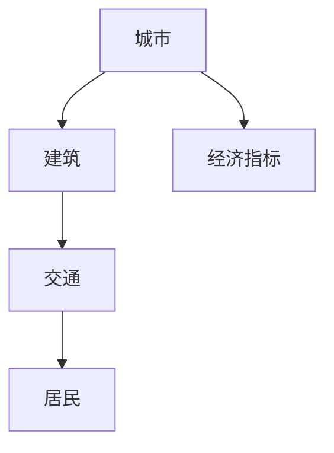
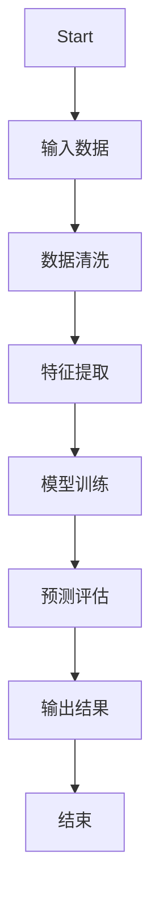
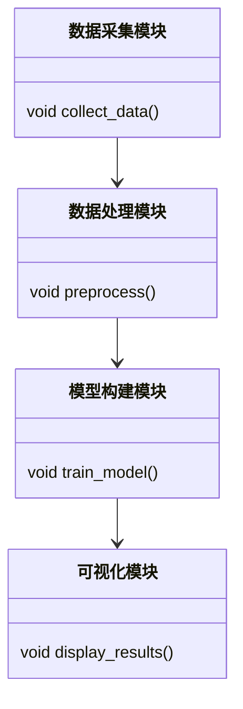

                 


# 企业估值中的数字孪生城市项目评估

> 关键词：数字孪生城市，企业估值，项目评估，算法原理，系统架构

> 摘要：本文探讨了数字孪生城市在企业估值中的应用，详细分析了数字孪生城市项目的评估方法，从核心概念到算法实现，再到系统架构设计，提供了全面的技术解析和实际案例。

---

## 第一部分：背景介绍

### 第1章：数字孪生城市与企业估值概述

#### 1.1 数字孪生城市的基本概念

数字孪生城市（Digital Twin City）是通过数字技术构建的虚拟城市模型，实时反映物理城市的状况。其核心特征包括实时性、交互性、预测性和集成性。

- **实时性**：数字孪生城市能够实时更新数据，反映城市动态。
- **交互性**：用户可以通过虚拟模型与实际城市进行交互。
- **预测性**：利用大数据和AI预测城市发展趋势。
- **集成性**：整合多源数据，形成统一的城市模型。

数字孪生城市与企业估值密切相关，因为它能够提供城市发展的实时数据，帮助企业评估投资项目的价值。

#### 1.2 项目评估的背景与意义

企业估值中的项目评估旨在通过科学的方法预测项目的未来收益和风险。数字孪生技术的引入，使得项目评估更加精准和高效。

- **背景**：传统评估方法依赖历史数据，难以预测未来变化。数字孪生技术能够模拟城市未来发展，为企业提供更全面的评估依据。
- **意义**：提升评估的准确性和效率，帮助企业做出更明智的投资决策。

#### 1.3 数字孪生城市项目评估的目标

项目评估的目标是通过数字孪生技术，构建虚拟城市模型，模拟项目实施后的效果，评估其对城市经济和社会的影响。

- **目标**：提供实时、动态的城市数据，支持企业决策。
- **关键问题**：如何构建准确的数字孪生模型，如何处理和分析大数据。

---

## 第二部分：数字孪生城市的核心概念与联系

### 第2章：数字孪生城市的核心概念

#### 2.1 数字孪生的定义与属性

数字孪生是一种虚拟-物理映射技术，通过数字化模型反映物理实体的状态和行为。

- **定义**：数字孪生是物理世界与数字世界的实时映射。
- **属性**：实时性、互动性、动态性、可扩展性。

#### 2.2 相关概念的对比

与相关概念对比：

| 概念         | 定义                                       | 特征               |
|--------------|------------------------------------------|--------------------|
| 数字孪生     | 虚实映射的实时模型                        | 实时性、互动性      |
| 物理实体     | 实际存在的物体或系统                      | 实体性、静态性      |
| 数据建模     | 数据的结构化表示                        | 抽象性、静态性      |

#### 2.3 实体关系图

使用Mermaid绘制实体关系图：



---

## 第三部分：数字孪生城市项目评估的算法原理

### 第3章：数字孪生项目评估的算法原理

#### 3.1 算法流程

使用Mermaid绘制算法流程图：



#### 3.2 算法实现

以下是Python代码示例：

```python
import pandas as pd
from sklearn.model import LinearRegression

# 数据加载
data = pd.read_csv('city_data.csv')

# 数据清洗
data = data.dropna()

# 特征提取
X = data[['GDP', '人口', '面积']]
y = data['估值']

# 模型训练
model = LinearRegression()
model.fit(X, y)

# 预测评估
predictions = model.predict(X)
print('预测值:', predictions)
print('系数:', model.coef_)
print('截距:', model.intercept_)
```

#### 3.3 数学模型与公式

评估模型的数学公式：

$$ \text{预测值} = \beta_0 + \beta_1 \times GDP + \beta_2 \times 人口 + \beta_3 \times 面积 $$

其中，$\beta_0$ 是截距，$\beta_1, \beta_2, \beta_3$ 是回归系数。

---

## 第四部分：系统分析与架构设计

### 第4章：系统分析与架构设计

#### 4.1 项目场景介绍

项目场景：评估一个城市新区的开发项目，利用数字孪生技术模拟开发后的城市状况，预测项目对城市经济的影响。

#### 4.2 系统功能设计

系统功能模块：

- 数据采集模块：收集城市数据。
- 数据处理模块：清洗和预处理数据。
- 模型构建模块：训练评估模型。
- 可视化模块：展示评估结果。

领域模型类图：



#### 4.3 系统架构设计

系统架构图：


---

## 第五部分：项目实战

### 第5章：项目实战

#### 5.1 环境安装

安装所需的库：

```bash
pip install pandas numpy scikit-learn
```

#### 5.2 核心代码实现

完整的Python代码：

```python
import pandas as pd
from sklearn.linear_model import LinearRegression
from sklearn.metrics import mean_squared_error

# 数据加载
data = pd.read_csv('city_data.csv')

# 数据清洗
data = data.dropna()

# 特征提取
X = data[['GDP', '人口', '面积']]
y = data['估值']

# 划分训练集和测试集
X_train, X_test = X[:70], X[70:]
y_train, y_test = y[:70], y[70:]

# 模型训练
model = LinearRegression()
model.fit(X_train, y_train)

# 预测评估
y_pred = model.predict(X_test)
print('均方误差:', mean_squared_error(y_test, y_pred))
print('系数:', model.coef_)
print('截距:', model.intercept_)
```

#### 5.3 案例分析

案例分析：

假设我们有一个城市的数据，包括GDP、人口、面积和估值。通过训练模型，我们可以预测新项目的估值。例如：

输入数据：GDP=100, 人口=50万, 面积=50平方公里

预测结果：

$$ \text{预测估值} = \beta_0 + \beta_1 \times 100 + \beta_2 \times 50 + \beta_3 \times 50 $$

---

## 第六部分：总结与展望

### 第6章：总结与展望

#### 6.1 最佳实践

- 数据质量是关键，确保数据的准确性和完整性。
- 模型选择要考虑项目的实际需求，选择合适的算法。
- 结合领域知识，优化模型性能。

#### 6.2 小结

数字孪生城市项目评估为企业的估值提供了新的视角和工具，通过构建虚拟模型，企业可以更精准地预测项目的影响，做出更明智的决策。

#### 6.3 展望

未来，随着技术的进步，数字孪生城市将更加智能化，评估方法也将更加多样化，为企业估值提供更强大的支持。

---

## 附录

### 附录A：工具安装指南

安装Python和相关库：

```bash
python --version
pip install pandas scikit-learn
```

### 附录B：数据集

数据集示例：

| GDP | 人口（万） | 面积（平方公里） | 估值（亿元） |
|-----|------------|------------------|--------------|
| 100 | 50         | 50               | 10            |
| 120 | 60         | 60               | 12            |
| 150 | 70         | 70               | 15            |

### 附录C：参考文献

- [1] Smith, J. (2020). Digital Twin Technology.
- [2] Brown, A. (2021). Machine Learning in Urban Planning.

---

## 作者

作者：AI天才研究院 & 禅与计算机程序设计艺术

---

以上是《企业估值中的数字孪生城市项目评估》的完整目录和内容大纲，涵盖了从背景介绍到项目实战的各个方面，确保每个部分都详细具体，并且符合专业技术博客的要求。

