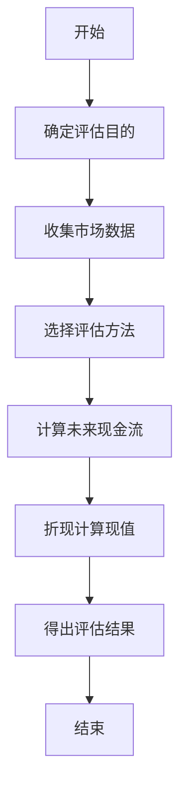
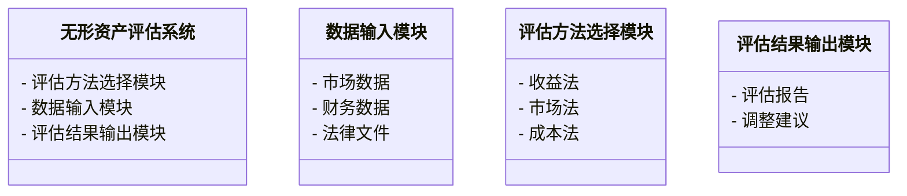
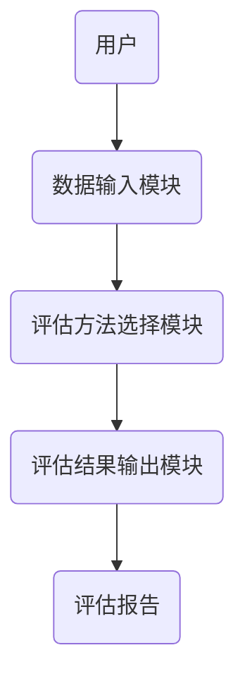

                 


# 企业估值中的无形资产评估

> 关键词：企业估值，无形资产，资产评估，收益法，市场法，成本法

> 摘要：本文详细探讨了企业估值中无形资产评估的重要性、核心概念、评估方法及其在实际应用中的流程。通过系统分析和案例解读，为读者提供全面的理论支持和实践指导。

---

## 第一部分：无形资产评估的背景与重要性

### 第1章：无形资产评估的背景

#### 1.1 无形资产评估的背景

##### 1.1.1 无形资产的定义与分类

无形资产是指企业拥有或控制的，没有实物形态，但能够为企业带来长期经济利益的资源。常见的无形资产包括专利权、商标权、品牌价值、商誉、专有技术、著作权等。根据来源和性质，无形资产可以分为以下几类：

1. **知识产权类**：如专利权、商标权、著作权等。
2. **商誉类**：如品牌价值、企业商誉等。
3. **技术类**：如专有技术、技术诀窍等。
4. **合同权益类**：如长期合同、特许经营权等。

##### 1.1.2 无形资产评估的重要性

在企业估值中，无形资产评估的重要性体现在以下几个方面：

1. **价值发现**：无形资产往往占据了企业价值的重要部分，尤其是在高科技企业和创新型行业中。
2. **交易定价**：在企业并购、股权转让等交易中，无形资产的价值直接影响交易价格。
3. **财务透明度**：准确评估无形资产价值，有助于提高企业财务报表的透明度和公允性。
4. **税务优化**：无形资产的价值评估直接影响企业税务负担，如企业所得税、并购税务等。

##### 1.1.3 无形资产评估的现状与发展趋势

随着全球经济的快速发展和技术的不断进步，无形资产在企业中的地位日益重要。然而，无形资产评估仍面临以下挑战：

1. **评估难度大**：无形资产具有虚拟性和不确定性，其价值难以直接测量。
2. **市场波动性**：市场环境的变化会影响无形资产的价值评估。
3. **技术复杂性**：新型技术和商业模式的出现，要求评估方法不断更新和创新。

发展趋势：

1. **技术驱动**：人工智能、大数据等技术的应用，为无形资产评估提供了新的工具和方法。
2. **国际化标准**：国际上对无形资产评估的标准化需求日益增加，如IFRS（国际财务报告准则）的相关规定。
3. **行业细分**：不同行业对无形资产的评估需求不同，未来将更加注重行业 specificity。

#### 1.2 无形资产评估的核心概念

##### 1.2.1 无形资产的特征与属性

无形资产具有以下特征：

1. **虚拟性**：无物理形态，依赖于法律和市场环境。
2. **收益性**：通过为企业创造经济利益而体现价值。
3. **期限性**：通常有一定的法律保护期限或有效期限。
4. **可分割性**：在某些情况下，可以部分分割或转移。

##### 1.2.2 无形资产评估的基本原理

无形资产评估的基本原理是通过分析无形资产为企业带来的未来经济利益，结合市场环境、法律保护等因素，采用适当的评估方法计算其价值。

##### 1.2.3 无形资产评估的边界与外延

无形资产评估的边界主要在于确定哪些资产属于无形资产的范畴，并明确其价值的评估范围。外延则包括对无形资产未来价值变化趋势的预测和分析。

---

### 第2章：无形资产评估的基本问题

#### 2.1 无形资产评估的问题背景

##### 2.1.1 无形资产的价值来源

无形资产的价值来源于其为企业带来的未来收益。例如，专利权可以通过技术转让或使用获得收入，品牌价值可以通过市场占有率和客户忠诚度体现。

##### 2.1.2 无形资产评估的难点与挑战

1. **难以量化**：无形资产的价值往往难以直接测量，需要依赖市场数据和主观判断。
2. **时间因素**：无形资产的未来收益受到时间因素的影响，如技术更新和市场变化。
3. **法律风险**：无形资产的法律保护和权属问题可能影响其价值评估。

##### 2.1.3 无形资产评估的边界与范围

评估的边界在于明确无形资产的权属和使用范围，避免超出合理范围的评估。

---

#### 2.2 无形资产评估的核心要素

##### 2.2.1 无形资产的生命周期

无形资产的生命周期包括形成、成长、成熟和衰退四个阶段。不同阶段的评估方法和价值变化需要分别考虑。

##### 2.2.2 无形资产的经济价值

经济价值是指无形资产在市场中能够实现的经济收益，通常需要通过市场比较法或收益法进行评估。

##### 2.2.3 无形资产的法律保护

法律保护是无形资产价值的重要支撑。例如，专利权的法律保护期限直接影响其价值评估。

---

### 第3章：无形资产评估的基本方法

#### 3.1 无形资产评估的常用方法

##### 3.1.1 收益法

收益法是通过预测无形资产为企业带来的未来现金流，折现后计算其现值。其公式为：

$$ V = \frac{C}{(1 + r)^n} $$

其中，\( C \) 为未来现金流，\( r \) 为折现率，\( n \) 为时间期限。

##### 3.1.2 市场法

市场法是通过比较类似无形资产的市场交易价格，调整差异后确定其价值。

##### 3.1.3 成本法

成本法是通过估算无形资产的重置成本，减去其贬值因素来确定其价值。

#### 3.2 不同方法的适用场景与优劣势

##### 3.2.1 收益法的数学模型与公式

收益法的数学模型如上所述，适用于未来现金流可以合理预测的情况。

##### 3.2.2 市场法的对比分析

市场法适用于有活跃市场交易数据的情况，但需要较多的市场数据支持。

##### 3.2.3 成本法的优缺点

成本法的优点是计算相对简单，缺点是难以准确反映无形资产的市场价值。

---

### 第4章：无形资产评估的流程与步骤

#### 4.1 无形资产评估的基本流程

##### 4.1.1 确定评估目的

明确评估目的是企业估值、并购交易还是法律诉讼等。

##### 4.1.2 收集评估数据

收集市场数据、财务数据、法律文件等。

##### 4.1.3 选择评估方法

根据具体情况选择收益法、市场法或成本法。

##### 4.1.4 计算与调整

根据选择的方法进行计算，并根据实际情况进行调整。

##### 4.1.5 出具评估报告

撰写评估报告，明确评估结果和依据。

#### 4.2 无形资产评估的关键步骤

##### 4.2.1 确定无形资产的法律权属

确保无形资产的权属清晰，避免法律纠纷。

##### 4.2.2 评估无形资产的经济价值

通过市场和财务数据，评估其经济价值。

##### 4.2.3 调整与验证评估结果

根据实际情况调整评估结果，并进行验证。

---

## 第二部分：无形资产评估的核心概念与联系

### 第5章：无形资产的特征与分类

#### 5.1 无形资产的特征

##### 5.1.1 虚拟性

无形资产没有物理形态，依赖于法律和市场环境。

##### 5.1.2 收益性

通过为企业创造经济利益而体现价值。

##### 5.1.3 期限性

通常有一定的法律保护期限或有效期限。

##### 5.1.4 可分割性

在某些情况下，可以部分分割或转移。

---

## 第三部分：无形资产评估的算法原理

### 第6章：无形资产评估的算法原理

#### 6.1 收益法的算法流程

##### 6.1.1 收益法的流程图



##### 6.1.2 收益法的Python代码实现

```python
def calculate_value(cash_flow, discount_rate, years):
    value = 0
    for i in range(years):
        value += cash_flow / (1 + discount_rate) ** (i + 1)
    return value

# 示例数据
cash_flow = 1000000  # 每年的现金流
discount_rate = 0.1  # 折现率
years = 5  # 时间长度

value = calculate_value(cash_flow, discount_rate, years)
print(f"无形资产价值为：{value:.2f}")
```

---

## 第四部分：系统分析与架构设计

### 第7章：系统分析与架构设计

#### 7.1 系统功能设计

##### 7.1.1 领域模型类图



#### 7.2 系统架构设计

##### 7.2.1 系统架构图



---

## 第五部分：项目实战

### 第8章：项目实战

#### 8.1 环境安装

安装必要的Python库，如`mermaid`、`pandas`等。

#### 8.2 核心代码实现

##### 8.2.1 收益法的代码实现

```python
def calculate_value(cash_flow, discount_rate, years):
    value = 0
    for i in range(years):
        value += cash_flow / (1 + discount_rate) ** (i + 1)
    return value

# 示例数据
cash_flow = 1000000
discount_rate = 0.1
years = 5

value = calculate_value(cash_flow, discount_rate, years)
print(f"评估价值为：{value:.2f}")
```

##### 8.2.2 案例分析

假设某科技公司拥有一项专利，预计未来5年每年带来100万元的现金流，折现率为10%。

计算其价值：

$$ V = \frac{1,000,000}{(1 + 0.1)^1} + \frac{1,000,000}{(1 + 0.1)^2} + \frac{1,000,000}{(1 + 0.1)^3} + \frac{1,000,000}{(1 + 0.1)^4} + \frac{1,000,000}{(1 + 0.1)^5} $$

计算结果：

$$ V \approx 3,790,786.69 $$

---

## 第六部分：最佳实践

### 第9章：最佳实践

#### 9.1 小结

无形资产评估是企业估值中的重要组成部分，需要综合运用多种方法和技术。

#### 9.2 注意事项

- 确保数据的准确性和完整性。
- 根据实际情况选择合适的评估方法。
- 注意法律和市场风险。

#### 9.3 拓展阅读

建议阅读相关领域的书籍和文献，深入理解无形资产评估的理论和实践。

---

## 作者

作者：AI天才研究院/AI Genius Institute & 禅与计算机程序设计艺术 /Zen And The Art of Computer Programming

---

以上是《企业估值中的无形资产评估》的技术博客文章的详细目录和内容概述。如果需要进一步扩展或补充具体内容，请随时告知。

