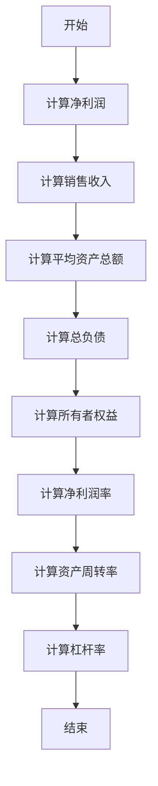

                 

# 《企业估值中的杜邦分析法》

> 关键词：杜邦分析法, 企业估值, 净资产收益率, 财务分析, 投资决策

> 摘要：杜邦分析法是一种经典的财务分析方法，用于评估企业的盈利能力。本文深入探讨了杜邦分析法的基本原理、数学模型、在企业估值中的应用，以及其与其他估值方法的结合。通过详细讲解杜邦分析法的各个组成部分，本文为读者提供了如何利用杜邦分析法进行企业估值的实用指南。

---

## 第1章: 杜邦分析法概述

### 1.1 杜邦分析法的起源与背景

杜邦分析法是20世纪初由美国杜邦公司开发的一种财务分析方法，旨在评估企业的盈利能力。它通过将净资产收益率（ROE）分解为净利润率、资产周转率和杠杆率，帮助投资者更好地理解企业的财务状况。

#### 1.1.1 杜邦分析法的起源

杜邦分析法的起源可以追溯到20世纪初，当时杜邦公司面临如何评估其子公司盈利能力的问题。通过将ROE分解为三个关键因素，杜邦公司能够更好地分析各子公司的财务表现。

#### 1.1.2 杜邦分析法的核心思想

杜邦分析法的核心思想是将ROE分解为三个部分：净利润率、资产周转率和杠杆率。这种方法不仅帮助评估企业的盈利能力，还能够识别影响ROE的关键因素。

#### 1.1.3 杜邦分析法在企业估值中的应用

杜邦分析法广泛应用于企业估值，尤其是在评估企业的盈利能力和财务健康状况时。通过分析ROE的各个组成部分，投资者可以更全面地了解企业的财务表现。

### 1.2 企业估值的基本概念

企业估值是指对企业未来现金流的现值进行评估，以确定其市场价值。常用的估值方法包括市盈率法、市净率法和 discounted cash flow（DCF）模型。

#### 1.2.1 企业估值的定义与意义

企业估值是企业价值评估的重要组成部分，帮助投资者确定企业的内在价值。准确的估值可以帮助投资者做出更明智的投资决策。

#### 1.2.2 企业估值的主要方法

企业估值的主要方法包括：

- 市盈率法：基于企业的市盈率和盈利水平进行估值。
- 市净率法：基于企业的市净率和资产价值进行估值。
- DCF模型：基于企业的未来现金流进行估值。

#### 1.2.3 杜邦分析法在企业估值中的地位

杜邦分析法是企业估值的重要工具之一，尤其在分析企业的盈利能力和财务杠杆时具有独特优势。它可以帮助投资者更深入地理解企业的财务表现。

### 1.3 杜邦分析法的核心指标

杜邦分析法的核心指标包括ROE、净利润率、资产周转率和杠杆率。

#### 1.3.1 净资产收益率（ROE）

ROE是衡量企业盈利能力的重要指标，公式为：

$$ROE = \frac{\text{净利润}}{\text{股东权益}}$$

#### 1.3.2 净利润与销售收入

净利润是企业税后利润，销售收入是企业的总收入。净利润率公式为：

$$\text{净利润率} = \frac{\text{净利润}}{\text{销售收入}}$$

#### 1.3.3 资产周转率与杠杆率

资产周转率公式为：

$$\text{资产周转率} = \frac{\text{销售收入}}{\text{平均资产总额}}$$

杠杆率公式为：

$$\text{杠杆率} = \frac{\text{总负债}}{\text{所有者权益}}$$

### 1.4 本章小结

本章介绍了杜邦分析法的起源、核心思想及其在企业估值中的应用。通过分析ROE的各个组成部分，读者可以更好地理解企业的财务表现。

---

## 第2章: 杜邦分析法的基本原理

### 2.1 杜邦分析法的公式推导

杜邦分析法通过将ROE分解为净利润率、资产周转率和杠杆率，帮助投资者深入分析企业的盈利能力。

#### 2.1.1 ROE的分解公式

ROE的分解公式为：

$$ROE = \text{净利润率} \times \text{资产周转率} \times \text{杠杆率}$$

其中：
- 净利润率（Net Profit Margin）= 净利润 / 销售收入
- 资产周转率（Asset Turnover）= 销售收入 / 平均资产总额
- 杠杆率（LeVERAGE）= 总负债 / 所有者权益

#### 2.1.2 净利润的计算公式

净利润的计算公式为：

$$\text{净利润} = \text{营业收入} - \text{营业成本} - \text{税金及附加} - \text{销售费用} - \text{管理费用} - \text{研发费用} - \text{利息支出}$$

#### 2.1.3 资产周转率与杠杆率的数学关系

资产周转率和杠杆率的数学关系体现在杜邦分析法的分解公式中。资产周转率影响ROE的分子部分，而杠杆率影响ROE的分母部分。

### 2.2 杜邦分析法的数学模型

杜邦分析法的数学模型可以通过以下步骤构建：

1. 计算净利润率：
   $$\text{净利润率} = \frac{\text{净利润}}{\text{销售收入}}$$

2. 计算资产周转率：
   $$\text{资产周转率} = \frac{\text{销售收入}}{\text{平均资产总额}}$$

3. 计算杠杆率：
   $$\text{杠杆率} = \frac{\text{总负债}}{\text{所有者权益}}$$

4. 最后，计算ROE：
   $$ROE = \text{净利润率} \times \text{资产周转率} \times \text{杠杆率}$$

### 2.3 杜邦分析法的流程图

使用 Mermaid 绘制杜邦分析法的流程图：

### 2.4 本章小结

在本章中，我们详细推导了杜邦分析法的公式，解释了其数学模型，并通过流程图展示了如何计算ROE。这为我们后续在企业估值中的应用奠定了基础。

---

## 第3章: 杜邦分析法与企业估值的关系

### 3.1 杜邦分析法在企业估值中的作用

杜邦分析法通过分解ROE，帮助企业更好地理解其盈利能力的来源，从而为估值提供依据。

#### 3.1.1 杜邦分析法对企业价值的影响

杜邦分析法可以帮助投资者识别影响企业价值的关键因素，如净利润率、资产周转率和杠杆率。例如，如果一家企业的净利润率较低，可能需要进一步分析其成本控制能力。

#### 3.1.2 杜邦分析法在企业估值中的优势

杜邦分析法的优势在于其分解性，可以帮助投资者深入分析企业的财务表现，识别潜在的问题和机会。

#### 3.1.3 杜邦分析法的局限性

杜邦分析法的局限性在于其假设企业的财务杠杆是固定的，而实际上杠杆率可能会影响企业的风险和成本。此外，杜邦分析法不考虑企业的成长性和行业因素。

### 3.2 杜邦分析法与企业价值的公式

杜邦分析法与企业价值的关系可以通过以下公式体现：

$$\text{企业价值} = \text{ROE} \times \text{股东权益}$$

其中，ROE是通过杜邦分析法计算得出的。

### 3.3 杜邦分析法在不同行业的应用

杜邦分析法在不同行业的应用有所不同。例如，在制造业中，资产周转率是关键因素；而在服务业中，净利润率更为重要。

#### 3.3.1 制造业中的应用

在制造业中，杜邦分析法可以帮助评估企业的资产周转率和成本控制能力。例如，一家制造企业的高资产周转率可能意味着高效的运营。

#### 3.3.2 服务业中的应用

在服务业中，杜邦分析法可以帮助评估净利润率和客户获取效率。例如，一家零售企业的高净利润率可能意味着有效的成本控制。

### 3.4 本章小结

在本章中，我们探讨了杜邦分析法在企业估值中的作用，分析了其与企业价值的关系，并讨论了其局限性和在不同行业中的应用。

---

## 第4章: 杜邦分析法的扩展与应用

### 4.1 杜邦分析法的扩展模型

杜邦分析法的扩展模型包括ROA和净利率的分析。

#### 4.1.1 包括ROA的杜邦分析法

ROA（资产净利率）公式为：

$$ROA = \frac{\text{净利润}}{\text{平均资产总额}}$$

#### 4.1.2 包括净利率的杜邦分析法

净利率公式为：

$$\text{净利率} = \frac{\text{净利润}}{\text{销售收入}}$$

#### 4.1.3 杜邦分析法的其他变体

其他变体包括考虑增长率和行业因素的杜邦分析法。

### 4.2 杜邦分析法在不同行业的应用

杜邦分析法在不同行业的应用需要考虑行业特点。例如，在高科技企业中，研发费用可能影响净利润率。

#### 4.2.1 制造业中的应用

制造业中的杜邦分析法需要考虑资产周转率和生产效率。

#### 4.2.2 服务业中的应用

服务业中的杜邦分析法需要考虑客户满意度和运营效率。

#### 4.2.3 高科技企业中的应用

高科技企业中的杜邦分析法需要考虑研发费用和创新能力。

### 4.3 杜邦分析法与企业战略的关系

杜邦分析法可以为企业制定战略提供依据。例如，通过提高净利润率或资产周转率来改善ROE。

#### 4.3.1 杜邦分析法对企业战略的影响

杜邦分析法可以帮助企业制定财务战略，如优化资产结构或降低财务杠杆。

#### 4.3.2 杜邦分析法在战略制定中的应用

杜邦分析法可以用于战略制定，例如通过提高资产周转率来提升ROE。

### 4.4 本章小结

在本章中，我们探讨了杜邦分析法的扩展模型及其在不同行业中的应用，分析了其对企业战略的影响。

---

## 附录

### 附录A: 杜邦分析法的数学公式

$$ROE = \text{净利润率} \times \text{资产周转率} \times \text{杠杆率}$$

其中：
- 净利润率 = 净利润 / 销售收入
- 资产周转率 = 销售收入 / 平均资产总额
- 杠杆率 = 总负债 / 所有者权益

### 附录B: 杜邦分析法的流程图代码

### 附录C: 参考文献

1. 谢尔曼, R. S., & 芒格, C. (2008). *Poor Charlie's Algebra*.  
2. 杜邦分析法相关文献

---

## 作者：AI天才研究院/AI Genius Institute & 禅与计算机程序设计艺术 /Zen And The Art of Computer Programming

---

这篇文章详细介绍了杜邦分析法的基本原理及其在企业估值中的应用。通过数学公式、流程图和实际案例的分析，读者可以深入理解杜邦分析法的核心思想，并将其应用于实际的企业估值中。

