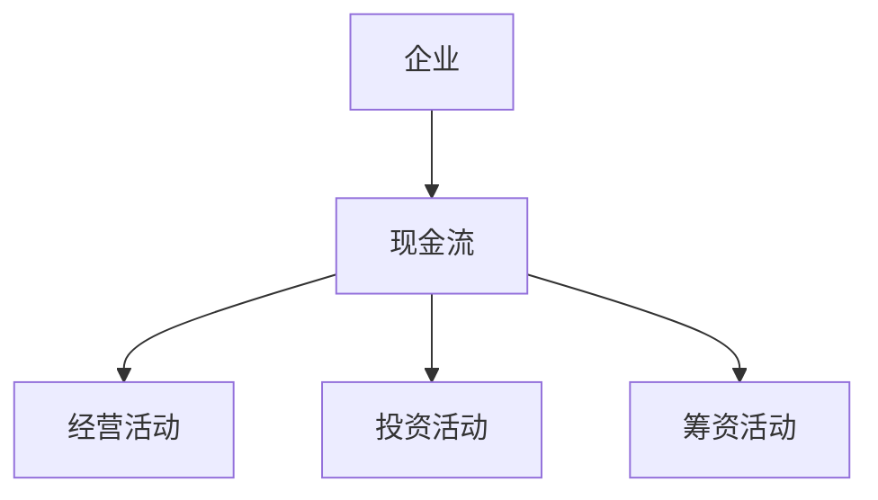
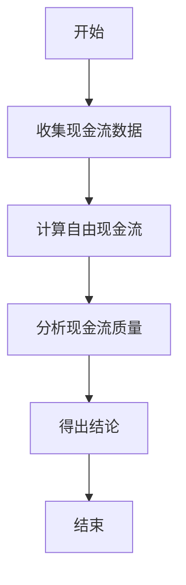
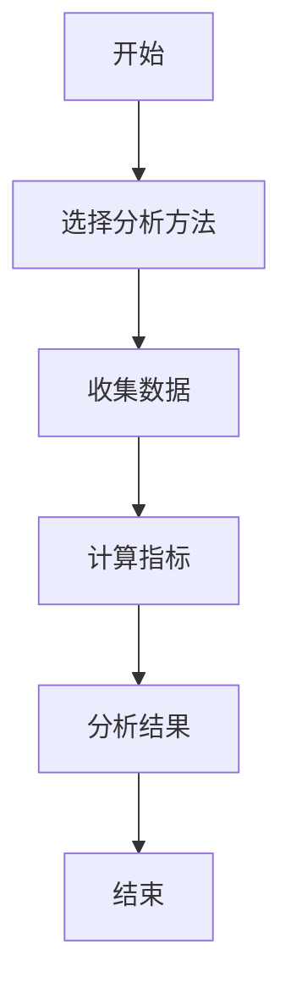
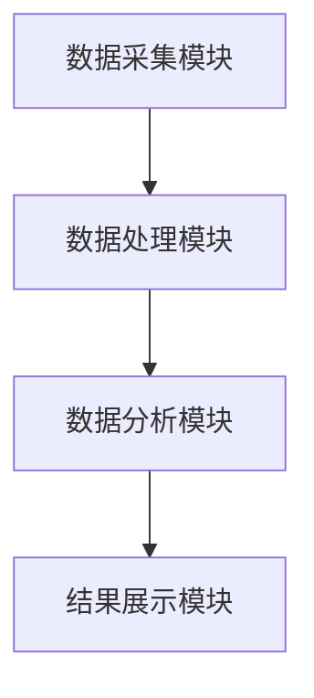
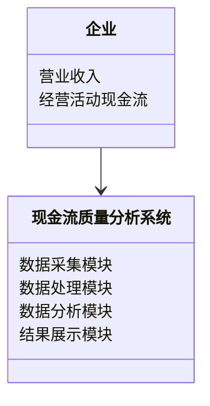

                 


# 企业估值中的现金流质量分析

> 关键词：现金流质量分析，企业估值，自由现金流，现金流量表，财务分析

> 摘要：现金流质量分析是企业估值中的核心环节，通过对企业的现金流进行深入分析，能够准确评估企业的财务健康状况和未来盈利能力。本文系统地阐述了现金流质量分析的核心概念、算法原理、系统架构设计以及项目实战，旨在为读者提供全面的技术指导和实践参考。

---

## 第1章 现金流质量分析概述

### 1.1 现金流质量分析的定义与背景

#### 1.1.1 企业估值中的现金流概念
现金流是企业运营中最重要的财务指标之一，它反映了企业的资金流动状况。现金流质量分析是通过对企业的经营活动、投资活动和筹资活动所产生的现金流进行分析，评估企业的真实财务健康状况。

#### 1.1.2 现金流质量分析的重要性
现金流质量分析能够揭示企业的盈利能力和财务风险，帮助投资者和管理层做出更准确的估值和决策。高质量的现金流意味着企业具有较强的自我造血能力，能够持续为股东创造价值。

#### 1.1.3 现金流质量与企业价值的关系
现金流质量是企业价值的重要组成部分。高质量的现金流能够提高企业的信用评级，降低融资成本，增强市场竞争力。反之，低质量的现金流可能导致企业财务状况恶化，影响其市场价值。

### 1.2 现金流质量分析的核心要素

#### 1.2.1 自由现金流的定义与计算
自由现金流是企业在扣除所有支出后，剩余可用于偿还债务和分配给股东的资金。其计算公式为：
$$\text{自由现金流} = \text{净利润} - \text{折旧} - \text{资本支出}$$

#### 1.2.2 现金流质量的关键指标
现金流质量的关键指标包括：
1. 现金流比率（Cash Flow Ratio）
2. 现金流周转率（Cash Flow Turnover）
3. 现金流收益率（Cash Flow Yield）

#### 1.2.3 现金流质量分析的边界与外延
现金流质量分析的边界包括企业的实际现金流数据和财务报表中的相关数据。其外延则涉及企业的财务策略、市场环境和行业特点。

### 1.3 现金流质量分析的理论基础

#### 1.3.1 现金流质量分析的理论框架
现金流质量分析的理论框架包括：
1. 财务学的基本原理
2. 企业价值评估模型
3. 现金流贴现模型（DCF模型）

#### 1.3.2 现金流质量分析的数学模型
现金流质量分析的数学模型包括：
1. 资本预算模型
2. 现金流贴现模型
3. 股权资本定价模型

#### 1.3.3 现金流质量分析的实践应用
现金流质量分析的实践应用包括：
1. 企业并购中的价值评估
2. 投资决策中的现金流分析
3. 股票投资中的现金流指标分析

### 1.4 现金流质量分析的核心概念与联系

#### 1.4.1 现金流质量分析的实体关系图


#### 1.4.2 现金流质量分析的属性特征对比
| 属性 | 经营活动现金流 | 投资活动现金流 | 筹资活动现金流 |
|------|----------------|----------------|----------------|
| 来源 | 经营活动产生的现金流 | 投资活动产生的现金流 | 筹资活动产生的现金流 |
| 用途 | 支付日常运营支出 | 支付投资支出 | 支付债务利息和股利 |

#### 1.4.3 现金流质量分析的流程图


### 1.5 本章小结
本章主要介绍了现金流质量分析的定义、重要性、核心要素以及理论基础。通过实体关系图和流程图，我们清晰地展示了现金流质量分析的逻辑框架和实施步骤。

---

## 第2章 现金流质量分析的算法原理

### 2.1 现金流质量分析的算法概述

#### 2.1.1 现金流质量分析的基本算法
现金流质量分析的基本算法包括：
1. 现金流贴现法（DCF）
2. 现金流比率分析法
3. 现金流质量评分法

#### 2.1.2 现金流质量分析的数学模型
现金流质量分析的数学模型如下：
$$\text{现金流质量评分} = \sum (\text{权重}_i \times \text{指标值}_i)$$

#### 2.1.3 现金流质量分析的流程图


### 2.2 现金流质量分析的数学公式

#### 2.2.1 现金流质量的计算公式
$$\text{现金流质量} = \frac{\text{经营活动现金流}}{\text{营业收入}} \times 100\%$$

#### 2.2.2 现金流质量分析的数学推导
假设经营活动现金流为 $CF$, 营业收入为 $Re$, 则：
$$\text{现金流质量} = \frac{CF}{Re} \times 100\%$$

#### 2.2.3 现金流质量分析的实例分析
以某公司为例：
- 经营活动现金流：$500万
- 营业收入：$1000万
- 现金流质量 = (500 / 1000) × 100% = 50%

### 2.3 现金流质量分析的算法实现

#### 2.3.1 算法实现的步骤
1. 收集企业财务数据
2. 计算经营活动现金流
3. 计算现金流质量指标
4. 分析结果并得出结论

#### 2.3.2 算法实现的代码示例
```python
def calculate_cash_flow_quality(revenue, operating_cash_flow):
    return (operating_cash_flow / revenue) * 100

revenue = 1000
operating_cash_flow = 500
cash_flow_quality = calculate_cash_flow_quality(revenue, operating_cash_flow)
print(f"现金流质量: {cash_flow_quality}%")
```

#### 2.3.3 算法实现的数学模型
$$\text{现金流质量} = \frac{\text{经营活动现金流}}{\text{营业收入}} \times 100\%$$

### 2.4 本章小结
本章详细讲解了现金流质量分析的算法原理，包括基本算法、数学公式和代码实现。通过实例分析，我们进一步验证了算法的可行性和准确性。

---

## 第3章 现金流质量分析的系统架构设计

### 3.1 系统分析与架构设计

#### 3.1.1 现金流质量分析系统的功能设计
现金流质量分析系统的功能设计包括：
1. 数据采集模块
2. 数据处理模块
3. 数据分析模块
4. 结果展示模块

#### 3.1.2 现金流质量分析系统的架构图


#### 3.1.3 现金流质量分析系统的接口设计
- 数据输入接口：接收企业的财务数据
- 数据输出接口：输出现金流质量分析结果

### 3.2 系统功能设计

#### 3.2.1 现金流质量分析系统的领域模型


#### 3.2.2 现金流质量分析系统的功能模块
- 数据采集模块：负责收集企业的财务数据
- 数据处理模块：对数据进行清洗和转换
- 数据分析模块：计算现金流质量指标
- 结果展示模块：以图表形式展示分析结果

### 3.3 系统架构设计

#### 3.3.1 现金流质量分析系统的分层架构


#### 3.3.2 现金流质量分析系统的组件设计
- 数据库组件：存储企业的财务数据
- 处理组件：对数据进行处理和分析
- 展示组件：以图表形式展示分析结果

### 3.4 本章小结
本章重点介绍了现金流质量分析系统的架构设计，包括功能模块、架构图和接口设计。通过系统的分层架构，我们能够更好地理解和实现现金流质量分析。

---

## 第4章 现金流质量分析的项目实战

### 4.1 项目环境安装与配置

#### 4.1.1 现金流质量分析工具的安装
安装Python和相关库：
```bash
pip install numpy pandas matplotlib
```

#### 4.1.2 现金流质量分析系统的配置
配置开发环境：
- 安装Jupyter Notebook
- 配置数据存储路径

#### 4.1.3 现金流质量分析数据的准备
准备企业的财务数据，包括营业收入、经营活动现金流等。

### 4.2 项目核心实现

#### 4.2.1 现金流质量分析算法的实现
```python
import pandas as pd

def calculate_cash_flow_quality(revenue, operating_cash_flow):
    return (operating_cash_flow / revenue) * 100

data = pd.DataFrame({
    '营业收入': [1000, 1500, 2000],
    '经营活动现金流': [500, 750, 1000]
})

data['现金流质量'] = data.apply(lambda x: calculate_cash_flow_quality(x['营业收入'], x['经营活动现金流']), axis=1)
print(data)
```

#### 4.2.2 现金流质量分析系统的实现
构建完整的现金流质量分析系统，包括数据采集、处理和分析模块。

### 4.3 项目应用与解读

#### 4.3.1 现金流质量分析结果的解读
分析结果以图表形式展示，包括现金流质量趋势图和对比图。

#### 4.3.2 现金流质量分析系统的应用
将系统应用于实际的企业估值中，验证其准确性和实用性。

### 4.4 本章小结
本章通过项目实战，详细讲解了现金流质量分析系统的实现过程，包括环境配置、算法实现和结果解读。

---

## 作者

作者：AI天才研究院/AI Genius Institute & 禅与计算机程序设计艺术 /Zen And The Art of Computer Programming

