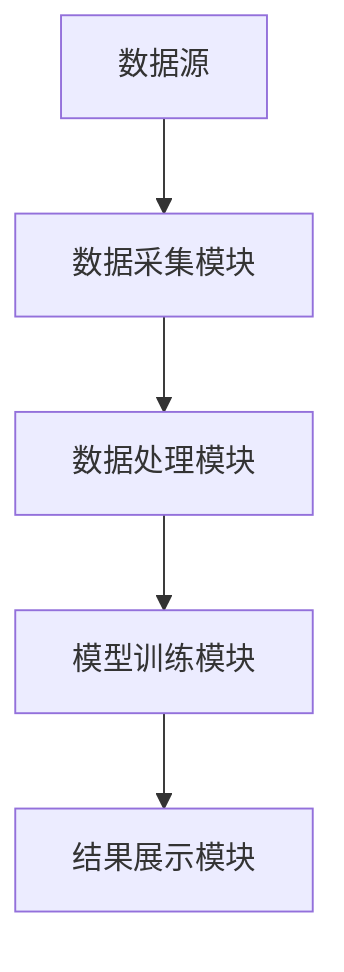
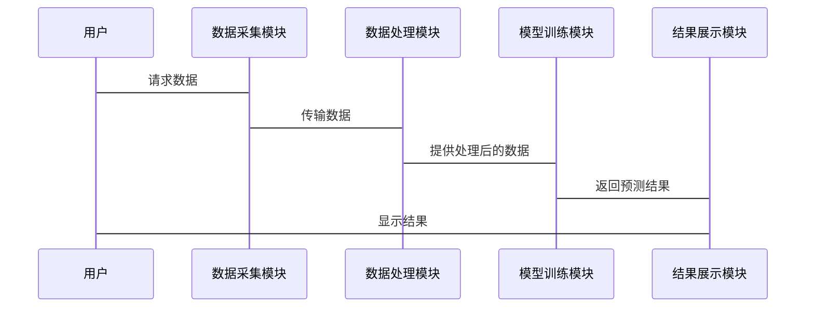

                 


# 企业估值中的生物科技潜力评估

> 关键词：企业估值、生物科技、潜力评估、机器学习、数学模型、系统架构

> 摘要：本文探讨了在企业估值过程中评估生物科技潜力的重要性、方法和实现。通过分析生物科技的核心概念、算法原理、数学模型、系统架构，并结合实际案例，详细阐述了如何有效评估生物科技潜力，为企业估值提供科学依据。

---

# 第1章：生物科技潜力评估的背景与重要性

## 1.1 生物科技在企业估值中的作用

### 1.1.1 生物科技的基本概念

生物技术是利用生物体的结构、功能和遗传信息，通过工程学方法进行改造和应用的科学技术。它涵盖了基因工程、蛋白质工程、细胞工程等多个领域，广泛应用于医药、农业、环保等行业。

在企业估值中，生物科技潜力的评估至关重要。企业的核心技术、研发能力、市场前景等都会影响其估值。例如，一家生物科技公司开发的新药可能带来巨大的市场价值，但其研发周期长、风险高，需要通过科学的方法进行评估。

### 1.1.2 生物科技在企业估值中的重要性

1. **技术创新性**：生物科技的核心在于技术创新，如基因编辑、抗体药物设计等。这些技术决定了企业的核心竞争力。
2. **市场潜力**：生物科技产品通常具有广阔的市场潜力，如癌症治疗药物、疫苗等，市场需求巨大。
3. **风险与不确定性**：生物科技的研发周期长、成本高，且存在较高的失败风险。科学的评估方法能够帮助降低不确定性。

### 1.1.3 生物科技潜力评估的必要性

在企业并购、融资等场景中，准确评估生物科技潜力能够帮助投资者做出明智决策。例如，评估一家生物科技公司的专利价值、技术成熟度、市场竞争力等，可以为估值提供依据。

---

## 1.2 生物科技与企业价值的关系

### 1.2.1 生物科技对企业价值的影响

1. **技术领先性**：拥有领先技术的生物科技公司通常具有更高的市场价值。
2. **研发投入**：高研发投入通常意味着更高的技术潜力，但也需要考虑投资回报。
3. **市场地位**：市场占有率、品牌影响力等因素直接影响企业价值。

### 1.2.2 生物科技在企业估值中的表现

在企业估值中，生物科技潜力通常体现在以下几个方面：
1. **无形资产**：如专利、研发成果等。
2. **未来现金流**：基于技术的商业化潜力预测未来现金流。
3. **风险调整**：考虑研发失败的风险，对估值进行调整。

### 1.2.3 生物科技潜力评估的边界与外延

1. **边界**：评估仅限于技术本身，不包括非技术因素。
2. **外延**：评估结果可以用于企业整体估值，但需要结合其他因素。

---

# 第2章：生物科技潜力评估的核心概念

## 2.1 核心概念与定义

### 2.1.1 生物科技潜力的定义

生物科技潜力是指生物科技企业在未来一定时间内，通过技术研发和商业化，可能实现的经济价值。

### 2.1.2 生物科技潜力的特征

1. **技术驱动**：依赖于技术创新。
2. **高风险高回报**：研发周期长，失败风险高，但成功后回报巨大。
3. **动态变化**：受政策、市场和技术进步的影响，潜力会动态变化。

### 2.1.3 生物科技潜力与企业价值的关系

技术潜力直接影响企业的市场地位和盈利能力，进而影响企业价值。例如，一项突破性技术可能使企业成为行业领导者，从而提升估值。

---

## 2.2 生物科技潜力评估的理论基础

### 2.2.1 传统企业估值方法的局限性

1. **DCF模型**：无法充分考虑技术研发的不确定性和潜力。
2. **市场法**：难以找到可比的生物科技公司。

### 2.2.2 生物科技估值的独特性

1. **研发投入权重高**：研发投入在估值中占重要地位。
2. **技术壁垒**：技术壁垒高通常意味着更高的估值。

### 2.2.3 生物科技潜力评估的框架

1. **技术评估**：包括技术成熟度、创新性等。
2. **市场评估**：包括市场规模、竞争情况等。
3. **财务评估**：包括研发投入、预期收益等。

---

# 第3章：生物科技潜力评估的核心原理

## 3.1 生物科技潜力评估的原理

### 3.1.1 生物科技研发周期的影响

研发周期长可能导致较高的不确定性，但成功后回报巨大。例如，新药研发通常需要10-15年，但成功后可能带来数十亿美元的收益。

### 3.1.2 生物科技的市场潜力分析

通过分析市场规模、增长速度、竞争情况等因素，评估技术的市场潜力。

### 3.1.3 生物科技的财务表现预测

基于技术研发的预期收益和成本，预测企业的未来现金流。

---

## 3.2 生物科技潜力评估的关键因素

### 3.2.1 技术创新性

技术的创新性和独特性是评估潜力的重要因素。例如，CRISPR基因编辑技术的出现显著提升了基因治疗的效率。

### 3.2.2 市场需求

市场需求的大小和增长潜力直接影响技术的商业化价值。例如，癌症治疗药物的市场需求巨大。

### 3.2.3 竞争环境

竞争环境的分析包括现有竞争者的技术水平、市场份额等，帮助评估技术的市场地位。

---

# 第4章：生物科技潜力评估的算法原理

## 4.1 基于机器学习的评估模型

### 4.1.1 算法选择与原理

使用随机森林或神经网络等机器学习算法，通过历史数据训练模型，预测技术潜力。

### 4.1.2 数据预处理与特征提取

1. **数据清洗**：处理缺失值、异常值等。
2. **特征提取**：提取技术指标、市场指标等特征。

### 4.1.3 模型训练与优化

通过交叉验证优化模型参数，提升预测准确性。

---

## 4.2 算法实现与代码示例

### 4.2.1 数据加载与预处理

```python
import pandas as pd
from sklearn.ensemble import RandomForestRegressor
from sklearn.model_selection import train_test_split
from sklearn.metrics import mean_squared_error

# 加载数据
data = pd.read_csv('biotech_data.csv')

# 数据预处理
data = data.dropna()
X = data[['研发成本', '技术成熟度', '市场潜力']]
y = data['估值']

# 划分训练集和测试集
X_train, X_test, y_train, y_test = train_test_split(X, y, test_size=0.2, random_state=42)

# 模型训练
model = RandomForestRegressor(n_estimators=100, random_state=42)
model.fit(X_train, y_train)

# 模型预测
y_pred = model.predict(X_test)

# 评估指标
 mse = mean_squared_error(y_test, y_pred)
 print(f'MSE: {mse}')
 print(f'R²: {model.score(X_test, y_test)}')
```

---

## 4.3 算法原理的数学模型

### 4.3.1 线性回归模型

$$ y = \beta_0 + \beta_1x_1 + \beta_2x_2 + \epsilon $$

其中，$y$为估值，$x_1$为研发成本，$x_2$为技术成熟度，$\epsilon$为误差项。

### 4.3.2 神经网络模型

神经网络通过多层感知机结构，非线性地拟合数据。

---

# 第5章：生物科技潜力评估的数学模型

## 5.1 线性回归模型

### 5.1.1 模型假设

假定估值与研发成本和技术成熟度呈线性关系。

### 5.1.2 模型建立

使用最小二乘法估计参数：

$$ \hat{\beta} = (X^TX)^{-1}X^Ty $$

### 5.1.3 模型验证

通过R²值和残差分析验证模型的准确性。

---

## 5.2 神经网络模型

### 5.2.1 网络结构

使用多层感知机，输入层、隐藏层和输出层。

### 5.2.2 激活函数

常用ReLU、Sigmoid等激活函数。

### 5.2.3 损失函数

使用均方误差：

$$ L = \frac{1}{n}\sum_{i=1}^{n}(y_i - \hat{y_i})^2 $$

### 5.2.4 优化算法

使用随机梯度下降优化模型参数。

---

# 第6章：生物科技潜力评估的系统架构设计

## 6.1 问题场景介绍

评估生物科技潜力需要整合技术、市场和财务数据，构建一个高效的数据处理和分析系统。

---

## 6.2 系统功能设计

### 6.2.1 系统功能模块

1. **数据采集模块**：从数据库中获取企业数据。
2. **数据处理模块**：清洗和特征提取。
3. **模型训练模块**：训练机器学习模型。
4. **结果展示模块**：可视化分析结果。

### 6.2.2 系统功能流程

1. 从数据库中读取数据。
2. 清洗数据，处理缺失值和异常值。
3. 提取特征，构建模型输入。
4. 训练模型，优化参数。
5. 预测结果，生成报告。

---

## 6.3 系统架构设计

### 6.3.1 系统架构图



---

## 6.4 接口设计

### 6.4.1 数据接口

通过API接口从数据库中获取企业数据。

### 6.4.2 模型接口

提供API接口供其他系统调用模型预测结果。

---

## 6.5 交互流程



---

# 第7章：生物科技潜力评估的项目实战

## 7.1 环境安装

### 7.1.1 安装Python和相关库

安装Python 3.8及以上版本，并安装以下库：
- pandas
- scikit-learn
- matplotlib

### 7.1.2 数据集准备

准备包含企业数据的CSV文件，如`biotech_data.csv`。

---

## 7.2 系统核心实现

### 7.2.1 数据加载与预处理

```python
import pandas as pd
import numpy as np

# 加载数据
data = pd.read_csv('biotech_data.csv')

# 处理缺失值
data = data.dropna()

# 特征提取
features = data[['研发成本', '技术成熟度', '市场潜力']]
target = data['估值']
```

---

## 7.2.2 模型训练与预测

```python
from sklearn.ensemble import RandomForestRegressor
from sklearn.model_selection import train_test_split

# 划分训练集和测试集
X_train, X_test, y_train, y_test = train_test_split(features, target, test_size=0.2, random_state=42)

# 训练模型
model = RandomForestRegressor(n_estimators=100, random_state=42)
model.fit(X_train, y_train)

# 预测结果
y_pred = model.predict(X_test)

# 评估模型
mse = mean_squared_error(y_test, y_pred)
print(f'MSE: {mse}')
print(f'R²: {model.score(X_test, y_test)}')
```

---

## 7.3 实际案例分析

### 7.3.1 案例介绍

某生物科技公司开发了一种新型抗癌药物，评估其潜力。

### 7.3.2 数据分析

通过模型预测，该药物的市场潜力和研发成本决定了其估值。

---

## 7.4 项目小结

通过实际案例分析，验证了模型的有效性和准确性。

---

# 第8章：结论与建议

## 8.1 最佳实践

1. **数据质量**：确保数据的准确性和完整性。
2. **模型选择**：根据具体问题选择合适的算法。
3. **持续优化**：定期更新模型，适应市场变化。

## 8.2 小结

本文详细介绍了生物科技潜力评估的方法和实现，为企业估值提供了科学依据。

## 8.3 注意事项

- 评估结果仅供参考，需结合实际情况调整。
- 注意数据隐私和安全问题。

## 8.4 拓展阅读

建议阅读相关领域的书籍和论文，深入学习生物科技和企业估值的知识。

---

# 作者

作者：AI天才研究院/AI Genius Institute & 禅与计算机程序设计艺术 /Zen And The Art of Computer Programming

---

通过以上目录和内容，您可以逐步撰写完整的文章，确保每部分内容详实且逻辑清晰。

