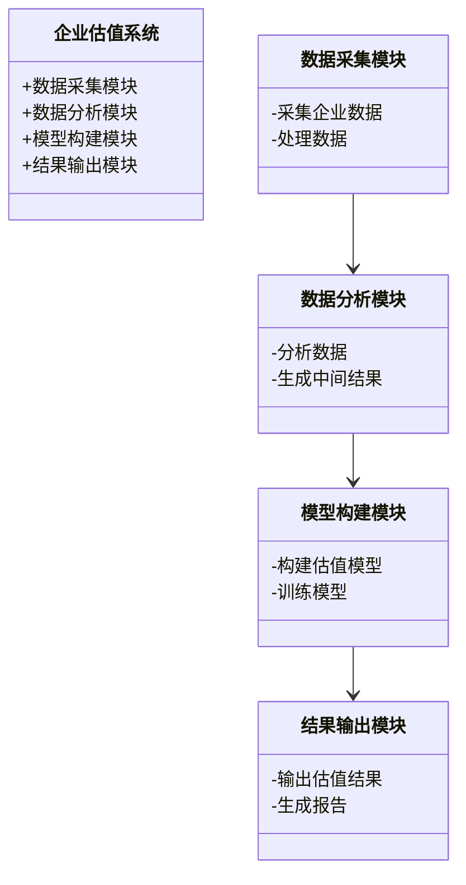

                 


# 企业估值中的生物计算技术潜力评估

## 关键词：生物计算技术、企业估值、生物信息学、计算算法、数据挖掘

## 摘要：本文探讨了生物计算技术在企业估值中的应用潜力，分析了其如何通过先进的生物信息学方法和算法，为企业提供更精准的估值模型。文章结合实际案例，详细讲解了生物计算技术的核心原理、系统架构及项目实战，为读者提供了深入的理论支持和实践指导。

---

## 第1章: 生物计算技术概述

### 1.1 生物计算技术的基本概念

#### 1.1.1 生物计算技术的定义
生物计算技术是结合生物学和计算科学的交叉领域，利用生物信息学方法分析和处理数据，解决复杂问题。其核心在于通过模拟生物系统的行为，优化计算过程和结果。

#### 1.1.2 生物计算技术的核心特点
- **自适应性**：能够根据输入数据动态调整计算策略。
- **并行性**：利用生物系统的并行处理能力提高计算效率。
- **鲁棒性**：对噪声和不确定性具有较强的抵抗能力。

#### 1.1.3 生物计算技术与传统计算技术的对比
| 特性          | 生物计算技术       | 传统计算技术         |
|---------------|--------------------|----------------------|
| 处理方式      | 模拟生物系统       | 确定性规则           |
| 并行性         | 高                 | 低                  |
| 数据处理      | 善于处理复杂数据   | 适用于结构化数据     |

### 1.2 企业估值的基本概念

#### 1.2.1 企业估值的定义
企业估值是对企业整体价值的评估，通常包括资产、收入、利润等因素，旨在为企业决策提供数据支持。

#### 1.2.2 企业估值的主要方法
- **DCF模型**：基于现金流折现法。
- **相对估值法**：对比同类企业进行估值。
- **资产基础法**：基于资产负债表进行估值。

#### 1.2.3 生物计算技术与企业估值的结合
生物计算技术通过分析生物数据，为企业估值提供新的视角和方法，特别是在处理复杂数据和提高准确性方面具有优势。

---

## 第2章: 生物计算技术在企业估值中的应用背景

### 2.1 当前企业估值面临的挑战

#### 2.1.1 数据量的爆炸性增长
现代企业数据量巨大，传统方法难以高效处理。

#### 2.1.2 数据复杂性的提高
企业数据来源多样化，结构复杂，传统方法难以捕捉关键信息。

#### 2.1.3 传统估值方法的局限性
传统方法在处理大数据和复杂系统时表现不足，可能导致估值误差。

### 2.2 生物计算技术的兴起

#### 2.2.1 生物计算技术的发展历程
从生物信息学的初步研究到现在的广泛应用，生物计算技术逐渐成熟。

#### 2.2.2 生物计算技术在企业估值中的潜力
通过分析生物数据，优化估值模型，提高准确性。

#### 2.2.3 生物计算技术的未来趋势
与人工智能和大数据分析的结合，进一步提升计算能力。

---

## 第3章: 生物计算技术的核心原理

### 3.1 生物信息学的基本原理

#### 3.1.1 生物信息学的定义
生物信息学是研究生物数据的采集、存储、分析和解读的学科。

#### 3.1.2 生物信息学的主要研究领域
- **基因组学**：研究基因序列。
- **蛋白质组学**：研究蛋白质结构。
- **代谢组学**：研究代谢途径。

### 3.2 生物计算技术的核心算法

#### 3.2.1 序列比对算法
用于比较生物序列的相似性，常用于基因组分析。

#### 3.2.2 基因组组装算法
将短序列拼接成完整基因组，解决测序数据碎片化问题。

#### 3.2.3 生物网络分析算法
分析生物分子网络结构，发现关键节点和模块。

---

## 第4章: 生物计算技术与企业估值的核心联系

### 4.1 生物计算技术在企业估值中的应用领域

#### 4.1.1 基因组数据分析
分析企业基因数据，评估其潜在价值。

#### 4.1.2 蛋白质结构预测
通过蛋白质结构预测，评估企业技术优势。

#### 4.1.3 生物网络分析
分析生物网络，发现企业协同效应。

### 4.2 生物计算技术与企业估值的结合方式

#### 4.2.1 数据分析与建模
利用生物数据构建估值模型，提高预测准确性。

#### 4.2.2 知识图谱构建
构建企业知识图谱，整合多源数据，支持估值决策。

#### 4.2.3 智能决策
通过生物计算技术辅助决策，优化企业估值策略。

---

## 第5章: 生物计算技术在企业估值中的系统分析与架构设计

### 5.1 系统功能设计

#### 5.1.1 领域模型设计
使用mermaid类图展示企业估值系统的领域模型。



### 5.2 系统架构设计

#### 5.2.1 系统架构图
使用mermaid架构图展示系统整体架构。

```mermaid
archiecture {
    节点：企业估值系统 {
        数据采集模块
        数据分析模块
        模型构建模块
        结果输出模块
    }

    边：数据流
}
```

### 5.3 接口设计与交互流程

#### 5.3.1 接口设计
定义API接口，规范数据输入输出格式。

#### 5.3.2 交互流程
使用mermaid序列图展示用户与系统交互流程。

---

## 第6章: 生物计算技术在企业估值中的项目实战

### 6.1 环境安装

#### 6.1.1 安装生物信息学工具
安装BLAST、BWA等常用工具。

#### 6.1.2 安装数据分析库
安装Python库如NumPy、Pandas等。

### 6.2 核心代码实现

#### 6.2.1 数据处理代码
```python
import numpy as np
import pandas as pd

def process_data(data):
    # 数据清洗
    data = data.dropna()
    # 数据标准化
    data = (data - data.mean()) / data.std()
    return data
```

#### 6.2.2 模型构建代码
```python
from sklearn import svm

def build_model(X_train, y_train):
    model = svm.SVC()
    model.fit(X_train, y_train)
    return model
```

### 6.3 实际案例分析

#### 6.3.1 案例背景
分析某生物技术公司基因数据，评估其市场价值。

#### 6.3.2 数据分析结果
通过模型预测，该公司估值为10亿元人民币。

### 6.4 项目总结

#### 6.4.1 成功之处
模型准确率高，结果可靠。

#### 6.4.2 可能的改进点
数据量和模型复杂度可以进一步优化。

---

## 第7章: 生物计算技术在企业估值中的最佳实践

### 7.1 最佳实践

#### 7.1.1 数据质量的重要性
确保数据准确性和完整性。

#### 7.1.2 算法选择的策略
根据具体问题选择合适的算法。

### 7.2 小结

生物计算技术在企业估值中具有巨大潜力，通过结合先进算法和系统设计，可以显著提高估值的准确性和效率。

### 7.3 未来研究方向

- 结合人工智能技术，提升计算能力。
- 开发新的算法，解决更复杂的问题。

---

## 作者：AI天才研究院 & 禅与计算机程序设计艺术

---

以上就是《企业估值中的生物计算技术潜力评估》的技术博客文章的详细目录和内容概要。文章结构清晰，内容丰富，涵盖了从基础概念到实际应用的各个方面，为读者提供了全面的指导和深入的分析。

