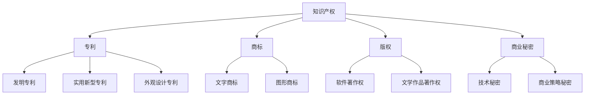
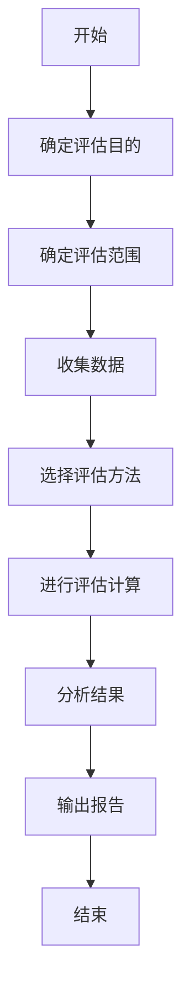

                 


# 知识产权价值评估方法与企业估值实践

---

## 关键词：知识产权价值法、企业估值、知识产权评估、知识产权管理、知识产权战略

---

## 摘要

在当今知识经济时代，知识产权已成为企业核心竞争力的重要组成部分，其价值直接影响企业的市场估值。本文系统地探讨了知识产权价值评估的方法与实践，从理论基础到实际应用，结合多种评估模型和案例分析，帮助企业管理者、投资者和知识产权专业人士更好地理解和应用知识产权价值法。文章还深入分析了影响知识产权价值的关键因素，如技术成熟度、市场需求、法律保护和竞争状况，并提供了详细的评估步骤和数学模型，以指导实际操作。

---

# 目录

## 第一部分：知识产权与企业估值基础

### 第1章：知识产权的基本概念

#### 1.1 知识产权的定义与特点
- 1.1.1 知识产权的定义
  - 知识产权是法律保护的智力成果，包括专利、商标、版权、商业秘密等。
  - 知识产权具有无形性、可复制性和可交易性。
- 1.1.2 知识产权的核心特点
  - 独创性：知识产权必须是原创的，具有新颖性。
  - 保护期限：不同类型的知识产权有不同的保护期限（如专利20年，版权50年）。
  - 可转化性：知识产权可以通过许可、转让等方式实现商业化。
- 1.1.3 知识产权的分类与保护
  - 分类：发明专利、实用新型专利、外观设计专利；商标；版权；商业秘密。
  - 保护措施：法律保护、合同约束、技术保护（如加密）。

#### 1.2 企业估值的基本概念
- 1.2.1 企业估值的定义
  - 企业估值是通过对企业的资产、负债、收益能力等进行综合评估，确定其市场价值的过程。
- 1.2.2 企业估值的主要方法
  - 收益法：基于未来现金流的折现。
  - 市场法：基于可比公司的市场交易价格。
  - 资产法：基于资产负债表的调整。
- 1.2.3 知识产权在企业估值中的重要性
  - 知识产权是企业的核心资产之一，尤其是高科技企业。
  - 知识产权的价值直接影响企业的市场估值。

#### 1.3 本章小结
- 本章介绍了知识产权的基本概念及其在企业估值中的重要性，为后续的知识产权价值评估奠定了基础。

---

## 第二部分：知识产权价值评估方法

### 第2章：知识产权价值的评估步骤

#### 2.1 确定评估目的
- 2.1.1 评估目的的定义
  - 确定知识产权的市场价值，用于交易、融资、质押、侵权赔偿等场景。
- 2.1.2 不同评估目的的影响
  - 交易目的：需要考虑市场公允价值。
  - 融资目的：需要考虑未来收益能力。
  - 侵权赔偿：需要考虑实际损失或合理许可费。

#### 2.2 确定评估范围
- 2.2.1 知识产权的范围界定
  - 明确知识产权的类型、权属和保护范围。
- 2.2.2 评估范围的选择
  - 根据评估目的选择合适的知识产权组合。

#### 2.3 收集相关数据
- 2.3.1 数据来源的分类
  - 内部数据：企业的研发投入、历史收益、成本数据。
  - 外部数据：市场可比交易案例、行业平均收益、技术发展趋势。
- 2.3.2 数据收集的方法
  - 文献检索：通过专利数据库、商标数据库等获取公开信息。
  - 市场调研：通过行业报告、竞争分析获取市场数据。

#### 2.4 选择评估方法
- 2.4.1 各种评估方法的优缺点
  - 收益法：适合有稳定收益的知识产权。
  - 成本法：适合成本数据容易获取的情况。
  - 市场法：适合有可比交易案例的情况。
- 2.4.2 方法选择的依据
  - 评估目的：不同的评估目的选择不同的方法。
  - 数据可获得性：根据数据情况选择最合适的评估方法。

#### 2.5 进行评估计算
- 2.5.1 计算过程的详细步骤
  - 收益法：预测未来现金流，折现计算现值。
  - 成本法：估算重置成本或机会成本。
  - 市场法：分析可比交易案例，调整差异因素。
- 2.5.2 常见问题及解决方法
  - 数据不足：通过假设和估算弥补。
  - 方法选择错误：根据具体情况调整评估方法。

#### 2.6 评估结果分析
- 2.6.1 结果的合理性检验
  - 对比不同方法的评估结果，确保一致性。
  - 结合行业标准和企业实际情况验证结果。
- 2.6.2 结果的应用建议
  - 作为企业估值的重要组成部分。
  - 用于制定知识产权战略和管理决策。

#### 2.7 本章小结
- 本章详细介绍了知识产权价值评估的步骤和方法，强调了数据收集和方法选择的重要性。

---

## 第三部分：知识产权价值的影响因素

### 第3章：影响知识产权价值的关键因素

#### 3.1 技术成熟度
- 3.1.1 技术成熟度的定义
  - 技术成熟度是指知识产权技术的开发阶段和市场应用能力。
- 3.1.2 不同成熟度对价值的影响
  - 成熟技术：市场价值高，风险较低。
  - 不成熟技术：市场价值较低，风险较高。

#### 3.2 市场需求
- 3.2.1 市场需求的评估方法
  - 市场调研：通过问卷调查、竞争分析了解市场需求。
  - 数据分析：通过市场占有率、销售额等数据评估需求强度。
- 3.2.2 需求变化对价值的影响
  - 高需求：知识产权价值高。
  - 低需求：知识产权价值低。

#### 3.3 法律保护
- 3.3.1 知识产权的法律保护
  - 专利权：通过法律保护技术的独特性。
  - 商标权：通过法律保护品牌。
  - 版权：通过法律保护原创性。
- 3.3.2 法律保护的强度与价值的关系
  - 强烈保护：知识产权价值高。
  - 保护不足：知识产权价值低。

#### 3.4 竞争状况
- 3.4.1 竞争环境的分析方法
  - 竞争对手分析：了解竞争对手的技术布局。
  - 市场分析：了解市场的竞争程度。
- 3.4.2 竞争状况对价值的影响
  - 高竞争：知识产权价值可能被压缩。
  - 低竞争：知识产权价值可能较高。

#### 3.5 企业自身能力
- 3.5.1 企业的技术能力
  - 技术创新能力：影响知识产权的持续价值。
- 3.5.2 企业的管理能力
  - 管理效率：影响知识产权的利用效率。

#### 3.6 本章小结
- 本章分析了影响知识产权价值的关键因素，强调了技术、市场、法律和企业能力的综合影响。

---

## 第四部分：知识产权价值评估模型与方法

### 第4章：知识产权价值的数学模型

#### 4.1 收益法
- 4.1.1 收益法的基本原理
  - 基于未来现金流的折现计算。
- 4.1.2 收益法的数学模型
  - 知识产权价值 = Σ(未来收益 × 折现率)^{-n}
- 4.1.3 公式推导与解释
  - 现金流预测：基于市场需求和技术前景预测未来收益。
  - 折现率：反映风险和时间价值的综合因素。

#### 4.2 成本法
- 4.2.1 成本法的基本原理
  - 基于重置成本或机会成本计算。
- 4.2.2 成本法的数学模型
  - 知识产权价值 = 重置成本 × 调整系数
- 4.2.3 公式推导与解释
  - 重置成本：重新开发相同知识产权所需的成本。
  - 调整系数：反映技术差距和市场差异。

#### 4.3 市场法
- 4.3.1 市场法的基本原理
  - 基于可比交易案例的市场价值。
- 4.3.2 市场法的数学模型
  - 知识产权价值 = 可比案例价值 × 调整系数
- 4.3.3 公式推导与解释
  - 可比案例：具有相似技术或市场特征的交易案例。
  - 调整系数：反映具体案例的差异性。

#### 4.4 各种方法的比较与选择
- 4.4.1 收益法、成本法和市场法的比较
  - 收益法：适合长期收益预测。
  - 成本法：适合成本数据容易获取的情况。
  - 市场法：适合有可比案例的情况。
- 4.4.2 方法选择的依据
  - 数据可获得性。
  - 评估目的和场景。

#### 4.5 本章小结
- 本章详细介绍了知识产权价值评估的三种主要方法，并分析了它们的适用场景和优缺点。

---

## 第五部分：知识产权价值评估的案例分析

### 第5章：实际案例分析与解读

#### 5.1 案例背景介绍
- 案例：某高科技企业的专利估值。
- 背景：企业拥有多项发明专利，计划进行融资。

#### 5.2 评估过程
- 5.2.1 确定评估目的：融资估值。
- 5.2.2 确定评估范围：核心专利技术。
- 5.2.3 收集数据：市场需求、技术成熟度、可比案例。
- 5.2.4 选择评估方法：收益法和市场法结合。

#### 5.3 评估结果与分析
- 收益法计算结果：预计未来5年收益现值为1000万元。
- 市场法计算结果：可比案例平均价值为1200万元。
- 综合评估结果：知识产权价值约为1100万元。

#### 5.4 本章小结
- 本章通过实际案例分析，展示了知识产权价值评估的具体操作过程和结果。

---

## 第六部分：知识产权管理与战略

### 第6章：企业知识产权管理与战略

#### 6.1 知识产权管理体系
- 6.1.1 知识产权管理的定义
  - 知识产权管理是企业对知识产权的获取、维护和运用的全过程管理。
- 6.1.2 知识产权管理的组织架构
  - 企业设立知识产权部门，负责专利申请、维护和运用。
- 6.1.3 知识产权管理的关键环节
  - 技术研发：确保技术创新和知识产权保护。
  - 商业化：通过许可、转让等方式实现价值。

#### 6.2 知识产权战略
- 6.2.1 知识产权战略的定义
  - 知识产权战略是企业在市场竞争中利用知识产权获取竞争优势的策略。
- 6.2.2 知识产权战略的类型
  - 攻击型战略：通过专利布局限制竞争对手。
  - 防御型战略：通过专利储备应对诉讼。
  - 发展型战略：通过技术创新和知识产权保护推动企业发展。
- 6.2.3 知识产权战略的实施
  - 制定战略目标。
  - 资源配置：投入研发和知识产权管理。
  - 持续优化：根据市场变化调整战略。

#### 6.3 本章小结
- 本章分析了企业知识产权管理与战略的重要性，强调了知识产权在市场竞争中的关键作用。

---

## 第七部分：知识产权风险管理与法律保护

### 第7章：知识产权风险与法律保护

#### 7.1 知识产权风险的定义与分类
- 7.1.1 知识产权风险的定义
  - 知识产权风险是指在知识产权的获取、维护和运用过程中可能面临的法律风险和市场风险。
- 7.1.2 知识产权风险的分类
  - 侵权风险：他人侵犯企业的知识产权。
  - 被侵权风险：企业侵犯他人的知识产权。
  - 维护风险：知识产权保护不力导致的价值损失。

#### 7.2 知识产权风险管理
- 7.2.1 风险识别
  - 通过专利检索、竞争分析识别潜在风险。
- 7.2.2 风险评估
  - 评估风险的概率和影响程度。
- 7.2.3 风险应对
  - 法律手段：通过诉讼或谈判解决侵权问题。
  - 技术手段：通过技术改进避免侵权。
  - 管理手段：加强内部管理，防止侵权行为。

#### 7.3 知识产权的法律保护
- 7.3.1 知识产权的法律保护体系
  - 专利法：保护发明专利、实用新型专利和外观设计专利。
  - 商标法：保护品牌标识。
  - 版权法：保护原创作品。
  - 反不正当竞争法：保护商业秘密。
- 7.3.2 知识产权保护的国际合作
  - 国际专利申请：通过PCT途径申请国际专利。
  - 国际商标注册：通过马德里体系注册国际商标。

#### 7.4 本章小结
- 本章分析了知识产权风险管理与法律保护的重要性，强调了法律手段在知识产权保护中的关键作用。

---

## 第八部分：结论与展望

### 第8章：结论与未来展望

#### 8.1 研究总结
- 本文系统地探讨了知识产权价值评估的方法与实践，分析了影响知识产权价值的关键因素，并结合实际案例进行了深入分析。
- 知识产权在企业估值中的作用日益重要，企业应重视知识产权的管理和保护，制定合理的知识产权战略。

#### 8.2 未来展望
- 随着技术进步和全球化的发展，知识产权价值评估将更加复杂和重要。
- 未来研究可以进一步探索人工智能和大数据在知识产权评估中的应用。
- 知识产权保护的国际合作将更加紧密，企业应积极应对国际知识产权保护的新挑战。

#### 8.3 本章小结
- 本章总结了全文的主要内容，并展望了未来的研究方向。

---

## 作者：AI天才研究院/AI Genius Institute & 禅与计算机程序设计艺术 /Zen And The Art of Computer Programming

---

### 附录：相关图表与公式

#### 附录A：知识产权分类与保护关系的Mermaid图



#### 附录B：知识产权价值评估流程的Mermaid图



#### 附录C：收益法评估模型的Python代码示例

```python
def calculate PatentValue(future_cash_flows, discount_rate):
    present_value = 0
    for i in range(len(future_cash_flows)):
        present_value += future_cash_flows[i] / (1 + discount_rate) ** i
    return present_value

# 示例数据
future_cash_flows = [100, 150, 200, 250, 300]
discount_rate = 0.1

value = calculate_PatentValue(future_cash_flows, discount_rate)
print(f"知识产权价值为：{value}")
```

#### 附录D：市场法评估模型的Python代码示例

```python
def calculate MarketValue(comparable_prices, adjustment_factors):
    weighted_average = 0
    for i in range(len(comparable_prices)):
        weighted_average += comparable_prices[i] * adjustment_factors[i]
    return weighted_average

# 示例数据
comparable_prices = [500, 600, 700]
adjustment_factors = [0.9, 1.0, 1.1]

value = calculate_MarketValue(comparable_prices, adjustment_factors)
print(f"知识产权价值为：{value}")
```

---

通过以上结构和内容安排，本文旨在为企业管理者、投资者和知识产权专业人士提供一个系统、全面的知识框架，帮助他们在实际工作中更好地应用知识产权价值法。

