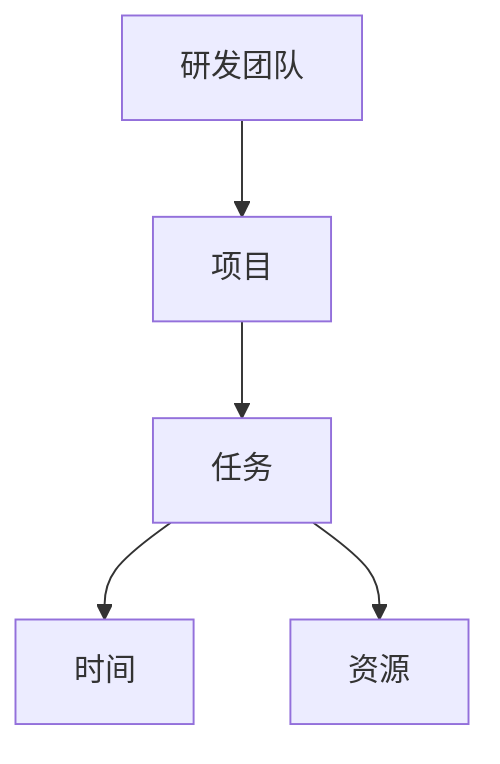
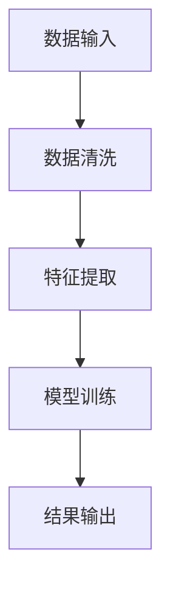
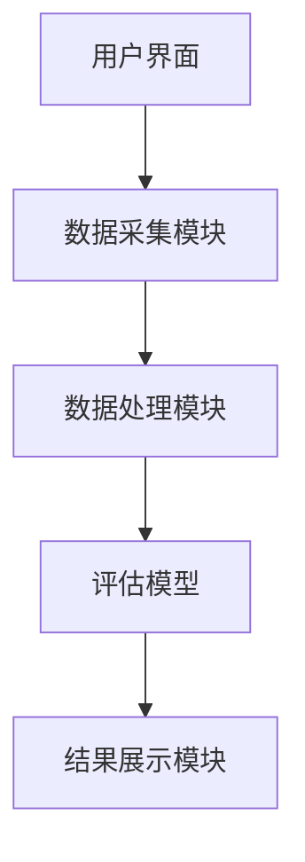

                 


# 企业估值中的研发效率评估

> 关键词：企业估值、研发效率、研发效率评估、研发团队、项目进度、资源利用率

> 摘要：研发效率评估在企业估值中扮演着关键角色，通过分析研发团队的效率、资源利用率和项目进度，可以有效衡量企业的研发能力，进而影响整体估值。本文将逐步分析研发效率评估的核心概念、算法原理、系统架构，并结合实际案例进行详细解读。

---

## 第一部分：研发效率评估的背景与重要性

### 第1章：研发效率评估的背景与问题背景

#### 1.1 研发效率评估的背景

在现代企业中，研发效率是衡量企业核心竞争力的重要指标。特别是在科技驱动的行业，研发效率直接关系到企业的创新能力和市场竞争力。研发效率高意味着企业能够更快地推出新产品、优化现有产品，从而在市场竞争中占据优势地位。同时，研发效率也是企业估值的重要组成部分，高效率的研发团队能够为企业带来更高的市场价值。

#### 1.2 研发效率在企业价值创造中的作用

研发效率不仅影响企业的短期表现，还影响企业的长期价值。高效的研发团队能够更快地将技术转化为商业价值，从而提升企业的盈利能力和市场地位。此外，研发效率高的企业通常能够吸引更多的优秀人才和投资者，进一步推动企业的增长。

#### 1.3 从效率到价值的转化

研发效率的提升可以通过以下方式转化为企业价值：
1. **缩短产品开发周期**：更快地将产品推向市场，抢占先机。
2. **降低研发成本**：通过优化资源配置，减少不必要的开支。
3. **提高产品质量**：高效的研发团队能够更好地控制产品质量，提升用户体验。
4. **增强创新能力**：高效的研发团队能够更快地进行技术迭代和创新。

#### 1.4 问题背景与挑战

尽管研发效率的重要性不言而喻，但在实际操作中，企业仍然面临诸多挑战：
1. **数据采集与处理**：如何准确采集和处理研发过程中的数据，是研发效率评估的第一步。
2. **指标体系设计**：如何设计合理的指标体系，全面反映研发效率。
3. **跨部门协作**：研发效率评估需要跨部门协作，涉及人力资源、财务、技术等多个部门。
4. **动态调整与优化**：研发效率是一个动态变化的过程，需要根据市场变化和技术进步不断调整。

---

### 第2章：研发效率评估的核心概念与联系

#### 2.1 研发效率评估的核心要素

研发效率评估的核心要素包括：
1. **人员效率**：衡量研发团队成员的个人效率，通常通过单位时间完成的任务量来衡量。
2. **资源利用率**：衡量研发过程中资源的使用效率，包括人力、时间和资金等。
3. **项目进度与质量**：衡量项目的完成速度和最终质量，确保项目按时交付且符合预期标准。

#### 2.2 核心概念原理

研发效率评估的核心原理在于通过量化指标来衡量研发团队的效率，并将其与企业价值联系起来。具体包括：
1. **指标权重分配**：根据企业战略目标，确定各项指标的权重，构建综合评估模型。
2. **数据预处理与特征提取**：通过对数据进行清洗和特征提取，为后续评估提供可靠的基础。
3. **综合评估模型**：基于数学模型，综合各项指标，得出研发效率的综合评估结果。

#### 2.3 核心概念属性对比表格

表2-1：研发效率评估指标对比

| 指标 | 定义 | 计算公式 | 适用场景 |
|------|------|----------|----------|
| 人员效率 | 单位时间内完成的任务量 | 任务完成数 / 时间 | 适用于衡量个人效率 |
| 资源利用率 | 资源投入与产出效率 | 产出 / 资源投入 | 适用于衡量整体资源效率 |
| 项目进度 | 项目完成情况 | （实际完成进度 / 计划进度）× 100% | 适用于衡量项目管理效率 |

#### 2.4 ER实体关系图



---

### 第3章：研发效率评估的算法原理

#### 3.1 算法原理概述

研发效率评估的算法原理主要包括以下几个步骤：
1. **数据预处理**：对原始数据进行清洗和标准化处理，确保数据的准确性和一致性。
2. **特征提取**：从数据中提取与研发效率相关的特征，例如任务完成时间、资源投入等。
3. **模型训练**：基于提取的特征，构建数学模型，进行研发效率的预测和评估。
4. **结果输出**：将模型的输出结果进行解释和可视化，为企业的决策提供支持。

#### 3.2 算法流程图



#### 3.3 算法实现代码

以下是一个简单的研发效率评估模型的实现代码示例：

```python
import pandas as pd
from sklearn.metrics import accuracy_score

# 示例代码：研发效率评估模型
def calculate_efficiency(data):
    # 假设data为研发项目数据
    efficiency = data['项目完成时间'] / data['投入资源']
    return efficiency

data = pd.DataFrame({
    '项目完成时间': [10, 20, 30],
    '投入资源': [5, 10, 15]
})
efficiency = calculate_efficiency(data)
print(efficiency)
```

#### 3.4 数学模型与公式

研发效率评估的数学模型可以表示为：

$$
\text{研发效率} = \frac{\text{项目完成时间}}{\text{投入资源}}
$$

其中，项目完成时间是项目的实际完成时间，投入资源包括人力、时间和资金等。

---

### 第4章：系统分析与架构设计方案

#### 4.1 问题场景介绍

在企业研发效率评估的实际应用中，通常需要构建一个完整的系统来支持评估过程。该系统需要能够采集研发过程中的各项数据，进行分析和处理，并生成评估结果。

#### 4.2 系统功能设计

系统功能设计主要包括以下几个方面：
1. **数据采集**：采集研发团队的项目数据，包括任务完成时间、资源投入等。
2. **数据处理**：对采集的数据进行清洗和标准化处理。
3. **评估模型**：构建数学模型，进行研发效率的预测和评估。
4. **结果展示**：将评估结果以图表形式展示，方便企业进行决策。

#### 4.3 系统架构设计

以下是系统架构设计的简图：



#### 4.4 系统接口设计

系统接口设计主要包括以下几个部分：
1. **数据接口**：与研发团队的数据源进行对接，获取研发数据。
2. **模型接口**：与评估模型进行交互，获取评估结果。
3. **展示接口**：将评估结果以图表形式展示给用户。

#### 4.5 系统交互设计

系统交互设计可以通过以下步骤实现：

1. 用户通过用户界面输入研发数据。
2. 数据采集模块将数据传递给数据处理模块。
3. 数据处理模块对数据进行清洗和标准化处理。
4. 评估模型对处理后的数据进行分析，生成评估结果。
5. 结果展示模块将评估结果以图表形式展示给用户。

---

## 第五部分：总结与展望

### 第5章：总结与展望

#### 5.1 最佳实践 tips

1. 在进行研发效率评估时，应注重数据的准确性和完整性。
2. 确保评估模型的合理性，根据企业实际情况进行调整。
3. 定期更新评估模型，以适应市场和技术的变化。

#### 5.2 小结

研发效率评估是企业估值中的重要组成部分，通过对研发团队的效率、资源利用率和项目进度进行综合评估，可以有效衡量企业的研发能力，进而影响整体估值。

#### 5.3 注意事项

1. 在进行研发效率评估时，应避免仅关注单一指标，而是要综合考虑多项指标。
2. 确保数据的准确性和完整性，避免因数据问题导致评估结果偏差。

#### 5.4 拓展阅读

1. 《企业估值方法论》
2. 《研发管理与项目优化》
3. 《数据驱动的决策制定》

---

## 作者信息

作者：AI天才研究院/AI Genius Institute & 禅与计算机程序设计艺术 /Zen And The Art of Computer Programming

