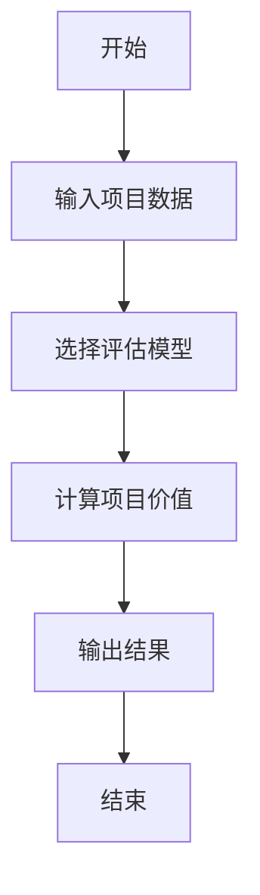

                 


# 企业估值中的研发管线价值评估

> 关键词：研发管线，企业估值，价值评估，贴现现金流模型，研发周期，项目风险

> 摘要：研发管线是企业在创新和市场竞争中的核心资产，其价值评估对于企业的整体估值至关重要。本文从研发管线的定义、作用、评估指标、模型方法等方面，系统性地分析了研发管线价值评估的关键问题，并结合实际案例，详细讲解了如何通过数学模型和系统架构设计来实现研发管线的价值评估。

---

## 第1章: 研发管线价值评估的背景与概念

### 1.1 研发管线的定义与作用
#### 1.1.1 研发管线的定义
研发管线（R&D Pipeline）是企业将创新想法转化为实际产品或服务的完整流程。它涵盖了从创意生成、技术研发、产品开发到市场投放的全生命周期。

#### 1.1.2 研发管线在企业中的作用
研发管线是企业核心竞争力的体现，直接影响企业的市场地位、收入增长和可持续发展能力。

#### 1.1.3 研发管线与企业估值的关系
研发管线的价值直接影响企业的整体估值。高潜力的研发管线通常会增加企业的市场价值。

### 1.2 企业估值的核心问题
#### 1.2.1 企业估值的基本概念
企业估值是通过对企业的财务状况、市场表现和未来潜力进行综合评估，确定其市场价值的过程。

#### 1.2.2 研发管线对估值的影响
研发管线的潜力是影响企业估值的重要因素。成功的研发项目可以显著提升企业的市场价值。

#### 1.2.3 研发管线价值评估的必要性
准确评估研发管线的价值，有助于企业制定科学的投资决策和战略规划。

### 1.3 研发管线价值评估的边界与外延
#### 1.3.1 研发管线的生命周期
研发管线通常分为早期阶段（概念验证）、中期阶段（技术研发）和后期阶段（产品开发）。

#### 1.3.2 研发管线的边界
研发管线的边界包括项目的投入成本、时间周期和潜在收益。

#### 1.3.3 研发管线价值的外延
研发管线的价值不仅包括直接收益，还包括企业品牌、技术储备和市场影响力。

---

## 第2章: 研发管线价值评估的核心概念与联系

### 2.1 研发管线的评估指标
#### 2.1.1 研发项目成功率
项目成功率是衡量研发项目价值的重要指标。

#### 2.1.2 研发成本与收益
研发成本与收益的对比是评估项目经济价值的关键。

#### 2.1.3 研发周期与风险
研发周期和风险直接影响项目的投入回报比。

### 2.2 研发管线价值评估的模型与方法
#### 2.2.1 简单加权平均法
简单加权平均法是一种基于项目成功率和收益的加权评估方法。

#### 2.2.2 贴现现金流模型
贴现现金流模型通过将未来现金流折现，评估项目的当前价值。

#### 2.2.3 概率加权模型
概率加权模型结合项目成功概率和收益，进行综合评估。

### 2.3 研发管线价值评估的核心要素
#### 2.3.1 项目阶段
项目的不同阶段对应不同的评估方法和权重。

#### 2.3.2 项目风险
风险评估是研发管线价值评估的重要组成部分。

#### 2.3.3 项目收益
收益评估是研发管线价值的核心考量因素。

---

## 第3章: 研发管线价值评估的算法原理

### 3.1 简单加权平均法
#### 3.1.1 算法原理
简单加权平均法通过将各项目成功率和收益按权重加总，得出项目的综合价值。

#### 3.1.2 算法步骤
1. 确定各项目的成功率和收益。
2. 根据权重对各项目进行加权。
3. 计算综合价值。

#### 3.1.3 算法实现
```python
def simple_weighted_average(projects):
    total = 0
    for project in projects:
        total += project['success_rate'] * project['revenue']
    return total / len(projects)
```

### 3.2 贴现现金流模型
#### 3.2.1 算法原理
贴现现金流模型通过将未来现金流折现，计算项目的当前价值。

#### 3.2.2 算法步骤
1. 预测未来现金流。
2. 确定折现率。
3. 计算现值。

#### 3.2.3 算法实现
```python
def discounted_cash_flow(projects, discount_rate):
    total = 0
    for project in projects:
        for year, cash_flow in enumerate(project['cash_flows']):
            total += cash_flow / (1 + discount_rate) ** year
    return total
```

### 3.3 概率加权模型
#### 3.3.1 算法原理
概率加权模型结合项目成功概率和收益，计算综合价值。

#### 3.3.2 算法步骤
1. 确定项目成功概率。
2. 确定项目收益。
3. 计算加权收益。

#### 3.3.3 算法实现
```python
def probability_weighted_model(projects):
    total = 0
    for project in projects:
        total += project['success_probability'] * project['revenue']
    return total
```

---

## 第4章: 研发管线价值评估的数学模型与公式

### 4.1 简单加权平均法的数学模型
$$ \text{综合价值} = \sum (\text{成功率}_i \times \text{收益}_i) $$

### 4.2 贴现现金流模型的数学模型
$$ \text{现值} = \sum \frac{\text{现金流}_t}{(1 + r)^t} $$

### 4.3 概率加权模型的数学模型
$$ \text{加权收益} = \sum (\text{概率}_i \times \text{收益}_i) $$

---

## 第5章: 研发管线价值评估的系统分析与架构设计

### 5.1 系统功能设计
#### 5.1.1 系统功能模块划分
- 数据输入模块：收集项目数据。
- 评估模块：计算项目价值。
- 输出模块：显示评估结果。

#### 5.1.2 系统功能流程图


### 5.2 系统架构设计
#### 5.2.1 系统架构图


### 5.3 系统接口设计
#### 5.3.1 系统输入接口
- 输入项目成功率、收益等数据。

#### 5.3.2 系统输出接口
- 输出项目综合价值评估结果。

---

## 第6章: 研发管线价值评估的项目实战

### 6.1 环境安装与配置
- 安装Python和必要的开发工具。

### 6.2 核心代码实现
#### 6.2.1 简单加权平均法的代码实现
```python
def simple_weighted_average(projects):
    return sum(project['success_rate'] * project['revenue'] for project in projects) / len(projects)
```

#### 6.2.2 贴现现金流模型的代码实现
```python
def discounted_cash_flow(projects, discount_rate):
    return sum(cash_flow / (1 + discount_rate) ** year for project in projects for year, cash_flow in enumerate(project['cash_flows']))
```

#### 6.2.3 概率加权模型的代码实现
```python
def probability_weighted_model(projects):
    return sum(project['success_probability'] * project['revenue'] for project in projects)
```

### 6.3 案例分析与解读
通过实际案例，详细解读如何应用上述模型进行研发管线价值评估。

---

## 第7章: 总结与展望

### 7.1 总结
研发管线价值评估是企业估值的重要组成部分，需要综合考虑项目成功率、收益和风险。

### 7.2 展望
未来，随着技术的进步，研发管线价值评估将更加智能化和精准化。

---

## 作者

作者：AI天才研究院/AI Genius Institute & 禅与计算机程序设计艺术 /Zen And The Art of Computer Programming

