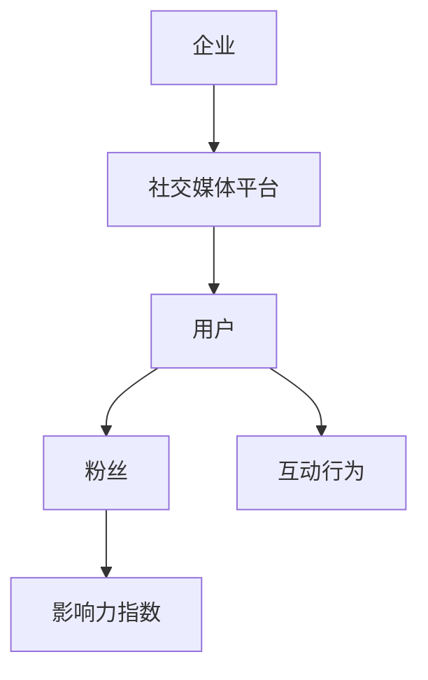
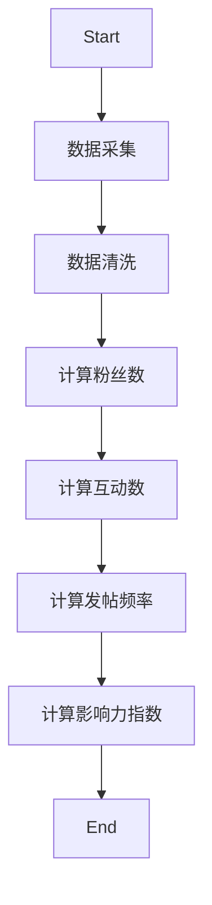

                 


# 《企业估值中的社交媒体影响力分析》

---

## 关键词：企业估值、社交媒体影响力、数据分析、影响力指数模型、影响力评分系统、影响力分析框架、影响力评估标准

---

## 摘要

在当今数字化时代，社交媒体已成为企业与消费者互动的重要平台，影响力分析在企业估值中的作用日益凸显。本文系统探讨了社交媒体影响力分析的核心概念、算法原理、系统架构设计以及实际应用案例。通过详细讲解影响力指数模型、影响力评分算法和系统架构，本文为读者提供了一套从数据采集到分析的完整方法论，帮助企业更好地利用社交媒体数据提升估值。

---

## 正文

---

## 第一部分：社交媒体影响力分析的背景与基础

### 1. 社交媒体影响力分析概述

#### 1.1 社交媒体的定义与特点

社交媒体（Social Media）是指通过互联网进行信息分享、传播和交互的平台。其主要特点包括：

- **互动性**：用户可以实时互动，评论、点赞、分享。
- **传播速度快**：信息可以在短时间内迅速扩散。
- **数据丰富**：积累了大量的用户行为数据，如发帖、评论、点赞等。

#### 1.2 企业估值中的社交媒体影响力分析

社交媒体影响力分析通过量化企业的品牌影响力、用户互动情况等指标，为企业估值提供数据支持。以下是具体分析：

- **品牌影响力**：粉丝数量、互动频率反映品牌知名度和用户参与度。
- **用户忠诚度**：通过评论量、分享量评估用户粘性。
- **情感分析**：用户评论的情感倾向影响品牌声誉，进而影响估值。

---

## 第二部分：社交媒体数据的采集与处理

### 2. 数据采集与处理方法

#### 2.1 数据采集方法

社交媒体数据采集主要通过以下方式：

- **API接口**：利用Twitter、Facebook等平台的API获取数据。
- **网页抓取**：使用工具如BeautifulSoup抓取公开数据。
- **第三方供应商**：购买专业数据服务。

#### 2.2 数据处理与清洗

- **数据清洗**：去重、处理缺失值，确保数据准确性。
- **数据转换**：将非结构化数据转换为结构化数据，便于分析。
- **预处理**：标注情感倾向，提取关键词。

---

## 第三部分：社交媒体影响力分析的核心概念

### 3. 影响力分析模型

#### 3.1 影响力指数的计算

影响力指数模型通过多维度指标量化企业影响力，公式如下：

$$
\text{影响力指数} = \frac{\text{粉丝数} + \text{互动数}}{\text{发帖频率}}
$$

其中：
- 粉丝数（Follower Count）：企业社交媒体账户的粉丝数量。
- 互动数（Engagement Rate）：包括点赞、评论、分享等。
- 发帖频率（Posting Frequency）：单位时间内的发帖数量。

#### 3.2 影响力分析的属性特征对比

| 指标       | 定义与作用                     | 权重 |
|------------|-------------------------------|------|
| 粉丝数     | 用户基数，反映品牌知名度       | 0.3  |
| 互动数     | 用户参与度，反映用户粘性       | 0.4  |
| 发帖频率   | 内容更新频率，影响用户活跃度   | 0.3  |

#### 3.3 实体关系图



---

## 第四部分：算法原理与实现

### 4. 影响力评分算法

#### 4.1 算法流程图



#### 4.2 Python代码实现

```python
import pandas as pd

def calculate_influence(followers, engagements, posting_freq):
    influence = (followers + engagements) / posting_freq
    return influence

# 示例数据
data = {
    '企业': ['A', 'B', 'C'],
    '粉丝数': [10000, 15000, 20000],
    '互动数': [500, 700, 900],
    '发帖频率': [5, 4, 3]
}

df = pd.DataFrame(data)
df['影响力指数'] = df.apply(lambda row: calculate_influence(row['粉丝数'], row['互动数'], row['发帖频率']), axis=1)
print(df)
```

---

## 第五部分：系统架构设计

### 5. 系统架构设计

#### 5.1 系统功能设计

- **数据采集模块**：负责采集社交媒体数据。
- **数据处理模块**：清洗和转换数据。
- **分析模块**：计算影响力指数。
- **展示模块**：可视化分析结果。

#### 5.2 系统架构图


---

## 第六部分：项目实战

### 6. 案例分析

#### 6.1 数据采集与处理

- 使用Twitter API采集某企业的 tweets 数据。
- 数据清洗，处理缺失值和重复数据。

#### 6.2 影响力评分计算

- 计算粉丝数、互动数和发帖频率。
- 应用影响力指数公式，得出该企业的影响力评分。

#### 6.3 结果分析

- 高影响力评分表明该企业社交媒体表现优异，品牌知名度和用户参与度高。

---

## 第七部分：总结与展望

### 7. 总结

社交媒体影响力分析为企业的估值提供了重要数据支持。通过多维度指标和算法模型，可以准确评估企业的品牌影响力和市场潜力。

### 8. 注意事项

- 数据隐私保护：确保遵守数据使用规定。
- 情感分析准确性：需要先进的NLP技术支撑。

### 9. 拓展阅读

- 《Social Media Marketing Analytics》
- 《Data Analytics for Business Decision Making》

---

## 作者：AI天才研究院 & 禅与计算机程序设计艺术

---

这篇文章详细介绍了社交媒体影响力分析在企业估值中的应用，从数据采集到系统设计，再到项目实战，为读者提供了全面的指导和实用的工具。

