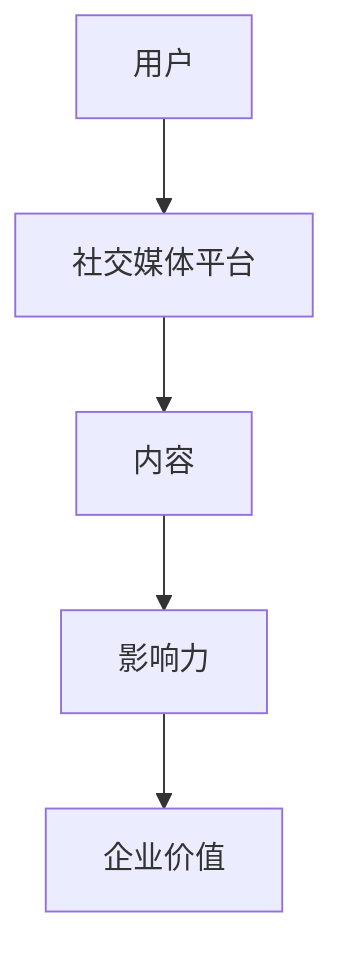
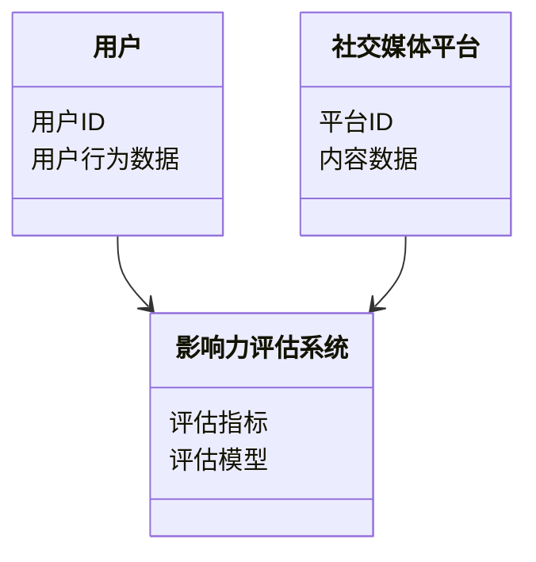
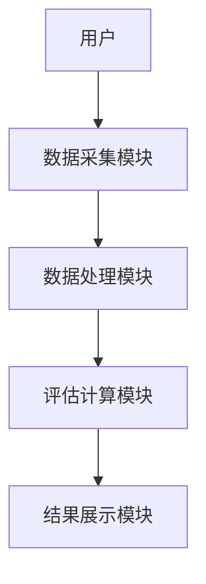

                 

# 企业估值中的社交媒体影响力评估

> 关键词：企业估值，社交媒体影响力，数字营销，品牌价值，影响力评估，社交媒体分析

> 摘要：本文系统地探讨了社交媒体影响力在企业估值中的作用，从理论到实践，详细分析了如何通过社交媒体数据评估企业影响力，并将其转化为企业价值。文章涵盖了算法原理、系统设计和实际案例，为读者提供了全面的指导。

---

# 第一部分：背景介绍与核心概念

## 第1章：背景介绍与核心概念

### 1.1 问题背景与描述

#### 1.1.1 社会媒体对企业估值的影响
社交媒体已成为企业与消费者互动的重要平台，直接影响企业的品牌价值和市场表现。通过分析社交媒体数据，可以更准确地评估企业的市场影响力和潜在价值。

#### 1.1.2 社会媒体影响力评估的必要性
企业估值需要考虑多方面的因素，社交媒体影响力是其中之一。通过评估社交媒体上的用户互动、内容传播和品牌声誉，可以提供额外的估值依据。

#### 1.1.3 问题的边界与外延
社交媒体影响力评估仅考虑社交媒体相关数据，不包括其他传统营销渠道。主要评估指标包括用户参与度、内容传播广度和品牌情感分析。

### 1.2 核心概念与联系

#### 1.2.1 社会媒体影响力评估的定义与属性
社交媒体影响力评估是指通过分析社交媒体数据，量化企业的市场影响力和品牌价值。其属性包括实时性、互动性和数据驱动性。

#### 1.2.2 影响力评估指标体系
主要指标包括：
- 用户参与度：点赞、评论、分享的数量。
- 内容传播广度：内容的转发次数和覆盖用户数。
- 品牌情感分析：用户对品牌的情感倾向。

#### 1.2.3 ER实体关系图架构

---

# 第二部分：算法原理与数学模型

## 第2章：算法原理讲解

### 2.1 算法原理

#### 2.1.1 影响力评估模型的构建
通过层次分析法（AHP）确定各指标的权重，构建评估模型。

#### 2.1.2 层次分析法（AHP）的应用
步骤：
1. 确定评估指标。
2. 构建层次分析结构。
3. 计算各指标权重。
4. 综合计算得出影响力评分。

#### 2.1.3 指标权重分配与计算
使用AHP计算权重，确保各指标的重要性得到合理分配。

### 2.2 数学模型与公式

#### 2.2.1 影响力评估的加权平均模型
$$影响力 = \sum_{i=1}^{n} w_i \times f_i$$
其中，$w_i$ 是第 $i$ 个指标的权重，$f_i$ 是第 $i$ 个指标的评分。

#### 2.2.2 企业价值与影响力的回归模型
$$企业价值 = \beta_0 + \beta_1 \times 影响力 + \epsilon$$
其中，$\beta_0$ 是截距，$\beta_1$ 是影响力系数，$\epsilon$ 是误差项。

---

# 第三部分：系统分析与架构设计

## 第3章：系统分析与架构设计

### 3.1 系统分析

#### 3.1.1 问题场景介绍
企业需要通过社交媒体数据评估影响力，进而影响估值。

#### 3.1.2 领域模型设计
构建领域模型，展示用户、社交媒体平台、内容和影响力之间的关系。

### 3.2 系统架构设计

#### 3.2.1 系统架构图

---

# 第四部分：项目实战

## 第4章：项目实战

### 4.1 环境安装与配置

#### 4.1.1 Python环境搭建
安装Python和必要的库，如pandas、numpy、scikit-learn。

#### 4.1.2 数据采集工具安装
使用社交媒体API或网络爬虫工具采集数据。

### 4.2 系统核心实现

#### 4.2.1 数据采集与预处理
编写代码采集社交媒体数据，并进行清洗和转换。

#### 4.2.2 影响力评估模型实现
实现层次分析法，计算各指标权重，评估影响力。

### 4.3 实际案例分析

#### 4.3.1 案例背景介绍
选择一家企业，分析其社交媒体数据。

#### 4.3.2 数据分析与结果解读
展示评估结果，解释其对企业估值的影响。

### 4.4 项目总结与经验分享

#### 4.4.1 项目小结
总结项目成果和遇到的问题。

#### 4.4.2 经验与教训
分享项目中的经验教训和改进建议。

---

# 第五部分：总结与展望

## 第5章：总结与展望

### 5.1 内容总结
回顾文章内容，强调社交媒体影响力评估的重要性。

### 5.2 未来研究方向
提出未来可能的研究方向，如引入更多数据源或优化评估模型。

### 5.3 实践中的注意事项

#### 5.3.1 数据质量
确保数据准确性和完整性。

#### 5.3.2 模型选择
根据实际情况选择合适的评估模型。

### 5.4 最佳实践 tips

#### 5.4.1 数据可视化
使用图表清晰展示评估结果。

#### 5.4.2 持续监测
定期更新数据，持续评估影响力变化。

---

# 作者

作者：AI天才研究院/AI Genius Institute  
& 禅与计算机程序设计艺术 /Zen And The Art of Computer Programming

