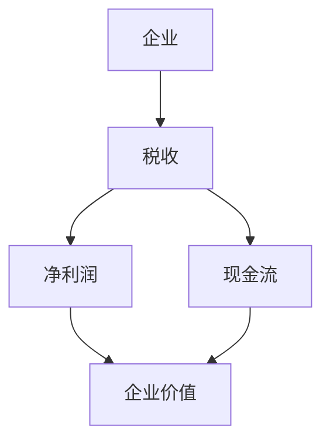
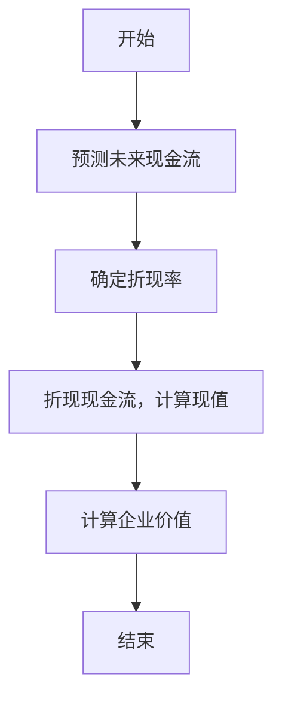
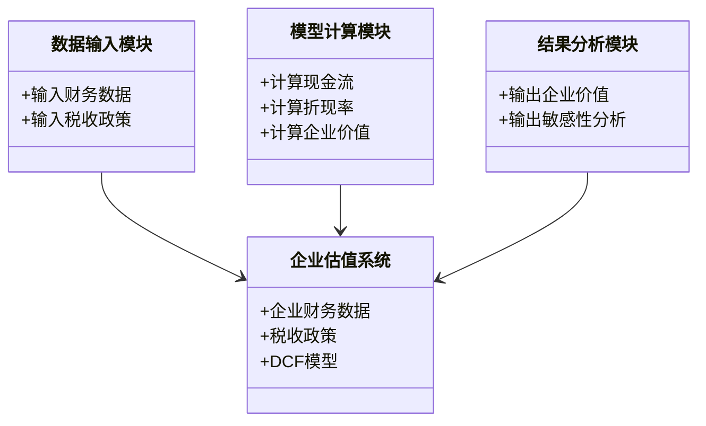
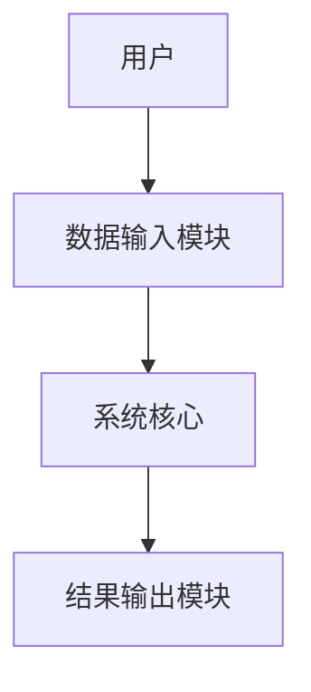

                 


# 企业估值中的税收影响分析

> 关键词：企业估值、税收影响、现金流折现模型、净利润、折现率、企业价值、DCF模型

> 摘要：本文从企业估值的基本概念出发，详细探讨了税收对估值的影响机制。通过分析税前利润、现金流、折现率等关键因素，结合现金流折现模型（DCF模型）和企业估值系统架构，深入剖析了税收在企业估值中的具体作用。文章还提供了实际案例和Python代码实现，帮助读者更好地理解和应用这些理论。

---

## 第一部分：企业估值与税收影响的背景介绍

### 第1章：企业估值的基本概念与税收影响的背景

#### 1.1 企业估值的核心概念

企业估值是评估企业整体价值的过程，通常用于企业并购、融资、上市等场景。常见的估值方法包括现金流折现模型（DCF模型）、相对估值法（如市盈率、市净率等）和资产重置成本法。

#### 1.2 税收与企业估值的关系

税收是企业的一项重要支出，直接影响企业的净利润和现金流。税收政策的变化（如税率调整）会直接影响企业的财务状况，从而影响其估值。

#### 1.3 税收对企业估值的影响范围

- **行业差异**：不同行业的税收政策不同，例如科技企业可能享受研发税收优惠，而制造企业可能面临更高的增值税。
- **地区差异**：不同地区的税率和税收政策不同，例如某些地区可能提供税收减免。
- **企业规模**：大型企业通常有更多的税收筹划空间，而小型企业可能受到更多限制。

#### 1.4 本章小结

企业估值与税收密切相关，税收政策的变化直接影响企业的财务状况和估值结果。理解税收对企业估值的影响是企业财务管理的重要组成部分。

---

## 第二部分：税收影响的核心概念与联系

### 第2章：税收影响的核心概念与原理

#### 2.1 税收影响的原理分析

税收影响的核心原理是通过调整企业的税后利润和现金流，进而影响企业价值。具体来说，税收会降低企业的税前利润，从而影响净利润和折现率。

**对比分析表：**

| 项目               | 税后利润增加 | 税后利润减少 |
|--------------------|--------------|--------------|
| 净利润             | 增加         | 减少          |
| 现金流             | 增加         | 减少          |
| 折现率             | 降低         | 增加          |

**ER实体关系图：**



#### 2.2 税收对企业财务指标的影响

- **净利润**：净利润 = 税前利润 - 税费。税费增加，净利润减少。
- **现金流**：现金流 = 净利润 + 折旧和摊销。税费增加，现金流减少。
- **折现率**：折现率与税率相关，税率越高，折现率可能越高。

#### 2.3 税收与企业估值的数学模型

企业价值公式：

$$
企业价值 = 净利润 \times 折现率
$$

对比分析：

$$
净利润_{\text{税后}} = 净利润_{\text{税前}} \times (1 - 税率)
$$

现金流折现模型中的现金流计算：

$$
CF_t = \text{EBIT}_t \times (1 - 税率) + \text{折旧}_t
$$

---

## 第三部分：税收影响的算法原理与数学模型

### 第3章：现金流折现模型中的税收影响

#### 3.1 现金流折现模型（DCF模型）概述

DCF模型是企业估值的核心方法之一。其基本步骤包括：

1. 预测未来现金流。
2. 确定合适的折现率。
3. 折现未来现金流，计算现值。
4. 加上残值，得出企业价值。

**流程图：**



#### 3.2 税收对现金流的影响

现金流计算公式：

$$
CF_t = \text{EBIT}_t \times (1 - 税率) + \text{折旧}_t
$$

#### 3.3 税收对折现率的影响

折现率与税率相关，税率越高，折现率可能越高。

#### 3.4 Python代码实现

```python
import numpy as np
import pandas as pd
from matplotlib import pyplot as plt

def calculateenterprise_value(revenue, cost, tax_rate, discount_rate, n=5):
    ebit = revenue - cost
    tax = ebit * tax_rate
    net_profit = ebit - tax
    cash_flow = net_profit + (revenue * 0.02)  # 假设折旧率为2%
    present_value = np.npv(discount_rate, [0] + [cash_flow]*n)
    return present_value

# 示例数据
revenue = 1000
cost = 600
tax_rate = 0.25
discount_rate = 0.1

enterprise_value = calculateenterprise_value(revenue, cost, tax_rate, discount_rate)
print(f"企业价值：{enterprise_value}")
```

---

## 第四部分：系统分析与架构设计方案

### 第4章：企业估值系统架构

#### 4.1 系统功能设计

- **数据输入模块**：输入企业财务数据和税收政策。
- **模型计算模块**：运行DCF模型，计算企业价值。
- **结果分析模块**：输出企业价值和敏感性分析结果。

**领域模型：**



#### 4.2 系统架构设计

**架构图：**



---

## 第五部分：项目实战

### 第5章：基于DCF模型的企业估值实战

#### 5.1 项目环境配置

安装所需Python库：

```bash
pip install numpy pandas matplotlib
```

#### 5.2 系统核心实现

```python
import numpy as np
import pandas as pd
import matplotlib.pyplot as plt

def calculateenterprise_value(revenue, cost, tax_rate, discount_rate, n=5):
    ebit = revenue - cost
    tax = ebit * tax_rate
    net_profit = ebit - tax
    cash_flow = net_profit + (revenue * 0.02)
    present_value = np.npv(discount_rate, [0] + [cash_flow]*n)
    return present_value

# 示例数据
revenue = 1000
cost = 600
tax_rate = 0.25
discount_rate = 0.1

enterprise_value = calculateenterprise_value(revenue, cost, tax_rate, discount_rate)
print(f"企业价值：{enterprise_value}")
```

#### 5.3 案例分析

以一家科技型企业为例，分析其估值过程。首先预测未来5年的现金流，计算税后现金流，然后折现得到企业价值。

#### 5.4 结果解读

通过案例分析，展示税收政策变化如何影响企业价值。例如，假设税率从25%降至20%，企业价值将如何变化。

---

## 第六部分：结论与展望

### 第6章：结论与展望

#### 6.1 本章总结

税收是影响企业估值的重要因素，理解其影响机制对于企业财务管理至关重要。

#### 6.2 展望

未来，随着税收政策的变化和企业数字化转型的推进，企业估值方法将更加复杂。建议企业结合人工智能和大数据技术，优化估值模型，提高估值的准确性。

---

## 参考文献

1. 财务管理基础教材
2. 现金流折现模型相关文献
3. 税法相关法规

---

## 作者

作者：AI天才研究院/AI Genius Institute & 禅与计算机程序设计艺术 /Zen And The Art of Computer Programming

---

通过本文的详细分析和实战案例，读者可以全面理解税收对企业估值的影响，并能够实际操作现金流折现模型，为企业估值提供有力支持。

