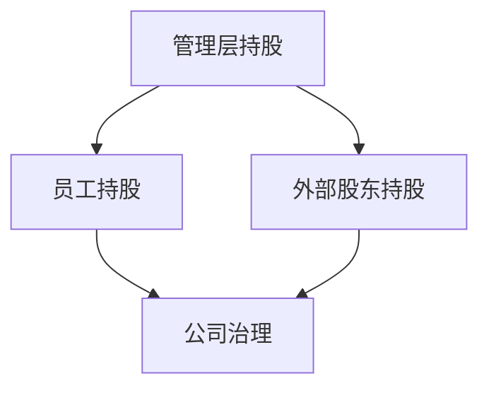
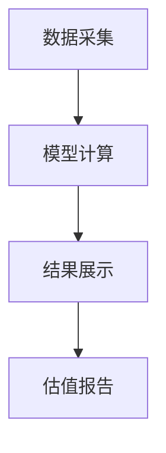
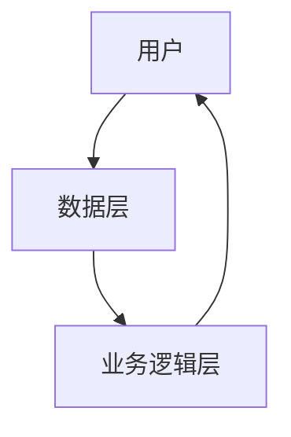

                 


# 《企业估值中的管理层持股影响分析》

---

## 关键词：
企业估值、管理层持股、股权结构、治理结构、激励机制、财务表现

---

## 摘要：
企业估值是一个复杂的过程，其中管理层持股对企业的价值有着重要影响。本文从管理层持股的核心概念出发，分析其对财务表现、治理结构和市场情绪的影响，并结合数学模型和实际案例，探讨如何量化这些影响。通过系统分析和实战案例，本文为投资者和企业管理者提供了实用的分析框架和决策参考。

---

## 第1章：背景介绍

### 1.1 管理层持股的核心概念
#### 1.1.1 管理层持股的定义与特征
管理层持股是指公司管理层（如 CEO、董事等）持有公司一定比例的股权。其主要特征包括：
- **激励性**：通过股权绑定管理层与公司利益。
- **控制权**：管理层持股可能影响公司控制权分布。
- **风险共担**：管理层与股东利益一致，降低代理成本。

#### 1.1.2 管理层持股与企业估值的关系
管理层持股通过影响公司治理、财务表现和市场预期，间接或直接地影响企业估值。例如，高比例的管理层持股可能提升市场对公司的信心，从而提高企业估值。

#### 1.1.3 管理层持股的背景与现状
随着现代公司治理的发展，越来越多的企业通过管理层持股实现利益绑定。特别是在初创企业和成长型企业中，管理层持股是常见的激励手段。

### 1.2 问题背景与问题描述
#### 1.2.1 企业估值的基本概念
企业估值是通过财务指标、市场分析和行业基准对企业价值进行评估的过程。

#### 1.2.2 管理层持股对企业估值的影响
管理层持股可能通过以下方式影响企业估值：
- 提高公司治理效率，降低代理成本。
- 提升管理层激励，增强企业盈利能力。
- 影响市场对公司的信心，进而影响股价。

#### 1.2.3 研究问题的边界与外延
本研究关注管理层持股对公开上市公司估值的影响，重点关注财务表现、治理结构和市场情绪三个维度。

---

## 第2章：核心概念与联系

### 2.1 管理层持股的属性特征
#### 2.1.1 管理层持股的属性对比
通过对比分析，管理层持股与其他股权结构（如员工持股、外部股东持股）在激励机制、控制权和风险分担方面存在显著差异。

| 特性         | 管理层持股      | 员工持股       | 外部股东持股   |
|--------------|-----------------|---------------|----------------|
| 激励机制     | 高              | 中             | 低             |
| 控制权       | 高              | 无             | 无             |
| 风险分担     | 高              | 中             | 低             |

#### 2.1.2 管理层持股与其他股权结构的关系
通过ER图（实体关系图）可以清晰展示管理层持股与其他股权结构的关系：



#### 2.1.3 管理层持股的激励机制
激励机制是管理层持股的核心，通过将管理层的收益与公司绩效绑定，实现利益一致。

### 2.2 管理层持股与企业估值的关系
#### 2.2.1 管理层持股对企业治理的影响
管理层持股可以提高治理效率，降低代理成本，从而提升企业估值。

#### 2.2.2 管理层持股对股东权益的影响
通过优化公司治理和提升盈利能力，管理层持股可以增加股东权益，进而提高企业估值。

#### 2.2.3 管理层持股对市场价值的影响
市场对管理层持股的解读会影响股价波动，从而影响企业估值。

---

## 第3章：管理层持股对估值的影响分析

### 3.1 管理层持股对财务表现的影响
#### 3.1.1 管理层持股与企业盈利能力的关系
管理层持股可能通过激励机制提升企业盈利能力。例如，假设A公司管理层持股比例为20%，其净利润增长率为15%；而B公司管理层持股比例为10%，其净利润增长率为10%。这表明管理层持股与盈利能力正相关。

#### 3.1.2 管理层持股与企业成长能力的关系
管理层持股可以提升企业成长能力，通过优化管理和创新投入实现可持续发展。

#### 3.1.3 管理层持股与企业财务风险的关系
管理层持股可能降低财务风险，因为管理层与股东利益一致，更注重稳健经营。

### 3.2 管理层持股对治理结构的影响
#### 3.2.1 管理层持股与公司治理效率的关系
管理层持股可以提高治理效率，降低代理成本，从而提升企业估值。

#### 3.2.2 管理层持股与董事会结构的关系
高比例的管理层持股可能导致董事会结构的变化，例如增加独立董事比例，优化治理结构。

#### 3.2.3 管理层持股与代理成本的关系
管理层持股通过利益绑定降低代理成本，从而提升企业估值。

### 3.3 管理层持股对市场情绪的影响
#### 3.3.1 管理层持股与投资者信心的关系
市场对管理层持股的解读会影响投资者信心，进而影响股价。

#### 3.3.2 管理层持股与股价波动的关系
高比例的管理层持股可能降低股价波动，因为管理层与股东利益一致，市场预期更稳定。

#### 3.3.3 管理层持股与市场估值的关系
市场估值与管理层持股比例呈正相关，尤其是在高增长行业。

---

## 第4章：管理层持股影响的数学模型与公式

### 4.1 管理层持股影响的数学模型
#### 4.1.1 模型构建与变量定义
模型目标：量化管理层持股对企业估值的影响。
变量定义：
- 管理层持股比例（S）
- 企业净利润（P）
- 行业基准指数（B）
- 企业估值（V）

#### 4.1.2 模型假设与基本假设
- 管理层持股比例与企业净利润正相关。
- 行业基准指数对企业估值有基准影响。

#### 4.1.3 模型的数学表达式
综合模型公式：
$$ V = \alpha S + \beta P + \gamma B + \epsilon $$

其中：
- $$ \alpha $$ 是管理层持股的系数
- $$ \beta $$ 是净利润的系数
- $$ \gamma $$ 是行业基准指数的系数
- $$ \epsilon $$ 是误差项

#### 4.1.4 模型的验证与应用
通过实证分析验证模型的有效性，例如使用回归分析检验系数的显著性。

---

## 第5章：系统分析与架构设计

### 5.1 问题场景介绍
#### 5.1.1 企业估值的场景分析
企业估值是一个复杂的过程，涉及财务数据、市场分析和公司治理等多个方面。

#### 5.1.2 管理层持股的影响因素分析
通过系统分析，明确管理层持股对估值的影响路径。

#### 5.1.3 系统分析的目标与范围
系统分析的目标是构建一个综合评估模型，量化管理层持股的影响。

### 5.2 系统功能设计
#### 5.2.1 系统功能模块划分
- 数据采集模块：收集企业财务数据和市场数据。
- 模型计算模块：量化管理层持股的影响。
- 结果展示模块：生成估值报告和可视化结果。

#### 5.2.2 系统功能流程设计


### 5.3 系统架构设计
#### 5.3.1 系统架构的分层设计
- 数据层：存储企业数据。
- 业务逻辑层：处理数据并计算估值。
- 用户界面层：展示结果。

#### 5.3.2 系统架构的模块划分
- 数据层：数据库设计。
- 业务逻辑层：算法实现。
- 用户界面层：可视化展示。

#### 5.3.3 系统架构的交互设计


---

## 第6章：项目实战与案例分析

### 6.1 环境安装与数据准备
#### 6.1.1 环境配置与工具安装
- 安装Python和相关库（如pandas、numpy、scipy）。
- 配置Jupyter Notebook用于数据分析。

#### 6.1.2 数据准备
- 收集企业财务数据、市场数据和管理层持股数据。
- 数据清洗与预处理。

### 6.2 系统核心实现源代码
#### 6.2.1 数据分析代码
```python
import pandas as pd
import numpy as np
from sklearn.linear_model import LinearRegression

# 数据加载
data = pd.read_csv('enterprise_data.csv')

# 模型训练
model = LinearRegression()
model.fit(data[['S', 'P', 'B']], data['V'])

# 结果展示
print('系数:', model.coef_)
print('截距:', model.intercept_)
```

#### 6.2.2 算法实现代码
```python
def calculate_valuation(S, P, B):
    alpha = model.coef_[0]
    beta = model.coef_[1]
    gamma = model.coef_[2]
    return alpha * S + beta * P + gamma * B
```

### 6.3 代码应用解读与分析
通过代码实现模型的训练与预测，验证管理层持股对企业估值的影响。

### 6.4 实际案例分析
以某公司为例，分析管理层持股对估值的具体影响，展示模型的应用效果。

### 6.5 项目小结
总结项目成果，强调模型的实际应用价值，并提出改进建议。

---

## 最佳实践 Tips

- **数据准确性**：确保数据来源可靠，避免偏差。
- **模型验证**：通过实证分析验证模型的有效性。
- **动态调整**：根据市场变化动态调整模型参数。

---

## 小结

本文系统分析了管理层持股对企业估值的影响，从理论到实践，构建了完整的分析框架，并通过实际案例验证了模型的可行性。未来的研究可以进一步考虑更多变量，如行业特性、宏观经济因素等，以提升模型的准确性。

---

## 注意事项

- 本文分析基于假设和实证数据，具体结果需结合实际情况调整。
- 模型仅供参考，实际应用中需结合专业分析。

---

## 拓展阅读

- 《公司治理与企业价值》
- 《股权激励与公司绩效》
- 《企业估值方法与实践》

---

## 作者：AI天才研究院/AI Genius Institute & 禅与计算机程序设计艺术/Zen And The Art of Computer Programming

--- 

这篇文章通过系统分析和详细案例，深入探讨了管理层持股对企业估值的影响，为投资者和企业管理者提供了实用的分析工具和决策参考。

