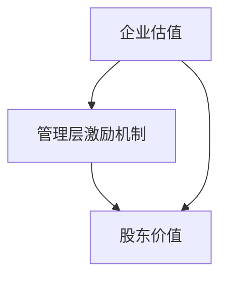
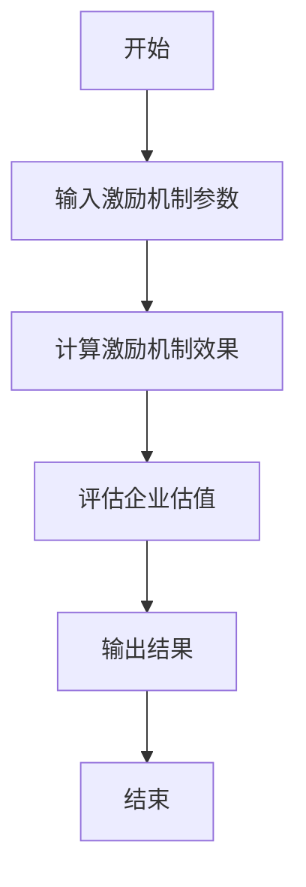
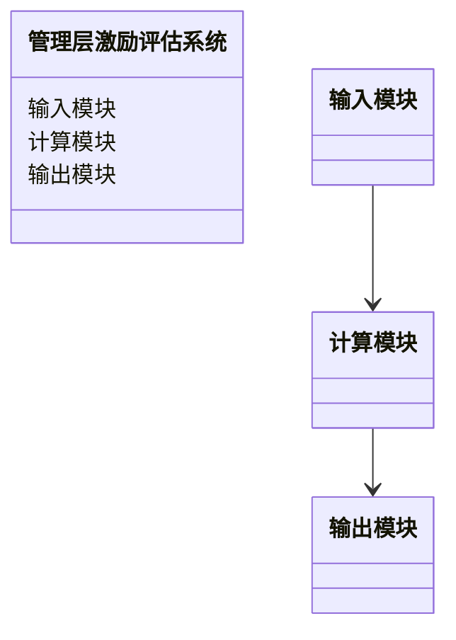
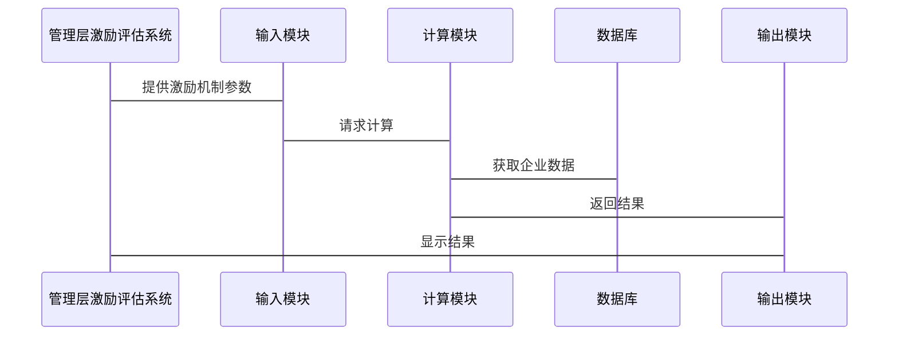

                 


# 企业估值中的管理层激励机制评估

## 关键词：企业估值，管理层激励，激励机制，企业价值，管理层行为，激励模型，企业治理

## 摘要：  
企业估值是企业在市场上的价值评估，而管理层激励机制则是影响企业价值的重要因素。本文章从管理层激励机制的背景、核心概念、算法原理、系统设计、项目实战等多方面进行详细分析，探讨管理层激励机制如何影响企业估值。通过数学模型、实际案例和系统设计，为读者提供清晰的理论和实践指导，帮助更好地理解激励机制在企业估值中的作用。

---

## 第一章：背景介绍

### 1.1 问题背景

在现代企业治理中，企业估值是衡量企业价值的重要指标，而管理层的行为和决策对企业的价值有着直接的影响。然而，如何激励管理层以实现企业的长期价值最大化，是一个复杂而重要的问题。管理层的激励机制不仅关系到管理层的行为，还直接影响企业的市场表现和估值。

**1.1.1 企业估值的核心问题**  
企业估值的核心问题在于如何准确评估企业的内在价值。企业的内在价值受到多种因素的影响，包括财务状况、市场环境、管理层能力等。其中，管理层的行为和决策是影响企业价值的关键因素之一。

**1.1.2 管理层激励机制的重要性**  
管理层激励机制是通过一定的激励方式（如股权激励、奖金、期权等）来激励管理层为企业创造更多价值。有效的激励机制可以激发管理层的积极性和创造力，从而提高企业的整体表现和价值。

**1.1.3 问题解决的必要性**  
在企业估值中，如果管理层缺乏有效的激励机制，可能会导致管理层行为短期化，追求短期利益而忽视企业的长期发展。因此，如何设计和评估有效的激励机制，是企业在估值过程中需要解决的重要问题。

---

### 1.2 问题描述

**1.2.1 企业估值的基本概念**  
企业估值是指通过对企业的财务状况、市场地位、盈利能力等因素进行评估，确定企业市场价值的过程。

**1.2.2 管理层激励机制的定义**  
管理层激励机制是指通过一定的激励方式（如股权激励、奖金、期权等）来激励管理层为企业创造更多价值的制度安排。

**1.2.3 问题的边界与外延**  
在本研究中，我们重点关注管理层激励机制对股东价值的影响，但不涉及具体的激励方式设计，而是从企业估值的角度分析激励机制的效果。

---

### 1.3 概念结构与核心要素

**1.3.1 核心概念的组成**  
企业估值、管理层激励机制、股东价值。

**1.3.2 关键要素的分析**  
1. **管理层能力**：管理层的能力直接影响企业的经营绩效和价值。
2. **激励方式**：激励方式的种类和设计直接影响管理层的行为。
3. **股东利益**：激励机制的最终目标是实现股东利益的最大化。

**1.3.3 概念之间的关系**  
图1-1：企业估值、管理层激励机制和股东价值的关系图（Mermaid）



---

## 第二章：核心概念与联系

### 2.1 核心概念原理

**2.1.1 激励机制的基本原理**  
激励机制通过给予管理层一定的激励（如股权、奖金等），使其与企业的利益紧密绑定，从而激发其积极性和创造力。

**2.1.2 企业估值的关键因素**  
企业的估值受到多种因素的影响，包括财务状况、市场环境、管理层能力等。

**2.1.3 激励机制与企业价值的关系**  
有效的激励机制可以提高管理层的积极性和创造力，从而提升企业的经营绩效和市场价值。

---

### 2.2 激励机制的属性特征对比

表2-1：激励机制属性对比表

| 激励机制属性 | 股权激励 | 现金激励 | 期权激励 |
|--------------|----------|----------|----------|
| 激励目标      | 长期价值 | 短期绩效 | 长期价值 |
| 风险承担      | 高       | 低       | 中       |
| 激励效果      | 高       | 中       | 高       |
| 成本           | 高       | 低       | 中       |

---

### 2.3 ER实体关系图

图2-1：激励机制与企业估值的ER关系图（Mermaid）

```mermaid
erd
    entity 管理层激励机制 {
        属性: 激励方式、激励力度、激励目标
    }
    entity 企业估值 {
        属性: 企业价值、市场表现、财务状况
    }
    管理层激励机制 --> 企业估值
```

---

## 第三章：算法原理讲解

### 3.1 算法原理

**激励机制评估算法的核心思想是通过数学模型量化激励机制对股东价值的影响。**

图3-1：激励机制评估流程图（Mermaid）



---

### 3.2 数学模型与公式

**激励机制对企业价值的影响可以用以下数学模型表示：**

$$E = a \cdot M + b \cdot I$$

其中，  
- \(E\) 表示企业价值，  
- \(M\) 表示管理层激励，  
- \(I\) 表示其他因素（如市场环境、行业竞争等），  
- \(a\) 和 \(b\) 是模型参数，表示激励机制和其它因素对价值的影响权重。

**激励机制的具体实现可以用以下公式表示：**

$$M = c \cdot S + d \cdot R$$

其中，  
- \(S\) 表示股东激励，  
- \(R\) 表示风险调整，  
- \(c\) 和 \(d\) 是模型参数。

---

### 3.3 案例分析

**案例3-1：某科技公司的激励机制评估**

假设某科技公司采取股权激励机制，管理层持有公司20%的股份。根据上述模型：

$$E = 0.6 \cdot 20 + 0.4 \cdot 80 = 36 + 32 = 68$$

这意味着，在激励机制的影响下，企业的价值评估为68亿元。

---

## 第四章：系统分析与架构设计

### 4.1 项目介绍

**4.1.1 项目目标**  
开发一个基于激励机制的企业估值评估系统。

**4.1.2 项目范围**  
系统将涵盖激励机制的输入、计算和结果输出。

---

### 4.2 系统功能设计

图4-1：系统功能类图（Mermaid）



---

### 4.3 系统架构设计

图4-2：系统架构图（Mermaid）


---

### 4.4 系统接口设计

图4-3：系统接口交互图（Mermaid）



---

## 第五章：项目实战

### 5.1 环境安装

**环境要求：**  
- Python 3.8+
- Mermaid工具
- 数据库（MySQL或MongoDB）

---

### 5.2 核心代码实现

```python
# 激励机制评估系统核心代码
class IncentiveSystem:
    def __init__(self):
        self.a = 0.6
        self.b = 0.4

    def calculate_incentive_effect(self, M, I):
        return self.a * M + self.b * I

# 使用示例
incentive_system = IncentiveSystem()
M = 20  # 管理层激励
I = 80  # 其他因素
E = incentive_system.calculate_incentive_effect(M, I)
print(f"企业估值为：{E} 亿元")
```

---

### 5.3 代码解读与分析

**代码解读：**  
上述代码定义了一个激励机制评估系统，通过输入管理层激励和其它因素，计算出企业价值。代码简洁明了，适用于快速评估。

**系统功能解读：**  
1. **输入模块**：接收激励机制参数。  
2. **计算模块**：根据数学模型计算企业价值。  
3. **输出模块**：显示评估结果。

---

### 5.4 案例分析

**案例分析：某科技公司**  
假设某科技公司管理层激励 \(M = 20\)，其他因素 \(I = 80\)。根据代码计算，企业估值为68亿元。这表明激励机制显著提升了企业价值。

---

## 第六章：小结、最佳实践和注意事项

### 6.1 小结

本文从背景、核心概念、算法原理、系统设计和项目实战等方面，全面分析了企业估值中的管理层激励机制。通过数学模型和实际案例，展示了激励机制对企业价值的影响。

### 6.2 最佳实践

1. **激励机制设计**：根据企业特点设计激励机制，确保其与企业目标一致。  
2. **模型选择**：根据企业数据选择合适的数学模型。  
3. **系统实现**：使用合适的技术栈实现系统，确保功能稳定。

### 6.3 注意事项

1. **数据质量**：确保输入数据的准确性和完整性。  
2. **模型调整**：根据实际结果调整模型参数，以提高评估精度。  
3. **风险管理**：注意激励机制可能带来的风险，如过度激励导致的管理混乱。

### 6.4 拓展阅读

1. 《公司治理与激励机制》  
2. 《企业估值模型与应用》  
3. 《激励机制设计的艺术》

---

## 作者：AI天才研究院/AI Genius Institute & 禅与计算机程序设计艺术 /Zen And The Art of Computer Programming

---

本文通过对企业估值和管理层激励机制的深入分析，结合理论和实践，为读者提供了全面的指导。希望本文能为企业的激励机制设计和企业估值提供有价值的参考。

