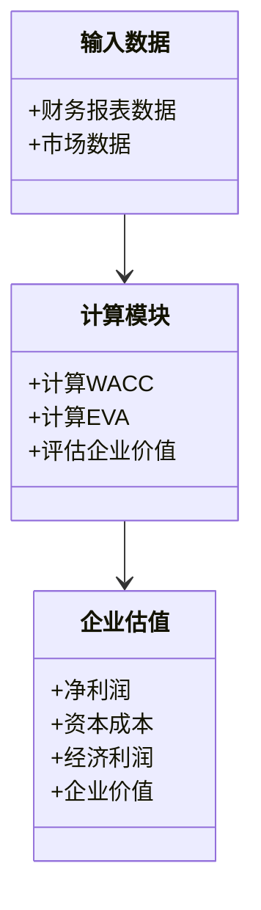

                 


# 《企业估值中的经济利润法》

---

> 关键词：企业估值，经济利润法，经济增加值（EVA），加权平均资本成本（WACC），资本预算

---

> 摘要：经济利润法是一种基于资本成本的企业估值方法，通过计算经济增加值（EVA）和加权平均资本成本（WACC），能够更准确地衡量企业的真实价值。本文从经济利润法的基本概念出发，深入分析其理论基础、算法原理、系统架构，并通过实际案例展示其应用过程，帮助读者全面理解经济利润法的核心思想和实践价值。

---

## 目录

### 第一部分: 企业估值中的经济利润法概述

#### 第1章: 经济利润法的背景与概念

##### 1.1 企业估值的基本问题

- 1.1.1 企业估值的核心目标
- 1.1.2 传统估值方法的局限性
- 1.1.3 经济利润法的提出与意义

##### 1.2 经济利润法的定义与特点

- 1.2.1 经济利润法的定义
- 1.2.2 经济利润法的核心特点
- 1.2.3 经济利润法与传统估值方法的对比

##### 1.3 经济利润法的应用场景

- 1.3.1 企业并购中的应用
- 1.3.2 企业融资中的应用
- 1.3.3 企业绩效评估中的应用

##### 1.4 本章小结

---

### 第二部分: 经济利润法的核心原理与模型

#### 第2章: 经济利润法的核心概念

##### 2.1 经济利润法的理论基础

- 2.1.1 资本资产定价模型（CAPM）
- 2.1.2 加权平均资本成本（WACC）
- 2.1.3 股权资本成本的计算

##### 2.2 经济利润法的公式推导

- 2.2.1 经济利润法的基本公式
$$ \text{Economic Profit} = \text{NOPAT} - (WACC \times \text{资本}) $$

- 2.2.2 各变量的定义与计算
- 2.2.3 公式推导的详细步骤

##### 2.3 经济利润法的属性特征对比

- 2.3.1 表格对比：经济利润法与传统估值方法的差异
- 2.3.2 图表展示：经济利润法的核心要素关系图

---

#### 第3章: 经济利润法的算法原理

##### 3.1 经济利润法的计算流程

- 3.1.1 确定企业的净利润
- 3.1.2 计算企业的资本成本
- 3.1.3 计算经济利润
- 3.1.4 评估企业价值

##### 3.2 经济利润法的数学模型

- 3.2.1 经济利润法的数学公式
$$ \text{EVA} = \text{NOPAT} - (WACC \times \text{资本}) $$

- 3.2.2 WACC的计算公式
$$ WACC = \left( \frac{D}{D+E} \right) \times r_d \times (1 - t) + \left( \frac{E}{D+E} \right) \times r_e $$

---

### 第三部分: 经济利润法的系统分析与架构设计

#### 第4章: 经济利润法的系统分析

##### 4.1 问题场景介绍

- 4.1.1 企业估值的基本问题
- 4.1.2 经济利润法的适用范围

##### 4.2 系统功能设计

- 4.2.1 领域模型Mermaid类图


##### 4.3 系统架构设计

- 4.3.1 系统架构Mermaid图


##### 4.4 系统接口设计

- 4.4.1 输入接口
- 4.4.2 输出接口
- 4.4.3 数据格式规范

##### 4.5 系统交互Mermaid序列图

```mermaid
sequenceDiagram
    participant 用户
    participant 输入数据模块
    participant 计算模块
    participant 结果展示模块
    用户 -> 输入数据模块: 提供财务数据
    输入数据模块 -> 计算模块: 传输数据
    计算模块 -> 结果展示模块: 返回计算结果
    用户 <- 结果展示模块: 显示企业估值结果
```

---

### 第四部分: 经济利润法的项目实战与案例分析

#### 第5章: 项目实战

##### 5.1 环境安装

- 5.1.1 安装Python环境
- 5.1.2 安装相关库（numpy, pandas, matplotlib）

##### 5.2 系统核心实现源代码

```python
import numpy as np
import pandas as pd

def calculate_wacc(market_value_debt, market_value_equity, cost_debt, cost_equity, tax_rate):
    wacc = (market_value_debt / (market_value_debt + market_value_equity)) * cost_debt * (1 - tax_rate) + \
           (market_value_equity / (market_value_debt + market_value_equity)) * cost_equity
    return wacc

def calculate_eva(net_profit, wacc, capital):
    eva = net_profit - (wacc * capital)
    return eva

# 示例数据
net_profit = 100  # 净利润
capital = 500  # 资本
market_value_debt = 200  # 市场价值债务
market_value_equity = 300  # 市场价值权益
cost_debt = 0.05  # 债务成本
cost_equity = 0.10  # 权益成本
tax_rate = 0.25  # 税率

wacc = calculate_wacc(market_value_debt, market_value_equity, cost_debt, cost_equity, tax_rate)
eva = calculate_eva(net_profit, wacc, capital)

print(f"计算的WACC为：{wacc}")
print(f"计算的EVA为：{eva}")
```

##### 5.3 代码应用解读与分析

- 5.3.1 代码功能解析
- 5.3.2 输入参数说明
- 5.3.3 输出结果解读

##### 5.4 实际案例分析

- 5.4.1 案例背景
- 5.4.2 数据准备
- 5.4.3 计算过程
- 5.4.4 结果分析

##### 5.5 本章小结

---

### 第五部分: 经济利润法的最佳实践与扩展

#### 第6章: 最佳实践

##### 6.1 小结

- 6.1.1 经济利润法的核心要点
- 6.1.2 实际应用中的注意事项

##### 6.2 注意事项

- 6.2.1 数据的准确性
- 6.2.2 假设的合理性
- 6.2.3 结果的可解释性

##### 6.3 拓展阅读

- 6.3.1 经济利润法的最新研究
- 6.3.2 相关工具与软件推荐
- 6.3.3 其他企业估值方法的对比

---

### 作者信息

作者：AI天才研究院/AI Genius Institute & 禅与计算机程序设计艺术/Zen And The Art of Computer Programming

