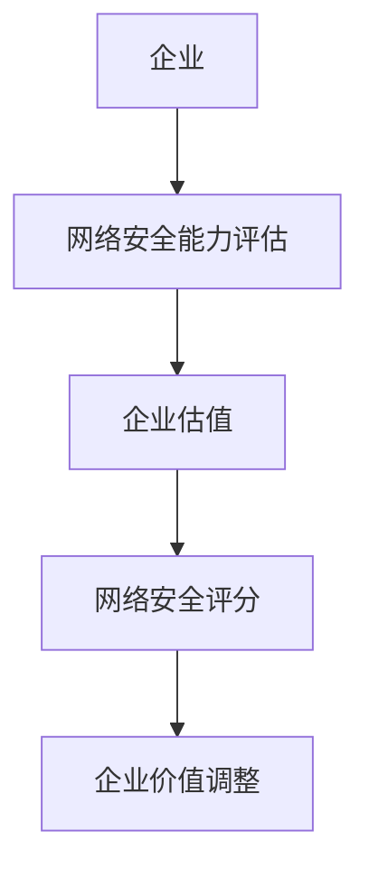
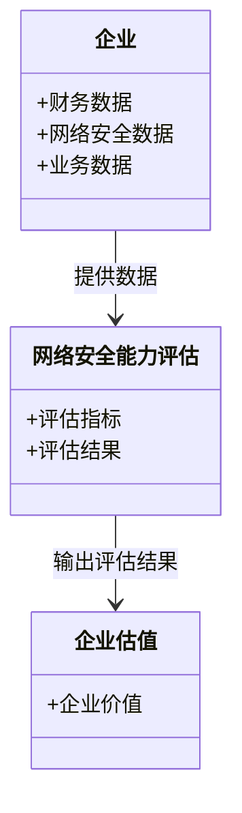
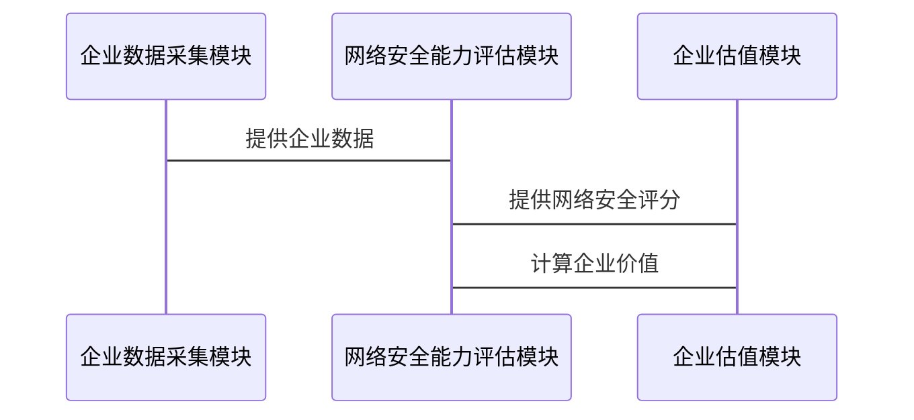

                 


# 企业估值中的网络安全能力评估

> 关键词：企业估值，网络安全，能力评估，指标体系，数学模型

> 摘要：企业估值中的网络安全能力评估是一项新兴而重要的研究领域。随着网络安全威胁的日益增多，企业的网络安全能力直接影响其市场价值。本文系统地分析了网络安全能力评估的核心概念，构建了网络安全能力评估的数学模型，并结合实际案例，详细阐述了如何将网络安全能力评估融入企业估值体系中，为企业管理者和投资者提供了新的视角和方法。

---

## 第一部分: 企业估值中的网络安全能力评估概述

## 第1章: 背景介绍

### 1.1 问题背景

#### 1.1.1 企业估值的传统方法与局限性
企业估值是企业管理和金融领域中的核心问题，传统的估值方法主要包括财务指标分析、市场比较法和DCF模型等。然而，这些方法往往忽视了网络安全这一重要因素。随着数字化转型的深入，网络安全已成为企业生存和发展的基石，直接影响企业的财务表现和市场价值。

#### 1.1.2 网络安全对企业价值的影响
网络安全能力是企业核心竞争力的重要组成部分。强大的网络安全能力可以降低数据泄露、网络攻击等风险，保护企业的知识产权和客户信任，从而提升企业的市场价值。反之，网络安全能力薄弱可能导致企业面临巨大的财务损失和声誉损害，进而影响估值。

#### 1.1.3 网络安全能力评估的必要性
为了准确评估企业的整体价值，必须将网络安全能力纳入估值体系。通过量化企业的网络安全能力，投资者和管理层可以更好地理解网络安全对企业价值的影响，并制定相应的战略决策。

### 1.2 问题描述

#### 1.2.1 网络安全能力评估的核心目标
网络安全能力评估的目标是量化企业在预防和应对网络攻击方面的能力，包括技术能力、管理能力和人员能力等方面。

#### 1.2.2 企业估值中的网络安全挑战
企业估值中的网络安全挑战主要体现在如何将网络安全能力转化为可量化的指标，并与企业的市场价值建立联系。

#### 1.2.3 网络安全能力评估的边界与外延
网络安全能力评估的边界包括企业的内部网络、数据资产和关键业务系统等。其外延则涉及企业外部的网络环境、合作伙伴的网络安全状况以及行业法规等。

### 1.3 问题解决

#### 1.3.1 网络安全能力评估的解决方案
通过建立网络安全能力评估指标体系，结合企业的实际情况，制定个性化的评估方案。

#### 1.3.2 企业估值与网络安全能力的结合
将网络安全能力评估结果作为企业估值的重要参考，纳入企业的整体价值评估体系。

#### 1.3.3 网络安全能力评估的实施步骤
1. 确定评估指标和权重。
2. 收集相关数据。
3. 进行评估计算。
4. 结果分析与优化。

---

## 第2章: 核心概念与联系

### 2.1 核心概念原理

#### 2.1.1 网络安全能力评估的定义与特征
网络安全能力评估是对企业在预防和应对网络攻击方面的整体能力的量化过程。其特征包括全面性、动态性和可量化性。

#### 2.1.2 企业估值的核心要素与网络安全的关系
企业估值的核心要素包括财务状况、市场地位、管理能力和创新能力等。网络安全能力是企业创新能力的重要组成部分，直接影响企业的市场价值。

#### 2.1.3 网络安全能力评估的数学模型
网络安全能力评估的数学模型需要综合考虑企业的技术、管理和人员等多个方面的因素。例如，可以使用加权评分模型，将各项指标进行加权求和，得出企业的网络安全评分。

### 2.2 概念属性特征对比表格

| 概念 | 特征 |
|------|------|
| 网络安全能力评估 | 全面性、动态性、可量化性 |
| 企业估值 | 财务状况、市场地位、管理能力、创新能力 |

### 2.3 ER实体关系图

```mermaid
er
  actor: 企业
  actor: 评估机构
  actor: 网络安全专家
  entity: 网络安全能力
  entity: 企业估值
  entity: 网络安全评分
  entity: 企业财务数据
  entity: 网络安全事件记录
  relation: 参与
  relation: 影响
  relation: 基于
  relation: 包含
```

---

## 第3章: 算法原理讲解

### 3.1 算法原理

#### 3.1.1 网络安全能力评估的指标体系
网络安全能力评估的指标体系包括技术能力、管理能力、人员能力和数据保护能力等方面。每个指标都需要有具体的评分标准。

#### 3.1.2 企业估值模型的构建
企业估值模型需要综合考虑企业的财务指标和网络安全评分。例如，可以使用线性回归模型，将网络安全评分作为自变量，企业价值作为因变量，进行回归分析。

#### 3.1.3 网络安全能力评分的加权算法
网络安全能力评分的加权算法需要根据各指标的重要性和影响程度进行加权求和。例如，可以使用层次分析法（AHP）确定各指标的权重。

### 3.2 mermaid流程图



### 3.3 Python源代码实现

```python
import pandas as pd
import numpy as np

def calculate_nsa_score(enterprise_data):
    # 网络安全能力评估指标
    ns_factors = ['防火墙强度', '入侵检测系统', '数据加密强度', '员工安全意识']
    
    # 确定各指标的权重
    weights = {'防火墙强度': 0.3, '入侵检测系统': 0.3, '数据加密强度': 0.2, '员工安全意识': 0.2}
    
    # 计算各指标的评分
    scores = {}
    for factor in ns_factors:
        scores[factor] = enterprise_data[factor] * weights[factor]
    
    # 计算总评分
    total_score = sum(scores.values())
    
    return total_score

# 示例数据
data = {
    '防火墙强度': [0.8, 0.7, 0.9],
    '入侵检测系统': [0.6, 0.8, 0.7],
    '数据加密强度': [0.5, 0.6, 0.8],
    '员工安全意识': [0.7, 0.6, 0.8]
}

df = pd.DataFrame(data)
ns_scores = df.apply(lambda x: calculate_nsa_score(x), axis=1)
print(ns_scores)
```

### 3.4 数学公式

网络安全能力评分公式：

$$
\text{NSA\_Score} = \sum_{i=1}^{n} w_i \times s_i
$$

其中，$w_i$ 是第 $i$ 个指标的权重，$s_i$ 是第 $i$ 个指标的评分。

企业估值模型公式：

$$
\text{企业价值} = \alpha \times \text{财务指标} + \beta \times \text{NSA\_Score}
$$

其中，$\alpha$ 和 $\beta$ 是回归系数。

---

## 第4章: 系统分析与架构设计方案

### 4.1 问题场景介绍
企业需要评估自身的网络安全能力，并将其纳入企业估值体系中。为此，需要设计一个模块化的系统，包括数据采集、评估计算、结果展示等功能。

### 4.2 项目介绍

#### 4.2.1 项目目标
设计一个网络安全能力评估系统，能够量化企业的网络安全能力，并将其与企业估值模型相结合。

### 4.3 系统功能设计

#### 4.3.1 领域模型


### 4.4 系统架构设计


### 4.5 系统接口设计
系统接口设计需要明确各模块之间的数据交互方式，例如通过API进行数据传输。

### 4.6 系统交互mermaid序列图



---

## 第5章: 项目实战

### 5.1 环境安装

#### 5.1.1 安装Python和相关库
需要安装Python 3.8及以上版本，并安装pandas、numpy等库。

### 5.2 系统核心实现源代码

#### 5.2.1 网络安全能力评估模块

```python
import pandas as pd
import numpy as np

def calculate_nsa_score(enterprise_data):
    # 网络安全能力评估指标
    ns_factors = ['防火墙强度', '入侵检测系统', '数据加密强度', '员工安全意识']
    
    # 确定各指标的权重
    weights = {'防火墙强度': 0.3, '入侵检测系统': 0.3, '数据加密强度': 0.2, '员工安全意识': 0.2}
    
    # 计算各指标的评分
    scores = {}
    for factor in ns_factors:
        scores[factor] = enterprise_data[factor] * weights[factor]
    
    # 计算总评分
    total_score = sum(scores.values())
    
    return total_score
```

#### 5.2.2 企业估值模块

```python
import pandas as pd
import numpy as np
from sklearn.linear_model import LinearRegression

def calculateenterprise_value(enterprise_data, ns_scores):
    # 定义企业价值模型
    model = LinearRegression()
    model.fit(enterprise_data[['财务指标']], enterprise_data['企业价值'])
    
    # 预测企业价值
    predicted_value = model.predict(ns_scores)
    
    return predicted_value
```

### 5.3 代码应用解读与分析

#### 5.3.1 网络安全能力评估模块解读
该模块通过加权评分算法，将企业的各项网络安全指标进行评分，并计算总评分。总评分反映了企业的网络安全能力。

#### 5.3.2 企业估值模块解读
该模块使用线性回归模型，结合企业的财务指标和网络安全评分，预测企业的市场价值。

### 5.4 实际案例分析和详细讲解剖析

#### 5.4.1 案例背景
某科技公司面临网络攻击风险，希望通过提升网络安全能力来增加企业估值。

#### 5.4.2 案例实施步骤
1. 收集企业的财务数据和网络安全数据。
2. 使用网络安全能力评估模块计算企业的网络安全评分。
3. 使用企业估值模块预测企业的市场价值。

### 5.5 项目小结
通过实际案例分析，可以发现网络安全能力评估能够显著影响企业的市场价值。企业需要重视网络安全能力的建设，并将其纳入企业估值体系中。

---

## 第6章: 最佳实践 tips、小结、注意事项、拓展阅读

### 6.1 最佳实践 tips
1. 在进行网络安全能力评估时，需要结合企业的实际情况，制定个性化的评估指标和权重。
2. 定期更新网络安全能力评估模型，以应对不断变化的网络安全威胁。
3. 企业需要加强员工的网络安全意识培训，提升整体网络安全能力。

### 6.2 小结
本文系统地分析了企业估值中的网络安全能力评估的核心概念，构建了网络安全能力评估的数学模型，并结合实际案例，详细阐述了如何将网络安全能力评估融入企业估值体系中。

### 6.3 注意事项
1. 网络安全能力评估需要结合企业的实际情况，避免过于理论化。
2. 在实际应用中，需要注意数据的准确性和完整性。
3. 网络安全能力评估模型需要定期更新和优化。

### 6.4 拓展阅读
1. 《企业网络安全管理实战》
2. 《网络安全与企业战略》
3. 《企业估值模型与应用》

---

## 作者

作者：AI天才研究院/AI Genius Institute & 禅与计算机程序设计艺术/Zen And The Art of Computer Programming

