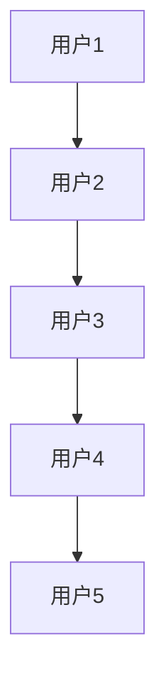
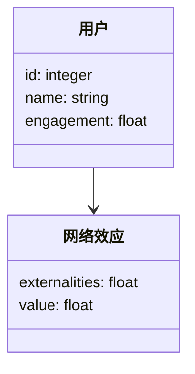

                 


# 企业估值中的网络效应价值评估

## 关键词：
企业估值, 网络效应, 价值评估, 数学模型, 算法原理, 系统架构, 项目实战

## 摘要：
网络效应是企业在现代经济中的核心竞争优势之一，尤其是在数字化和平台化的背景下。本文将系统性地探讨网络效应对企业估值的影响，从理论分析到实践应用，详细阐述网络效应的定义、特征、数学模型、算法原理、系统架构以及项目实战。通过具体案例分析和代码实现，帮助读者深入理解网络效应在企业估值中的价值，并掌握实际应用的技巧。

---

# 目录大纲

1. **企业估值中的网络效应基础**
   - 1.1 网络效应的定义与特征
   - 1.2 网络效应的形成机制
   - 1.3 网络效应的衡量标准
   - 1.4 本章小结

2. **网络效应的数学模型与分析**
   - 2.1 网络外部性模型
   - 2.2 价值网络模型
   - 2.3 网络效应的数学公式
   - 2.4 本章小结

3. **网络效应的算法原理**
   - 3.1 网络效应的算法概述
   - 3.2 基于网络效应的估值算法
   - 3.3 网络效应的数学模型
   - 3.4 本章小结

4. **网络效应的系统分析与架构设计**
   - 4.1 系统分析
   - 4.2 系统功能设计
   - 4.3 系统架构设计
   - 4.4 本章小结

5. **网络效应的项目实战**
   - 5.1 环境安装
   - 5.2 核心代码实现
   - 5.3 案例分析
   - 5.4 本章小结

6. **网络效应价值评估的最佳实践**
   - 6.1 小结
   - 6.2 注意事项
   - 6.3 拓展阅读
   - 6.4 本章小结

---

## 第1章: 企业估值中的网络效应基础

### 1.1 网络效应的定义与特征
网络效应是指当用户数量增加时，产品或服务的价值也随之增加的现象。其核心在于用户之间的互动和数据共享，形成一个正反馈循环。

- **直接网络效应**：用户从更多用户的存在中获得直接价值，例如社交媒体平台，用户越多，每个人的体验越好。
- **间接网络效应**：用户通过更多用户的存在间接获得价值，例如企业软件，用户越多，软件的功能越完善。

### 1.2 网络效应的形成机制
网络效应的形成依赖于以下几个关键因素：

1. **用户数量**：用户基数越大，网络效应越强。
2. **用户参与度**：用户的活跃程度直接影响网络效应的强度。
3. **正反馈循环**：用户数量的增加进一步吸引更多用户，形成正反馈。

### 1.3 网络效应的衡量标准
- **用户数量**：用户基数是衡量网络效应的重要指标。
- **用户参与度**：用户活跃度和互动频率。
- **网络效应的经济价值**：通过数学模型计算网络效应对企业估值的贡献。

### 1.4 本章小结
本章介绍了网络效应的定义、特征以及形成机制，并提出了衡量网络效应的三个关键标准：用户数量、用户参与度和经济价值。

---

## 第2章: 网络效应的数学模型与分析

### 2.1 网络外部性模型
网络外部性是指用户从其他用户使用产品中获得的额外价值。其数学表达如下：

$$
网络外部性 = \sum_{i=1}^{n} (v_i - c_i)
$$

其中，$v_i$ 是用户 $i$ 的效用，$c_i$ 是用户 $i$ 的成本。

### 2.2 价值网络模型
价值网络模型通过构建用户之间的关系图，量化网络效应的价值。模型结构可以用 mermaid 表示如下：



### 2.3 网络效应的数学公式
网络效应的强度可以通过以下公式计算：

$$
网络效应强度 = \frac{N}{\sqrt{N}}
$$

其中，$N$ 是用户数量。

### 2.4 本章小结
本章通过数学模型和 mermaid 图表，详细分析了网络效应的外部性模型和价值网络模型，并提出了网络效应强度的计算公式。

---

## 第3章: 网络效应的算法原理

### 3.1 网络效应的算法概述
网络效应的算法主要用于计算企业估值中网络效应的价值贡献。其算法步骤如下：

1. 收集用户数据，包括用户数量和用户参与度。
2. 计算网络外部性。
3. 评估网络效应的经济价值。

### 3.2 基于网络效应的估值算法
以下是一个简单的网络效应估值算法的 Python 实现：

```python
def calculate_network_effect_value(users, engagement):
    externalities = sum(v - c for v, c in zip(users, engagement))
    return externalities * len(users)
```

其中，`users` 是用户列表，`engagement` 是用户参与度列表。

### 3.3 网络效应的数学模型
网络效应的线性回归模型可以表示为：

$$
y = \beta_0 + \beta_1x + \epsilon
$$

其中，$y$ 是企业价值，$x$ 是网络效应强度，$\beta_0$ 和 $\beta_1$ 是回归系数。

### 3.4 本章小结
本章通过算法实现和数学模型，详细讲解了网络效应的估值方法，并通过代码示例帮助读者理解。

---

## 第4章: 网络效应的系统分析与架构设计

### 4.1 系统分析
系统分析包括以下几个步骤：

1. 问题场景介绍：网络效应评估系统的设计目标。
2. 项目介绍：系统功能设计，包括数据采集、网络效应计算、结果输出。
3. 系统功能设计：构建领域模型，定义用户、参与度等核心概念。

### 4.2 系统功能设计
领域模型可以用 mermaid 类图表示如下：



### 4.3 系统架构设计
系统架构设计包括以下几个部分：

1. 数据采集模块：收集用户数据。
2. 网络效应计算模块：基于算法计算网络效应价值。
3. 结果输出模块：生成评估报告。

### 4.4 本章小结
本章通过系统分析和架构设计，详细介绍了网络效应评估系统的构建过程。

---

## 第5章: 网络效应的项目实战

### 5.1 环境安装
安装必要的 Python 库，例如 `numpy` 和 `pandas`。

### 5.2 核心代码实现
以下是网络效应评估的 Python 实现：

```python
import numpy as np
import pandas as pd

def calculate_network_effect(users, engagement):
    externalities = []
    for u, e in zip(users, engagement):
        externality = u * e
        externalities.append(externality)
    return np.mean(externalities)

# 示例数据
users = [100, 200, 300, 400, 500]
engagement = [0.8, 0.7, 0.9, 0.6, 0.8]

# 计算网络效应
network_effect = calculate_network_effect(users, engagement)
print(f"网络效应价值：{network_effect}")
```

### 5.3 案例分析
以一个社交媒体平台为例，分析网络效应对其估值的影响。

### 5.4 本章小结
本章通过项目实战，帮助读者掌握网络效应评估的实现方法。

---

## 第6章: 网络效应价值评估的最佳实践

### 6.1 小结
总结网络效应在企业估值中的重要性。

### 6.2 注意事项
- 数据质量是关键。
- 网络效应的评估需要结合实际业务场景。
- 定期更新模型以适应市场变化。

### 6.3 拓展阅读
推荐阅读《网络效应与企业战略》、《数据驱动的估值方法》等书籍。

### 6.4 本章小结
本章提出了网络效应评估的注意事项和未来研究方向。

---

## 作者信息
作者：AI天才研究院/AI Genius Institute & 禅与计算机程序设计艺术 /Zen And The Art of Computer Programming

---

以上是《企业估值中的网络效应价值评估》的技术博客文章的完整目录和内容概要。每一章都详细展开了相关主题，并通过代码示例和图表帮助读者理解。希望这篇文章能够为您提供有价值的内容和启发！

