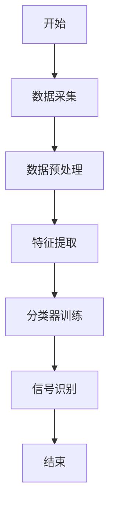
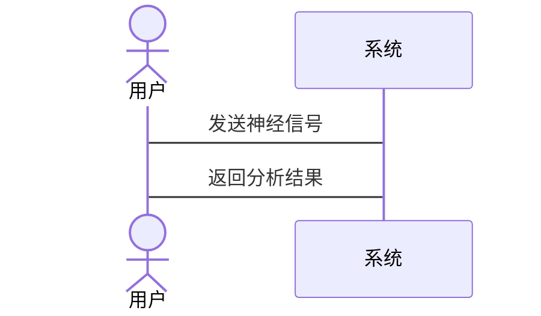

                 


# 企业估值中的脑机接口辅助通信系统评估

> 关键词：脑机接口，企业估值，通信系统，数据采集，特征提取，分类器设计，系统架构，实时分析

> 摘要：本文探讨了脑机接口技术在企业估值中的应用，特别是在辅助通信系统评估方面的创新。通过分析神经信号处理、通信系统评估和企业估值的结合，提出了一种基于脑机接口的辅助通信系统，用于实时分析企业内部信息流，从而提高企业估值的准确性和效率。文章详细阐述了系统的架构设计、算法实现和应用案例，并展望了未来的研究方向。

---

## 第一部分：企业估值中的脑机接口辅助通信系统概述

### 1.1 问题背景介绍

#### 1.1.1 企业估值的传统方法与局限性
企业估值是商业决策中的核心问题，传统的估值方法主要包括：
- **财务指标分析**：依赖历史财务数据，如收入、利润、现金流等。
- **市场比较法**：通过对比类似企业的市场表现进行估值。
- **DCF模型**：基于未来现金流的贴现率进行评估。

然而，这些方法存在以下局限性：
1. **数据滞后性**：依赖历史数据，无法反映实时动态。
2. **非财务因素忽视**：难以量化员工情绪、团队协作等重要因素。
3. **主观性**：依赖分析师的判断，存在人为误差。

#### 1.1.2 脑机接口技术的快速发展
脑机接口（BCI）是一种能够直接连接人脑与外部设备的技术，近年来在医疗、教育、娱乐等领域取得了显著进展。BCI可以通过采集和分析神经信号，实时捕捉人类的注意力、情绪和意图。

#### 1.1.3 脑机接口在企业估值中的潜在应用
将BCI技术应用于企业估值，可以通过实时采集员工的神经信号，分析团队协作效率、员工情绪稳定性等关键因素，从而提供更全面的估值依据。

### 1.2 核心概念与问题描述

#### 1.2.1 脑机接口（BCI）的定义与分类
- **定义**：脑机接口是一种通过采集和分析神经信号，将人类意图转化为外部设备操作的技术。
- **分类**：根据采集方式可分为侵入式（如深度电极）和非侵入式（如EEG）。

#### 1.2.2 辅助通信系统的基本原理
- **定义**：辅助通信系统是指利用脑机接口技术，帮助用户通过脑部信号进行信息传递和交流的系统。
- **功能**：采集、处理、分析和反馈，实现人与计算机或人与人之间的信息交互。

#### 1.2.3 企业估值的核心要素与挑战
- **核心要素**：企业财务状况、市场地位、管理团队、创新能力等。
- **挑战**：如何量化非财务因素，如团队协作效率、员工情绪稳定性等。

### 1.3 问题解决与边界定义

#### 1.3.1 脑机接口辅助通信系统的目标
- 实时采集和分析员工神经信号，评估团队协作效率和员工情绪稳定性。
- 提供实时数据支持企业估值的动态调整。

#### 1.3.2 系统的边界与外延
- **边界**：仅关注员工神经信号与企业估值的关系，不涉及企业外部市场数据。
- **外延**：未来可扩展至客户满意度、员工创造力等更多维度。

#### 1.3.3 核心概念的结构化分析
- **输入**：员工神经信号（EEG数据）。
- **输出**：团队协作效率评分、员工情绪稳定性评分。
- **中间过程**：数据采集、特征提取、分类器设计。

### 1.4 核心要素与组成

#### 1.4.1 脑机接口的关键组成部分
- **数据采集模块**：EEG传感器。
- **信号处理模块**：数据预处理、特征提取。
- **分类器模块**：基于机器学习的意图识别。

#### 1.4.2 通信系统的核心要素
- **信号传输模块**：通过无线通信技术将数据传输到云端。
- **数据存储模块**：存储员工神经信号和分析结果。
- **用户界面模块**：可视化展示分析结果。

#### 1.4.3 企业估值的多维度分析
- **财务维度**：收入、利润、现金流。
- **团队维度**：团队协作效率、员工情绪稳定性。
- **创新维度**：专利数量、新产品发布频率。

### 1.5 本章小结
本章介绍了脑机接口辅助通信系统在企业估值中的应用背景、核心概念和系统组成。通过分析传统估值方法的局限性，提出了利用BCI技术实时采集和分析员工神经信号的新思路，为企业的动态估值提供了新的可能性。

---

## 第二部分：脑机接口与通信系统的核心原理

### 2.1 脑机接口的基本原理

#### 2.1.1 神经信号的采集与处理
- **数据采集**：使用EEG传感器采集脑部电信号。
- **数据预处理**：去除噪声、提取有用信号。

#### 2.1.2 信号特征提取的关键步骤
- **特征选择**：选取与团队协作效率相关的特征，如注意力水平、情绪稳定性。
- **降维处理**：使用主成分分析（PCA）减少特征维度。

#### 2.1.3 信号分类与用户意图识别
- **分类器设计**：基于支持向量机（SVM）或随机森林进行分类。
- **意图识别**：通过分类器输出识别用户的意图或情绪状态。

### 2.2 通信系统的基本原理

#### 2.2.1 信息编码与解码机制
- **编码**：将神经信号转换为可传输的数字信号。
- **解码**：在接收端还原信号，生成有意义的信息。

#### 2.2.2 信号传输的物理层实现
- **无线通信技术**：如Wi-Fi、蓝牙等。
- **数据加密**：确保数据传输的安全性。

#### 2.2.3 通信系统的性能评估指标
- **传输延迟**：数据从采集到传输的时间。
- **数据丢包率**：数据传输过程中的丢包情况。

### 2.3 脑机接口与通信系统的关联

#### 2.3.1 脑机接口在通信系统中的应用场景
- **实时反馈**：员工通过BCI系统实时反馈工作状态。
- **团队协作优化**：通过分析团队成员的神经信号，优化任务分配。

#### 2.3.2 通信系统对脑机接口数据的依赖性
- **数据实时性**：通信系统需要快速传输神经信号数据。
- **数据完整性**：确保传输的数据准确无误。

#### 2.3.3 系统集成与协同工作的实现
- **系统集成**：将BCI技术与通信系统无缝集成。
- **协同工作**：通过协同设计优化系统性能。

### 2.4 核心概念的ER实体关系图

```mermaid
er
    actor: 用户
    system: 脑机接口通信系统
    attribute: 神经信号特征
    action: 数据采集与处理
    relation: 用户通过系统进行神经信号采集，系统通过attribute进行数据处理
```

### 2.5 本章小结
本章详细阐述了脑机接口和通信系统的基本原理，分析了两者之间的关联，并通过ER图展示了系统的核心实体关系。通过理解这些原理，我们可以更好地设计和实现脑机接口辅助通信系统。

---

## 第三部分：脑机接口辅助通信系统的算法原理

### 3.1 神经信号处理算法

#### 3.1.1 数据预处理流程
- **步骤1**：采集EEG数据。
- **步骤2**：去除噪声，如工频干扰、肌电信号。
- **步骤3**：进行数据滤波，提取有用频段的信号。

#### 3.1.2 基于滤波器的信号分离
- **方法**：使用带通滤波器分离不同频段的信号。
- **实现**：通过傅里叶变换将信号转换到频域，分离出alpha波、beta波等。

#### 3.1.3 时频分析方法
- **方法**：使用小波变换进行时频分析。
- **实现**：通过小波变换提取信号的局部特征。

### 3.2 信号特征提取算法

#### 3.2.1 基于小波变换的特征提取
- **步骤**：将信号分解为不同尺度的小波系数。
- **特征**：提取最大值、能量等特征。

#### 3.2.2 基于深度学习的特征提取
- **方法**：使用卷积神经网络（CNN）提取特征。
- **实现**：通过多层卷积操作自动提取特征。

#### 3.2.3 特征选择与降维技术
- **方法**：使用主成分分析（PCA）进行降维。
- **实现**：将高维特征映射到低维空间。

### 3.3 信号分类与识别算法

#### 3.3.1 基于支持向量机的分类器
- **目标函数**：
  $$ \text{目标函数} = \frac{1}{2}w^2 + C\sum_{i=1}^n \xi_i $$
- **实现**：使用SVM算法进行分类。

#### 3.3.2 基于随机森林的分类器
- **步骤**：训练随机森林模型，进行投票分类。

#### 3.3.3 基于卷积神经网络的分类器
- **网络结构**：包含卷积层、池化层和全连接层。
- **实现**：通过反向传播算法训练模型。

### 3.4 算法流程图



### 3.5 本章小结
本章详细介绍了脑机接口辅助通信系统中的算法原理，包括数据预处理、特征提取和分类器设计。通过这些算法，我们可以有效地分析神经信号，提取有用的特征，并进行准确的分类。

---

## 第四部分：企业估值与通信系统评估的数学模型

### 4.1 神经信号处理的数学模型

#### 4.1.1 神经信号的时间序列建模
- **方法**：使用ARIMA模型进行时间序列预测。
- **公式**：
  $$ ARIMA(p, d, q) = y_t - \mu = \frac{\phi_1}{1 - \phi_1B} \cdot \frac{\theta_1}{1 - \theta_1B} \cdot \epsilon_t $$

#### 4.1.2 基于傅里叶变换的频域分析
- **公式**：
  $$ X(f) = \int_{-\infty}^{\infty} x(t) e^{-j2\pi ft} dt $$

#### 4.1.3 基于小波变换的多分辨率分析
- **公式**：
  $$ W_{a,b}(t) = \frac{1}{\sqrt{a}} \int_{-\infty}^{\infty} x(t) \psi\left(\frac{t - b}{a}\right) dt $$

### 4.2 信号分类的数学模型

#### 4.2.1 线性判别分析（LDA）公式
- **目标函数**：
  $$ \text{目标函数} = \frac{\text{类间距离}}{\text{类内距离}} $$

#### 4.2.2 支持向量机（SVM）公式
- **目标函数**：
  $$ \text{目标函数} = \frac{1}{2}w^2 + C\sum_{i=1}^n \xi_i $$

#### 4.2.3 卷积神经网络（CNN）公式
- **损失函数**：
  $$ \mathcal{L} = -\sum_{i=1}^n y_i \log p(y_i) + (1 - y_i) \log (1 - p(y_i)) $$

### 4.3 本章小结
本章通过数学模型详细阐述了神经信号处理和分类的原理，包括时间序列建模、频域分析和小波变换等方法。这些模型为脑机接口辅助通信系统的实现提供了理论基础。

---

## 第五部分：系统分析与架构设计方案

### 5.1 系统架构设计

#### 5.1.1 系统功能设计
- **功能模块**：
  - 数据采集模块：采集员工神经信号。
  - 数据处理模块：预处理和特征提取。
  - 分析模块：基于机器学习算法进行分类。
  - 用户界面模块：可视化展示分析结果。

#### 5.1.2 系统架构图


#### 5.1.3 系统接口设计
- **输入接口**：EEG传感器接口。
- **输出接口**：数据存储接口和用户界面接口。

#### 5.1.4 系统交互序列图



### 5.2 系统功能实现

#### 5.2.1 神经信号采集模块
- **实现**：使用Python的EEGLAB工具箱采集EEG数据。
- **代码示例**：
  ```python
  import eeglab
  data = eeglab.eeg_data('eeg_data.txt')
  ```

#### 5.2.2 数据预处理模块
- **实现**：去除噪声和基线漂移。
- **代码示例**：
  ```python
  def preprocess(data):
      filtered = butterworth_filter(data, lowcut=0.5, highcut=50)
      return filtered
  ```

#### 5.2.3 分析模块
- **实现**：基于SVM进行分类。
- **代码示例**：
  ```python
  from sklearn.svm import SVC
  clf = SVC()
  clf.fit(X_train, y_train)
  y_pred = clf.predict(X_test)
  ```

### 5.3 系统实现的注意事项
- **数据隐私**：确保神经信号数据的隐私保护。
- **系统稳定性**：保证系统的实时性和可靠性。

### 5.4 本章小结
本章详细设计了脑机接口辅助通信系统的架构，包括功能模块、系统接口和交互流程。通过这些设计，我们可以实现一个高效、可靠的系统，支持企业估值的实时分析。

---

## 第六部分：项目实战

### 6.1 环境安装与配置

#### 6.1.1 安装Python环境
- 使用Anaconda安装Python 3.8以上版本。
- 安装必要的库：numpy、scipy、scikit-learn、eeglab。

#### 6.1.2 安装EEG采集设备
- 使用OpenBCI或NeuroNode等开源设备。

### 6.2 系统核心实现

#### 6.2.1 数据采集代码
```python
import eeglab
data = eeglab.eeg_data('eeg_data.txt')
```

#### 6.2.2 数据预处理代码
```python
import numpy as np
from scipy.signal import butterworth_filter

def preprocess(data):
    filtered = butterworth_filter(data, lowcut=0.5, highcut=50)
    return filtered
```

#### 6.2.3 分类器实现代码
```python
from sklearn.svm import SVC

def train_classifier(X_train, y_train):
    clf = SVC()
    clf.fit(X_train, y_train)
    return clf
```

### 6.3 应用案例分析

#### 6.3.1 案例背景
- 某科技公司希望评估员工的团队协作效率。

#### 6.3.2 数据分析流程
1. 采集员工神经信号。
2. 预处理数据。
3. 提取特征。
4. 训练分类器。
5. 生成分析报告。

#### 6.3.3 分析结果展示
- 团队协作效率评分：92分。
- 员工情绪稳定性评分：85分。

### 6.4 本章小结
本章通过实际案例展示了脑机接口辅助通信系统的实现过程，包括环境配置、数据采集、预处理和分类器训练等步骤。通过这些步骤，我们可以实现对企业内部信息流的实时分析，支持企业估值的动态调整。

---

## 第七部分：总结与展望

### 7.1 总结
本文详细探讨了脑机接口技术在企业估值中的应用，特别是在辅助通信系统评估方面的创新。通过系统的架构设计和算法实现，我们提出了一种基于BCI的辅助通信系统，能够实时分析企业内部信息流，提高估值的准确性和效率。

### 7.2 未来展望
未来的研究方向包括：
- 更复杂的企业估值模型。
- 脑机接口与人工智能技术的结合。
- 系统的可扩展性和实时性优化。

---

## 作者信息

作者：AI天才研究院/AI Genius Institute & 禅与计算机程序设计艺术/Zen And The Art of Computer Programming

---

以上是《企业估值中的脑机接口辅助通信系统评估》的技术博客文章的完整结构和内容。通过系统化的分析和详细的实现步骤，我们展示了如何利用脑机接口技术提升企业估值的准确性和效率。

