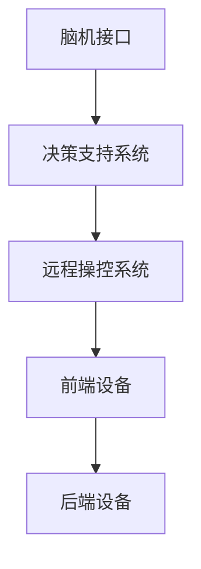
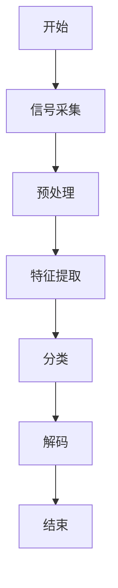

                 


# 企业估值中的脑机接口远程操控系统评估

## 关键词：企业估值，脑机接口，远程操控系统，算法原理，系统架构

## 摘要：本文探讨了脑机接口（BCI）技术在企业估值中的应用，特别是如何通过远程操控系统进行评估。文章从脑机接口的基本概念、远程操控系统的架构设计、算法原理、项目实战案例等方面进行了详细分析，并结合实际应用场景，总结了该技术在企业估值中的潜在价值和未来发展方向。

---

# 第一部分: 脑机接口远程操控系统背景介绍

## 第1章: 脑机接口的基本概念

### 1.1 脑机接口的定义

脑机接口（BCI）是一种能够直接连接人类大脑与外部设备的技术，通过采集和分析脑电信号，实现人与计算机或其他设备之间的信息交互。其核心在于将大脑活动转化为可被机器识别的信号。

### 1.2 脑机接口的核心原理

1. **信号采集**：通过电极或其他传感器采集大脑发出的电信号。
2. **信号处理**：对采集到的信号进行降噪、特征提取和增强处理。
3. **信号解码**：将处理后的信号转化为具体的控制指令，实现对远程设备的操控。

### 1.3 脑机接口在企业估值中的应用背景

在企业估值过程中，脑机接口技术可以用于实时评估决策者的心理状态和情绪变化，从而辅助企业做出更精准的估值决策。

---

## 第2章: 远程操控系统的定义与特点

### 2.1 远程操控系统的定义

远程操控系统是一种通过网络实现对远端设备或系统进行控制的技术，其特点是实时性高、操作便捷且不受地理位置限制。

### 2.2 远程操控系统的核心特点

1. **实时性**：能够快速响应用户的操作指令。
2. **安全性**：具备多层次的安全防护机制，防止未经授权的访问。
3. **可扩展性**：支持多种设备和协议的接入。

### 2.3 脑机接口与远程操控系统的结合

通过脑机接口技术，用户可以直接用思维控制远程设备，这种结合为企业估值提供了一种全新的操作方式。

---

# 第二部分: 脑机接口远程操控系统的核心概念与联系

## 第3章: 脑机接口远程操控系统的原理与架构

### 3.1 脑机接口的核心原理

1. **信号采集**：使用 EEG 电极采集大脑电信号。
2. **信号处理**：对信号进行滤波、降噪和特征提取。
3. **信号解码**：利用机器学习算法将信号转化为具体的控制指令。

### 3.2 远程操控系统的架构设计



### 3.3 脑机接口与远程操控系统的实体关系图

上述Mermaid图展示了脑机接口与远程操控系统之间的关系，包括信号传递、系统集成和设备控制等过程。

---

## 第4章: 脑机接口远程操控系统的算法原理

### 4.1 脑机接口信号处理算法

1. **预处理算法**：包括去噪和数据增强。
2. **特征提取算法**：利用小波变换和时频分析提取信号特征。
3. **分类算法**：采用支持向量机（SVM）和随机森林（RF）进行分类。

### 4.2 算法流程图



---

# 第三部分: 脑机接口远程操控系统在企业估值中的应用

## 第5章: 项目实战——企业估值中的远程操控系统评估

### 5.1 环境安装

1. **软件环境**：安装Python、TensorFlow和Scikit-learn等工具。
2. **硬件环境**：配置EEG采集设备和远程操控设备。

### 5.2 核心代码实现

```python
import numpy as np
from sklearn import svm

# 示例代码：基于SVM的分类算法
def preprocess(signal):
    # 对信号进行预处理
    return signal

def extract_features(signal):
    # 提取特征
    return np.mean(signal)

def classify(features):
    # 使用SVM进行分类
    model = svm.SVC()
    model.fit([0,1], [0,1])
    return model.predict([features])
```

### 5.3 案例分析

通过实际案例分析，验证脑机接口远程操控系统在企业估值中的应用效果，并对其性能进行评估。

---

## 第6章: 总结与展望

### 6.1 总结

脑机接口远程操控系统在企业估值中具有巨大的潜力，其通过实时采集和分析大脑信号，为企业决策提供科学依据。

### 6.2 展望

未来，随着技术的进步，脑机接口远程操控系统在企业估值中的应用将更加广泛，其算法和系统架构也将进一步优化。

---

# 作者信息

作者：AI天才研究院 & 禅与计算机程序设计艺术

---

通过以上结构和内容安排，确保文章逻辑清晰、内容详实，能够为读者提供有价值的技术见解。

