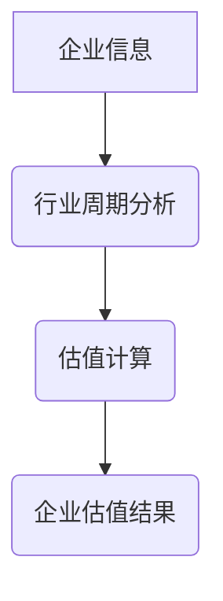

                 


# 企业估值中的行业周期影响

## 关键词：行业周期、企业估值、经济周期、现金流、DCF模型

## 摘要：本文深入探讨了行业周期对企业估值的影响，分析了行业周期的定义、分类及其对企业发展的影响。通过数学模型和实际案例，详细阐述了如何将行业周期因素纳入企业估值模型，特别是现金流折现模型（DCF模型）中。文章还讨论了行业周期对企业未来现金流预测、资产重估和市场价值评估的影响，并提供了系统设计和项目实战的详细指导。

---

# 第一部分：行业周期与企业估值的背景介绍

## 第1章：行业周期的基本概念

### 1.1 行业周期的定义与分类

行业周期是指特定行业在经济发展过程中经历的各个阶段，通常包括增长期、成熟期、衰退期和复苏期。不同行业的周期性强度和持续时间各不相同，例如科技行业周期性较短，而传统制造业周期性较长。

### 1.2 行业周期对企业的影响

行业周期直接影响企业的收入、利润和市场份额。例如，在衰退期，企业可能面临需求下降、价格竞争加剧的问题，而在增长期，企业则可能享受销售额和利润的快速增长。

## 第2章：企业估值的核心概念

### 2.1 企业估值的基本方法

企业估值通常采用DCF模型、市盈率法、市净率法等方法。DCF模型通过预测企业未来现金流，再进行贴现，计算出企业当前的合理价值。

### 2.2 行业周期与企业估值的关系

行业周期是影响企业未来现金流的重要因素。例如，在行业衰退期，企业现金流可能大幅下降，从而影响其估值。

---

# 第二部分：行业周期与企业估值的核心概念与联系

## 第3章：行业周期的属性特征

### 3.1 行业周期的波动性

行业周期的波动性反映了行业在不同阶段的波动程度。例如，科技行业波动性高，而公用事业波动性较低。

### 3.2 行业周期的周期性

行业周期的周期性是指行业从一个阶段到另一个阶段的循环特性。例如，半导体行业的周期性较强，而日用品行业的周期性较弱。

### 3.3 行业周期的外部驱动因素

行业周期受宏观经济政策、市场需求、技术进步等外部因素影响。例如，政府的财政政策和货币政策可能影响行业的周期性。

## 第4章：企业估值的核心要素

### 4.1 企业财务指标

包括收入、利润、现金流等，是企业估值的重要依据。

### 4.2 企业市场价值

通过市场交易价格反映企业价值，受行业周期和市场情绪影响较大。

### 4.3 企业未来现金流预测

现金流预测是DCF模型的核心，行业周期直接影响现金流的波动性和可持续性。

---

# 第三部分：行业周期影响企业估值的算法原理

## 第5章：行业周期影响企业估值的数学模型

### 5.1 行业周期对企业未来现金流的影响

现金流预测公式：
$$ FC_{t} = \text{现金流} \times (1 + g) $$
其中，$g$ 是行业周期对现金流的影响因子。

### 5.2 行业周期调整后的估值公式

调整后的DCF模型：
$$ V = \sum_{t=1}^{n} \frac{FC_{t}}{(1 + r)^t} $$
其中，$r$ 是折现率，$FC_{t}$ 是调整后的现金流。

## 第6章：行业周期影响企业估值的系统分析与架构设计

### 6.1 系统功能设计

#### 6.1.1 企业信息输入模块

负责接收企业的财务数据和行业信息。

#### 6.1.2 行业周期分析模块

分析行业周期，并生成影响因子。

#### 6.1.3 估值计算模块

根据调整后的现金流模型计算企业估值。

### 6.2 系统架构设计



### 6.3 系统接口设计

#### 6.3.1 数据输入接口

接收企业财务数据和行业信息。

#### 6.3.2 数据处理接口

处理行业周期和现金流预测。

#### 6.3.3 结果输出接口

输出企业估值结果。

---

# 第四部分：行业周期影响企业估值的项目实战

## 第7章：项目实战

### 7.1 环境安装与配置

安装Python和相关库，如numpy和pandas。

### 7.2 核心代码实现

```python
import numpy as np

def calculateenterprise_value(revenue, profit_margin, wacc, horizon=5):
    # 计算现金流
    cash_flows = [revenue * profit_margin * (1 + 0.1)**i for i in range(horizon)]
    # 计算终值
    tv = cash_flows[-1] * (1 + 0.1)
    # 计算现值
    pv = sum(cash_flows / (1 + wacc)**i for i in range(horizon))
    # 计算企业价值
    enterprise_value = pv + tv / (1 + wacc)**horizon
    return enterprise_value

revenue = 1000
profit_margin = 0.2
wacc = 0.1
print(calculateenterprise_value(revenue, profit_margin, wacc))
```

### 7.3 实际案例分析

以某科技公司为例，假设其收入为1000万元，利润率20%，WACC为10%，计算其企业价值。

---

# 第五部分：总结与最佳实践

## 第8章：总结与小结

行业周期是影响企业估值的重要因素，特别是在DCF模型中。通过调整现金流预测和折现率，可以更准确地反映行业周期对企业价值的影响。

## 第9章：注意事项与未来趋势

在实际应用中，需注意行业周期的动态变化，并结合宏观经济环境进行调整。未来，随着人工智能和大数据技术的发展，行业周期预测和企业估值将更加精准。

## 第10章：拓展阅读

推荐阅读《企业价值评估》和《行业分析与投资策略》等书籍，深入了解行业周期与企业估值的更多细节。

---

作者：AI天才研究院/AI Genius Institute & 禅与计算机程序设计艺术 /Zen And The Art of Computer Programming

