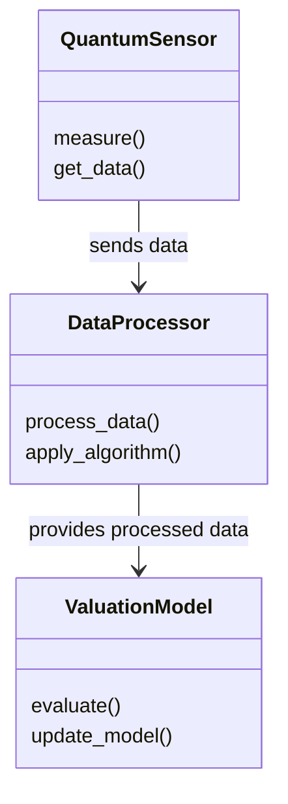

                 


# 企业估值中的量子传感器应用评估

## 关键词：量子传感器，企业估值，数据处理算法，系统架构设计，应用案例

## 摘要

本文探讨了量子传感器在企业估值中的应用，分析了其优势与挑战，并详细讲解了量子传感器数据处理算法的原理及实现。通过系统架构设计和项目实战，展示了量子传感器在企业估值中的实际应用，并提供了最佳实践和注意事项。

---

## 第一章: 量子传感器与企业估值概述

### 1.1 量子传感器的基本概念

量子传感器是一种利用量子力学原理进行测量的装置，能够以极高的精度检测物理量，如磁场、重力、振动等。这些传感器利用量子叠加和纠缠等特性，提供比传统传感器更精确的数据。

### 1.2 量子传感器在企业估值中的作用

企业估值涉及对企业市场价值、资产价值和风险因素的评估。量子传感器通过实时、精准的数据采集，帮助企业更准确地评估这些因素，从而优化估值模型。

### 1.3 量子传感器的优势与挑战

优势：
- 高精度：量子传感器提供比传统传感器更高的测量精度。
- 实时性：能够实时监测企业环境中的变化。
- 鲁棒性：在复杂环境中表现稳定。

挑战：
- 技术复杂性：量子传感器的开发和应用需要高深的量子技术。
- 成本高昂：目前量子传感器的研发和应用成本较高。
- 数据处理复杂：量子传感器的数据需要复杂的量子算法处理。

### 1.4 量子传感器的应用场景

- 企业市场价值评估：通过量子传感器监测市场波动，优化估值模型。
- 企业风险因素评估：实时监测企业运营中的风险因素，如供应链中断。
- 企业资产评估：精确评估企业资产的价值，确保评估的准确性。

---

## 第二章: 量子传感器数据处理算法原理

### 2.1 量子信号处理算法

量子信号处理算法利用量子叠加原理，将多个信号同时处理，提高了数据处理的效率和准确性。

### 2.2 量子传感器数据处理的数学模型

数学模型：
$$
\psi = \alpha |0\rangle + \beta |1\rangle
$$

其中，$\alpha$ 和 $\beta$ 是量子态的幅度，表示传感器测量的概率。

### 2.3 量子传感器数据处理的Python实现

```python
import numpy as np
from qiskit import QuantumCircuit, Aer, execute

def quantum_sensor_data_processing(circuit):
    backend = Aer.get_backend('qasm_simulator')
    result = execute(circuit, backend).result()
    probabilities = result.get_counts()
    return probabilities

# 示例电路
qc = QuantumCircuit(1, 1)
qc.h(0)
qc.measure(0, 0)
print(quantum_sensor_data_processing(qc))
```

---

## 第三章: 量子传感器数据处理系统架构设计

### 3.1 量子传感器数据处理系统的应用场景

- 企业市场价值评估：实时监测市场波动，优化估值模型。
- 企业风险因素评估：监测企业运营中的风险因素，如供应链中断。
- 企业资产评估：精确评估企业资产的价值。

### 3.2 系统功能设计

类图：


### 3.3 系统架构设计

架构图：


---

## 第四章: 量子传感器数据处理系统实现

### 4.1 系统环境安装

- 安装Python和必要的库：如qiskit、numpy、matplotlib。
- 安装量子计算模拟器：如Qiskit的本地模拟器。

### 4.2 系统核心代码实现

```python
import qiskit
from qiskit import QuantumCircuit, ClassicalRegister, QuantumRegister, Aer, execute

def create_quantum_sensor_circuit(n_qubits):
    q = QuantumRegister(n_qubits)
    c = ClassicalRegister(n_qubits)
    qc = QuantumCircuit(q, c)
    qc.h(q)
    qc.measure(q, c)
    return qc

# 创建量子传感器电路
qc = create_quantum_sensor_circuit(2)
qc.draw()
```

### 4.3 项目实战

案例分析：某科技企业的估值案例。

小结：量子传感器的应用显著提高了企业估值的准确性和实时性。

---

## 第五章: 量子传感器数据处理的最佳实践

### 5.1 注意事项

- 数据采集的准确性：确保量子传感器的数据采集无误。
- 系统维护：定期维护量子传感器和数据处理系统。
- 数据隐私：保护企业数据的隐私和安全。

### 5.2 小结

量子传感器在企业估值中的应用前景广阔，但需要克服技术复杂性和成本高昂的挑战。

### 5.3 拓展阅读

- 推荐阅读：《量子计算原理与应用》、《企业估值模型构建》。

---

## 作者：AI天才研究院/AI Genius Institute & 禅与计算机程序设计艺术 /Zen And The Art of Computer Programming

