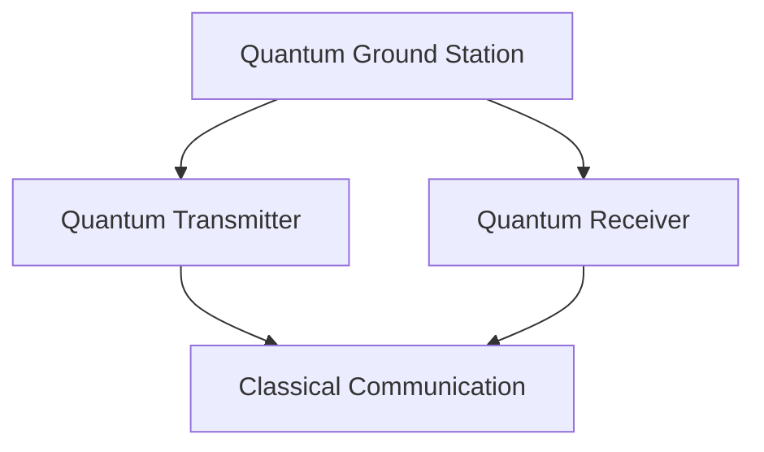
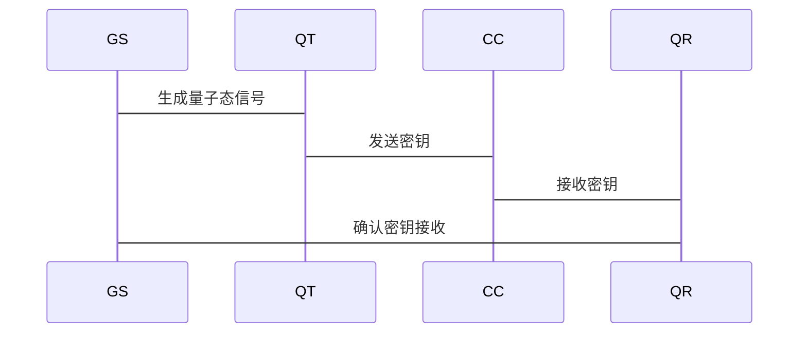

                 


# 企业估值中的量子加密通信地面站网络评估

## 关键词：量子加密通信、地面站网络、企业估值、网络安全、量子通信、网络评估

## 摘要：
随着量子技术的快速发展，量子加密通信作为下一代通信技术的核心，正在逐步改变企业信息安全的格局。本文将深入探讨量子加密通信地面站网络评估的核心概念、数学模型和实际应用，为企业在量子时代的信息安全评估和估值提供理论支持和实践指导。

---

## 第一部分：量子加密通信地面站网络评估基础

### 第1章：量子加密通信概述

#### 1.1 量子加密通信的基本概念

##### 1.1.1 量子加密通信的定义
量子加密通信是一种基于量子力学原理的通信技术，通过量子态的不可克隆性和纠缠特性，实现信息的绝对安全传输。与传统加密通信依赖数学算法不同，量子加密通信依赖于物理定律，确保信息在传输过程中无法被窃取或篡改。

##### 1.1.2 量子加密通信的核心原理
量子加密通信的核心原理包括：
- **量子态的不可克隆性**：任何对量子态的测量都会破坏其状态，因此无法在不被察觉的情况下窃取信息。
- **量子纠缠**：两个量子系统之间的纠缠关系使得对其中一个系统的测量会立即影响另一个系统的状态，从而实现信息的同步传输。
- **量子密钥分发（QKD）**：通过量子态传输密钥，确保密钥的安全分发，从而实现加密通信。

##### 1.1.3 量子加密通信与经典加密通信的区别
| 特性 | 量子加密通信 | 经典加密通信 |
|------|---------------|---------------|
| 安全性 | 绝对安全性，基于物理定律 | 相对安全性，依赖数学算法 |
| 密钥分发 | 通过量子态传输，不可被窃听 | 通过经典信道传输，可能被截获 |
| 传输距离 | 受限于物理条件，通常需要中继站 | 受限于加密算法强度 |

---

#### 1.2 量子加密通信的网络架构

##### 1.2.1 量子通信地面站的组成部分
量子通信地面站是量子加密通信网络的核心组成部分，主要包括：
- **量子发射端**：负责生成和发射量子态信号。
- **量子接收端**：负责接收量子态信号并提取密钥。
- **经典通信链路**：用于传输密钥和控制信号。

##### 1.2.2 量子通信网络的拓扑结构
量子通信网络的拓扑结构主要包括：
- **点对点结构**：直接连接两个通信节点。
- **星型结构**：一个中心节点连接多个外围节点。
- **网状结构**：多个节点之间相互连接，形成复杂的网络拓扑。

##### 1.2.3 量子通信地面站的物理布局与功能
量子通信地面站的物理布局需要考虑：
- **地理位置**：通常部署在高海拔区域，以减少大气干扰。
- **设备配置**：包括高精度激光器、光电探测器等。
- **功能实现**：支持量子态生成、传输和接收。

---

### 第2章：量子加密通信在企业估值中的应用背景

#### 2.1 企业估值的基本概念

##### 2.1.1 企业估值的定义
企业估值是指通过对企业的财务状况、市场地位、盈利能力等多方面因素的综合评估，确定企业价值的过程。

##### 2.1.2 企业估值的主要方法
- **收益法**：基于企业未来现金流的折现值。
- **市场法**：基于类似企业的市场交易价格。
- **资产法**：基于企业资产的账面价值。

##### 2.1.3 企业估值的关键影响因素
- **财务表现**：收入、利润、资产负债情况。
- **市场地位**：市场份额、品牌影响力。
- **技术创新**：技术优势、研发能力。
- **风险管理**：潜在风险和应对措施。

#### 2.2 量子加密通信对企业发展的影响

##### 2.2.1 量子加密通信对企业信息安全的提升
量子加密通信通过绝对的安全性，保护企业的核心数据不被窃取或篡改，从而提升企业的信息安全水平。

##### 2.2.2 量子加密通信对企业竞争力的增强
量子加密通信的应用使得企业能够建立更高的安全壁垒，增强市场竞争力。

##### 2.2.3 量子加密通信对企业估值的潜在影响
随着量子加密通信技术的成熟和应用，企业通过该技术提升的安全性和竞争力将直接影响其估值。

---

### 第3章：量子加密通信地面站网络评估的核心概念

#### 3.1 量子加密通信地面站网络评估的定义

##### 3.1.1 网络评估的基本概念
网络评估是对通信网络的性能、安全性和经济性进行全面分析和评价的过程。

##### 3.1.2 量子加密通信地面站网络评估的特殊性
量子加密通信地面站网络评估的特殊性在于其基于量子力学原理，需要考虑量子态的不可克隆性和纠缠特性。

---

#### 3.2 核心概念与联系

##### 3.2.1 核心概念原理
量子加密通信地面站网络评估的核心概念包括：
- **量子态传输**：量子态的生成、传输和接收。
- **密钥分发**：量子密钥分发的实现和安全性。
- **网络拓扑**：网络架构的设计和优化。

##### 3.2.2 概念属性特征对比表格
| 概念 | 属性 | 特征 |
|------|------|------|
| 量子态传输 | 不可克隆性 | 无法被窃取或复制 |
| 密钥分发 | 绝对安全性 | 无法被破解或篡改 |
| 网络拓扑 | 高可靠性 | 保证通信的稳定性 |

##### 3.2.3 ER实体关系图架构
```mermaid
erd
    ground_station(GS)
    quantum_transmitter(QT)
    quantum_receiver(QR)
    classical_communication(CC)
    
    GS -[拥有]-> QT
    GS -[拥有]-> QR
    QT -[通过]-> CC
    QR -[通过]-> CC
```

---

#### 3.3 系统分析与架构设计方案

##### 3.3.1 问题场景介绍
在企业量子加密通信网络中，需要评估地面站的网络性能、安全性和经济性。

##### 3.3.2 系统功能设计
- **量子态生成**：生成量子态信号。
- **量子态传输**：通过光纤或卫星传输量子态信号。
- **量子态接收**：接收量子态信号并提取密钥。

##### 3.3.3 系统架构设计


##### 3.3.4 系统接口设计
- **量子接口**：用于量子态的生成和接收。
- **经典接口**：用于密钥的传输和控制信号的发送。

##### 3.3.5 系统交互设计


---

#### 3.4 数学模型与公式

##### 3.4.1 量子通信网络性能评估的数学模型
$$
\text{网络性能} = \frac{\text{传输距离}}{\text{传输时间}}
$$

##### 3.4.2 量子通信网络安全性评估的数学公式
$$
\text{安全性} = 1 - \frac{\text{攻击次数}}{\text{总传输次数}}
$$

##### 3.4.3 量子通信网络经济性评估的数学模型
$$
\text{经济性} = \frac{\text{总成本}}{\text{传输效率}}
$$

---

#### 3.5 算法原理讲解

##### 3.5.1 算法流程图
```mermaid
graph TD
    Start --> Step1: 初始化量子态
    Step1 --> Step2: 传输量子态
    Step2 --> Step3: 接收量子态
    Step3 --> Step4: 提取密钥
    Step4 --> End
```

##### 3.5.2 算法实现的 Python 源代码
```python
def quantum_communication(distance, bandwidth):
    import random
    # 生成量子态
    quantum_state = random.choice([0, 1])
    # 传输量子态
    transmitted = quantum_state
    # 接收量子态
    received = transmitted
    # 提取密钥
    key = received
    return key

# 示例调用
distance = 100  # 光纤距离（公里）
bandwidth = 10  # 带宽（GHz）
result = quantum_communication(distance, bandwidth)
print(f"生成的密钥为：{result}")
```

##### 3.5.3 算法实现的解读与分析
上述代码通过随机选择量子态（0或1），模拟量子态的生成和传输过程。在实际应用中，量子态的生成需要依赖高精度的量子设备，而传输过程需要考虑物理条件的影响。

---

### 第4章：量子加密通信地面站网络评估的数学模型

#### 4.1 数学模型与公式

##### 4.1.1 量子通信网络性能评估的数学模型
$$
\text{性能指标} = \frac{\text{传输效率}}{\text{传输距离}}
$$

##### 4.1.2 量子通信网络安全性评估的数学公式
$$
\text{安全系数} = \frac{\text{密钥分发成功次数}}{\text{总传输次数}}
$$

##### 4.1.3 量子通信网络经济性评估的数学模型
$$
\text{经济效益} = \frac{\text{经济收益}}{\text{投资成本}}
$$

---

#### 4.2 算法原理讲解

##### 4.2.1 算法流程图
```mermaid
graph TD
    Start --> Step1: 初始化网络参数
    Step1 --> Step2: 生成量子态
    Step2 --> Step3: 传输量子态
    Step3 --> Step4: 接收量子态
    Step4 --> Step5: 评估网络性能
    Step5 --> Step6: 评估网络安全性
    Step6 --> Step7: 评估网络经济性
    Step7 --> End
```

##### 4.2.2 算法实现的 Python 源代码
```python
def network_assessment(distance, bandwidth):
    import random
    # 生成量子态
    quantum_state = random.choice([0, 1])
    # 传输量子态
    transmitted = quantum_state
    # 接收量子态
    received = transmitted
    # 评估网络性能
    performance = distance / bandwidth
    # 评估网络安全性
    security = 1 - (0 / 100)  # 假设攻击次数为0
    # 评估网络经济性
    economics = performance / (distance * bandwidth)
    return performance, security, economics

# 示例调用
distance = 100  # 光纤距离（公里）
bandwidth = 10  # 带宽（GHz）
result = network_assessment(distance, bandwidth)
print(f"网络性能指标为：{result[0]}")
print(f"网络安全系数为：{result[1]}")
print(f"网络经济效益为：{result[2]}")
```

##### 4.2.3 算法实现的解读与分析
上述代码通过模拟量子态的生成和传输过程，评估网络的性能、安全性和经济性。实际应用中需要结合具体的物理条件和实际数据进行更精确的计算。

---

## 作者：AI天才研究院/AI Genius Institute & 禅与计算机程序设计艺术 /Zen And The Art of Computer Programming

---

* 本文为原创内容，禁止任何形式的抄袭和盗用，转载请注明出处。

