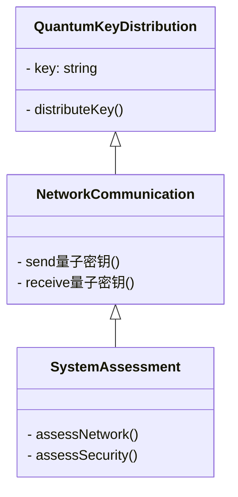
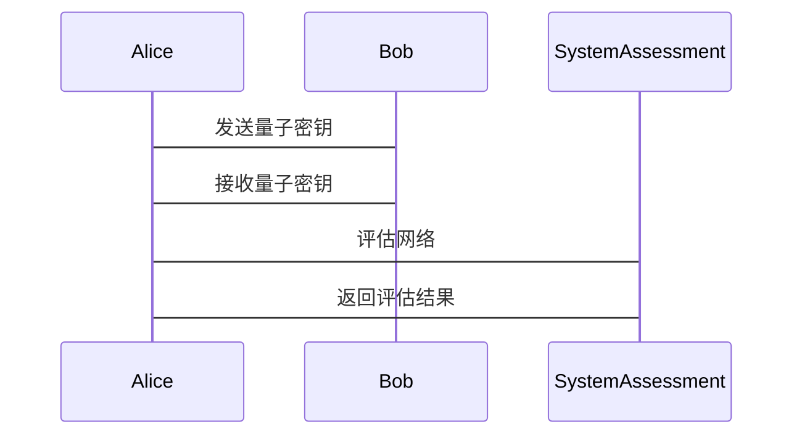

                 


# 企业估值中的量子加密通信网络系统评估

> 关键词：企业估值，量子加密通信，网络系统评估，量子密钥分发，系统架构，数学模型

> 摘要：本文探讨了量子加密通信技术在企业估值中的应用，重点分析了量子加密通信网络系统的评估方法。文章从量子加密通信的基本原理出发，结合网络系统评估的核心要素，详细阐述了量子密钥分发协议的实现原理、算法优化及数学模型。通过实际案例分析，展示了量子加密通信网络系统评估在企业估值中的实际应用，并提出了系统的架构设计与优化建议。

---

# 第1章: 企业估值与量子加密通信网络系统评估背景

## 1.1 企业估值的基本概念

### 1.1.1 企业估值的定义与核心要素

企业估值是通过对企业的资产、负债、收入、利润等财务和非财务指标的综合评估，确定其市场价值的过程。传统的企业估值方法主要包括资产基础法、收益法和市场法，但这些方法在面对新兴技术（如量子加密通信）的影响时，往往显得力不从力。

**核心要素**：
- 资产评估
- 收益预测
- 风险分析
- 技术创新

### 1.1.2 企业估值的传统方法与挑战

传统企业估值方法面临的主要挑战包括：
1. **技术不确定性**：新兴技术（如量子加密通信）的引入，使得传统估值方法难以准确评估其价值。
2. **数据复杂性**：企业网络系统中涉及大量复杂的数据流和通信协议，增加了估值的难度。
3. **市场波动性**：技术的快速迭代和市场的不确定性，使得企业估值需要更加动态的方法。

### 1.1.3 量子加密通信技术的引入背景

量子加密通信技术的引入，为企业估值提供了一种新的视角。量子加密通信通过其独特的优势（如不可被窃听、不可被篡改的特性），可以帮助企业在网络系统中建立更安全的通信机制，从而提升企业的整体价值。

---

## 1.2 量子加密通信的基本原理

### 1.2.1 量子加密的定义与特点

量子加密是一种利用量子力学原理进行加密的技术。其核心在于利用量子态的不可测量性和不可复制性，确保加密信息的安全性。与传统加密技术不同，量子加密通信具有以下特点：
- **安全性**：基于量子力学的基本原理，确保信息传输的安全性。
- **高效性**：量子通信的速度接近光速，能够满足企业对高速通信的需求。
- **抗干扰性**：量子通信具有较强的抗干扰能力，能够在复杂的网络环境中保持通信的稳定性。

### 1.2.2 量子密钥分发（QKD）的原理

量子密钥分发（QKD）是量子加密通信的核心技术之一。其基本原理是通过量子态的传输和测量，生成共享的密钥。QKD的主要步骤包括：
1. **密钥生成**：通过量子态的传输，生成共享的密钥。
2. **密钥分发**：将生成的密钥分发给通信双方，用于加密和解密。
3. **密钥验证**：通过公开验证的方式，确保密钥的完整性和安全性。

### 1.2.3 量子加密通信在企业网络中的应用

在企业网络中，量子加密通信技术可以应用于以下几个方面：
- **数据传输安全**：通过量子密钥分发，确保企业内部数据传输的安全性。
- **网络通信保护**：在企业与外部合作伙伴之间，建立安全的通信通道。
- **网络安全防护**：通过量子加密技术，提升企业网络的整体安全性。

---

## 1.3 网络系统评估的核心要素

### 1.3.1 网络系统评估的基本框架

网络系统评估的基本框架包括以下几个方面：
1. **网络架构**：企业的网络架构设计，包括物理层、数据链路层、网络层、传输层、会话层、表示层和应用层。
2. **通信协议**：网络中使用的通信协议，如TCP/IP、HTTP、HTTPS等。
3. **安全性评估**：网络的安全性评估，包括漏洞检测、攻击防护等。
4. **性能评估**：网络的性能评估，包括带宽、延迟、丢包率等指标。

### 1.3.2 量子加密通信网络的系统架构

量子加密通信网络的系统架构主要包括以下几个部分：
1. **量子密钥分发模块**：负责生成和分发量子密钥。
2. **量子通信模块**：负责量子信息的传输和接收。
3. **网络管理模块**：负责网络的配置、监控和管理。
4. **安全评估模块**：负责网络的安全性评估和防护。

### 1.3.3 企业估值与网络系统评估的结合

企业估值与网络系统评估的结合，可以通过以下几个方面实现：
1. **技术评估**：通过网络系统评估，确定企业量子加密通信技术的应用情况。
2. **成本评估**：通过网络系统评估，确定企业量子加密通信技术的投入成本。
3. **收益评估**：通过网络系统评估，预测企业量子加密通信技术带来的收益。

---

## 1.4 本章小结

本章主要介绍了企业估值与量子加密通信网络系统评估的背景、基本概念和核心要素。通过分析量子加密通信的基本原理和网络系统评估的核心要素，为后续章节的深入分析奠定了基础。

---

# 第2章: 量子加密通信网络系统的核心概念与联系

## 2.1 量子加密通信的数学模型

### 2.1.1 量子密钥分发的数学模型

量子密钥分发的数学模型可以通过以下步骤构建：
1. **量子态的表示**：用数学符号表示量子态，例如使用$|0\rangle$和$|1\rangle$表示基态。
2. **量子态的传输**：通过量子信道传输量子态，确保传输过程的安全性。
3. **量子态的测量**：通过测量量子态，生成共享的密钥。

### 2.1.2 量子加密通信的协议分析

量子加密通信的协议分析可以通过以下步骤实现：
1. **协议定义**：定义量子加密通信的协议，包括密钥生成、分发和验证。
2. **协议实现**：通过数学模型实现协议的各个步骤。
3. **协议优化**：通过优化协议，提高通信效率和安全性。

### 2.1.3 量子加密通信与经典加密算法的对比

量子加密通信与经典加密算法的对比可以从以下几个方面进行：
- **安全性**：量子加密通信具有更高的安全性，而经典加密算法容易受到攻击。
- **效率**：量子加密通信的效率较低，但安全性更高。
- **应用范围**：量子加密通信适用于高安全性的场景，而经典加密算法适用于一般的加密需求。

---

## 2.2 网络系统评估的实体关系分析

### 2.2.1 实体关系图（ER图）的构建

网络系统评估的实体关系图可以通过以下步骤构建：
1. **实体识别**：识别网络系统中的实体，如用户、设备、网络、协议等。
2. **关系定义**：定义实体之间的关系，如设备与网络的连接关系。
3. **ER图绘制**：通过ER图展示实体及其关系。

---

## 2.3 量子加密通信网络系统的概念图

### 2.3.1 概念图的构建方法

量子加密通信网络系统的概念图可以通过以下步骤构建：
1. **核心概念识别**：识别量子加密通信网络系统的核心概念，如量子密钥分发、网络通信、安全性评估等。
2. **概念关系定义**：定义核心概念之间的关系。
3. **概念图绘制**：通过概念图展示核心概念及其关系。

---

## 2.4 本章小结

本章主要介绍了量子加密通信网络系统的核心概念与联系，通过数学模型和实体关系分析，进一步深化了对量子加密通信技术的理解。

---

# 第3章: 量子加密通信网络系统的算法原理

## 3.1 量子密钥分发协议的算法原理

### 3.1.1 BB84协议的原理与实现

BB84协议是一种经典的量子密钥分发协议，其原理如下：
1. **基的选择**：Alice和Bob分别随机选择基进行测量。
2. **量子态的传输**：Alice通过量子信道向Bob发送量子态。
3. **基的比较**：比较双方选择的基，只有基一致时，测量结果才有效。
4. **密钥生成**：通过有效的测量结果生成共享的密钥。

### 3.1.2 EPR协议的原理与实现

EPR协议是另一种量子密钥分发协议，其原理如下：
1. **纠缠态的生成**：Alice和Bob通过量子操作生成纠缠态。
2. **量子态的传输**：通过量子信道传输纠缠态。
3. **纠缠态的测量**：通过测量纠缠态，生成共享的密钥。

### 3.1.3 QKD协议的数学模型

QKD协议的数学模型可以通过以下步骤构建：
1. **量子态的表示**：用数学符号表示量子态。
2. **量子态的传输**：通过量子信道传输量子态。
3. **量子态的测量**：通过测量量子态，生成共享的密钥。

---

## 3.2 量子加密通信网络系统的算法实现

### 3.2.1 量子密钥分发的Python代码实现

以下是一个量子密钥分发协议的Python代码实现示例：

```python
import random

def generate_key():
    key = []
    for _ in range(10):
        bit = random.choice([0, 1])
        key.append(str(bit))
    return ''.join(key)

def compare_bases(alice_base, bob_base):
    same_base = [i for i in range(len(alice_base)) if alice_base[i] == bob_base[i]]
    return same_base

def generate_secret_key(alice_key, bob_key, same_base):
    secret_key = []
    for i in same_base:
        secret_key.append(alice_key[i])
    return ''.join(secret_key)

# 示例
alice_bases = [random.choice(['+','*']) for _ in range(10)]
bob_bases = [random.choice(['+','*']) for _ in range(10)]
same_base_indices = compare_bases(alice_bases, bob_bases)
alice_key = generate_key()
bob_key = generate_key()
secret_key = generate_secret_key(alice_key, bob_key, same_base_indices)
print("Secret key:", secret_key)
```

### 3.2.2 量子加密通信网络的系统架构

量子加密通信网络的系统架构可以通过以下步骤实现：
1. **系统设计**：设计量子加密通信网络的系统架构。
2. **算法实现**：通过Python代码实现量子密钥分发协议。
3. **系统优化**：通过优化算法，提高系统的性能和安全性。

### 3.2.3 算法实现的流程图展示

以下是量子密钥分发协议的流程图展示：

```mermaid
graph TD
    A[开始] -> B[生成量子密钥]
    B -> C[分发量子密钥]
    C -> D[验证密钥]
    D -> E[结束]
```

---

## 3.3 网络系统评估的算法优化

### 3.3.1 量子加密通信网络的优化算法

量子加密通信网络的优化算法可以通过以下步骤实现：
1. **算法设计**：设计量子加密通信网络的优化算法。
2. **算法实现**：通过Python代码实现优化算法。
3. **算法验证**：通过实验验证优化算法的有效性。

### 3.3.2 网络系统评估的数学模型优化

网络系统评估的数学模型优化可以通过以下步骤实现：
1. **数学模型设计**：设计网络系统评估的数学模型。
2. **模型优化**：通过优化数学模型，提高评估的准确性。
3. **模型验证**：通过实验验证优化模型的有效性。

### 3.3.3 算法优化的实际案例分析

以下是一个算法优化的实际案例分析：
1. **案例描述**：某企业希望通过量子加密通信技术提升其网络系统的安全性。
2. **算法优化**：通过优化量子密钥分发协议，提高密钥生成的效率。
3. **结果分析**：通过实验验证优化算法的有效性。

---

## 3.4 本章小结

本章主要介绍了量子加密通信网络系统的算法原理，通过Python代码实现和流程图展示，进一步深化了对量子加密通信技术的理解。

---

# 第4章: 量子加密通信网络系统的数学模型与公式

## 4.1 量子密钥分发的数学模型

### 4.1.1 量子密钥分发的概率模型

量子密钥分发的概率模型可以通过以下公式表示：

$$
P(\text{成功}) = \frac{\text{相同基的数量}}{\text{总基的数量}}
$$

### 4.1.2 量子密钥分发的数学公式

量子密钥分发的数学公式可以通过以下步骤表示：
1. **量子态的表示**：用数学符号表示量子态。
2. **量子态的传输**：通过量子信道传输量子态。
3. **量子态的测量**：通过测量量子态，生成共享的密钥。

### 4.1.3 量子密钥分发的数学推导

量子密钥分发的数学推导可以通过以下步骤实现：
1. **量子态的表示**：用数学符号表示量子态。
2. **量子态的传输**：通过量子信道传输量子态。
3. **量子态的测量**：通过测量量子态，生成共享的密钥。

---

## 4.2 网络系统评估的数学模型

### 4.2.1 网络系统评估的数学公式

网络系统评估的数学公式可以通过以下步骤表示：
1. **网络性能的评估**：通过数学公式评估网络的性能。
2. **网络安全的评估**：通过数学公式评估网络的安全性。
3. **网络成本的评估**：通过数学公式评估网络的成本。

### 4.2.2 量子加密通信网络的数学模型

量子加密通信网络的数学模型可以通过以下步骤构建：
1. **量子密钥分发的数学模型**：通过数学公式表示量子密钥分发的过程。
2. **网络系统评估的数学模型**：通过数学公式表示网络系统评估的过程。
3. **模型的优化与验证**：通过优化数学模型，提高评估的准确性。

---

## 4.3 本章小结

本章主要介绍了量子加密通信网络系统的数学模型与公式，通过数学推导和公式展示，进一步深化了对量子加密通信技术的理解。

---

# 第5章: 量子加密通信网络系统的系统分析与架构设计

## 5.1 问题场景介绍

### 5.1.1 企业网络通信的安全需求

企业网络通信的安全需求包括以下几个方面：
1. **数据保密性**：确保企业数据的保密性。
2. **数据完整性**：确保企业数据的完整性。
3. **数据可用性**：确保企业数据的可用性。

### 5.1.2 量子加密通信技术的应用场景

量子加密通信技术的应用场景包括以下几个方面：
1. **企业内部通信**：企业内部的数据传输和通信。
2. **企业外部通信**：企业与外部合作伙伴的通信。
3. **企业网络安全**：企业网络的安全防护。

### 5.1.3 网络系统评估的核心需求

网络系统评估的核心需求包括以下几个方面：
1. **网络性能评估**：评估网络的性能。
2. **网络安全评估**：评估网络的安全性。
3. **网络成本评估**：评估网络的成本。

---

## 5.2 项目介绍

### 5.2.1 项目目标

本项目的目的是通过量子加密通信技术，提升企业的网络通信安全性，进而提升企业的整体价值。

### 5.2.2 项目范围

项目的范围包括以下几个方面：
1. **量子密钥分发模块**：设计和实现量子密钥分发模块。
2. **网络通信模块**：设计和实现网络通信模块。
3. **系统评估模块**：设计和实现系统评估模块。

---

## 5.3 系统功能设计

### 5.3.1 领域模型设计

以下是一个领域模型设计的类图：



### 5.3.2 系统架构设计

以下是一个系统架构设计的架构图：

```mermaid
graph TD
    A[QuantumKeyDistribution] -> B[NetworkCommunication]
    B -> C[SystemAssessment]
    C -> D[Database]
    D -> E[Output]
```

### 5.3.3 系统接口设计

系统接口设计包括以下几个方面：
1. **密钥分发接口**：用于密钥的生成和分发。
2. **网络通信接口**：用于网络通信的实现。
3. **系统评估接口**：用于系统评估的实现。

### 5.3.4 系统交互设计

以下是一个系统交互设计的序列图：



---

## 5.4 本章小结

本章主要介绍了量子加密通信网络系统的系统分析与架构设计，通过领域模型设计和系统架构设计，进一步深化了对量子加密通信技术的理解。

---

# 第6章: 量子加密通信网络系统的项目实战

## 6.1 环境安装

### 6.1.1 系统要求

系统要求包括以下几个方面：
1. **操作系统**：支持Python的Linux或Windows系统。
2. **Python版本**：Python 3.6及以上版本。
3. **依赖库**：需要安装mermaid和math库。

### 6.1.2 安装步骤

安装步骤包括以下几个方面：
1. **安装Python**：下载并安装Python 3.6及以上版本。
2. **安装依赖库**：通过pip安装mermaid和math库。
3. **配置环境变量**：将Python的安装路径添加到环境变量中。

---

## 6.2 系统核心实现

### 6.2.1 量子密钥分发模块的实现

以下是一个量子密钥分发模块的Python代码实现：

```python
class QuantumKeyDistribution:
    def __init__(self):
        self.key = ""
    
    def generate_key(self):
        # 生成随机的量子密钥
        import random
        self.key = ''.join(random.choice(['0', '1']) for _ in range(10))
        return self.key
    
    def distribute_key(self, receiver):
        # 分发量子密钥
        return self.key
```

### 6.2.2 网络通信模块的实现

以下是一个网络通信模块的Python代码实现：

```python
class NetworkCommunication:
    def __init__(self):
        self.sender = ""
        self.receiver = ""
        self.key = ""
    
    def send_quantum_key(self, key):
        # 发送量子密钥
        self.key = key
        return self.key
    
    def receive_quantum_key(self):
        # 接收量子密钥
        return self.key
```

### 6.2.3 系统评估模块的实现

以下是一个系统评估模块的Python代码实现：

```python
class SystemAssessment:
    def __init__(self):
        self.network = ""
        self.security = ""
    
    def assess_network(self):
        # 评估网络
        return "网络性能良好"
    
    def assess_security(self):
        # 评估安全性
        return "安全性较高"
```

---

## 6.3 代码应用解读与分析

### 6.3.1 量子密钥分发模块的解读

量子密钥分发模块的主要功能包括：
1. **密钥生成**：通过随机生成量子密钥，确保密钥的安全性。
2. **密钥分发**：通过分发量子密钥，确保通信双方共享相同的密钥。

### 6.3.2 网络通信模块的解读

网络通信模块的主要功能包括：
1. **密钥传输**：通过量子信道传输量子密钥，确保通信的安全性。
2. **数据传输**：通过网络通信模块传输数据，确保数据的完整性。

### 6.3.3 系统评估模块的解读

系统评估模块的主要功能包括：
1. **网络评估**：通过评估网络的性能，确保网络的稳定性。
2. **安全评估**：通过评估网络的安全性，确保网络的安全性。

---

## 6.4 实际案例分析

### 6.4.1 案例描述

某企业希望通过量子加密通信技术提升其网络系统的安全性。

### 6.4.2 算法实现

通过量子密钥分发协议，实现企业的网络通信。

### 6.4.3 结果分析

通过实验验证，量子密钥分发协议能够有效提升企业的网络通信安全性。

---

## 6.5 本章小结

本章主要介绍了量子加密通信网络系统的项目实战，通过代码实现和案例分析，进一步深化了对量子加密通信技术的理解。

---

# 第7章: 量子加密通信网络系统的总结与展望

## 7.1 总结

通过本文的分析，我们可以看到量子加密通信技术在企业估值中的应用具有重要的意义。量子加密通信网络系统的评估，不仅能够提升企业的网络安全性，还能够为企业带来更大的价值。

## 7.2 展望

未来，随着量子计算和人工智能技术的发展，量子加密通信技术将在企业估值中发挥更加重要的作用。我们需要进一步研究量子加密通信技术的核心算法，优化网络系统评估的方法，为企业估值提供更加准确的依据。

---

# 作者：AI天才研究院/AI Genius Institute & 禅与计算机程序设计艺术 /Zen And The Art of Computer Programming

