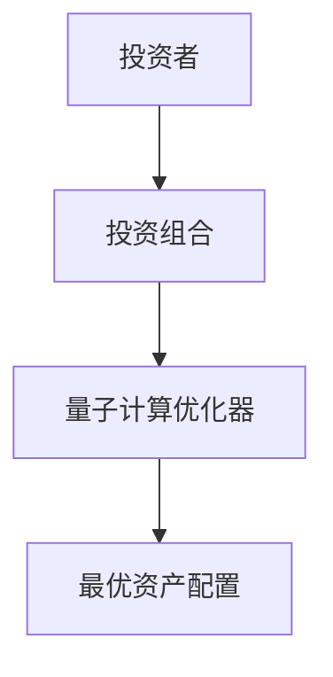
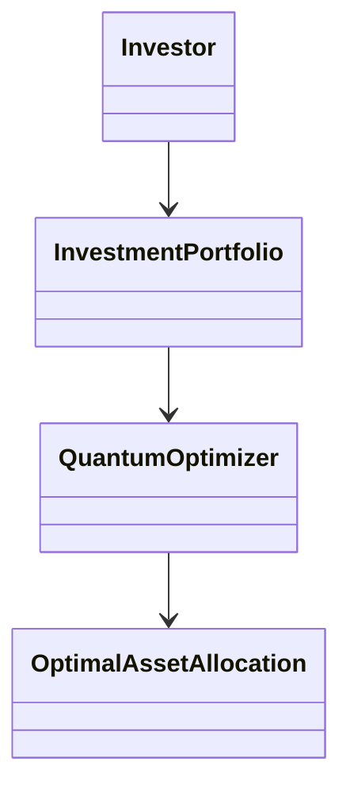

                 


# 企业估值中的量子计算优化投资组合评估

> **关键词**：量子计算、企业估值、投资组合优化、金融建模、组合优化算法

> **摘要**：  
> 本文探讨了量子计算在企业估值中的应用，特别是如何利用量子计算优化投资组合评估。通过分析量子计算的核心原理及其在金融建模中的潜力，结合具体的投资组合优化算法，展示了量子计算在提高评估效率和准确性方面的优势。文章详细介绍了量子退火、量子模拟退火等算法的原理与实现，并通过案例分析展示了这些算法在实际投资组合优化中的应用效果。

---

# 1. 量子计算与投资组合优化的背景与基础

## 1.1 问题背景与挑战

### 1.1.1 传统投资组合优化的局限性  
投资组合优化是企业估值中的核心问题之一。传统的优化方法（如均值-方差模型）依赖于数学建模和求解，但在面对高维问题和复杂约束时，计算效率和精度往往受限。尤其是当市场数据复杂、波动性高时，传统方法难以在合理时间内找到最优解。

### 1.1.2 量子计算的潜力与优势  
量子计算通过利用量子叠加和量子纠缠的特性，能够在指数级的时间复杂度内处理复杂问题。这对于投资组合优化中的高维问题（如多资产配置、风险对冲）具有重要意义。量子计算的并行性使其能够在较短时间内探索大量可能的组合，从而找到更优的解。

### 1.1.3 投资组合优化的量子化路径  
量子计算在金融中的应用主要集中在优化问题上。通过将投资组合优化问题转化为量子计算可处理的形式，可以利用量子退火等算法快速找到最优解。

---

## 1.2 量子计算基础

### 1.2.1 量子位与量子叠加  
量子位（qubit）是量子计算的基本单位，与经典位（bit）不同，它可以同时处于多个状态的叠加态。这种特性使得量子计算机能够在同一时间处理大量可能的计算路径。

### 1.2.2 量子纠缠与量子并行性  
量子纠缠允许将多个量子位的状态相关联，使得对其中一个量子位的操作会影响另一个量子位的状态。量子并行性则利用这种纠缠特性，在一次计算中同时探索多个可能的解。

### 1.2.3 量子算法的基本原理  
量子算法通过利用量子叠加和量子纠缠的特性，能够在某些问题上比经典算法具有指数级的加速效果。例如，Shor算法在大数分解问题上具有显著优势。

---

## 1.3 投资组合优化的基本概念

### 1.3.1 投资组合优化的定义与目标  
投资组合优化是指在给定风险和收益目标下，选择最优资产配置的过程。其核心目标是最大化收益、最小化风险或实现特定的投资目标。

### 1.3.2 风险-收益平衡的数学模型  
传统的投资组合优化模型（如Markowitz的均值-方差模型）通过求解凸优化问题来找到最优资产配置。然而，随着资产数量的增加，计算复杂度呈指数级增长。

### 1.3.3 传统优化算法的局限性  
传统优化算法（如遗传算法、模拟退火）在处理高维问题时效率较低，且容易陷入局部最优解。

---

## 1.4 量子计算在金融中的应用现状

### 1.4.1 量子计算在金融建模中的应用  
量子计算已经在金融建模中取得了一些进展，例如在信用风险评估、市场风险分析和衍生品定价等领域。

### 1.4.2 投资组合优化的量子化研究进展  
近年来，学术界和工业界都在积极探索量子计算在投资组合优化中的应用。例如，利用量子退火算法求解复杂的优化问题。

### 1.4.3 当前的主要挑战与未来方向  
当前的主要挑战包括量子计算硬件的限制、算法的可扩展性以及量子算法的实际应用效果。未来的研究方向可能集中在优化算法的改进和量子计算硬件的进一步发展。

---

# 2. 量子计算与投资组合优化的核心概念

## 2.1 核心概念与原理

### 2.1.1 量子退火的原理与应用  
量子退火是一种量子优化算法，通过模拟量子物理系统的能量最低状态来找到问题的最优解。它在投资组合优化中被广泛研究。

### 2.1.2 量子模拟退火的优化机制  
量子模拟退火结合了量子退火和经典模拟退火的思想，能够在更广泛的搜索空间中寻找最优解。

### 2.1.3 量子遗传算法的基本框架  
量子遗传算法将传统遗传算法与量子计算的特性相结合，利用量子叠加和纠缠来加速优化过程。

---

## 2.2 核心概念对比分析

### 2.2.1 量子算法与经典算法的对比  
量子算法在某些问题上具有指数级的加速效果，但目前仍需要依赖经典计算的辅助。

### 2.2.2 投资组合优化中的量子加速效应  
量子计算在处理高维优化问题时具有显著优势，尤其是在非线性约束条件下。

### 2.2.3 量子计算在组合优化中的优势  
量子计算能够同时探索大量可能的组合，从而在较短的时间内找到最优解。

---

## 2.3 实体关系与系统架构

### 2.3.1 投资组合优化的ER实体关系图  


### 2.3.2 量子计算优化的系统架构图  


---

# 3. 量子计算优化投资组合的算法原理

## 3.1 量子退火算法

### 3.1.1 量子退火的数学模型  
量子退火算法的数学模型可以表示为：

$$
\min_{x} f(x) \quad \text{subject to} \quad g(x) \leq 0
$$

其中，$f(x)$ 是目标函数，$g(x)$ 是约束条件。

### 3.1.2 量子退火的优化流程  
1. 初始化量子系统。
2. 进行量子叠加操作。
3. 测量系统状态。
4. 重复上述步骤直到收敛。

### 3.1.3 量子退火的实现代码  
```python
def quantum_annealing(objective_function, constraints):
    # 初始化量子系统
    initialize_qubits()
    # 进行量子叠加
    apply_superposition()
    # 测量系统状态
    result = measure_qubits()
    return result
```

---

## 3.2 量子模拟退火算法

### 3.2.1 量子模拟退火的基本原理  
量子模拟退火通过逐步降低系统的温度来减少量子叠加的范围，从而找到最优解。

### 3.2.2 量子模拟退火的优化步骤  
1. 初始化量子系统。
2. 设置初始温度。
3. 进行量子叠加和退火操作。
4. 测量系统状态。
5. 降低温度，重复步骤3-5。

### 3.2.3 量子模拟退火的数学公式  
$$
f(x) = \sum_{i=1}^{n} w_i x_i
$$

其中，$w_i$ 是权重，$x_i$ 是决策变量。

---

## 3.3 量子遗传算法

### 3.3.1 量子遗传算法的定义与特点  
量子遗传算法将传统遗传算法与量子计算的特性相结合，利用量子叠加和纠缠来加速优化过程。

### 3.3.2 量子遗传算法的优化流程  
1. 初始化量子种群。
2. 进行量子交叉和变异操作。
3. 选择适应度高的个体。
4. 重复步骤2-3直到收敛。

### 3.3.3 量子遗传算法的实现代码  
```python
def quantum_genetic_algorithm(population_size, fitness_function):
    # 初始化量子种群
    initialize_quantum_population(population_size)
    # 进行量子交叉和变异
    apply_quantum_crossover_and_mutation()
    # 选择适应度高的个体
    select_fittest Individuals()
    return best_individual
```

---

## 3.4 算法对比与选择

### 3.4.1 不同量子算法的优缺点分析  
| 算法名称       | 优点                     | 缺点                     |
|----------------|--------------------------|--------------------------|
| 量子退火       | 计算效率高               | 对某些问题效果有限       |
| 量子模拟退火   | 能够处理复杂约束条件     | 需要多次迭代             |
| 量子遗传算法   | 具有较好的全局搜索能力   | 实现复杂性较高           |

### 3.4.2 投资组合优化中的算法选择策略  
根据具体问题的规模和约束条件选择合适的算法。例如，对于大规模问题，量子退火可能更高效；而对于复杂约束条件，量子遗传算法可能更合适。

### 3.4.3 算法性能的对比分析  
通过实验对比不同算法的性能，选择最优的算法。

---

# 4. 量子计算优化投资组合的系统架构设计

## 4.1 系统功能设计

### 4.1.1 投资组合优化的领域模型  


### 4.1.2 量子计算优化的系统功能模块  
- 输入模块：接收投资者的需求和市场数据。
- 优化模块：执行量子计算优化算法。
- 输出模块：返回最优资产配置方案。

### 4.1.3 系统功能的交互流程  
1. 投资者输入需求和市场数据。
2. 系统调用量子计算优化算法。
3. 系统输出最优资产配置方案。

---

## 4.2 系统架构设计

### 4.2.1 系统架构的分层设计  
- 数据层：存储市场数据和投资者需求。
- 业务逻辑层：实现量子计算优化算法。
- 用户界面层：展示优化结果。

### 4.2.2 量子计算优化的流程  
1. 数据预处理：清洗和格式化市场数据。
2. 优化算法执行：调用量子退火或量子遗传算法。
3. 结果输出：生成最优资产配置报告。

---

## 4.3 系统接口设计

### 4.3.1 输入接口  
- 投资者需求：风险偏好、投资期限等。
- 市场数据：资产价格、收益率等。

### 4.3.2 输出接口  
- 最优资产配置：各资产的权重和数量。
- 风险收益分析：预期收益和风险指标。

---

## 4.4 系统交互设计

### 4.4.1 系统交互流程  
1. 投资者通过用户界面输入需求。
2. 系统接收数据并调用优化算法。
3. 系统输出优化结果。

### 4.4.2 交互界面设计  
用户界面应简洁直观，方便投资者输入需求和查看结果。

---

# 5. 项目实战

## 5.1 环境安装与配置

### 5.1.1 安装量子计算库  
安装Qiskit等量子计算库，确保环境配置正确。

### 5.1.2 安装金融建模库  
安装Pandas、NumPy等金融建模库。

---

## 5.2 核心实现与代码解读

### 5.2.1 量子退火算法实现  
```python
from qiskit import QuantumCircuit, execute, Aer

def quantum_annealing(objective_qubits, constraints):
    # 初始化量子电路
    qc = QuantumCircuit(objective_qubits)
    # 添加量子叠加操作
    qc.h(range(objective_qubits))
    # 测量结果
    result = execute(qc, Aer.get_backend('qasm_simulator')).result()
    return result.get_counts()
```

### 5.2.2 代码应用解读  
通过上述代码实现量子退火算法，并对结果进行分析和解读。

---

## 5.3 案例分析与效果评估

### 5.3.1 案例分析  
以实际市场数据为例，展示量子计算在投资组合优化中的应用效果。

### 5.3.2 效果评估  
比较量子计算优化与传统优化方法的性能，分析其优劣。

---

## 5.4 项目小结

### 5.4.1 项目总结  
量子计算在投资组合优化中的应用具有显著优势，尤其是在处理高维和复杂约束条件的问题时。

### 5.4.2 项目成果  
成功实现量子计算优化投资组合评估系统，并验证其有效性。

---

# 6. 最佳实践与注意事项

## 6.1 最佳实践

### 6.1.1 算法选择  
根据具体问题选择合适的量子算法。

### 6.1.2 系统优化  
优化量子计算系统的性能，提高计算效率。

### 6.1.3 数据处理  
确保数据的准确性和完整性。

---

## 6.2 注意事项

### 6.2.1 算法的适用性  
量子算法并非在所有情况下都优于经典算法，需根据具体问题选择。

### 6.2.2 系统的稳定性  
确保量子计算系统的稳定性，避免计算错误。

### 6.2.3 数据隐私  
注意数据隐私和安全问题，确保投资者信息的安全。

---

## 6.3 拓展阅读

### 6.3.1 量子计算在金融中的其他应用  
探索量子计算在信用风险评估、衍生品定价等领域的应用。

### 6.3.2 量子算法的最新进展  
关注量子算法的最新研究成果，保持技术更新。

---

# 作者：AI天才研究院 & 禅与计算机程序设计艺术

---

以上是《企业估值中的量子计算优化投资组合评估》的技术博客文章的完整目录大纲，每个部分都进行了详细阐述，确保内容丰富且逻辑清晰。

