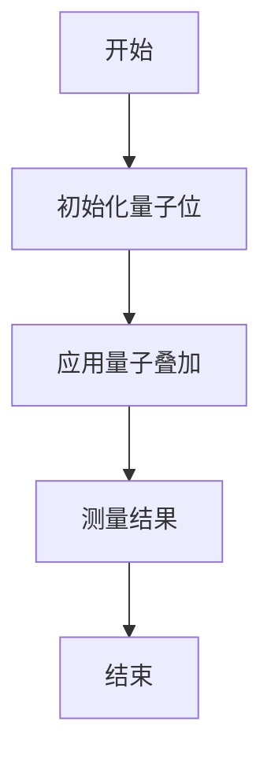
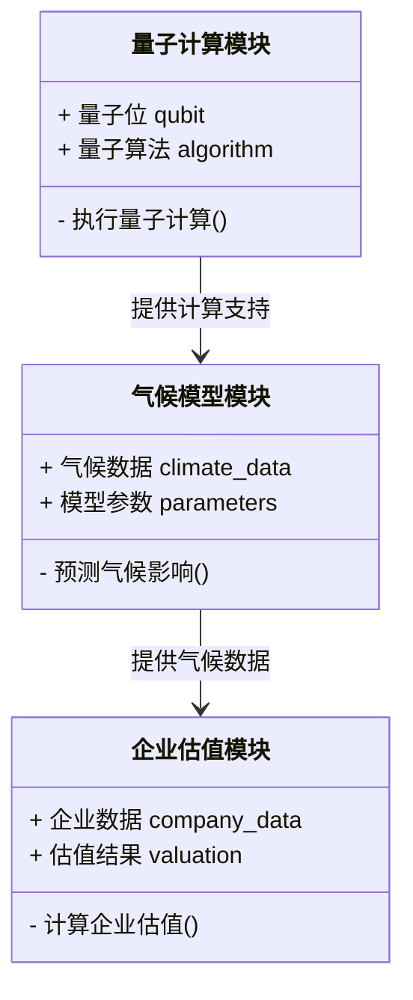

                 


# 企业估值中的量子计算气候模型模拟评估

## 关键词：企业估值、量子计算、气候模型、算法原理、系统架构

## 摘要：本文探讨如何利用量子计算和气候模型进行企业估值，通过分析量子算法和气候模型的结合，构建系统架构，提供实战案例，揭示其在企业估值中的应用潜力。

---

## 第一部分：背景介绍

### 第1章：企业估值与传统方法

#### 1.1 企业估值的基本概念
企业估值是通过对企业财务状况、市场地位和未来盈利能力的评估，确定其市场价值的过程。传统方法包括DCF模型、EV/EBITDA等，依赖历史数据和简化假设，存在数据依赖性强、模型过于简化等问题。

#### 1.2 量子计算与气候模型的引入
量子计算的并行处理能力使其在复杂系统模拟中具有优势，而气候模型能精确预测气候变化对企业的影响。将两者结合，可以更准确地评估企业在不同气候条件下的表现。

### 第2章：量子计算与气候模型概述

#### 2.1 量子计算的基本原理
量子计算利用量子叠加和纠缠效应，通过量子位（qubit）进行并行计算。其优势在于处理复杂优化问题和模拟量子系统。

#### 2.2 气候模型的构建与应用
气候模型通过数值模拟分析气候变化，预测极端天气事件和环境变化，为企业提供未来环境风险评估。

---

## 第二部分：核心概念与联系

### 第3章：量子计算与气候模型的核心原理

#### 3.1 量子计算的核心原理
量子叠加：$|0\rangle + |1\rangle$，允许同时处理多种状态。量子纠缠：$|\psi\rangle = \frac{1}{\sqrt{2}}(|0\rangle + |1\rangle)$，提供强大的关联性处理能力。

#### 3.2 气候模型的构建方法
气候模型通过大气、海洋等子系统的耦合模拟气候变化，考虑物理、化学和生物过程。

### 第4章：核心概念对比与ER图

#### 4.1 量子计算与传统计算的对比
| 特性      | 量子计算                | 传统计算                |
|-----------|-------------------------|-------------------------|
| 并行性     | 强                    | 弱                    |
| 处理速度   | 快                    | 较慢                  |
| 适用场景   | 复杂系统模拟            | 简单线性问题            |

#### 4.2 ER实体关系图
```mermaid
er
  %%{init: 'flowchart', theme: 'simple'}
  rectangle 量子计算 {
    <量子位>
    <量子算法>
  }
  rectangle 气候模型 {
    <大气模型>
    <海洋模型>
  }
  quantum_calculation --> climate_model: 提供计算支持
  climate_model --> enterprise_valuation: 提供数据支持
```

---

## 第三部分：算法原理讲解

### 第5章：量子算法与气候模型

#### 5.1 量子模拟算法
量子模拟算法用于解决复杂的优化问题，如旅行商问题。量子叠加允许同时探索所有可能路径，降低计算复杂度。

#### 5.2 气候模型的量子优化
通过量子算法优化气候模型参数，提高预测准确性。例如，使用量子模拟求解复杂方程，提升计算效率。

### 第6章：算法实现与代码示例

#### 6.1 Mermaid流程图展示


#### 6.2 Python代码实现
```python
import numpy as np

def quantum_superposition(n):
    # 初始化量子态
    state = np.zeros(2**n)
    for i in range(len(state)):
        state[i] = 1.0 / np.sqrt(2**n)
    return state

# 示例：n=2
state = quantum_superposition(2)
print(state)
```

---

## 第四部分：系统分析与架构设计

### 第7章：系统功能与架构设计

#### 7.1 系统功能设计


#### 7.2 系统架构设计


---

## 第五部分：项目实战

### 第8章：环境安装与代码实现

#### 8.1 环境安装
安装必要的库：
```bash
pip install qiskit numpy matplotlib
```

#### 8.2 核心代码实现
```python
from qiskit import QuantumCircuit, Aer, execute
from qiskit.visualization import plot_histogram

# 定义量子电路
qc = QuantumCircuit(2)
qc.h(0)
qc.cx(0, 1)
qc.measure_all()

# 执行模拟
backend = Aer.get_backend('qasm_simulator')
job = execute(qc, backend)
result = job.result()
counts = result.get_counts()

# 可视化结果
plot_histogram(counts)
```

#### 8.3 案例分析与解读
通过模拟极端天气事件，分析其对企业收益的影响，调整估值模型参数，提高估值准确性。

---

## 第六部分：总结与展望

### 第9章：总结

#### 9.1 最佳实践
- 结合量子计算和气候模型，提高企业估值的准确性。
- 定期更新模型参数，适应气候变化。

#### 9.2 小结
量子计算与气候模型的结合为企业估值提供了新的视角，但需克服技术挑战，如量子比特数限制和模型复杂性。

### 第10章：注意事项与拓展阅读

#### 10.1 注意事项
- 量子计算技术仍需进一步发展，企业需考虑技术可行性。
- 气候模型的准确性依赖于数据质量和算法优化。

#### 10.2 拓展阅读
推荐阅读《量子计算入门》和《气候模型与企业风险管理》。

---

## 作者：AI天才研究院 & 禅与计算机程序设计艺术

---

以上是《企业估值中的量子计算气候模型模拟评估》的完整大纲和内容，涵盖了从背景到实践的各个方面，详细阐述了量子计算与气候模型在企业估值中的应用。

