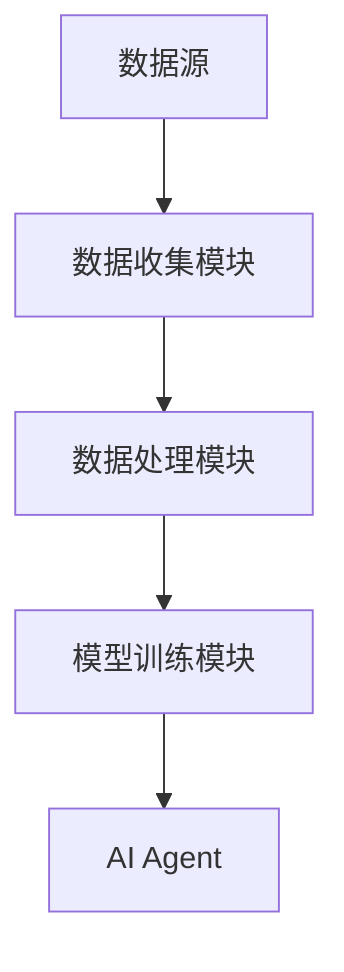
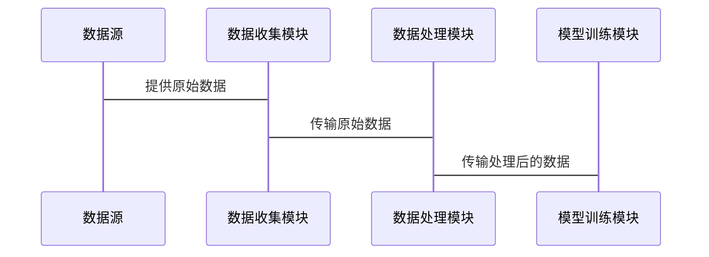

                 


# 企业数据管理：AI Agent训练数据的收集与处理

---

## 关键词：企业数据管理，AI Agent，数据收集，数据处理，机器学习

---

## 摘要：  
在当今数字化转型的浪潮中，企业数据管理的重要性日益凸显。AI Agent（人工智能代理）作为企业智能化转型的核心技术之一，其训练数据的收集与处理是决定模型性能的关键环节。本文系统地探讨了企业数据管理中AI Agent训练数据的收集与处理流程，从数据收集的基本方法到数据处理的高级技术，结合实际案例，深入分析了数据质量管理、特征工程、数据增强等关键环节，为企业构建高效、准确的AI Agent训练数据流提供理论支持和实践指导。

---

## 第一部分: 企业数据管理与AI Agent概述

---

### 第1章: 企业数据管理的背景与重要性

#### 1.1 企业数据管理的基本概念  
企业数据管理（Enterprise Data Management）是指通过系统化的方法对企业的数据进行采集、存储、处理、分析和应用的过程。其核心目标是确保数据的准确性、一致性和完整性，为企业决策提供可靠支持。

#### 1.2 AI Agent的基本概念  
AI Agent（人工智能代理）是指能够感知环境、自主决策并执行任务的智能体。AI Agent在企业中的应用场景广泛，包括智能客服、自动化运维、数据分析助手等。AI Agent的能力高度依赖其训练数据的质量。

#### 1.3 数据收集与处理的挑战  
在企业数据管理中，数据收集与处理面临以下挑战：  
1. **数据来源多样性**：数据可能来自结构化数据库、非结构化文本、图像、音频等多种来源。  
2. **数据质量保障**：数据可能存在噪声、缺失、冗余等问题，直接影响模型性能。  
3. **数据隐私与安全**：数据处理过程中需要严格遵守隐私保护法规，确保数据安全。  

#### 1.4 本章小结  
企业数据管理是AI Agent训练的基础，数据收集与处理的质量直接决定了AI Agent的能力。面对数据来源多样、质量保障和隐私安全等挑战，企业需要采取系统化的数据管理策略。

---

## 第二部分: 数据收集与处理的核心概念

---

### 第2章: 数据收集与处理的核心概念

#### 2.1 数据收集的方法  
数据收集是AI Agent训练的第一步，主要包括以下方法：  

1. **结构化数据收集**  
   - 来源：数据库、CSV文件等。  
   - 方法：通过SQL查询、API接口等方式获取结构化数据。  

2. **非结构化数据收集**  
   - 来源：文本文件、图像、音频等。  
   - 方法：使用自然语言处理（NLP）技术提取文本信息，通过计算机视觉技术处理图像数据。  

3. **实时数据流收集**  
   - 来源：传感器数据、实时日志等。  
   - 方法：使用流处理技术（如Apache Kafka）实时采集数据。  

#### 2.2 数据预处理技术  
数据预处理是确保数据质量的关键步骤，主要包括以下技术：  

1. **数据清洗**  
   - 方法：去除噪声数据、填补缺失值、删除重复数据。  
   - 工具：Python中的Pandas库常用。  

2. **数据标准化与归一化**  
   - 标准化：将数据按比例缩放到均值为0、方差为1的范围内。  
   - 归一化：将数据缩放到[0,1]范围内。  

3. **数据增强**  
   - 方法：通过增加噪声、旋转、裁剪等方式增强数据多样性。  

#### 2.3 数据质量评估  
数据质量评估是数据处理的重要环节，主要指标包括：  

1. **完整性**：数据是否完整，是否存在缺失值。  
2. **准确性**：数据是否真实反映业务场景。  
3. **一致性**：数据格式是否统一。  
4. **及时性**：数据是否及时更新。  

#### 2.4 本章小结  
数据收集与处理是AI Agent训练的基础，数据质量直接影响模型性能。通过数据清洗、标准化、增强等技术，可以有效提升数据质量。

---

## 第三部分: 数据收集与处理的进阶方法

---

### 第3章: 数据特征工程

#### 3.1 数据特征的定义与选择  
特征工程是通过选择和创建合适的特征，提升模型性能的过程。  

1. **特征选择**  
   - 方法：基于相关性分析、Lasso回归等。  

2. **特征创建**  
   - 方法：通过组合现有特征、提取新特征等方式增加特征多样性。  

#### 3.2 数据增强与扩展  
数据增强是通过技术手段增加数据多样性，提升模型泛化能力。  

1. **文本增强**  
   - 方法：同义词替换、句式变化等。  

2. **图像增强**  
   - 方法：旋转、翻转、裁剪等。  

#### 3.3 数据标注与标注工具  
数据标注是将数据进行分类、打标签的过程，常用工具包括：  

1. **标注工具**  
   - 常用工具：Label Studio、CVAT等。  

2. **标注流程**  
   - 流程：数据预处理、标注、质量检查、数据存储。  

#### 3.4 本章小结  
特征工程和数据增强是提升模型性能的关键，数据标注是AI Agent训练数据处理的重要环节。

---

## 第四部分: 系统架构与项目实战

---

### 第4章: 系统架构设计

#### 4.1 问题场景介绍  
假设某企业需要构建一个智能客服AI Agent，用于处理客户咨询。  

#### 4.2 系统功能设计  
1. **数据收集模块**  
   - 功能：采集客户咨询记录、用户反馈等数据。  

2. **数据处理模块**  
   - 功能：清洗数据、提取特征、标注数据。  

3. **模型训练模块**  
   - 功能：基于处理后的数据训练AI Agent模型。  

#### 4.3 系统架构图  


#### 4.4 系统接口设计  
1. 数据收集模块接口  
   - 输入：数据源配置参数  
   - 输出：原始数据集  

2. 数据处理模块接口  
   - 输入：原始数据集  
   - 输出：处理后的数据集  

#### 4.5 系统交互流程  


#### 4.6 本章小结  
系统架构设计是AI Agent训练数据处理的关键，合理的架构设计可以提升系统的可扩展性和可维护性。

---

## 第五章: 项目实战

### 5.1 环境安装  
1. 安装Python  
   - 命令：`python --version`  
2. 安装相关库  
   - 命令：`pip install pandas numpy scikit-learn`  

### 5.2 核心代码实现  

#### 5.2.1 数据收集  
```python
import pandas as pd
# 从CSV文件读取数据
data = pd.read_csv('data.csv')
print(data.head())
```

#### 5.2.2 数据清洗  
```python
# 删除缺失值
data.dropna(inplace=True)
# 去重
data.drop_duplicates(inplace=True)
```

#### 5.2.3 特征工程  
```python
from sklearn.preprocessing import StandardScaler
scaler = StandardScaler()
data_scaled = scaler.fit_transform(data)
```

#### 5.2.4 模型训练  
```python
from sklearn.model import Model
model = Model()
model.fit(data_scaled, labels)
```

### 5.3 代码解读与分析  
1. 数据收集：从CSV文件中读取数据，使用Pandas库。  
2. 数据清洗：删除缺失值和重复数据。  
3. 特征工程：使用标准化方法处理数据。  
4. 模型训练：基于处理后的数据训练模型。  

### 5.4 实际案例分析  
以智能客服AI Agent为例，通过上述代码实现数据收集与处理流程，训练模型并部署到生产环境。

### 5.5 本章小结  
通过项目实战，读者可以掌握AI Agent训练数据的收集与处理的具体步骤和方法。

---

## 第六章: 总结与展望

### 6.1 总结  
本文系统地探讨了企业数据管理中AI Agent训练数据的收集与处理流程，从数据收集的基本方法到数据处理的高级技术，结合实际案例，深入分析了数据质量管理、特征工程、数据增强等关键环节。

### 6.2 最佳实践Tips  
1. 数据收集时，优先选择高质量的数据源。  
2. 数据处理时，注重数据质量和特征工程。  
3. 数据标注时，确保标注的准确性和一致性。  

### 6.3 未来展望  
随着AI技术的不断发展，企业数据管理将更加智能化和自动化。未来，AI Agent的训练数据收集与处理将更加高效和精准。

---

## 作者：AI天才研究院/AI Genius Institute & 禅与计算机程序设计艺术 /Zen And The Art of Computer Programming

