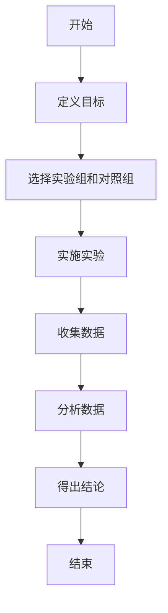
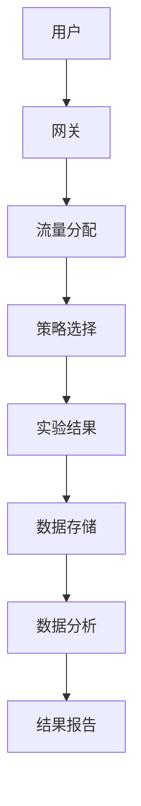
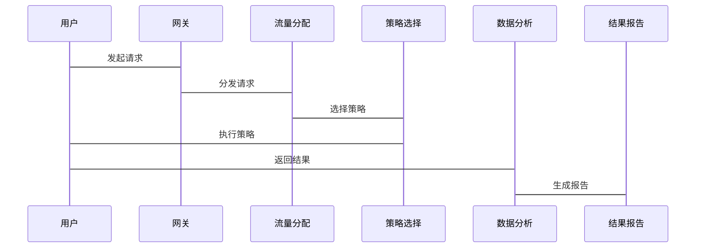

                 


# 企业级AI Agent的A/B测试策略与实施

> 关键词：企业级AI Agent, A/B测试, 算法原理, 系统架构, 项目实战

> 摘要：本文详细探讨了企业级AI Agent的A/B测试策略与实施方法，从核心概念到算法原理，再到系统架构和项目实战，层层深入，为读者提供全面的指导。

---

## 第1章: 企业级AI Agent的A/B测试概述

### 1.1 问题背景与描述
#### 1.1.1 企业级AI Agent的定义与特点
企业级AI Agent是一种能够独立决策、自主执行任务的智能体，具备以下特点：
- **自主性**：能够在无外部干预的情况下完成任务。
- **反应性**：能够根据环境变化实时调整行为。
- **目标导向性**：始终围绕预定目标执行操作。

#### 1.1.2 A/B测试的核心问题与目标
A/B测试是一种实验方法，通过对比不同策略的效果，找到最优方案。在企业级AI Agent中，A/B测试的主要目标是：
- **优化决策算法**：通过测试不同策略，选择最优的决策路径。
- **提升系统性能**：通过实验数据，优化系统运行效率。
- **降低风险**：通过小规模实验，降低大规模部署的风险。

#### 1.1.3 企业级AI Agent的A/B测试场景
在实际应用中，企业级AI Agent的A/B测试可能涉及以下场景：
- **用户体验优化**：测试不同的用户交互策略。
- **任务执行效率**：测试不同的任务分配算法。
- **系统稳定性**：测试不同的容错机制。

### 1.2 问题解决与边界
#### 1.2.1 A/B测试在企业级AI Agent中的作用
A/B测试在企业级AI Agent中的作用可以总结为：
- **验证假设**：通过实验验证特定策略的有效性。
- **数据驱动决策**：通过实验数据支持决策。
- **持续优化**：通过不断实验，实现系统性能的持续优化。

#### 1.2.2 问题解决的边界与外延
A/B测试在企业级AI Agent中的边界包括：
- **实验范围**：明确实验的目标和范围，避免过度实验。
- **实验成本**：控制实验的成本，确保实验的可行性。
- **实验周期**：合理安排实验周期，确保实验的及时性。

#### 1.2.3 核心概念与关键要素
- **实验组与对照组**：实验组采用新策略，对照组采用旧策略。
- **指标体系**：通过多个指标评估实验效果，如转化率、响应时间等。
- **统计方法**：采用统计方法分析实验结果，确保结果的科学性。

---

## 第2章: 核心概念与联系

### 2.1 AI Agent与A/B测试的关系
#### 2.1.1 AI Agent的实体关系图（ER图）
```mermaid
erDiagram
    user(AI Agent) {
        <属性>
        id : string
        type : string
        status : string
    }
    strategy(A/B测试策略) {
        <属性>
        id : string
        name : string
        description : string
    }
    experiment(A/B测试实验) {
        <属性>
        id : string
        start_time : datetime
        end_time : datetime
        result : float
    }
    user --> strategy : 选择策略
    user --> experiment : 参与实验
    strategy --> experiment : 实验策略
```

#### 2.1.2 A/B测试的流程图（Mermaid）


### 2.2 核心概念对比表
| 对比维度 | AI Agent | A/B测试 |
|----------|-----------|----------|
| 定义 | 一种智能体，能够自主决策和执行任务 | 一种实验方法，通过对比不同策略的效果，找到最优方案 |
| 目标 | 完成特定任务，实现目标 | 优化决策算法，提升系统性能，降低风险 |
| 应用场景 | 用户交互优化，任务执行效率，系统稳定性 | 优化决策算法，提升系统性能，降低风险 |
| 关系 | A/B测试是优化AI Agent性能的重要手段 | AI Agent是A/B测试的应用载体 |

---

## 第3章: A/B测试的算法原理

### 3.1 流量分配算法
#### 3.1.1 等概率分配原理
等概率分配是将流量均匀分配到不同的实验组和对照组，确保每个用户有相等的概率被分配到任意一组。

#### 3.1.2 不等概率分配原理
不等概率分配是根据实验目标的权重，调整不同组的流量分配比例。

#### 3.1.3 动态分配算法
动态分配算法根据实时数据，动态调整流量分配比例，确保实验结果的最优性。

### 3.2 统计检验算法
#### 3.2.1 T检验原理
T检验用于比较两组数据的均值差异是否具有统计显著性，公式如下：
$$ t = \frac{\bar{x}_1 - \bar{x}_2}{\sqrt{\frac{s_1^2}{n_1} + \frac{s_2^2}{n_2}}} $$

#### 3.2.2 卡方检验原理
卡方检验用于比较观察频数与期望频数的差异，公式如下：
$$ \chi^2 = \sum \frac{(O_i - E_i)^2}{E_i} $$

#### 3.2.3 置信区间计算
置信区间用于估计参数的范围，公式如下：
$$ \text{置信区间} = \bar{x} \pm z \cdot \frac{s}{\sqrt{n}} $$

---

## 第4章: 数学模型与公式

### 4.1 统计显著性计算
#### 4.1.1 T检验公式
$$ t = \frac{\bar{x}_1 - \bar{x}_2}{\sqrt{\frac{s_1^2}{n_1} + \frac{s_2^2}{n_2}}} $$

#### 4.1.2 卡方检验公式
$$ \chi^2 = \sum \frac{(O_i - E_i)^2}{E_i} $$

### 4.2 动态分配模型
#### 4.2.1 动态分配公式
$$ p_i = \frac{e^{\beta x_i}}{\sum_j e^{\beta x_j}} $$

---

## 第5章: 系统分析与架构设计

### 5.1 问题场景描述
#### 5.1.1 用户行为分析
分析用户的交互行为，识别关键路径，确定实验目标。

#### 5.1.2 实验设计
设计实验方案，明确实验目标、实验组和对照组、实验指标。

#### 5.1.3 结果监控
监控实验过程中的数据，确保实验的顺利进行。

### 5.2 系统功能设计
#### 5.2.1 领域模型类图（Mermaid）
```mermaid
classDiagram
    class AI-Agent {
        id
        type
        status
        strategy
    }
    class A/B-Test-Strategy {
        id
        name
        description
    }
    class Experiment {
        id
        start_time
        end_time
        result
    }
    AI-Agent <|-- Strategy
    A/B-Test-Strategy <|-- Experiment
```

## 第6章: 系统架构设计

### 6.1 系统架构图（Mermaid）


### 6.2 接口设计
- **用户请求接口**：用户发起请求，网关接收并分发到不同策略。
- **策略选择接口**：根据实验结果，选择最优策略。
- **数据分析接口**：收集实验数据，进行统计分析。

### 6.3 交互流程图（Mermaid）


---

## 第7章: 项目实战

### 7.1 环境安装
安装必要的工具和库，如Python、numpy、pandas、scipy等。

### 7.2 核心代码实现
#### 7.2.1 流量分配代码
```python
import numpy as np

def allocate_traffic(strategy):
    if np.random.random() < 0.5:
        return 'control'
    else:
        return strategy
```

#### 7.2.2 统计检验代码
```python
from scipy.stats import ttest_ind

def calculate_ttest(group1, group2):
    t, p = ttest_ind(group1, group2)
    return t, p
```

### 7.3 实际案例分析
通过具体案例，详细讲解实验设计、数据分析和结果解读。

### 7.4 项目总结
总结实验结果，分析成功与失败的原因，提出改进建议。

---

## 第8章: 最佳实践与小结

### 8.1 最佳实践
- **实验设计**：明确实验目标，合理选择实验组和对照组。
- **数据收集**：确保数据的完整性和准确性。
- **结果分析**：采用多种统计方法，确保结果的科学性。

### 8.2 小结
本文从理论到实践，全面探讨了企业级AI Agent的A/B测试策略与实施方法，为读者提供了系统的指导。

### 8.3 注意事项
- **实验成本**：控制实验成本，避免过度实验。
- **实验周期**：合理安排实验周期，确保实验的及时性。
- **实验结果**：实验结果需结合业务目标，避免片面性。

### 8.4 拓展阅读
- **统计学基础**：深入学习统计学知识，提升实验分析能力。
- **机器学习算法**：学习更多机器学习算法，优化实验策略。
- **系统架构**：研究系统架构设计，提升实验系统的可扩展性。

---

# 附录

## 附录A: 术语表
- **A/B测试**：通过对比不同策略的效果，找到最优方案。
- **统计显著性**：实验结果的差异具有实际意义。

## 附录B: 工具推荐
- **Python**：数据分析和实验实现的首选工具。
- **Scipy**：统计分析的常用库。
- **Mermaid**：绘制图表的工具。

---

作者：AI天才研究院/AI Genius Institute & 禅与计算机程序设计艺术 /Zen And The Art of Computer Programming

