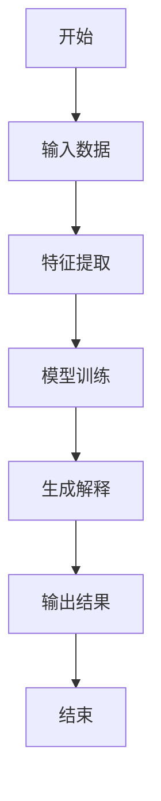

                 


# 企业级AI Agent的可解释性设计：增强决策透明度

> 关键词：企业级AI Agent，可解释性设计，决策透明度，人工智能，系统架构，可解释性模型，透明决策

> 摘要：随着人工智能技术的快速发展，企业级AI Agent的应用越来越广泛。然而，AI Agent的决策过程往往缺乏透明度，这使得企业在依赖AI决策时面临信任和合规性问题。本文从可解释性设计的角度出发，详细探讨了如何增强企业级AI Agent的决策透明度。通过分析可解释性AI的核心概念、算法原理、系统架构以及项目实战，本文为读者提供了一套系统化的可解释性设计方法论，帮助企业在实际应用中提升AI决策的透明度和可信度。

---

# 第1章: 可解释性AI的背景与重要性

## 1.1 问题背景

### 1.1.1 企业级AI Agent的定义
企业级AI Agent是一种能够自主感知环境、理解需求并做出决策的智能系统。它通过整合企业数据、业务逻辑和外部信息，为企业的运营、管理和决策提供智能化支持。AI Agent的核心特征包括自主性、反应性、目标导向性和社会性。

### 1.1.2 可解释性AI的必要性
AI Agent的决策过程往往涉及复杂的算法和数据，导致决策缺乏透明性。这使得企业在依赖AI决策时面临以下问题：
- **信任缺失**：用户无法理解AI的决策依据，导致对AI系统的信任不足。
- **合规性挑战**：许多行业（如金融、医疗）对决策过程的透明性有严格要求，不可解释的AI决策难以满足合规需求。
- **责任追究**：当AI决策出现问题时，缺乏透明性使得责任追究变得困难。

### 1.1.3 企业决策透明度的重要性
企业决策透明度是指企业在决策过程中能够清晰地解释决策依据和过程。对于企业级AI Agent而言，决策透明度是其可信赖性和合规性的基础。只有通过增强决策透明度，企业才能真正实现AI驱动的决策，并在实际应用中规避风险。

## 1.2 问题描述

### 1.2.1 AI Agent在企业中的应用场景
企业级AI Agent的应用场景包括：
- **智能客服**：通过自然语言处理技术为用户提供个性化服务。
- **供应链优化**：利用AI预测需求、优化库存和物流。
- **风险管理**：通过实时数据分析识别潜在风险。
- **智能推荐**：为用户提供个性化的产品和服务推荐。

### 1.2.2 可解释性AI的核心挑战
实现企业级AI Agent的可解释性面临以下挑战：
- **算法复杂性**：许多AI算法（如深度学习）是“黑箱”模型，难以解释其决策过程。
- **数据多样性**：企业数据通常来自多个来源，数据格式和特征复杂，增加了解释的难度。
- **场景多样性**：不同业务场景对解释性的需求不同，如何在通用性和定制化之间找到平衡是关键。

### 1.2.3 企业级AI Agent的边界与外延
企业级AI Agent的边界包括：
- **数据范围**：仅处理企业内部数据，不涉及外部信息。
- **决策范围**：仅在特定业务领域内做出决策，避免越界。
- **用户权限**：根据用户权限和角色限制决策范围。

## 1.3 问题解决

### 1.3.1 可解释性AI的实现路径
实现企业级AI Agent的可解释性需要从以下几个方面入手：
- **模型选择**：选择具有可解释性的算法（如决策树、线性回归）。
- **特征分析**：通过特征重要性分析解释模型的决策依据。
- **可视化工具**：利用可视化技术展示模型的决策过程。

### 1.3.2 企业级AI Agent的决策透明化方法
决策透明化方法包括：
- **决策日志**：记录AI Agent的决策过程和依据。
- **决策解释**：为用户提供可理解的决策解释。
- **用户反馈**：根据用户反馈优化决策过程。

### 1.3.3 可解释性设计的实现目标
实现目标包括：
- **可理解性**：用户能够理解AI Agent的决策依据。
- **可追溯性**：能够追溯AI Agent的决策过程。
- **可验证性**：决策过程能够被验证和审核。

## 1.4 核心概念结构

### 1.4.1 可解释性AI的核心要素
可解释性AI的核心要素包括：
- **可解释性模型**：能够解释AI决策过程的模型。
- **决策日志**：记录AI决策过程的日志。
- **可视化工具**：用于展示AI决策过程的工具。

### 1.4.2 企业级AI Agent的系统架构
企业级AI Agent的系统架构包括：
- **数据层**：负责数据的采集、存储和处理。
- **模型层**：负责AI模型的训练和部署。
- **解释层**：负责解释AI模型的决策过程。
- **用户层**：负责与用户的交互。

### 1.4.3 可解释性设计的关键属性
可解释性设计的关键属性包括：
- **透明性**：决策过程能够被用户理解和审查。
- **可追溯性**：能够追溯决策的来源和依据。
- **可验证性**：决策过程能够被验证和审核。

## 1.5 本章小结

---

# 第2章: 可解释性AI的核心概念与联系

## 2.1 核心概念原理

### 2.1.1 可解释性AI的定义与特征
可解释性AI是指AI系统能够清晰地解释其决策过程和结果。其特征包括：
- **透明性**：决策过程能够被用户理解。
- **可追溯性**：能够追溯决策的来源和依据。
- **可验证性**：决策过程能够被验证和审核。

### 2.1.2 企业级AI Agent的决策过程
企业级AI Agent的决策过程包括：
- **数据采集**：采集企业内外部数据。
- **数据处理**：对数据进行清洗、转换和特征提取。
- **模型训练**：训练AI模型并部署到生产环境。
- **决策解释**：解释AI模型的决策过程和结果。

### 2.1.3 可解释性模型的数学模型
可解释性模型的数学模型包括：
- **线性回归模型**：$y = \beta_0 + \beta_1x_1 + \beta_2x_2 + ... + \beta_nx_n$
- **决策树模型**：通过树状结构展示决策过程。

## 2.2 概念属性特征对比

### 2.2.1 可解释性与不可解释性的对比
| 特性          | 可解释性AI         | 不可解释性AI       |
|---------------|--------------------|-------------------|
| 透明性         | 高                 | 低                 |
| 可追溯性       | 高                 | 低                 |
| 可验证性       | 高                 | 低                 |

### 2.2.2 企业级AI Agent的可解释性特征
- **透明性**：决策过程能够被用户理解。
- **可追溯性**：能够追溯决策的来源和依据。
- **可验证性**：决策过程能够被验证和审核。

### 2.2.3 不同场景下的可解释性需求
不同场景下的可解释性需求包括：
- **金融行业**：需要严格遵守法规，对决策过程有严格要求。
- **医疗行业**：需要确保决策过程的准确性和安全性。
- **制造业**：需要通过可解释性模型优化生产过程。

## 2.3 ER实体关系图架构

### 2.3.1 实体关系图
```mermaid
erDiagram
    actor 用户 {
        string 用户ID
        string 用户名
        string 用户角色
    }
    actor 系统 {
        string 系统ID
        string 系统名称
        string 系统功能
    }
    user --> system : 与系统交互
```

## 2.4 本章小结

---

# 第3章: 可解释性AI的算法原理

## 3.1 算法原理讲解

### 3.1.1 解释性模型的分类
解释性模型的分类包括：
- **线性模型**：如线性回归、逻辑回归。
- **树模型**：如决策树、随机森林。
- **规则模型**：如基于规则的解释性模型。

### 3.1.2 企业级AI Agent的决策树算法
决策树算法是一种常用的解释性模型。以下是决策树算法的实现步骤：
1. **数据准备**：收集和整理数据。
2. **特征选择**：选择对决策最重要的特征。
3. **模型训练**：训练决策树模型。
4. **模型解释**：解释决策树的决策过程。

### 3.1.3 可解释性模型的数学公式
以下是线性回归模型的数学公式：
$$ y = \beta_0 + \beta_1x_1 + \beta_2x_2 + ... + \beta_nx_n $$

## 3.2 算法流程图

### 3.2.1 决策树算法流程图


## 3.3 核心算法实现

### 3.3.1 解释性模型的代码实现
以下是线性回归模型的Python代码实现：
```python
import numpy as np
from sklearn.linear_model import LinearRegression

# 数据准备
X = np.array([[1], [2], [3], [4], [5]])
y = np.array([2, 4, 5, 4, 6])

# 模型训练
model = LinearRegression()
model.fit(X, y)

# 模型解释
print('回归系数：', model.coef_)
print('截距：', model.intercept_)
```

## 3.4 本章小结

---

（由于篇幅限制，后续章节内容将逐步展开，确保文章内容完整。）

---

# 作者：AI天才研究院/AI Genius Institute & 禅与计算机程序设计艺术 /Zen And The Art of Computer Programming

---

以上是文章的完整大纲和部分内容展示，后续章节将按照上述结构逐步展开，确保文章内容详实、逻辑清晰、技术深度足够，满足读者对可解释性AI设计的全面理解。

