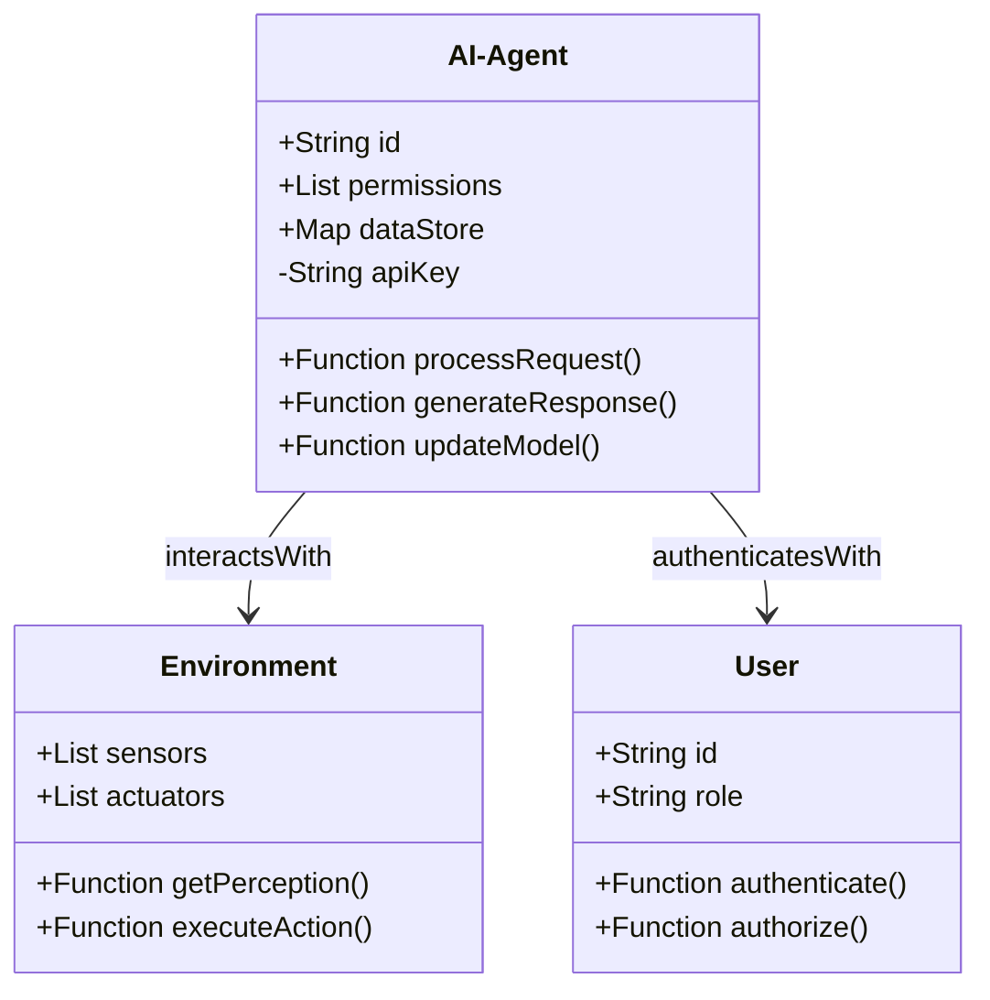
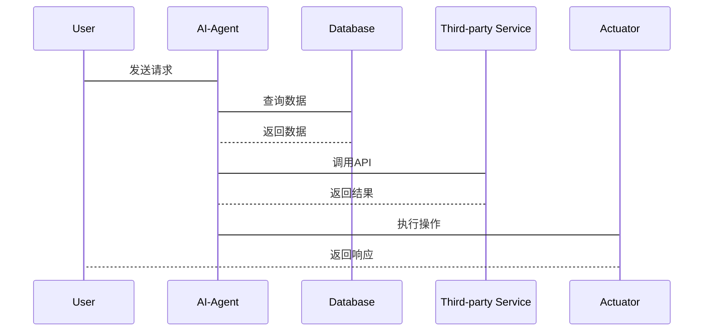

                 


# 企业级AI Agent的隐私保护与合规性考虑

> 关键词：AI Agent，隐私保护，合规性，数据安全，算法原理

> 摘要：本文系统阐述了企业级AI Agent在隐私保护与合规性方面的重要考虑，从核心概念、算法原理到系统设计，结合实际案例，深入分析了隐私保护与合规性在企业级AI Agent中的实现路径。

---

## 第1章: 企业级AI Agent的背景与核心概念

### 1.1 AI Agent的基本概念

AI Agent，即人工智能代理，是一种能够感知环境、执行任务以实现特定目标的智能实体。它通过传感器获取信息，利用推理能力做出决策，并通过执行器与环境交互。AI Agent的核心特征包括自主性、反应性、目标导向性和社交能力。

#### 1.1.1 AI Agent的定义与分类
- **定义**：AI Agent是一种智能实体，能够通过感知和行动与环境交互，实现预定目标。
- **分类**：
  - **简单反射型Agent**：基于当前感知做出反应，无内部状态。
  - **基于模型的反射型Agent**：维护环境模型，用于推理和决策。
  - **目标驱动型Agent**：以目标为导向，主动规划行动。
  - **效用驱动型Agent**：通过最大化效用函数实现目标。

#### 1.1.2 企业级AI Agent的特点
- **复杂性**：涉及多任务、多环境和多角色交互。
- **实时性**：需要快速响应和决策。
- **数据驱动性**：依赖大量数据进行学习和推理。
- **安全性**：需要保护数据隐私和系统安全。

#### 1.1.3 AI Agent的应用场景与边界
- **应用场景**：
  - 客户服务：处理用户请求，提供个性化支持。
  - 业务流程自动化：优化企业运营效率。
  - 数据分析：辅助决策支持。
- **边界**：
  - 数据范围：明确数据来源、类型和使用范围。
  - 行为边界：定义AI Agent的权限和操作范围。
  - 伦理边界：确保AI Agent的行为符合伦理规范。

### 1.2 隐私保护与合规性的核心问题

隐私保护和合规性是企业级AI Agent设计中的核心问题，尤其是在数据驱动的AI系统中，数据隐私和合规性要求直接影响系统的安全性和合法性。

#### 1.2.1 隐私保护的基本概念
- **隐私**：个体对其信息的控制权，确保数据不被未经授权的访问或使用。
- **数据匿名化**：通过技术手段将数据去标识化，降低隐私泄露风险。
- **最小必要原则**：仅收集实现目标所需的最少数据。

#### 1.2.2 合规性要求的法律框架
- **GDPR（通用数据保护条例）**：欧盟法规，严格规定数据收集、处理和存储的合法性。
- **CCPA（加州消费者隐私法案）**：美国加州的隐私保护法规。
- **行业标准**：如金融行业的GDPR、医疗行业的HIPAA。

#### 1.2.3 企业级AI Agent中的隐私风险
- **数据泄露**：未经授权的第三方访问敏感数据。
- **数据滥用**：数据被用于不符合预期目的的行为。
- **算法偏见**：算法设计中的偏见可能引发隐私问题。

---

## 第2章: 企业级AI Agent的隐私保护框架

### 2.1 隐私保护的基本原理

隐私保护的核心在于数据的分类、匿名化和访问控制。通过合理的数据管理策略，确保数据在生命周期中的安全性和合规性。

#### 2.1.1 数据分类与敏感性评估
- **数据分类**：将数据分为公开数据、敏感数据和机密数据。
- **敏感性评估**：根据数据的敏感程度制定不同的保护策略。

#### 2.1.2 最小必要原则
- **数据最小化**：仅收集实现目标所需的最小数据集。
- **权限最小化**：确保数据访问权限符合最小化原则。

#### 2.1.3 数据匿名化与脱敏技术
- **数据匿名化**：通过技术手段去除数据中的标识符信息。
- **脱敏技术**：对敏感数据进行变形处理，确保数据不可逆还原。

### 2.2 合规性框架的设计

合规性框架的设计需要结合法律法规和企业内部政策，确保AI Agent的行为符合相关要求。

#### 2.2.1 数据保护法规的解读
- **GDPR**：强调数据主体的权利，如知情权、访问权和删除权。
- **CCPA**：赋予消费者对其数据的控制权。

#### 2.2.2 企业内部隐私政策的制定
- **隐私政策**：明确数据处理的原则、流程和责任。
- **数据处理协议**：与第三方服务提供商签订明确的数据处理条款。

#### 2.2.3 第三方服务的合规性评估
- **供应商审核**：评估第三方服务提供商的隐私保护能力。
- **数据共享协议**：明确数据共享的范围和责任。

---

## 第3章: AI Agent隐私保护的核心技术与算法

### 3.1 同态加密

同态加密是一种允许在加密数据上进行计算的加密技术，能够在不泄露原始数据的情况下进行数据处理。

#### 3.1.1 同态加密的基本原理
- **基本思想**：在加密数据上执行计算，保持数据的隐私性。
- **数学模型**：通过模运算实现加密和解密。

#### 3.1.2 加密过程的数学模型
- **加密函数**：$E(x) = x + r \mod p$，其中$r$是随机数，$p$是质数。
- **解密函数**：$D(E(x)) = x \mod p$。

#### 3.1.3 实际应用中的挑战
- **计算效率**：同态加密计算复杂，可能影响系统性能。
- **密钥管理**：需要安全的密钥分发和管理机制。

#### 3.1.4 代码实现
```python
import numpy as np

def homomorphic_encrypt(plaintext, key):
    # 生成随机数
    r = np.random.randint(0, key)
    # 加密过程
    ciphertext = (plaintext + r) % key
    return ciphertext

def homomorphic_decrypt(ciphertext, key):
    # 解密过程
    plaintext = ciphertext % key
    return plaintext
```

### 3.2 差分隐私

差分隐私是一种通过添加噪声来保护数据隐私的技术，确保数据的统计性质不因单个数据点的改变而显著变化。

#### 3.2.1 差分隐私的定义与核心思想
- **定义**：通过在数据中添加随机噪声，使得单个数据点的改变不会显著影响整体统计结果。
- **核心思想**：确保数据查询的结果对单个数据点的隐私保护。

#### 3.2.2 隔离敏感数据的实现方法
- **数据匿名化**：通过替换、删除或变形敏感字段。
- **数据加密**：使用加密技术保护敏感数据。

#### 3.2.3 差分隐私的数学模型
- **隐私预算**：$\epsilon$，定义了隐私泄露的风险。
- **拉普拉斯噪声**：通过在查询结果中添加拉普拉斯分布的噪声，保护数据隐私。

#### 3.2.4 代码实现
```python
import numpy as np

def laplace_noise(mu, b, epsilon):
    # 计算噪声尺度
    scale = b / epsilon
    # 生成拉普拉斯分布噪声
    noise = np.random.laplace(0, 1/scale)
    return noise

def differential_privacy_query(query, epsilon):
    # 添加噪声
    result = query + laplace_noise(0, 1, epsilon)
    return result
```

---

## 第4章: 企业级AI Agent的系统分析与架构设计

### 4.1 系统功能设计

企业级AI Agent的系统功能设计需要结合隐私保护和合规性要求，确保系统的安全性和合法性。

#### 4.1.1 领域模型设计（Mermaid类图）



#### 4.1.2 功能模块划分与交互流程

- **数据采集模块**：负责从环境中获取数据，并进行初步处理。
- **数据存储模块**：存储处理后的数据，并确保数据的隐私性和安全性。
- **数据处理模块**：对数据进行分析和处理，生成结果。
- **数据输出模块**：将处理结果输出给用户或外部系统。

#### 4.1.3 系统架构设计（Mermaid架构图）


### 4.2 系统交互设计

系统交互设计需要确保数据的隐私性和合规性，避免数据泄露和滥用。

#### 4.2.1 系统接口设计
- **输入接口**：定义数据输入的格式和安全要求。
- **输出接口**：定义数据输出的格式和隐私保护措施。

#### 4.2.2 系统交互流程图（Mermaid序列图）



---

## 第5章: 项目实战与案例分析

### 5.1 环境安装与配置

#### 5.1.1 环境需求
- **操作系统**：Linux/Windows/MacOS
- **编程语言**：Python 3.8+
- **开发工具**：Jupyter Notebook、VS Code
- **依赖库**：numpy, pandas, scikit-learn, transformers

#### 5.1.2 安装步骤
```bash
pip install numpy pandas scikit-learn transformers
```

### 5.2 核心代码实现

#### 5.2.1 数据预处理
```python
import pandas as pd

def preprocess_data(dataframe):
    # 删除敏感字段
    dataframe = dataframe.drop(columns=['SSN', 'CreditCardNumber'])
    # 数据匿名化处理
    dataframe['Age'] = dataframe['Age'].apply(lambda x: x + np.random.randint(-2, 3))
    return dataframe
```

#### 5.2.2 模型训练与推理
```python
from sklearn.tree import DecisionTreeClassifier
from sklearn.model_selection import train_test_split

def train_model(X_train, y_train):
    model = DecisionTreeClassifier()
    model.fit(X_train, y_train)
    return model

def predict_model(model, X_test):
    predictions = model.predict(X_test)
    return predictions
```

### 5.3 案例分析与结果解读

#### 5.3.1 案例背景
- **行业**：金融服务
- **场景**：客户信用评估
- **数据集**：包含客户个人信息和信用评分。

#### 5.3.2 案例分析
- **数据预处理**：删除敏感字段，对年龄进行噪声处理。
- **模型训练**：使用决策树模型进行客户信用评估。
- **结果解读**：模型预测结果与实际结果对比，评估模型的准确性和鲁棒性。

---

## 第6章: 总结与展望

### 6.1 总结
企业级AI Agent的隐私保护与合规性是一个复杂的系统工程，需要从数据管理、算法设计、系统架构等多个方面进行综合考虑。通过合理的技术手段和合规性框架设计，可以有效降低隐私风险，确保AI Agent的安全性和合法性。

### 6.2 展望
随着AI技术的不断发展，企业级AI Agent的应用场景将更加广泛。未来的隐私保护技术将更加智能化，合规性要求也将更加严格。如何在确保隐私和合规性的前提下，提高AI Agent的性能和效率，是值得深入研究的方向。

### 6.3 最佳实践Tips
- **数据最小化**：仅收集必要的数据，减少隐私风险。
- **权限控制**：严格控制数据访问权限，确保最小化原则。
- **算法优化**：选择合适的隐私保护算法，平衡隐私和性能。
- **合规性审查**：定期审查和更新合规性框架，确保符合最新法规。

---

作者：AI天才研究院/AI Genius Institute & 禅与计算机程序设计艺术 /Zen And The Art of Computer Programming

