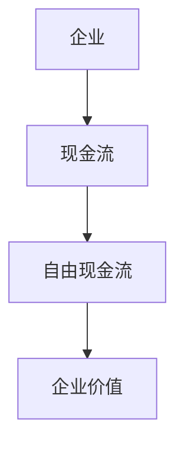
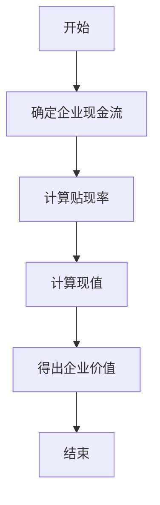

                 


# 《企业自由现金流估值法详解》

---

## 关键词：
企业自由现金流、估值法、DCF模型、系统架构、项目实战

---

## 摘要：
企业自由现金流（FCFE，Free Cash Flow to Equity）是企业估值中最重要的指标之一，它反映了企业在扣除所有费用和再投资需求后的剩余现金流量。本文详细讲解企业自由现金流的计算方法、估值模型、系统架构设计以及实际应用案例，帮助读者掌握从理论到实践的企业估值方法。

---

## 目录

---

### 第一部分：企业自由现金流估值法的基础

### 第1章：企业自由现金流估值法概述

#### 1.1 企业自由现金流的基本概念
- 什么是企业自由现金流
- 企业自由现金流的意义
- 企业自由现金流与企业价值的关系

#### 1.2 企业自由现金流的计算公式
- 标准公式
- 变体公式
- 公式中的关键变量分析

#### 1.3 企业自由现金流的应用范围
- 企业估值中的应用
- 投资决策中的应用
- 股权分析中的应用

#### 1.4 本章小结

---

### 第2章：企业自由现金流的核心概念与联系

#### 2.1 核心概念原理
- 自由现金流的生成过程
- 自由现金流的时间价值
- 自由现金流的风险调整

#### 2.2 核心概念属性特征对比表
| 概念       | 特征1 | 特征2 | 特征3 |
|------------|-------|-------|-------|
| 自由现金流 | ...   | ...   | ...   |

#### 2.3 ER实体关系图（Mermaid流程图）


#### 2.4 本章小结

---

### 第3章：企业自由现金流估值法的算法原理

#### 3.1 算法原理概述
- 自由现金流贴现模型
- 现金流折现法
- 内部收益率法

#### 3.2 算法流程图（Mermaid）


#### 3.3 算法实现代码
```python
def free_cash_flow_valuation(cash_flows, discount_rate):
    present_value = sum(cash_flow / (1 + discount_rate)**i for i, cash_flow in enumerate(cash_flows))
    return present_value

# 示例
cash_flows = [100, 200, 300]
discount_rate = 0.1
print(free_cash_flow_valuation(cash_flows, discount_rate))
```

---

### 第二部分：企业自由现金流估值法的深入分析

### 第4章：企业自由现金流估值模型

#### 4.1 常用估值模型概述
- DCF模型
- DDM模型
- WACC方法

#### 4.2 DCF模型的详细分析
- 步骤分解
- 数学公式推导
- 实际案例分析

#### 4.3 模型的优缺点对比
- 优缺点表格
- 案例对比分析

---

### 第5章：企业自由现金流的系统分析与架构设计

#### 5.1 系统分析
- 问题场景介绍
- 需求分析
- 功能模块划分

#### 5.2 系统架构设计
- 层次架构图
- 模块交互图

#### 5.3 数据流设计
- 数据输入输出流程
- 数据存储与处理

#### 5.4 接口设计
- API定义
- 接口交互流程

---

### 第6章：企业自由现金流估值法的项目实战

#### 6.1 项目背景与目标
- 项目背景
- 项目目标

#### 6.2 工具选择与环境配置
- Python安装
- 库的安装与配置

#### 6.3 代码实现
- 数据收集与预处理
- 模型实现
- 结果计算与分析

#### 6.4 实验结果与分析
- 结果展示
- 结果解释

#### 6.5 项目总结与优化建议

---

### 第7章：总结与展望

#### 7.1 本书内容回顾
- 核心内容总结
- 学习成果回顾

#### 7.2 企业自由现金流估值法的未来趋势
- 技术发展
- 应用领域扩展

#### 7.3 学习建议与注意事项
- 学习资源推荐
- 常见误区提醒

---

## 附录

### 附录A：数学公式汇总
$$ \text{FCF} = \text{EBIT}(1 - \text{税率}) + \text{折旧} + \text{摊销} - \text{资本支出} $$

### 附录B：工具推荐与安装指南
- Python安装指南
- 常用库推荐：Pandas、NumPy、Matplotlib

### 附录C：扩展阅读资料
- 推荐书籍
- 在线课程
- 行业报告

---

## 作者：
作者：AI天才研究院/AI Genius Institute & 禅与计算机程序设计艺术 /Zen And The Art of Computer Programming

---

希望这个目录大纲能满足您的需求！如果需要进一步调整或补充，请随时告知。

