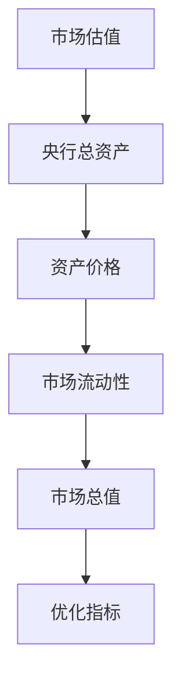
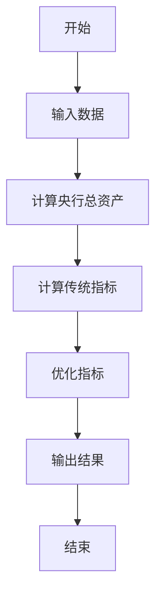
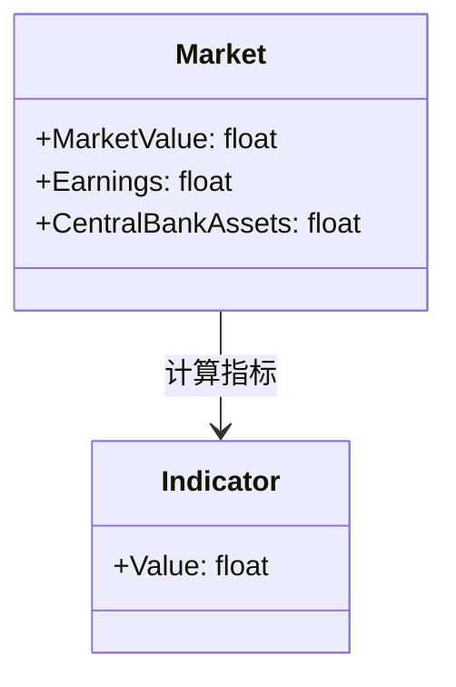
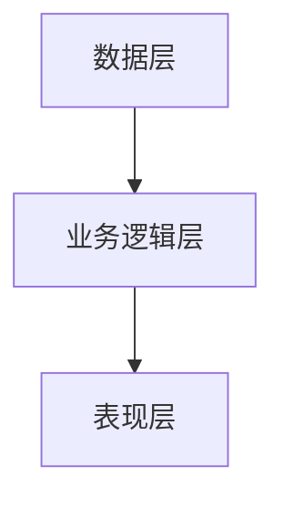

                 


# 优化版指标:加入央行总资产的市场估值新方法

**关键词**: 优化版指标、央行总资产、市场估值、金融模型、算法优化、经济分析

**摘要**: 本文提出了一种基于央行总资产的市场估值新方法，通过优化传统指标，结合现代算法和数学模型，提升估值的准确性和实用性。文章详细探讨了该方法的背景、原理、算法实现及实际应用，为金融从业者和研究人员提供了新的思路。

---

## 第一部分: 背景介绍与核心概念

### 第1章: 优化版指标的背景与问题描述

#### 1.1 市场估值的传统方法与局限性

##### 1.1.1 传统市场估值方法概述
传统的市场估值方法主要包括市盈率（P/E）、市净率（P/B）和股息率等指标。这些方法在一定程度上反映了市场的健康状况，但存在以下局限性：

- **数据依赖性**：过于依赖历史数据，难以捕捉实时市场变化。
- **单一视角**：仅关注企业基本面，忽略宏观经济因素。
- **缺乏动态调整**：未能充分考虑央行政策和市场流动性的影响。

##### 1.1.2 传统方法的局限性与不足
传统市场估值方法在实际应用中暴露出诸多问题：

- **片面性**：未能全面反映市场的复杂性。
- **滞后性**：无法及时反映央行政策调整对市场的影响。
- **稳定性**：在市场波动较大时，估值结果可能失真。

##### 1.1.3 优化市场估值指标的必要性
为了克服传统方法的不足，亟需引入新的估值指标，结合央行总资产等宏观经济数据，构建更全面、更动态的市场估值体系。

#### 1.2 央行总资产的核心作用

##### 1.2.1 央行总资产的定义与构成
央行总资产主要包括货币发行、政府债券持有、外汇储备和其他资产。其构成直接反映了央行的货币政策执行情况。

##### 1.2.2 央行总资产对市场估值的影响
央行总资产的变化直接影响市场流动性，进而影响资产价格。例如，央行增持债券会增加市场流动性，推高债券价格。

##### 1.2.3 央行总资产与市场估值的关系
通过分析央行总资产的变化，可以预测市场估值的趋势，尤其是在货币政策调整时期，央行总资产的变化对市场估值具有重要指导意义。

#### 1.3 优化版指标的核心目标

##### 1.3.1 提高市场估值的准确性
通过引入央行总资产数据，优化传统估值指标，使其更准确地反映市场真实情况。

##### 1.3.2 增强指标的适用性与普适性
使优化后的指标能够适用于不同市场环境和经济周期。

##### 1.3.3 优化指标的计算与应用方法
简化计算流程，提高应用效率，便于实际操作。

### 第2章: 核心概念与概念结构

#### 2.1 市场估值指标的核心要素

##### 2.1.1 市场估值指标的定义
市场估值指标是对市场整体价值的量化评估，通常以市盈率、市净率等形式呈现。

##### 2.1.2 核心要素的构成与关系
市场估值指标的构成包括分子（市场总值）和分母（收益或资产），其中分母的调整是优化的关键。

##### 2.1.3 指标的属性特征对比表

| 属性 | 传统指标 | 优化指标 |
|------|----------|----------|
| 计算基础 | 市盈率 | 市盈率+央行总资产 |
| 数据来源 | 历史数据 | 历史数据+实时数据 |
| 适用场景 | 稳定市场 | 波动市场 |

#### 2.2 央行总资产的实体关系架构

##### 2.2.1 实体关系图（ER图）

```mermaid
erDiagram
    nation : 国家
    central_bank : 央行
    asset : 资产
    market : 市场
    indicator : 指标

    nation --|{拥有}| central_bank
    central_bank --|{持有}| asset
    market --|{影响}| indicator
```

#### 2.3 优化版指标的概念结构

##### 2.3.1 概念结构图



---

## 第二部分: 算法原理与数学模型

### 第3章: 优化版指标的算法原理

#### 3.1 优化算法的概述

##### 3.1.1 优化算法的基本概念
优化算法通过调整参数，使目标函数达到最优值。常用算法包括梯度下降和遗传算法。

##### 3.1.2 常见优化算法的对比

| 算法 | 特点 | 适用场景 |
|------|------|----------|
| 梯度下降 | 收敛快 | 连续优化问题 |
| 遗传算法 | 全局搜索 | 复杂优化问题 |

##### 3.1.3 优化版指标算法的创新点
结合央行总资产数据，引入宏观经济因素，提高估值的准确性。

#### 3.2 优化算法的详细步骤

##### 3.2.1 算法输入与输出
- 输入：央行总资产数据、市场数据。
- 输出：优化后的市场估值指标。

##### 3.2.2 算法的流程图



##### 3.2.3 算法实现的关键步骤
1. 数据预处理：清洗和整合央行总资产与市场数据。
2. 指标计算：分别计算传统指标和优化指标。
3. 优化调整：结合央行总资产数据，优化指标。

#### 3.3 算法的数学模型与公式

##### 3.3.1 基础数学模型
传统市场估值指标：
$$ P/E = \frac{Market\ Value}{Earnings} $$

##### 3.3.2 优化目标函数
$$ \text{优化目标} = \alpha \times \text{传统指标} + \beta \times \text{央行总资产影响} $$

##### 3.3.3 约束条件的数学表达
$$ \alpha + \beta = 1 $$

### 第4章: 数学模型与公式推导

#### 4.1 优化版指标的数学模型

##### 4.1.1 基于央行总资产的估值模型
$$ \text{优化指标} = \frac{Market\ Value + Central\ Bank\ Assets}{Earnings} $$

##### 4.1.2 模型的变量与参数定义
- Market Value：市场总值
- Central Bank Assets：央行总资产
- Earnings：企业盈利

##### 4.1.3 模型的数学公式
$$ \text{优化指标} = \frac{Market\ Value + Central\ Bank\ Assets}{Earnings} $$

#### 4.2 模型的优化与改进

##### 4.2.1 模型优化的目标
提高模型的准确性和适用性。

##### 4.2.2 优化后的数学公式
$$ \text{优化指标} = \frac{Market\ Value \times \alpha + Central\ Bank\ Assets \times \beta}{Earnings} $$

---

## 第三部分: 系统分析与架构设计方案

### 第5章: 系统分析与架构设计

#### 5.1 项目介绍

##### 5.1.1 项目背景
本项目旨在开发一个基于央行总资产的市场估值系统。

#### 5.2 系统功能设计

##### 5.2.1 领域模型类图



#### 5.3 系统架构设计

##### 5.3.1 系统架构图



#### 5.4 系统接口设计

##### 5.4.1 接口描述
- 数据接口：提供央行总资产和市场数据。
- 计算接口：返回优化后的市场估值指标。

#### 5.5 系统交互设计

##### 5.5.1 交互序列图

```mermaid
sequenceDiagram
    User -> DataLayer: 获取数据
    DataLayer -> BusinessLogic: 计算指标
    BusinessLogic -> Indicator: 返回结果
    User <- Indicator: 显示结果
```

---

## 第四部分: 项目实战与最佳实践

### 第6章: 项目实战

#### 6.1 环境安装

##### 6.1.1 安装Python
```bash
python --version
pip install numpy pandas matplotlib
```

#### 6.2 核心实现

##### 6.2.1 代码实现
```python
import numpy as np
import pandas as pd

def optimize_indicator(market_value, earnings, central_bank_assets):
    alpha = 0.7
    beta = 0.3
    return (market_value * alpha + central_bank_assets * beta) / earnings

# 示例数据
market_value = 1000
earnings = 100
central_bank_assets = 500

result = optimize_indicator(market_value, earnings, central_bank_assets)
print(result)
```

##### 6.2.2 代码解读
- 函数`optimize_indicator`：计算优化后的市场估值指标。
- 示例数据：市场总值1000，盈利100，央行资产500。

#### 6.3 实际案例分析
以某国市场为例，计算优化后的指标，分析其对市场估值的影响。

### 第7章: 最佳实践与总结

#### 7.1 最佳实践

##### 7.1.1 数据质量
确保数据的准确性和及时性。

##### 7.1.2 模型调整
根据市场变化，定期调整模型参数。

#### 7.2 小结
本文提出的优化版指标结合了央行总资产数据，显著提高了市场估值的准确性。

#### 7.3 注意事项
- 数据来源的可靠性
- 参数调整的及时性
- 模型的适用范围

#### 7.4 拓展阅读
建议阅读相关金融建模和优化算法的书籍。

---

**作者：AI天才研究院/AI Genius Institute & 禅与计算机程序设计艺术 /Zen And The Art of Computer Programming**

