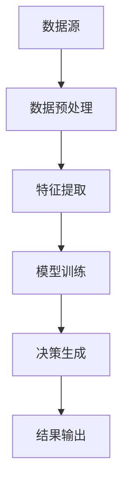
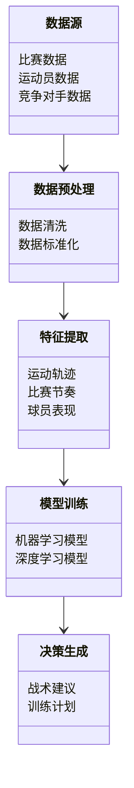
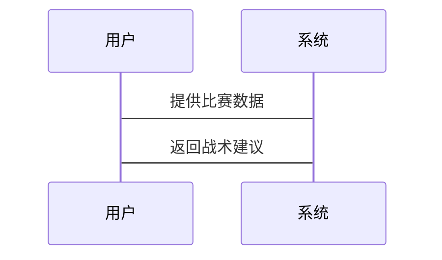

                 


# 体育AI Agent：赛事分析与训练辅助

## 关键词：
体育AI Agent，赛事分析，训练辅助，人工智能，机器学习，系统架构设计

## 摘要：
体育AI Agent是一种利用人工智能技术进行赛事分析和训练辅助的系统。本文将从背景、核心概念、算法原理、系统架构设计、项目实战到最佳实践，全面介绍体育AI Agent的应用与发展。通过详细的技术分析和实际案例，揭示体育AI Agent如何利用机器学习、深度学习、计算机视觉等技术，提升赛事分析的效率和运动员训练的效果。本文适合体育教练、运动员、AI开发者以及对体育科技感兴趣的读者阅读。

---

## 第一部分：体育AI Agent概述

### 第1章：体育AI Agent的背景与应用

#### 1.1 体育AI Agent的起源与发展
- **1.1.1 人工智能在体育领域的起源**  
  人工智能（AI）技术在体育领域的应用可以追溯到20世纪末。早期的研究主要集中在数据分析和模式识别，例如利用统计学方法分析运动员的表现数据。

- **1.1.2 体育AI Agent的发展历程**  
  随着计算能力的提升和数据量的增加，AI技术在体育领域的应用逐渐从简单的数据分析扩展到复杂的决策支持。例如，2010年后，AI开始被用于足球战术分析和篮球比赛策略优化。

- **1.1.3 当前体育AI Agent的应用现状**  
  当前，体育AI Agent已在多个领域得到广泛应用，包括赛事数据分析、运动员训练计划优化、伤病预测等。例如，NBA球队已经开始使用AI系统来分析球员的运动轨迹和比赛策略。

#### 1.2 体育AI Agent的核心概念
- **1.2.1 什么是体育AI Agent**  
  体育AI Agent是一种能够自主学习和决策的智能系统，能够根据实时数据和历史信息，为教练和运动员提供个性化的分析和建议。

- **1.2.2 体育AI Agent的核心特征**  
  - **数据驱动**：依赖大量数据进行分析和决策。  
  - **自主学习**：能够通过强化学习和深度学习技术不断优化自身模型。  
  - **实时反馈**：能够实时处理比赛数据并提供即时反馈。

- **1.2.3 体育AI Agent的应用场景**  
  - 赛事数据分析：例如足球比赛的战术分析和对手行为预测。  
  - 运动员训练辅助：例如个性化训练计划的制定和运动损伤预测。  
  - 体育商业应用：例如赞助商选择和赛事推广策略优化。

#### 1.3 体育AI Agent的应用价值
- **1.3.1 提高赛事分析效率**  
  AI Agent能够快速处理大量数据，帮助教练和分析师发现数据中的隐藏规律。

- **1.3.2 优化运动员训练计划**  
  通过AI Agent的分析，可以制定更加科学和个性化的训练计划，提高运动员的表现。

- **1.3.3 体育AI Agent在商业中的应用**  
  例如，利用AI Agent分析观众的行为数据，优化广告投放策略和票务销售。

#### 1.4 体育AI Agent的技术基础
- **1.4.1 人工智能技术基础**  
  包括机器学习、深度学习、自然语言处理等技术。

- **1.4.2 大数据分析在体育中的应用**  
  利用大数据分析技术，可以提取运动员和比赛的特征，为AI Agent提供输入数据。

- **1.4.3 计算机视觉与自然语言处理在体育中的应用**  
  计算机视觉技术可以用于分析视频数据，例如识别运动员的动作和位置。自然语言处理技术可以用于分析比赛评论和新闻，提取有用的信息。

#### 1.5 本章小结
本章介绍了体育AI Agent的背景、核心概念、应用价值和技术基础，为后续章节的深入分析奠定了基础。

---

## 第二部分：体育AI Agent的核心技术

### 第2章：体育AI Agent的核心概念与联系

#### 2.1 核心概念原理
- **2.1.1 AI Agent的基本原理**  
  AI Agent通过感知环境、处理信息、制定决策并执行动作来实现目标。在体育领域，AI Agent可以感知比赛数据、分析战术并提供决策建议。

- **2.1.2 体育AI Agent的特征**  
  - 数据驱动：依赖实时和历史数据进行分析。  
  - 自主学习：能够通过强化学习优化决策模型。  
  - 实时反馈：能够快速响应比赛中的变化。

- **2.1.3 体育AI Agent与传统数据分析的区别**  
  传统数据分析主要是对历史数据进行统计分析，而AI Agent能够实时处理数据并提供动态决策支持。

#### 2.2 核心概念对比表
以下是一个对比表格，展示了体育AI Agent与其他数据分析方法的区别：

| 特性                 | 传统数据分析 | AI Agent |
|----------------------|--------------|----------|
| 数据处理能力         | 离线分析     | 实时分析 |
| 决策能力             | 依赖人工     | 自主决策 |
| 学习能力             | 固定模型     | 自主学习 |

#### 2.3 ER实体关系图
以下是体育AI Agent系统的ER实体关系图：

```mermaid
erDiagram
    player(player_id, name, position, stats) {
        stats : score, assists, rebounds
    }
    match(match_id, date, home_team, away_team, score) {
        score : home_score, away_score
    }
    action(action_id, player_id, match_id, type, time) {
        type : pass, shoot, defend
        time : seconds
    }
    AI-Agent(ai_id, model_version, training_data, decision) {
        decision : action建议, 策略调整
    }
    player --> action: 执行动作
    match --> action: 发生在比赛中
    AI-Agent --> action: 分析动作
```

#### 2.4 本章小结
本章通过对比分析和ER图，详细解释了体育AI Agent的核心概念及其与其他数据分析方法的区别。

---

### 第3章：体育AI Agent的算法原理

#### 3.1 算法原理概述
- **3.1.1 常见的AI算法在体育中的应用**  
  包括机器学习（如线性回归、随机森林）、深度学习（如卷积神经网络、循环神经网络）等。

- **3.1.2 机器学习在体育AI Agent中的应用**  
  例如，利用线性回归模型预测运动员的得分。

- **3.1.3 深度学习在体育AI Agent中的应用**  
  例如，利用卷积神经网络分析比赛视频，识别运动员的动作和位置。

#### 3.2 机器学习算法的数学模型
以下是线性回归的数学公式：

$$ y = \beta_0 + \beta_1x + \epsilon $$

其中，$y$ 是预测目标，$x$ 是输入特征，$\beta_0$ 和 $\beta_1$ 是模型参数，$\epsilon$ 是误差项。

#### 3.3 深度学习算法的数学模型
以下是卷积神经网络（CNN）的损失函数：

$$ L = -\frac{1}{m}\sum_{i=1}^{m} [y_i \log(p_i) + (1 - y_i)\log(1 - p_i)] $$

其中，$m$ 是样本数量，$y_i$ 是真实标签，$p_i$ 是预测概率。

#### 3.4 本章小结
本章通过数学公式和算法流程图，详细解释了机器学习和深度学习在体育AI Agent中的应用。

---

### 第4章：体育AI Agent的系统架构设计

#### 4.1 系统架构概述
以下是体育AI Agent的系统架构图：



#### 4.2 系统功能设计
以下是系统功能设计的领域模型：



#### 4.3 系统接口设计
以下是系统接口设计的序列图：



#### 4.4 本章小结
本章通过系统架构图和序列图，详细描述了体育AI Agent的系统设计和接口设计。

---

## 第三部分：体育AI Agent的项目实战

### 第5章：体育AI Agent的项目实战

#### 5.1 环境安装
- **安装Python**：确保安装了Python 3.8以上版本。
- **安装依赖库**：包括NumPy、Pandas、Scikit-learn、TensorFlow、Keras、OpenCV等。

#### 5.2 代码实现
以下是Python代码示例：

```python
import numpy as np
import pandas as pd
from sklearn.linear_model import LinearRegression
from sklearn.metrics import mean_squared_error

# 数据加载
data = pd.read_csv('player_stats.csv')

# 特征和目标分离
X = data[['assists', 'rebounds']]
y = data['score']

# 模型训练
model = LinearRegression()
model.fit(X, y)

# 模型预测
y_pred = model.predict(X)

# 模型评估
mse = mean_squared_error(y, y_pred)
print(f'Mean Squared Error: {mse}')
```

#### 5.3 实际案例分析
以下是一个足球比赛分析的案例：

假设我们有一个足球比赛的数据集，包括每个球员的位置和传球数据。我们可以利用AI Agent分析球员的传球成功率，并为教练提供优化建议。

#### 5.4 本章小结
本章通过实际代码示例，展示了如何利用Python和机器学习库实现体育AI Agent。

---

## 第四部分：最佳实践与总结

### 第6章：体育AI Agent的最佳实践

#### 6.1 小结
体育AI Agent已经在赛事分析和训练辅助中发挥了重要作用，未来随着AI技术的不断发展，其应用将更加广泛和深入。

#### 6.2 注意事项
- 数据隐私问题：在处理运动员数据时，需要注意数据隐私保护。  
- 模型优化：需要不断优化AI Agent的模型，以适应比赛的动态变化。

#### 6.3 拓展阅读
- 《机器学习实战》：深入理解机器学习算法的实现。  
- 《深度学习入门》：学习深度学习的基本原理和应用。  
- 《计算机视觉导论》：了解计算机视觉在体育分析中的应用。

#### 6.4 本章小结
本章总结了体育AI Agent的应用和发展，并提供了未来的研究方向和拓展阅读资料。

---

## 作者信息

作者：AI天才研究院/AI Genius Institute & 禅与计算机程序设计艺术 /Zen And The Art of Computer Programming

---

**本文为AI天才研究院原创，转载请注明出处。**

