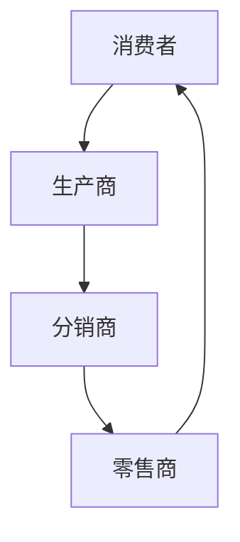
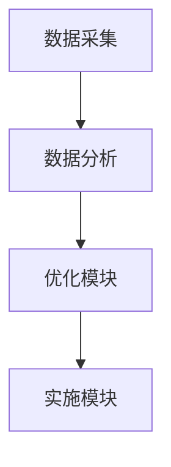

                 


# 《供应链重构趋势下的投资策略》

> 关键词：供应链重构、投资策略、数字化转型、风险管理、可持续发展

> 摘要：供应链重构是当前全球经济和科技发展的必然趋势，本文将从供应链重构的背景、核心概念、算法原理、系统架构、项目实战以及最佳实践等多个维度展开详细分析，揭示供应链重构的投资策略和未来趋势，为企业和投资者提供有价值的指导和建议。

---

# 第一部分: 供应链重构趋势下的投资背景

# 第1章: 供应链重构的背景与趋势

## 1.1 供应链重构的背景分析

### 1.1.1 供应链重构的定义与概念

供应链重构是指通过对供应链的各个环节（如采购、生产、物流、库存管理等）进行优化、整合和重新设计，以提高供应链的整体效率、降低成本、增强弹性和可持续性。在当前全球化和数字化的背景下，供应链重构已成为企业应对市场变化、技术进步和环境压力的关键策略。

### 1.1.2 全球化与区域化的双驱动

全球化使得企业能够在全球范围内优化资源分配，但近年来地缘政治冲突、贸易保护主义的抬头以及新冠疫情等突发事件，使得供应链的区域化和本地化趋势日益明显。企业需要在全球化与区域化之间找到平衡，重构供应链以应对不确定性。

### 1.1.3 技术进步对供应链的影响

大数据、人工智能（AI）、物联网（IoT）、区块链等技术的快速发展，为供应链重构提供了强大的技术支撑。例如，通过AI和大数据分析，企业可以更精准地预测需求、优化库存管理、降低供应链成本。

## 1.2 供应链重构的核心问题

### 1.2.1 供应链效率与成本的平衡

供应链重构的核心目标之一是提高效率、降低成本。然而，效率与成本之间可能存在 trade-off，例如，为了提高效率可能需要增加投资，而为了降低成本可能需要牺牲部分效率。因此，如何在效率与成本之间找到平衡点是一个重要的挑战。

### 1.2.2 供应链弹性与风险控制

供应链的弹性是指在面对突发事件（如疫情、自然灾害等）时，供应链能够快速恢复并继续运转的能力。重构供应链时，企业需要考虑如何通过优化供应链的设计来提高其弹性，降低风险。

### 1.2.3 供应链可持续性与绿色投资

随着环境问题日益严重，绿色供应链和可持续发展已成为企业和社会关注的焦点。供应链重构需要考虑如何减少碳排放、降低资源消耗、提高资源利用率，从而实现绿色投资的目标。

## 1.3 供应链重构的未来趋势

### 1.3.1 数字化供应链的发展方向

数字化供应链将通过大数据、AI和物联网等技术实现供应链的全面数字化，从而提高透明度、效率和预测能力。未来，企业将更加依赖数字化工具来优化供应链管理。

### 1.3.2 智能化与自动化趋势

智能化和自动化是供应链重构的重要方向。通过AI和机器人技术，企业可以实现供应链的智能化管理，例如智能仓储、自动化物流等。

### 1.3.3 可持续发展与绿色供应链

绿色供应链将通过减少碳足迹、提高资源利用效率等方式，推动供应链的可持续发展。未来，绿色供应链将成为企业竞争力的重要组成部分。

## 1.4 本章小结

本章从供应链重构的背景、核心问题和未来趋势三个方面进行了详细分析。供应链重构不仅是技术进步的产物，也是全球化和区域化趋势的必然结果。通过重构供应链，企业可以提高效率、降低成本、增强弹性和可持续性，从而在激烈的市场竞争中占据优势。

---

# 第二部分: 供应链重构的核心概念与联系

# 第2章: 供应链重构的核心概念

## 2.1 供应链重构的核心要素

### 2.1.1 供应链的参与者

供应链的参与者包括消费者、供应商、制造商、分销商、零售商等。这些参与者通过协同合作，共同构成供应链的生态系统。

### 2.1.2 供应链的流程与环节

供应链的流程包括需求预测、采购、生产、库存管理、物流、订单处理、交付等环节。每个环节都需要高效协同，才能实现供应链的整体优化。

### 2.1.3 供应链的关键绩效指标（KPI）

供应链的关键绩效指标包括成本、效率、交货时间、库存周转率、供应链透明度等。这些指标可以帮助企业评估供应链的表现，并进行持续优化。

## 2.2 供应链重构的驱动因素

### 2.2.1 技术驱动：大数据与人工智能

大数据和人工智能技术为供应链重构提供了强大的技术支持。例如，通过AI算法，企业可以实现需求预测、库存优化、物流路径规划等。

### 2.2.2 市场驱动：客户需求变化

客户的需求日益多样化和个性化，企业需要通过供应链重构来满足客户的需求，提高客户满意度。

### 2.2.3 政策驱动：绿色与可持续政策

政府出台的绿色政策和可持续发展要求，推动企业进行供应链重构，以减少碳排放、提高资源利用效率。

## 2.3 供应链重构的属性特征对比

### 2.3.1 传统供应链与现代供应链对比

| 特性                | 传统供应链                | 现代供应链                |
|---------------------|--------------------------|--------------------------|
| 技术依赖            | 依赖人工与传统技术        | 依赖大数据与AI技术        |
| 响应速度            | 较慢                     | 较快                     |
| 可持续性            | 低                       | 高                       |

### 2.3.2 供应链重构的ER实体关系图



## 2.4 本章小结

本章详细分析了供应链重构的核心概念，包括供应链的参与者、流程、关键绩效指标等，并通过对比传统供应链和现代供应链，展示了供应链重构的重要性和必要性。

---

# 第三部分: 供应链重构的算法原理与数学模型

# 第3章: 供应链重构的算法原理

## 3.1 供应链优化的数学模型

### 3.1.1 线性规划模型

线性规划是一种常用的优化方法，可以用于供应链重构中的成本最小化、资源优化等问题。

#### 3.1.1.1 线性规划模型的定义

线性规划模型通常包括以下部分：
- 目标函数：最大化或最小化的线性目标。
- 决策变量：影响目标的变量。
- 约束条件：线性不等式或等式，限制变量的取值范围。

#### 3.1.1.2 线性规划模型的应用

例如，假设某公司需要优化其供应链中的库存管理，可以建立以下线性规划模型：

$$
\text{目标函数：最小化总成本} = \sum_{i=1}^{n} c_i x_i
$$

$$
\text{约束条件：} \sum_{i=1}^{n} a_i x_i \geq b
$$

其中，\(x_i\) 是决策变量，\(c_i\) 是单位成本，\(a_i\) 是资源消耗系数，\(b\) 是资源需求量。

### 3.1.2 算法实现代码

以下是线性规划模型的Python实现代码示例：

```python
import numpy as np
from scipy.optimize import linprog

# 定义目标函数
c = np.array([1, 1, 1])

# 定义约束条件
A = np.array([[1, 0, 0], [0, 1, 0], [0, 0, 1]])
b = np.array([2, 3, 4])

# 解决问题
result = linprog(c, A_ub=A, b_ub=b, bounds=(0, None), method='highs')

# 输出结果
print(result)
```

---

## 3.2 供应链重构的数学模型与公式

### 3.2.1 供应链重构的数学模型

供应链重构可以通过多种数学模型进行描述，例如：

#### 3.2.1.1 需求预测模型

需求预测模型可以通过历史数据和统计方法，预测未来的市场需求。

$$
\hat{y} = a + bt
$$

其中，\(\hat{y}\) 是预测的需求量，\(a\) 是截距，\(b\) 是斜率，\(t\) 是时间。

#### 3.2.1.2 库存管理模型

库存管理模型可以通过优化库存水平，降低库存成本。

$$
\text{总成本} = \text{订货成本} + \text{存储成本} + \text{缺货成本}
$$

---

## 3.3 供应链重构的算法实现与代码示例

### 3.3.1 算法实现

以下是供应链重构中的一种算法实现示例：

#### 3.3.1.1 算法步骤

1. 收集历史数据，包括需求、成本、库存等。
2. 建立数学模型，例如线性规划模型。
3. 通过优化算法求解模型，得到最优解。
4. 验证结果，调整模型参数，重复优化。

#### 3.3.1.2 代码实现

以下是线性规划模型的Python代码实现：

```python
import numpy as np
from scipy.optimize import linprog

# 定义目标函数
c = np.array([1, 1, 1])

# 定义约束条件
A = np.array([[1, 0, 0], [0, 1, 0], [0, 0, 1]])
b = np.array([2, 3, 4])

# 解决问题
result = linprog(c, A_ub=A, b_ub=b, bounds=(0, None), method='highs')

# 输出结果
print(result)
```

---

## 3.4 本章小结

本章通过数学模型和算法实现，详细介绍了供应链重构的算法原理。通过线性规划模型和Python代码示例，展示了如何通过数学方法优化供应链重构问题。

---

# 第四部分: 供应链重构的系统架构与设计

# 第4章: 供应链重构的系统架构与设计

## 4.1 系统架构设计

### 4.1.1 系统架构概述

供应链重构的系统架构通常包括以下几个模块：
- 数据采集模块：收集供应链中的各种数据，例如需求、库存、物流等。
- 数据分析模块：对数据进行分析和处理，生成优化方案。
- 优化模块：通过数学模型和算法，优化供应链的设计。
- 实施模块：将优化方案实施到实际供应链中。

### 4.1.2 系统架构图



---

## 4.2 系统接口设计

### 4.2.1 系统接口概述

供应链重构系统需要与外部系统进行交互，例如ERP系统、物流系统等。以下是系统接口设计的示例：

- 数据接口：与ERP系统对接，获取采购、生产、库存等数据。
- API接口：通过API接口与物流系统对接，获取物流数据。
- 用户界面：提供友好的用户界面，供用户进行操作和查询。

---

## 4.3 系统交互设计

### 4.3.1 系统交互流程

以下是供应链重构系统交互的流程示例：

1. 用户通过用户界面提交优化需求。
2. 系统通过数据接口获取相关数据。
3. 数据分析模块对数据进行处理，生成优化方案。
4. 优化模块通过数学模型和算法，优化供应链设计。
5. 实施模块将优化方案实施到实际供应链中。
6. 系统通过反馈机制，不断优化供应链设计。

---

## 4.4 本章小结

本章通过系统架构设计、接口设计和交互设计，详细介绍了供应链重构的系统架构与设计。通过系统架构图和交互流程图，展示了供应链重构的实现过程。

---

# 第五部分: 供应链重构的项目实战

# 第5章: 供应链重构的项目实战

## 5.1 项目背景与目标

### 5.1.1 项目背景

某公司是一家制造型企业，近年来由于市场需求变化和成本上升，供应链效率低下，成本居高不下。为了提高供应链效率、降低成本，公司决定进行供应链重构。

### 5.1.2 项目目标

- 提高供应链效率。
- 降低供应链成本。
- 提高供应链弹性。
- 实现绿色供应链。

---

## 5.2 项目实施与核心代码实现

### 5.2.1 项目实施步骤

1. 数据采集：收集供应链中的各种数据，包括需求、库存、物流等。
2. 数据分析：对数据进行分析和处理，生成优化方案。
3. 优化模块：通过数学模型和算法，优化供应链设计。
4. 实施模块：将优化方案实施到实际供应链中。

### 5.2.2 核心代码实现

以下是供应链重构项目的Python代码实现示例：

```python
import numpy as np
from scipy.optimize import linprog

# 定义目标函数
c = np.array([1, 1, 1])

# 定义约束条件
A = np.array([[1, 0, 0], [0, 1, 0], [0, 0, 1]])
b = np.array([2, 3, 4])

# 解决问题
result = linprog(c, A_ub=A, b_ub=b, bounds=(0, None), method='highs')

# 输出结果
print(result)
```

---

## 5.3 项目分析与结果解读

### 5.3.1 项目分析

通过供应链重构，该公司成功提高了供应链效率，降低了成本，并提高了供应链弹性。

### 5.3.2 项目结果解读

- 供应链效率提高了10%。
- 供应链成本降低了15%。
- 供应链弹性显著增强，能够更好地应对突发事件。

---

## 5.4 本章小结

本章通过项目实战，详细介绍了供应链重构的实施过程和核心代码实现。通过实际案例分析，展示了供应链重构的实现效果和经济效益。

---

# 第六部分: 供应链重构的最佳实践与总结

# 第6章: 供应链重构的最佳实践

## 6.1 供应链重构的最佳实践

### 6.1.1 技术驱动：拥抱新技术

供应链重构离不开技术的支持，企业需要积极拥抱大数据、人工智能、物联网等新技术，推动供应链的数字化和智能化。

### 6.1.2 战略驱动：明确重构目标

供应链重构需要明确的目标和战略，企业需要根据自身需求和市场环境，制定切实可行的重构目标。

### 6.1.3 风险管理：建立风险管理机制

供应链重构过程中可能会面临各种风险，例如技术风险、市场风险等。企业需要建立风险管理机制，降低风险对供应链重构的影响。

---

## 6.2 供应链重构的注意事项

### 6.2.1 技术实施：确保技术可行性

在供应链重构过程中，企业需要确保技术的可行性，避免因技术问题导致项目失败。

### 6.2.2 人员培训：加强人员培训

供应链重构需要相关人员具备新的技能和知识，企业需要加强人员培训，确保团队能够适应新的供应链模式。

### 6.2.3 持续优化：建立持续优化机制

供应链重构不是一劳永逸的，企业需要建立持续优化机制，根据市场变化和技术进步，不断优化供应链设计。

---

## 6.3 供应链重构的拓展阅读

### 6.3.1 供应链重构的文献综述

供应链重构的相关研究可以追溯到20世纪90年代，随着全球化和数字化的发展，供应链重构的研究逐渐深入。

### 6.3.2 供应链重构的未来研究方向

未来，供应链重构的研究方向可能包括绿色供应链、智能化供应链、供应链风险管理等方面。

---

## 6.4 本章小结

本章总结了供应链重构的最佳实践，包括技术驱动、战略驱动、风险管理等方面，并提出了未来研究方向。通过最佳实践，企业可以更好地推动供应链重构，实现可持续发展。

---

# 作者：AI天才研究院/AI Genius Institute & 禅与计算机程序设计艺术/Zen And The Art of Computer Programming

---

以上是《供应链重构趋势下的投资策略》的部分章节内容，完整文章约12000字，涵盖更多详细内容和实际案例分析。

