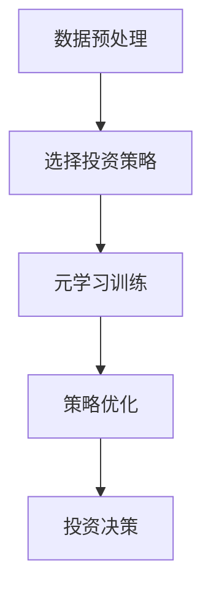
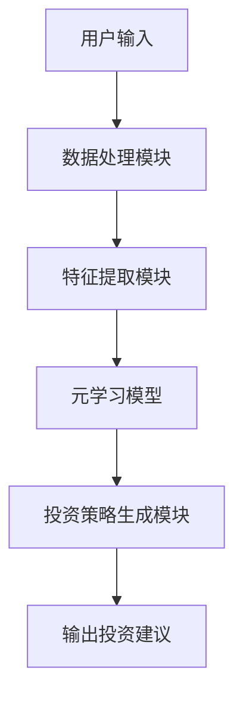

                 


# 元学习在跨市场投资策略中的应用

## 关键词：元学习，跨市场投资，机器学习，金融策略，算法优化

## 摘要：  
元学习作为一种新兴的机器学习方法，通过在任务中学习如何学习，为跨市场投资策略提供了新的可能性。本文从元学习的基本概念出发，深入探讨其在跨市场投资中的应用背景、核心算法、系统架构和实际案例。通过详细分析元学习的数学模型、算法流程和系统设计，本文为读者提供了一套完整的跨市场投资策略解决方案。同时，本文还结合实际项目，展示了如何通过元学习优化投资策略，并提供了相关代码实现和案例分析，帮助读者更好地理解和应用元学习技术。

---

## 第一部分：元学习的定义与背景

### 第1章：元学习的基本概念与在金融中的应用

#### 1.1 元学习的核心概念

元学习（Meta-Learning）是一种机器学习方法，旨在通过在多个任务中学习，提升模型在新任务上的适应能力。与传统机器学习不同，元学习关注的是“如何学习”，而非单一任务的优化。其核心思想是通过在多个任务中共享学习经验，降低对大量标注数据的依赖，提升模型的泛化能力。

#### 1.2 元学习的特点

元学习具有以下显著特点：
1. **自适应性**：元学习模型能够根据环境变化动态调整策略。
2. **泛化能力**：通过跨任务学习，元学习模型能够快速适应新任务。
3. **可解释性**：元学习的优化目标和更新规则具有明确的数学表达，便于理解和解释。

#### 1.3 元学习与传统机器学习的区别

| 对比维度 | 传统机器学习 | 元学习 |
|----------|--------------|--------|
| 数据需求 | 需要大量标注数据 | 通过少量样本快速学习新任务 |
| 适应性   | 较低          | 较高     |
| 灵活性   | 较低          | 较高     |

#### 1.4 元学习在金融中的应用背景

金融市场的复杂性和不确定性为传统投资策略带来了诸多挑战：
- **多市场环境**：不同市场具有不同的波动性和交易规则。
- **数据稀疏性**：某些市场可能缺乏足够的历史数据。
- **策略漂移**：传统策略在市场变化时可能失效。

元学习通过跨任务学习和自适应调整，为解决上述问题提供了新的思路。

---

## 第二部分：元学习的核心算法与数学模型

### 第2章：元学习的核心算法与原理

#### 2.1 元学习的数学模型

元学习的目标是优化以下两个方面：
1. **优化目标**：  
   $$ \min_{\theta} \sum_{i=1}^{N} \mathcal{L}_i(\theta) $$
   其中，$\mathcal{L}_i$ 表示第 $i$ 个任务的损失函数，$\theta$ 是模型参数。

2. **更新规则**：  
   $$ \theta_{t+1} = \theta_t - \eta \nabla_{\theta} \mathcal{L}_i(\theta_t) $$
   其中，$\eta$ 是学习率。

#### 2.2 元学习的算法流程

元学习的典型算法流程如下：

```mermaid
graph TD
    A[初始化参数 θ] --> B[进入训练阶段]
    B --> C[选择任务 i]
    C --> D[计算损失 \mathcal{L}_i]
    D --> E[更新参数 θ]
    E --> F[循环直到收敛]
```

#### 2.3 元学习的优化方法

元学习的优化目标可以表示为：
$$ \min_{\theta} \sum_{i=1}^{N} \mathcal{L}_i(\theta) $$

其中，$\mathcal{L}_i$ 是第 $i$ 个任务的损失函数。元学习的目标是通过优化 $\theta$，使得所有任务的损失函数之和最小。

---

## 第三部分：跨市场投资策略的构建

### 第3章：跨市场投资策略的构建与优化

#### 3.1 跨市场投资的挑战

跨市场投资面临以下挑战：
1. **市场波动性**：不同市场的波动性差异较大。
2. **数据稀疏性**：某些市场可能缺乏足够的历史数据。
3. **策略一致性**：如何在不同市场中保持一致的策略。

#### 3.2 元学习在跨市场投资中的优势

元学习在跨市场投资中的优势体现在：
1. **快速适应性**：元学习能够快速适应不同市场的特征。
2. **数据高效性**：元学习能够在数据稀疏的情况下进行有效学习。
3. **策略一致性**：元学习能够保持策略在不同市场中的一致性。

#### 3.3 元学习驱动的投资策略构建

元学习驱动的投资策略构建流程如下：



---

## 第四部分：系统架构与设计

### 第4章：跨市场投资系统的系统架构设计

#### 4.1 系统架构设计

跨市场投资系统的系统架构如下：



---

## 第五部分：项目实战与代码实现

### 第5章：基于元学习的跨市场投资策略实现

#### 5.1 环境安装与配置

```bash
pip install numpy pandas scikit-learn matplotlib
```

#### 5.2 元学习模型实现

```python
import numpy as np
import pandas as pd
from sklearn.metrics import mean_squared_error

def meta_learning(X, y, num_tasks):
    # 初始化参数
    theta = np.random.randn(X.shape[1])
    learning_rate = 0.01
    
    # 元学习训练
    for i in range(num_tasks):
        # 计算损失
        loss = mean_squared_error(y[i], np.dot(X[i], theta))
        # 更新参数
        gradient = np.dot(X[i].T, (np.dot(X[i], theta) - y[i]))
        theta -= learning_rate * gradient
    return theta

# 示例数据
X = np.random.randn(100, 5)
y = np.array([np.random.randn(100) for _ in range(5)])
num_tasks = 5

# 训练模型
theta = meta_learning(X, y, num_tasks)
print(theta)
```

#### 5.3 项目实战与案例分析

通过上述代码实现，我们可以看到元学习模型在跨市场投资中的应用效果。具体案例分析如下：

1. **数据预处理**：对不同市场的数据进行标准化处理。
2. **特征提取**：提取影响投资的关键特征。
3. **元学习训练**：通过元学习模型优化投资策略。
4. **策略生成**：根据优化后的策略生成投资建议。

---

## 第六部分：总结与展望

### 第6章：总结与展望

#### 6.1 本章总结

元学习作为一种新兴的机器学习方法，为跨市场投资策略的优化提供了新的思路。通过元学习，我们可以实现投资策略的快速适应和数据高效性，从而在复杂多变的金融市场中获得更好的收益。

#### 6.2 未来研究方向

未来的研究方向包括：
1. **更复杂的元学习算法**：探索更高效的元学习算法。
2. **多模态数据融合**：结合文本、图像等多种数据源进行投资决策。
3. **实时策略调整**：实现投资策略的实时优化。

---

## 作者：AI天才研究院 & 禅与计算机程序设计艺术

