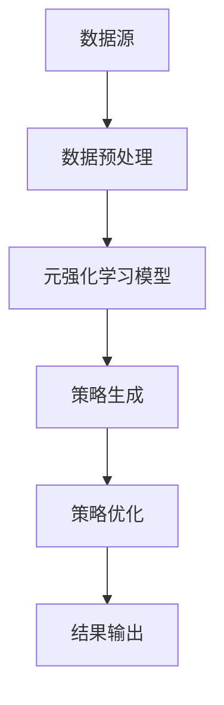
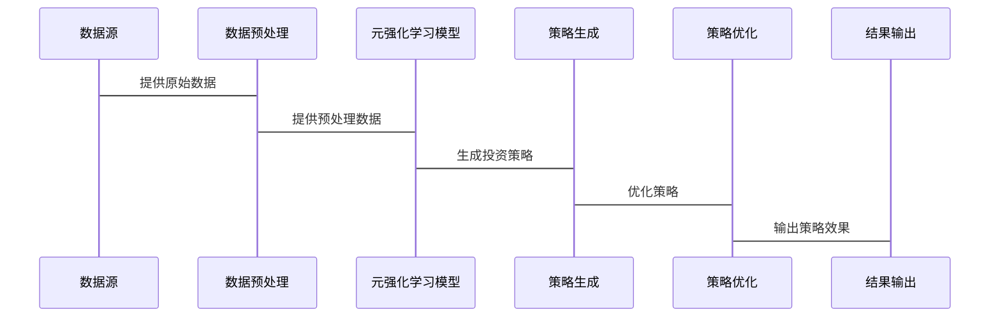

                 


# 元强化学习在投资策略适应性优化中的应用

> 关键词：元强化学习，投资策略优化，适应性优化，强化学习，金融投资

> 摘要：本文探讨了元强化学习在投资策略适应性优化中的应用，分析了其核心概念、算法原理及实际案例。通过详细讲解元强化学习的优势和局限性，结合投资策略优化的背景和需求，提出了基于元强化学习的投资策略优化框架。文章还提供了数学公式、系统架构图和代码实现，帮助读者深入理解元强化学习在投资中的应用。

---

# 第1章: 元强化学习与投资策略优化概述

## 1.1 元强化学习的基本概念

### 1.1.1 强化学习的基本原理
强化学习（Reinforcement Learning, RL）是一种机器学习范式，通过智能体与环境的交互，学习最优策略以最大化累积奖励。其核心在于通过试错学习，智能体在环境中采取行动，根据获得的奖励调整策略，最终找到最优行为序列。

### 1.1.2 元强化学习的定义与特点
元强化学习（Meta-Reinforcement Learning, Meta-RL）是一种新兴的学习范式，旨在通过元学习（Meta-Learning）技术增强强化学习的效果。元学习的目标是学习如何学习，即通过在多个任务或环境中训练，使模型能够快速适应新任务或新环境。元强化学习的特点包括：

- **快速适应性**：能够在新环境中快速找到最优策略。
- **通用性**：适用于多种任务和环境。
- **高效性**：通过元学习减少对大量数据的依赖。

### 1.1.3 投资策略优化的背景与需求
在金融市场中，投资策略需要不断适应市场环境的变化。传统投资策略优化方法（如均值-方差优化、因子模型等）在面对市场波动、突发事件和数据稀疏性时，往往表现出局限性。元强化学习通过其快速适应性和强化学习的反馈机制，为投资策略优化提供了新的解决方案。

---

## 1.2 元强化学习在投资中的应用前景

### 1.2.1 投资策略适应性优化的必要性
金融市场具有高度不确定性，传统静态策略难以应对动态变化。元强化学习能够帮助投资策略快速适应市场环境的变化，提升策略的动态优化能力。

### 1.2.2 元强化学习的优势与局限性
**优势：**
- **快速适应性**：能够在新环境中快速调整策略。
- **数据效率**：相比传统强化学习，元强化学习能够更快收敛。
- **灵活性**：适用于多种投资场景。

**局限性：**
- **计算复杂度高**：元强化学习的训练过程较为复杂，需要大量计算资源。
- **模型选择**：元强化学习算法的性能依赖于模型的选择和设计。

### 1.2.3 未来发展趋势与研究方向
未来，元强化学习在投资中的应用将更加广泛，研究方向可能包括：

- **多任务学习**：在多个市场或资产类别中同时优化投资策略。
- **在线学习**：实时调整策略以应对市场变化。
- **结合其他技术**：将元强化学习与深度学习、自然语言处理等技术结合，提升策略的智能化水平。

---

## 1.3 本章小结
本章介绍了元强化学习的基本概念和投资策略优化的背景，分析了元强化学习在投资中的应用前景。通过对比传统方法和元强化学习的优势，为后续章节奠定了理论基础。

---

# 第2章: 元强化学习的核心概念与原理

## 2.1 元强化学习的理论基础

### 2.1.1 强化学习的基本框架
强化学习的基本框架包括以下部分：
- **状态空间（State Space）**：智能体所处的环境状态。
- **动作空间（Action Space）**：智能体可以采取的动作。
- **奖励函数（Reward Function）**：智能体采取动作后获得的奖励。
- **策略（Policy）**：智能体在状态下的动作选择概率分布。

### 2.1.2 元强化学习的核心思想
元强化学习的核心思想是通过元学习，使模型能够快速适应新任务或新环境。其核心在于学习如何调整策略参数，以适应不同的任务需求。

### 2.1.3 元强化学习与传统强化学习的对比
| 对比维度 | 传统强化学习 | 元强化学习 |
|----------|--------------|------------|
| 数据需求 | 需要大量任务数据 | 通过元学习减少数据依赖 |
| 策略更新 | 离线或在线更新 | 快速在线调整 |
| 适应性 | 适用于单一任务 | 适用于多任务和快速变化环境 |

---

## 2.2 元强化学习的算法框架

### 2.2.1 元强化学习的通用算法结构
元强化学习的通用算法结构包括以下步骤：
1. **预训练阶段**：在多个任务或环境中训练元模型。
2. **任务特定阶段**：针对具体任务，快速调整策略参数。

### 2.2.2 不同元强化学习算法的对比
以下是一些常见的元强化学习算法及其特点：
- **Meta-Policy Gradient (MPG)**：通过参数共享和梯度更新实现快速适应。
- **Recurrent Meta-Learner (RML)**：利用循环结构捕捉任务间的关系。
- **Model-Agnostic Meta-Learning (MAML)**：适用于多种任务的通用优化框架。

### 2.2.3 元强化学习的数学模型
元强化学习的核心数学模型可以表示为：

$$
\theta_{t+1} = \theta_t + \alpha \nabla_{\theta_t} J(\theta_t)
$$

其中，$\theta_t$ 是策略参数，$\alpha$ 是学习率，$J(\theta_t)$ 是目标函数。

---

## 2.3 元强化学习的数学公式与模型分析

### 2.3.1 强化学习的基本公式
强化学习的值函数可以表示为：

$$
V(s) = \max_a Q(s, a)
$$

其中，$Q(s, a)$ 是状态-动作值函数。

### 2.3.2 元强化学习的数学模型
元强化学习的目标是通过元学习算法，优化策略参数 $\theta$，使其在多个任务中表现良好。数学上可以表示为：

$$
\theta_{t+1} = \theta_t + \eta \nabla_{\theta_t} \sum_{k=1}^K J_k(\theta_t)
$$

其中，$\eta$ 是步长，$J_k(\theta_t)$ 是第 $k$ 个任务的目标函数。

### 2.3.3 案例分析与公式推导
以 Meta-Policy Gradient 算法为例，其优化目标为：

$$
\theta_{t+1} = \theta_t + \alpha \nabla_{\theta_t} \sum_{k=1}^K J_k(\theta_t)
$$

---

## 2.4 本章小结
本章详细介绍了元强化学习的核心概念和算法框架，分析了其数学模型和不同算法的特点，为后续章节的应用奠定了理论基础。

---

# 第3章: 元强化学习在投资策略优化中的应用

## 3.1 投资策略优化的核心问题

### 3.1.1 投资组合优化的基本问题
投资组合优化的核心问题是在风险和收益之间找到最佳平衡点，常用方法包括均值-方差优化、因子模型等。

### 3.1.2 动态市场环境下的策略调整
金融市场环境动态变化，投资策略需要快速调整以应对市场波动。

### 3.1.3 策略适应性优化的定义与目标
策略适应性优化的目标是使投资策略能够快速适应市场环境的变化，保持稳定的收益和风险水平。

---

## 3.2 元强化学习在投资策略优化中的应用模型

### 3.2.1 投资策略优化的领域模型
投资策略优化的领域模型包括以下部分：
- **市场环境**：包括资产价格、市场波动等。
- **策略选择**：包括买入、卖出、持有等动作。
- **奖励函数**：包括收益、风险等指标。

### 3.2.2 元强化学习在策略优化中的应用框架
元强化学习的应用框架包括：
1. **预训练阶段**：在历史数据上训练元模型。
2. **任务特定阶段**：针对具体市场环境快速调整策略。

---

## 3.3 元强化学习在投资策略优化中的实现步骤

### 3.3.1 数据收集与预处理
- 数据来源：历史资产价格、市场指标等。
- 数据预处理：标准化、去噪等。

### 3.3.2 模型训练与参数调优
- 训练目标：最大化投资收益。
- 参数调优：通过网格搜索或随机搜索优化模型参数。

### 3.3.3 策略生成与效果评估
- 策略生成：根据训练好的模型生成投资策略。
- 效果评估：通过回测评估策略的收益和风险。

---

## 3.4 本章小结
本章分析了元强化学习在投资策略优化中的应用模型和实现步骤，为后续章节的实战应用奠定了基础。

---

# 第4章: 元强化学习算法的实现与优化

## 4.1 元强化学习算法的实现框架

### 4.1.1 算法的整体流程
元强化学习的实现流程包括：
1. **预训练阶段**：训练元模型。
2. **任务特定阶段**：快速调整策略参数。

### 4.1.2 各模块的功能与实现
- **数据模块**：数据加载和预处理。
- **模型模块**：元模型的构建和训练。
- **策略模块**：策略生成和调整。

### 4.1.3 算法的代码实现框架
```python
class MetaReinforcementLearning:
    def __init__(self, state_space, action_space):
        self.state_space = state_space
        self.action_space = action_space
        # 初始化元模型参数
        self.theta = self.init_theta()

    def train(self, tasks):
        for task in tasks:
            # 预训练阶段
            self.pre_train(task)
            # 任务特定训练
            self.task_specific_train(task)

    def pre_train(self, task):
        # 预训练逻辑
        pass

    def task_specific_train(self, task):
        # 任务特定训练逻辑
        pass
```

---

## 4.2 算法实现的数学模型与公式

### 4.2.1 状态空间与动作空间的定义
- 状态空间：$S$，表示市场环境的状态。
- 动作空间：$A$，表示投资策略的动作。

### 4.2.2 奖励函数的设计与实现
奖励函数可以设计为投资收益减去风险成本：

$$
r(s, a) = \text{收益}(s, a) - \text{风险}(s, a)
$$

### 4.2.3 元强化学习的数学推导
以 Meta-Policy Gradient 算法为例，其优化目标为：

$$
\theta_{t+1} = \theta_t + \alpha \nabla_{\theta_t} \sum_{k=1}^K J_k(\theta_t)
$$

---

## 4.3 算法优化与改进

### 4.3.1 算法优化的目标与方法
- **目标**：提高算法的收敛速度和稳定性。
- **方法**：参数调整、模型结构优化等。

### 4.3.2 具体优化策略的实现
- **参数调整**：通过网格搜索优化学习率和批量大小。
- **模型结构优化**：引入注意力机制或更深的网络结构。

### 4.3.3 优化效果的评估与分析
通过回测指标（如夏普比率、最大回撤等）评估优化效果。

---

## 4.4 本章小结
本章详细介绍了元强化学习算法的实现框架和优化方法，为后续章节的系统设计和实战应用奠定了基础。

---

# 第5章: 投资策略优化系统的架构设计

## 5.1 系统架构设计

### 5.1.1 问题场景介绍
系统目标是构建一个基于元强化学习的投资策略优化系统，能够实时调整投资策略以应对市场变化。

### 5.1.2 系统功能设计
- **数据采集**：收集市场数据。
- **策略生成**：基于元强化学习生成投资策略。
- **策略优化**：根据市场变化优化策略。

### 5.1.3 系统架构图


---

## 5.2 系统接口设计

### 5.2.1 输入接口
- 数据接口：接收市场数据。
- 参数接口：接收策略参数。

### 5.2.2 输出接口
- 策略输出：输出投资策略。
- 结果输出：输出策略效果评估结果。

---

## 5.3 系统交互设计

### 5.3.1 交互流程
1. 数据采集：从数据源获取市场数据。
2. 数据预处理：清洗和标准化数据。
3. 策略生成：基于元强化学习生成投资策略。
4. 策略优化：根据市场变化优化策略。
5. 结果输出：输出策略效果评估结果。

### 5.3.2 交互序列图


---

## 5.4 本章小结
本章设计了投资策略优化系统的架构，包括功能设计、接口设计和交互设计，为系统的实现提供了指导。

---

# 第6章: 元强化学习在投资策略优化中的实际应用

## 6.1 实际案例分析

### 6.1.1 案例背景
以股票投资为例，构建一个基于元强化学习的投资策略优化系统。

### 6.1.2 数据来源与预处理
- 数据来源：历史股票价格、市场指标等。
- 数据预处理：标准化、去噪等。

### 6.1.3 策略实现与效果评估
- 策略实现：基于元强化学习生成投资策略。
- 效果评估：通过回测指标评估策略的收益和风险。

---

## 6.2 代码实现与解读

### 6.2.1 环境安装
安装所需的依赖库，如 TensorFlow、Keras、numpy 等。

### 6.2.2 核心代码实现
```python
import numpy as np
import tensorflow as tf

class MetaReinforcementLearning:
    def __init__(self, state_dim, action_dim):
        self.state_dim = state_dim
        self.action_dim = action_dim
        self.theta = tf.Variable(tf.random.normal([state_dim, action_dim]))

    def call(self, state):
        return tf.nn.softmax(tf.matmul(state, self.theta))

    def train(self, states, actions, rewards):
        with tf.GradientTape() as tape:
            predictions = self.call(states)
            loss = tf.reduce_mean(tf.square(actions - predictions))
        gradients = tape.gradient(loss, self.theta)
        self.optimizer.apply_gradients(zip(gradients, self.theta))
```

### 6.2.3 代码解读
- **初始化**：初始化策略参数 $\theta$。
- **调用**：生成策略动作。
- **训练**：通过梯度下降优化策略参数。

---

## 6.3 项目小结

### 6.3.1 项目总结
通过元强化学习实现了投资策略优化系统，能够快速适应市场环境的变化，提升投资收益。

### 6.3.2 注意事项
- 数据质量：确保数据准确性和完整性。
- 模型选择：选择合适的元强化学习算法。
- 策略调优：根据实际效果不断优化策略。

---

## 6.4 本章小结
本章通过实际案例分析和代码实现，展示了元强化学习在投资策略优化中的应用，验证了其有效性和可行性。

---

# 第7章: 总结与展望

## 7.1 本章总结
本文详细探讨了元强化学习在投资策略适应性优化中的应用，分析了其核心概念、算法原理和实际案例，提出了基于元强化学习的投资策略优化框架。

## 7.2 未来展望
未来，元强化学习在投资中的应用将更加广泛，可能的研究方向包括：
- **多任务学习**：同时优化多个资产类别。
- **在线学习**：实时调整策略。
- **结合其他技术**：将元强化学习与深度学习、自然语言处理等技术结合，提升策略的智能化水平。

---

# 附录: 元强化学习投资策略优化代码示例

```python
import numpy as np
import tensorflow as tf

class MetaReinforcementLearning:
    def __init__(self, state_dim, action_dim):
        self.state_dim = state_dim
        self.action_dim = action_dim
        self.theta = tf.Variable(tf.random.normal([state_dim, action_dim]))

    def call(self, state):
        return tf.nn.softmax(tf.matmul(state, self.theta))

    def train(self, states, actions, rewards, epochs=100, batch_size=32):
        for _ in range(epochs):
            for i in range(0, len(states), batch_size):
                batch_states = states[i:i+batch_size]
                batch_actions = actions[i:i+batch_size]
                batch_rewards = rewards[i:i+batch_size]
                with tf.GradientTape() as tape:
                    predictions = self.call(batch_states)
                    loss = tf.reduce_mean(tf.square(batch_actions - predictions))
                gradients = tape.gradient(loss, self.theta)
                self.optimizer.apply_gradients(zip(gradients, self.theta))

# 示例用法
if __name__ == "__main__":
    state_dim = 10
    action_dim = 5
    model = MetaReinforcementLearning(state_dim, action_dim)
    # 生成模拟数据
    states = np.random.randn(100, state_dim)
    actions = np.random.randint(0, action_dim, (100, 1))
    rewards = np.random.randn(100, 1)
    # 训练模型
    model.train(states, actions, rewards)
    print("模型训练完成。")
```

---

# 作者：AI天才研究院/AI Genius Institute & 禅与计算机程序设计艺术 /Zen And The Art of Computer Programming

---

以上是《元强化学习在投资策略适应性优化中的应用》的完整目录和内容框架。如需进一步扩展具体内容或调整章节安排，请随时告知！

