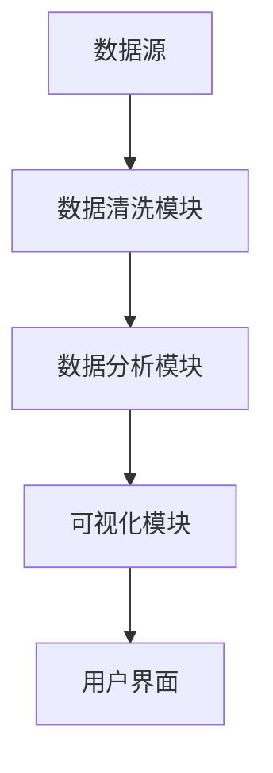

                 


# 全球经济体系市值与GDP比较分析

## 关键词：全球经济、GDP、市值、经济比较、数据分析、金融模型

## 摘要：本文系统地分析了全球经济体市值与GDP的关系，探讨了两者的计算方法、对比分析及实际应用，旨在帮助读者理解经济体系的内在联系和区域差异。

---

## 第1章: 全球经济体系的背景与重要性

### 1.1 经济体系的基本概念
- 经济体系的定义：指一个国家或地区内所有经济活动的组织方式，包括生产、分配和消费。
- 经济体系的类型：包括市场经济、计划经济、混合经济等。
- 经济体系的重要性：决定了资源分配、生产效率和财富分配方式。

### 1.2 市值与GDP的基本概念
- 市值：指某个经济体内所有上市公司股票的总价值，反映市场对经济的估值。
- GDP：国内生产总值，衡量一个国家或地区在一定时期内生产的最终产品和服务的总价值。
- 市值与GDP的关系：市值反映了市场的经济规模，而GDP反映了实际的经济产出。

### 1.3 全球经济体系的现状与趋势
- 全球经济的主要驱动力：技术创新、全球化和政策调控。
- 经济体系的区域差异：发达国家与发展中国家的经济结构不同。
- 当前经济趋势与挑战：全球经济一体化、通货膨胀、经济不平等加剧。

---

## 第2章: 市值与GDP的核心概念

### 2.1 市值的核心概念
- 市值的定义与计算：市值 = 股价 × 流通股本，反映市场对企业的估值。
- 市值的影响因素：企业盈利能力、市场预期、宏观经济环境等。
- 市值与企业价值的关系：市值是市场对企业价值的评估，可能高于或低于实际价值。

### 2.2 GDP的核心概念
- GDP的定义与计算：GDP = C（消费） + I（投资） + G（政府支出） + (X - M)（净出口）。
- GDP的组成部分：消费、投资、政府支出和净出口。
- GDP与国家经济实力的关系：GDP是衡量国家经济实力的重要指标，但不能完全反映经济效率和社会福利。

---

## 第3章: 市值与GDP的联系与对比

### 3.1 市值与GDP的联系
- 市值对GDP的影响：高市值企业往往推动GDP增长，特别是在高科技和服务业。
- GDP对市值的影响：经济繁荣时，企业盈利增加，市值上升。
- 两者关系的区域差异：发达国家市值与GDP高度相关，发展中国家可能存在较大差异。

### 3.2 市值与GDP的对比分析
- 数据来源对比：市值来自金融市场数据，GDP来自政府统计。
- 计算方法对比：市值基于市场价值，GDP基于生产价值。
- 应用场景对比：市值用于评估投资价值，GDP用于衡量经济规模和政策制定。

---

## 第4章: 数据收集与处理方法

### 4.1 数据来源
- 市值数据来源：股票交易所数据、金融信息服务商（如彭博、路透）。
- GDP数据来源：国家统计局、国际货币基金组织（IMF）。
- 数据来源的可靠性：选择权威机构数据，确保准确性。

### 4.2 数据清洗与预处理
- 数据清洗：处理缺失值、异常值和重复数据。
- 数据转换：将数据转换为统一的单位和时间跨度。
- 数据存储：使用数据库或数据框存储，方便后续分析。

---

## 第5章: 算法原理与数学模型

### 5.1 算法原理
- 计算市值与GDP的步骤：
  1. 收集数据。
  2. 清洗和预处理数据。
  3. 计算市值和GDP。
  4. 对比分析。

### 5.2 数学公式
- GDP计算公式：$$ GDP = C + I + G + (X - M) $$
- 市值计算公式：$$ 市值 = \text{股价} \times \text{流通股本} $$

### 5.3 Python代码实现
```python
import pandas as pd

# 示例数据
gdp_data = {'Year': [2018, 2019, 2020], 'GDP': [100, 105, 110]}
market_value_data = {'Year': [2018, 2019, 2020], 'Market_Value': [50, 55, 60]}

# 合并数据
merged_data = pd.merge(gdp_data, market_value_data, on='Year')
print(merged_data)
```

### 5.4 代码解读
- 数据合并：将GDP和市值数据按年份合并，便于比较。
- 数据分析：计算两者增长率，分析趋势。

---

## 第6章: 系统分析与架构设计

### 6.1 问题场景介绍
- 数据来源多样，格式不统一。
- 数据量大，需要高效处理。

### 6.2 项目介绍
- 开发一个比较分析工具，帮助用户理解市值与GDP的关系。

### 6.3 系统功能设计
- 数据收集模块：自动获取数据。
- 数据处理模块：清洗和预处理。
- 数据分析模块：计算和比较。
- 可视化模块：生成图表展示结果。

### 6.4 系统架构设计


### 6.5 接口设计
- 数据接口：REST API，提供数据查询服务。
- 用户界面：Web界面，展示分析结果。

---

## 第7章: 项目实战

### 7.1 环境安装
- 安装Python和相关库（pandas、numpy、matplotlib）。

### 7.2 核心实现
```python
import pandas as pd
import matplotlib.pyplot as plt

# 数据获取
gdp = pd.read_csv('gdp.csv')
market_value = pd.read_csv('market_value.csv')

# 数据合并
combined = pd.merge(gdp, market_value, on='Country')

# 数据分析
combined['GDP_growth'] = combined['GDP'].pct_change()
combined['Market_growth'] = combined['Market_Value'].pct_change()

# 可视化
plt.plot(combined['GDP_growth'], label='GDP Growth')
plt.plot(combined['Market_growth'], label='Market Growth')
plt.legend()
plt.show()
```

### 7.3 案例分析
- 以美国为例，分析其GDP和市值的变化趋势。
- 讨论两者之间的相关性，解释原因。

---

## 第8章: 结论与展望

### 8.1 结论
- 市值与GDP均是衡量经济的重要指标，但侧重点不同。
- 两者关系在不同国家和地区存在差异，需结合具体情况分析。

### 8.2 局限性
- 数据来源和计算方法可能影响结果。
- 忽略了非上市公司和地下经济的影响。

### 8.3 未来展望
- 引入更多经济指标，如失业率、通胀率，进行综合分析。
- 开发实时监控工具，帮助政策制定者及时调整。

---

## 作者：AI天才研究院 & 禅与计算机程序设计艺术

