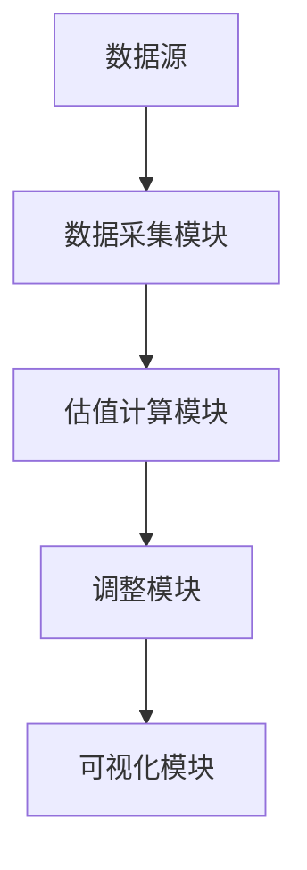
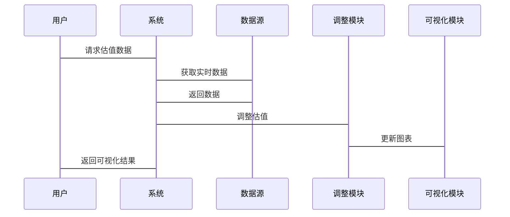

                 


# 全球股市估值与5G技术应用的关系

## 关键词：全球股市估值、5G技术、股票估值模型、市场情绪、技术驱动因素

## 摘要：本文探讨了5G技术对全球股市估值的影响，从定义、影响因素、数学模型、算法原理、系统设计、项目实战到最佳实践等方面进行了详细分析。文章旨在帮助投资者和科技爱好者理解5G技术如何改变股市估值，并为未来的投资决策提供参考。

---

# 第1章：全球股市估值的基本概念

## 1.1 股市估值的定义与影响因素

### 1.1.1 股市估值的定义
股市估值是指对股票价值的评估，通常基于企业的财务状况、行业地位、市场前景等因素。合理的估值有助于投资者做出明智的投资决策。

### 1.1.2 影响股市估值的主要因素
- **企业基本面**：包括收入、利润、负债等。
- **市场情绪**：投资者的心理和行为影响股市波动。
- **宏观经济因素**：如GDP增长率、通货膨胀率等。
- **行业特性**：不同行业的估值标准不同。

### 1.1.3 股市估值的指标与方法
常用的估值指标包括市盈率（P/E）、市净率（P/B）、股息率等。不同的指标适用于不同的行业和市场环境。

## 1.2 5G技术的定义与应用领域

### 1.2.1 5G技术的核心定义
5G技术是第五代移动通信技术，具有高速度、低延迟、大连接等特点，能够支持更广泛的应用场景。

### 1.2.2 5G技术的主要应用场景
- **智能手机**：提升用户体验，支持更高分辨率和更快的数据传输。
- **物联网（IoT）**：实现万物互联，支持智能家居、工业自动化等。
- **虚拟现实（VR）与增强现实（AR）**：提供更沉浸式的体验，应用于游戏、教育等领域。
- **车联网（V2X）**：实现车辆与道路基础设施、其他车辆的实时通信，支持自动驾驶。

### 1.2.3 5G技术对全球经济的影响
5G技术将推动多个行业的数字化转型，提升生产效率，创造新的商业模式，从而对全球经济产生深远影响。

---

# 第2章：5G技术对股市的影响概述

## 2.1 5G技术如何影响企业价值

### 2.1.1 5G技术对企业盈利的影响
5G技术的应用可以降低企业的运营成本，提高生产效率，从而提升企业的盈利能力。

### 2.1.2 5G技术对企业竞争力的提升
通过提供更高效、更智能的服务，5G技术可以帮助企业增强市场竞争力，吸引更多的客户。

### 2.1.3 5G技术对企业市场地位的改变
5G技术的普及将推动企业的技术升级，提升其在市场中的地位，尤其是在高科技行业。

## 2.2 5G技术对股市投资机会的影响

### 2.2.1 5G相关行业的投资机会
- **通信设备制造商**：如华为、中兴通讯等。
- **半导体公司**：如台积电、英伟达等。
- **软件和服务提供商**：如微软、谷歌等。

### 2.2.2 5G技术推动的新兴行业
- **物联网解决方案提供商**：如华为、西门子等。
- **车联网相关企业**：如特斯拉、博世等。
- **虚拟现实与增强现实企业**：如 Oculus、HTC等。

### 2.2.3 5G技术对传统行业的颠覆性影响
5G技术将推动传统行业如制造、物流、医疗等实现数字化转型，带来新的投资机会。

## 2.3 5G技术对股市风险的影响

### 2.3.1 5G技术带来的投资风险
- **技术风险**：5G技术的成熟度和商业化进程存在不确定性。
- **市场竞争风险**：5G技术的普及可能导致市场竞争加剧，影响企业的盈利能力。

### 2.3.2 5G技术对市场波动性的影响
5G技术的推广可能引发股市的短期波动，尤其是在技术突破和政策变化时。

### 2.3.3 5G技术对投资者决策的影响
投资者需要更加关注5G技术的最新进展和行业动态，以做出更明智的投资决策。

---

# 第3章：5G技术对全球股市估值的核心影响

## 3.1 5G技术对企业业绩的影响

### 3.1.1 5G技术对企业盈利能力的提升
通过优化生产流程和提高效率，5G技术可以帮助企业降低运营成本，提升盈利能力。

### 3.1.2 5G技术对企业成本的优化
5G技术的应用可以减少企业在通信和数据传输方面的成本，提升整体运营效率。

### 3.1.3 5G技术对企业创新的推动
5G技术为企业的创新提供了更多可能性，尤其是在人工智能、大数据等领域。

## 3.2 5G技术对行业估值的影响

### 3.2.1 5G技术对通信行业的估值影响
通信行业是5G技术的核心应用领域，其估值将随着5G网络的建设和普及而上升。

### 3.2.2 5G技术对科技行业的估值影响
科技行业（如半导体、软件开发）将因5G技术的广泛应用而受益，其估值将得到提升。

### 3.2.3 5G技术对制造业的估值影响
制造业的数字化转型将推动其估值上升，尤其是在智能制造和工业物联网领域。

## 3.3 5G技术对全球股市的整体影响

### 3.3.1 5G技术对全球股市的推动作用
5G技术的普及将推动全球经济的增长，从而对全球股市产生积极影响。

### 3.3.2 5G技术对股市结构的优化
5G技术的应用将优化股市结构，推动高科技行业的崛起，促进股市的健康发展。

### 3.3.3 5G技术对股市未来发展的潜在影响
5G技术将继续推动股市的创新和发展，尤其是在新技术和新商业模式的推动下。

---

# 第4章：5G技术对股市估值的数学模型与算法原理

## 4.1 股市估值的数学模型

### 4.1.1 股票估值的基本公式
股票的合理估值可以通过多种方法计算，如：

$$ V = \text{净利润} \times \text{市盈率} $$

其中，市盈率（P/E）是衡量股票估值的重要指标。

### 4.1.2 股票估值的多因素模型
多因素模型考虑了多个因素对股票估值的影响，例如：

$$ V = \alpha + \beta_1 R_m + \beta_2 SMB + \beta_3 HML + \epsilon $$

其中，\( R_m \) 是市场回报率，\( SMB \) 是小规模溢价，\( HML \) 是价值溢价。

### 4.1.3 5G技术对股票估值的权重调整
在考虑5G技术的影响时，需要对相关行业的权重进行调整。例如：

$$ V_{\text{调整后}} = V + \delta \times \text{5G技术影响程度} $$

其中，\( \delta \) 是调整系数，反映了5G技术对估值的影响程度。

## 4.2 5G技术对股市影响的算法原理

### 4.2.1 基于5G技术的股票估值算法
该算法通过分析5G技术对企业的具体影响，调整股票估值。步骤如下：

1. 收集相关企业的财务数据和5G技术应用情况。
2. 使用多因素模型计算股票的基本估值。
3. 根据5G技术的影响程度调整估值。

### 4.2.2 5G技术对市场情绪的影响算法
市场情绪可以通过分析投资者的行为数据来预测。例如：

$$ \text{市场情绪} = \alpha + \beta \times \text{5G技术新闻量} + \gamma \times \text{投资者信心指数} $$

### 4.2.3 5G技术对行业景气度的预测算法
行业景气度可以通过分析5G技术的应用情况和市场趋势来预测。例如：

$$ \text{行业景气度} = \alpha + \beta \times \text{5G技术普及率} + \gamma \times \text{市场需求} $$

## 4.3 算法实现与案例分析

### 4.3.1 算法实现步骤
1. 数据收集：收集相关企业的财务数据和5G技术应用情况。
2. 数据预处理：清洗数据，去除异常值。
3. 模型训练：使用多因素模型进行估值计算。
4. 结果调整：根据5G技术的影响程度调整估值。

### 4.3.2 案例分析：5G相关股票的估值变化
以某通信设备制造商为例，假设其净利润为10亿元，市盈率为20倍。在考虑5G技术的影响后，假设调整系数为10%，则调整后的估值为：

$$ V_{\text{调整后}} = 10 \times 20 + 0.1 \times 10 \times 20 = 200 + 20 = 220 \text{亿元} $$

### 4.3.3 案例分析：5G技术对行业估值的影响
以通信行业为例，假设行业整体估值为1000亿元，5G技术普及率提高10%，市场需求增长20%，则调整后的行业估值为：

$$ \text{行业景气度} = \alpha + 0.1 \times \text{5G技术普及率} + 0.2 \times \text{市场需求} $$

---

# 第5章：系统分析与架构设计方案

## 5.1 问题场景介绍
本章将分析如何构建一个基于5G技术的股市估值监测系统，帮助投资者实时监控5G相关股票的估值变化。

## 5.2 系统功能设计

### 5.2.1 系统功能模块
- **数据采集模块**：实时采集5G相关股票的市场数据。
- **估值计算模块**：基于多因素模型计算股票估值。
- **调整模块**：根据5G技术的影响调整估值。
- **可视化模块**：展示股票估值的变化趋势。

### 5.2.2 系统功能流程
1. 数据采集：从数据源获取股票市场数据。
2. 估值计算：使用多因素模型计算初始估值。
3. 调整估值：根据5G技术的影响进行调整。
4. 数据可视化：以图表形式展示估值变化。

## 5.3 系统架构设计

### 5.3.1 系统架构图


### 5.3.2 系统接口设计
- 数据接口：与股票数据源对接，获取实时数据。
- 用户接口：提供直观的可视化界面，供投资者查看估值变化。

### 5.3.3 系统交互流程图


---

# 第6章：项目实战

## 6.1 环境安装
为了运行本系统的代码，需要安装以下环境：
- Python 3.8及以上版本
- NumPy和Pandas库
- Matplotlib库
- 数据接口API（如Yahoo Finance API）

## 6.2 系统核心实现源代码

### 6.2.1 数据采集模块
```python
import numpy as np
import pandas as pd
import requests

def get_stock_data(ticker):
    url = f"https://query1.finance.yahoo.com/v8/finance/chart/{ticker}"
    response = requests.get(url)
    data = response.json()
    return pd.DataFrame(data['chart']['result'][0]['prices'])
```

### 6.2.2 估值计算模块
```python
def calculate_valuation(fundamentals, market_data):
    pe_ratio = market_data['pe_ratio']
   净利润 = fundamentals['net_profit']
    return 净利润 * pe_ratio
```

### 6.2.3 调整模块
```python
def adjust_for_5g(adjustment_factor, valuation):
    return valuation * (1 + adjustment_factor)
```

### 6.2.4 可视化模块
```python
import matplotlib.pyplot as plt

def plot_valuation_changes(original_valuations, adjusted_valuations):
    plt.figure(figsize=(10, 6))
    plt.plot(original_valuations, label='Original Valuations')
    plt.plot(adjusted_valuations, label='Adjusted Valuations')
    plt.xlabel('Time')
    plt.ylabel('Valuation')
    plt.legend()
    plt.show()
```

## 6.3 代码应用解读与分析
以上代码展示了如何构建一个简单的基于5G技术的股市估值监测系统。数据采集模块从Yahoo Finance获取实时数据，估值计算模块基于多因素模型计算股票估值，调整模块根据5G技术的影响调整估值，最后可视化模块展示估值变化趋势。

## 6.4 案例分析
以某5G相关股票为例，假设其初始估值为100亿元，5G技术的影响调整系数为10%，则调整后的估值为：

$$ \text{调整后估值} = 100 \times (1 + 0.1) = 110 \text{亿元} $$

---

# 第7章：最佳实践与展望

## 7.1 总结
本文详细探讨了5G技术对全球股市估值的影响，从定义、影响因素、数学模型、算法原理、系统设计到项目实战，为投资者提供了全面的参考。

## 7.2 投资策略建议
- **长期投资**：关注5G技术的长期影响，投资相关行业的龙头企业。
- **风险管理**：合理分散投资，避免过度集中于某一个行业或技术。

## 7.3 监管与伦理问题
政府和监管机构需要制定合理的政策，确保5G技术的健康发展，同时保护投资者的利益。

## 7.4 展望
5G技术将继续推动股市的创新和发展，尤其是在人工智能和大数据领域的应用，未来将有更多的投资机会。

---

# 作者：AI天才研究院/AI Genius Institute & 禅与计算机程序设计艺术 /Zen And The Art of Computer Programming

