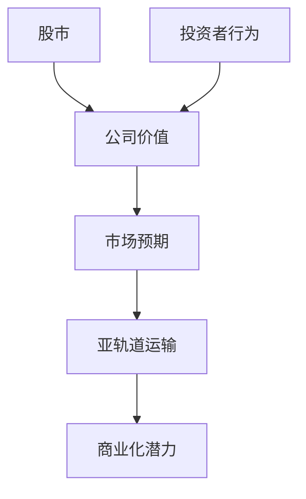
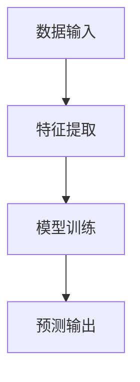
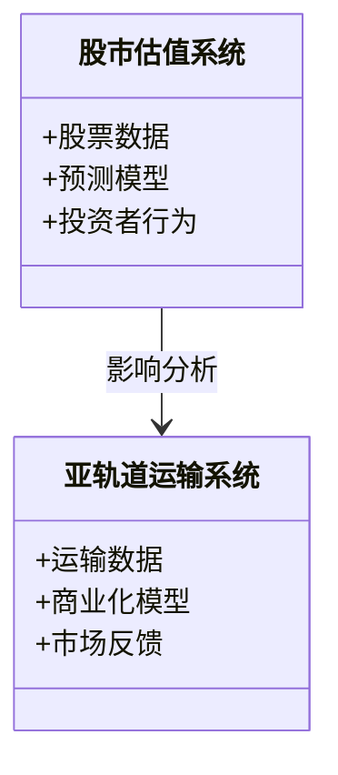
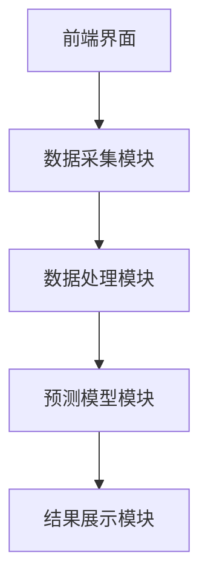

                 


# 全球股市估值与亚轨道快速运输商业化的关系

**关键词**：全球股市估值、亚轨道运输、商业化、投资分析、技术经济、市场预测、系统架构

**摘要**：  
本文探讨了全球股市估值与亚轨道快速运输商业化之间的复杂关系，分析了两者如何相互影响，提出了结合时间序列分析和机器学习模型的预测方法，并通过实际案例展示了系统的实现与应用。

---

## 第一部分: 全球股市估值与亚轨道快速运输商业化的关系概述

### 第1章: 背景介绍

#### 1.1 问题背景
- 1.1.1 股市估值的全球演变
- 1.1.2 亚轨道运输的技术突破
- 1.1.3 问题解决的重要性

#### 1.2 问题描述
- 1.2.1 股市估值的核心要素
- 1.2.2 亚轨道运输的商业化挑战
- 1.2.3 问题的边界与外延

#### 1.3 核心概念与联系
- 1.3.1 核心概念原理
- 1.3.2 概念属性特征对比表格
- 1.3.3 ER实体关系图架构（Mermaid）

### 第2章: 核心概念与联系

#### 2.1 核心概念原理
- 2.1.1 股市估值的数学模型
- 2.1.2 亚轨道运输的商业化模式

#### 2.2 概念属性特征对比
- 2.2.1 股市估值的特征
- 2.2.2 亚轨道运输的特征
- 2.2.3 对比分析

#### 2.3 ER实体关系图架构（Mermaid）



### 第3章: 算法原理讲解

#### 3.1 算法原理
- 3.1.1 时间序列分析
- 3.1.2 机器学习模型

#### 3.2 算法流程图（Mermaid）



#### 3.3 数学模型与公式
- 3.3.1 股市估值模型
  $$ P = \frac{E}{D} $$
- 3.3.2 亚轨道运输商业化模型
  $$ R = \alpha \cdot T + \beta \cdot C $$

## 第4章: 系统分析与架构设计

### 4.1 系统架构设计
#### 4.1.1 系统功能设计（领域模型Mermaid类图）



#### 4.1.2 系统架构设计（Mermaid架构图）



### 4.2 系统接口设计
#### 4.2.1 接口设计说明
- 数据输入接口：API用于接收实时股市数据和亚轨道运输数据
- 数据处理接口：对数据进行清洗和预处理
- 模型调用接口：调用预测模型进行分析
- 结果输出接口：返回分析结果到前端

#### 4.2.2 系统交互流程图（Mermaid序列图）

```mermaid
sequenceDiagram
参与者: 用户
系统: 系统
参与者 -> 系统: 请求数据
系统 -> 系统: 数据处理
系统 -> 系统: 模型预测
系统 -> 参与者: 返回结果
```

## 第5章: 项目实战

### 5.1 环境安装与配置
- 安装Python、数据处理库（Pandas、NumPy）
- 安装机器学习库（Scikit-learn、XGBoost）
- 安装可视化库（Matplotlib、Seaborn）
- 安装Mermaid工具

### 5.2 核心代码实现
#### 5.2.1 数据处理代码

```python
import pandas as pd
import numpy as np

# 数据加载
df = pd.read_csv('data.csv')

# 数据清洗
df.dropna(inplace=True)
df['date'] = pd.to_datetime(df['date'])
df.set_index('date', inplace=True)

# 特征提取
features = df[['open', 'high', 'low', 'close']]
```

#### 5.2.2 模型训练代码

```python
from sklearn.model_selection import train_test_split
from sklearn.ensemble import RandomForestRegressor

X_train, X_test, y_train, y_test = train_test_split(features, df['close'], test_size=0.2)

model = RandomForestRegressor(n_estimators=100, random_state=42)
model.fit(X_train, y_train)

print("Accuracy:", model.score(X_test, y_test))
```

### 5.3 实际案例分析
- 选择一家亚轨道运输公司，分析其股票走势
- 对比预测结果与实际数据
- 总结模型的有效性

## 第6章: 最佳实践与总结

### 6.1 最佳实践
- 数据收集：确保数据的准确性和及时性
- 模型选择：根据数据特性选择合适的算法
- 风险评估：考虑市场波动和政策影响
- 持续优化：定期更新模型和数据

### 6.2 小结
- 本文通过系统分析和实际案例，展示了如何将股市估值与亚轨道运输商业化结合起来，提供了实用的预测模型和系统架构设计。

### 6.3 注意事项
- 数据隐私和安全问题
- 模型的局限性和适用范围
- 市场变化的不可预测性

### 6.4 拓展阅读
- 时间序列分析的经典书籍
- 机器学习在金融领域的应用
- 亚轨道运输的最新技术进展

## 第7章: 结语

- 未来的研究方向
- 技术与经济的深度融合
- 可能的应用场景展望

---

**作者**：AI天才研究院/AI Genius Institute & 禅与计算机程序设计艺术/Zen And The Art of Computer Programming

---

希望这个目录大纲能满足您的需求。如果需要进一步的修改或补充，请随时告知！

