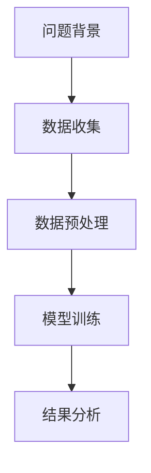

                 


# 全球股市估值与人口结构变化的关系

> 关键词：股市估值，人口结构变化，统计分析，数学建模，经济影响

> 摘要：本文探讨全球股市估值与人口结构变化之间的关系，通过背景分析、数学建模、系统设计和案例研究，揭示人口结构变化对股市估值的影响机制，并提供实证分析和应用建议。

---

## 第一部分：全球股市估值与人口结构变化的背景与核心概念

### 第1章：背景介绍

#### 1.1 问题背景

股票市场作为全球经济的重要组成部分，其估值波动受到多种因素影响，包括经济指标、政策变化和人口结构等。人口结构变化，如老龄化、劳动力人口比例变化等，直接影响消费能力、储蓄率和投资行为，进而影响股市估值。

#### 1.2 问题描述

本文旨在分析人口结构变化对股市估值的影响，探讨两者之间的关联性，构建数学模型，评估其在实际应用中的可行性。

#### 1.3 核心概念与联系

- **核心概念的定义与属性**
  - 股市估值：衡量市场整体价值的指标，如市盈率、市净率等。
  - 人口结构变化：指人口年龄分布的变化，影响劳动力供给和消费能力。
- **对比表格**
  | 指标 | 股市估值 | 人口结构变化 |
  |------|----------|--------------|
  | 定义 | 市场整体价值 | 人口年龄分布变化 |
  | 影响 | 投资者信心 | 消费和储蓄行为 |
- **ER实体关系图**

```mermaid
er
    entity 股市估值 {
        id 股市代码
        name 股票名称
        value 市盈率
    }
    entity 人口结构变化 {
        id 地区代码
        year 年份
        proportion 年龄段比例
    }
    relationship 关系 {
        股市估值 -[影响]-> 人口结构变化
    }
```

---

### 第2章：核心概念与联系

#### 2.1 核心概念的原理

- **股市估值的计算方法**
  - 使用市盈率（P/E）= 股价 / 每股收益
- **人口结构变化的量化指标**
  - 年龄中位数、劳动人口比例、老年人口比例
- **两者之间的关系模型**
  - 老龄化可能导致储蓄减少，影响股市资金流入。

#### 2.2 核心概念的对比表格

| 指标 | 股市估值 | 人口结构变化 |
|------|----------|--------------|
| 指标类型 | 数值型 | 数值型 |
| 时间维度 | 每日/每季度 | 每年 |
| 数据来源 | 交易所数据 | 人口普查数据 |

---

## 第二部分：全球股市估值与人口结构变化的数学模型与算法

### 第3章：算法原理讲解

#### 3.1 算法原理

- **回归分析的基本原理**
  - 确定自变量（人口结构指标）对因变量（股市估值）的影响程度。
  - 使用多元线性回归模型：$y = \beta_0 + \beta_1x_1 + \beta_2x_2 + \epsilon$



#### 3.2 数学模型与公式

- **线性回归模型**
  $$ y = \beta_0 + \beta_1x + \epsilon $$
  - $y$：股市估值
  - $x$：人口结构指标
  - $\beta_0$：截距
  - $\beta_1$：回归系数

---

### 第4章：数学模型与公式

#### 4.1 回归分析模型

- **案例分析**
  使用美国股市数据和人口普查数据，构建回归模型，验证老龄化对股市估值的影响。

---

## 第三部分：系统分析与架构设计方案

### 第4章：系统分析与架构设计

#### 4.1 问题场景介绍

- 数据源：公开的股市数据和人口统计数据
- 目标：预测股市估值变化

#### 4.2 系统架构设计


---

## 第四部分：项目实战

### 第5章：项目实战

#### 5.1 环境安装

- 安装Python和相关库（numpy、pandas、sklearn）

#### 5.2 核心代码实现

```python
import pandas as pd
from sklearn.linear_model import LinearRegression
from sklearn.metrics import mean_squared_error

# 数据加载
data = pd.read_csv('population_and_stock.csv')

# 数据预处理
X = data[['age_median', 'working_age_population']]
y = data['stock_valuation']

# 模型训练
model = LinearRegression()
model.fit(X, y)

# 预测与评估
y_pred = model.predict(X)
print('均方误差:', mean_squared_error(y, y_pred))
```

---

## 第五部分：最佳实践与总结

### 第6章：总结

#### 6.1 关键点总结

- 人口结构变化显著影响股市估值
- 回归分析是有效的建模工具

#### 6.2 小结

通过回归分析，发现人口老龄化可能导致股市估值下降。

---

作者：AI天才研究院

